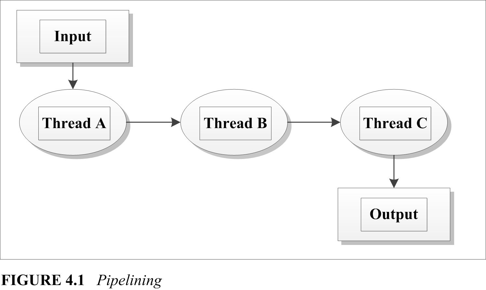
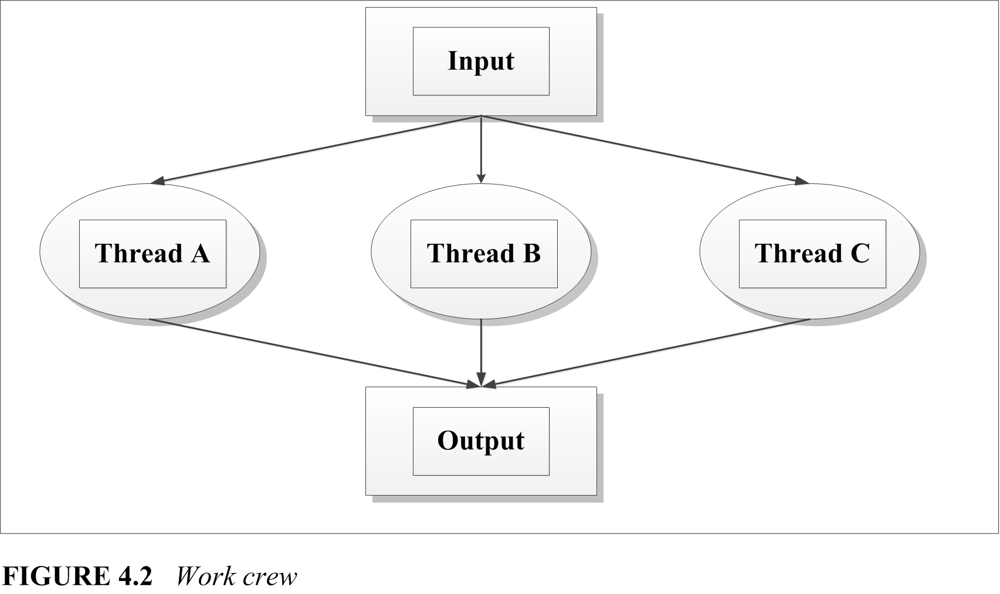
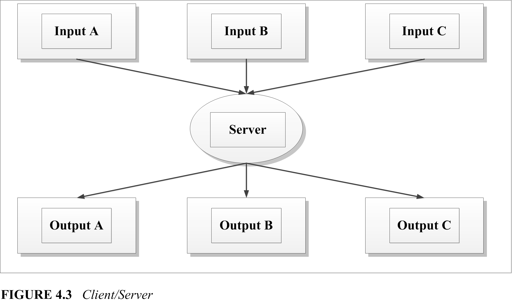

# From the maker

\<\<Programming with POSIX thread\>\> by David R. Butenhof is a guide book for pthread development. Unfortunately this book was published too early and never been updated. That is why no pure text PDF can be found on internet.

I'm really troubled reading ugly ebook.

So I extract text from djvu file by OCR and re-structure and correct them into markdown, which you are reading.

It's a huge work for me, and I wish I can finish it.

The OCR is not that clever, and I'm not that careful. So mistakes might be hidden in the book. Please tell me if you found any.


Forrest  
mr.jianggq@gmail.com  
12/26/2017  
# Content
[TOC]
# Preface

Lewis Carroll, Alice's Adventures in Wonderland
> The White Rabbit put on his spectacles,  
> "Where shall I begin, please your Majesty?" he asked.  
> "Begin at the beginning," the King said, very gravely,  
> "and go on till you come to the end: then stop."

This book is about "threads" and how to use them. "Thread" is just a name for a basic software "thing" that can do work on a computer. A thread is smaller, faster, and more maneuverable than a traditional process. In fact, once threads have been added to an operating system, a "process" becomes just data-address space, files, and so forth-plus one or more threads that do something with all that data.

With threads, you can build applications that utilize system resources more efficiently, that are more friendly to users, that run blazingly fast on multiprocessors, and that may even be easier to maintain. To accomplish all this, you need only add some relatively simple function calls to your code, adjust to a new way of thinking about programming, and leap over a few yawning chasms. Reading this book carefully will, I hope, help you to accomplish all that without losing your sense of humor.

The threads model used in this book is commonly called "Pthreads", or "POSIX threads". Or, more formally (since you haven't yet been properly introduced), the POSIX 1003.1c-1995 standard. I'll give you a few other names later-but for now, "Pthreads" is all you need to worry about.

As I write this, Sun's Solaris, Digital's Digital UNIX, and SGI's IRIX already support Pthreads. The other major commercial UNIX operating systems will soon have Pthreads as well, maybe even by the time you read this, including IBM's AIX and Hewlett-Packard's HP-UX. Pthreads implementations are also available for Linux and other UNIX operating systems.

In the personal computer market, Microsoft's Win32 API (the primary programming interface to both Windows NT and Windows 95) supports threaded programming, as does IBM's OS/2. These threaded programming models are quite different from Pthreads, but the important first step toward using them productively is understanding concurrency, synchronization, and scheduling. The rest is (more or less) a matter of syntax and style, and an experienced thread programmer can adapt to any of these models.

The threaded model can be (and has been) applied with great success to a wide range of programming problems. Here are just a few:

- Large scale, computationally intensive programs
- High-performance application programs and library code that can take advantage of multiprocessor systems
- Library code that can be used by threaded application programs
- Realtime application programs and library code
- Application programs and library code that perform I/O to slow external devices (such as networks and human beings).


# Intended audience

This book assumes that you are an experienced programmer, familiar with developing code for an operating system in "the UNIX family" using the ANSI C language. I have tried not to assume that you have any experience with threads or other forms of asynchronous programming. The [Introduction](#1) chapter provides a general overview of the terms and concepts you'll need for the rest of the book. If you don't want to read the Introduction first, that's fine, but if you ever feel like you're "missing something" you might try skipping back to get introduced.

Along the way you'll find examples and simple analogies for everything. In the end I hope that you'll be able to continue comfortably threading along on your own. Have fun, and "happy threading."

# About the author

I have been involved in the Pthreads standard since it began, although I stayed at home for the first few meetings. I was finally forced to spend a grueling week in the avalanche-proof concrete bunker at the base of Snowbird ski resort in Utah, watching hard-working standards representatives from around the world wax their skis. This was very distracting, because I had expected a standards meeting to be a formal and stuffy environment. As a result of this misunderstanding, I was forced to rent ski equipment instead of using my own.

After the Pthreads standard went into balloting, I worked on additional thread synchronization interfaces and multiprocessor issues with several POSIX working groups. I also helped to define the Aspen threads extensions, which were fasttracked into X/Open XSH5.

I have worked at Digital Equipment Corporation for (mumble, mumble) years, in various locations throughout Massachusetts and New Hampshire. I was one of the creators of Digital's own threading architecture, and I designed (and implemented much of) the Pthreads interfaces on Digital UNIX 4.0. I have been helping people develop and debug threaded code for more than eight years.

My unofficial motto is "Better Living Through Concurrency." Threads are not sliced bread, but then, we're programmers, not bakers, so we do what we can.

# Acknowledgments

This is the part where I write the stuff that I'd like to see printed, and that my friends and coworkers want to see. You probably don't care, and I promise not to be annoyed if you skip over it-but if you're curious, by all means read on.

No project such as this book can truly be accomplished by a single person, despite the fact that only one name appears on the cover. I could have written a book about threads without any help-I know a great deal about threads, and I am at least reasonably competent at written communication. However, the result would not have been this book, and this book is better than that hypothetical work could possibly have been.

Thanks first and foremost to my manager Jean Fullerton, who gave me the time and encouragement to write this book on the job-and thanks to the rest of the DECthreads team who kept things going while I wrote, including Brian Keane, Webb Scales, Jacqueline Berg, Richard Love, Peter Portante, Brian Silver, Mark Simons, and Steve Johnson.

Thanks to Garret Swart who, while he was with Digital at the Systems Research Center, got us involved with POSIX. Thanks to Nawaf Bitar who worked with Garret to create, literally overnight, the first draft of what became Pthreads, and who became POSIX thread evangelist through the difficult period of getting everyone to understand just what the heck this threading thing was all about anyway. Without Garret, and especially Nawaf, Pthreads might not exist, and certainly wouldn't be as good as it is. (The lack of perfection is not their responsibility-that's the way life is.)

Thanks to everyone who contributed to the design of cma, Pthreads, UNIX98, and to the users of DCE threads and DECthreads, for all the help, thought-provoking discourse, and assorted skin-thickening exercises, including Andrew Birrell, Paul Borman, Bob Conti, Bill Cox, Jeff Denham, Peter Gilbert, Rick Greer, Mike Grier, Kevin Harris, Ken Hobday, Mike Jones, Steve Kleiman, Bob Knighten, Leslie Lamport, Doug Locke, Paula Long, Finnbarr P. Murphy, Bill Noyce, Simon Patience, Harold Seigel, Al Simons, Jim Woodward, and John Zolnowsky.


Many thanks to all those who patiently reviewed the drafts of this book (and even to those who didn't seem so patient at times). Brian Kernighan, Rich Stevens, Dave Brownell, Bill Gallmeister, Ilan Ginzburg, Will Morse, Bryan O'Sullivan, Bob Robillard, Dave Ruddock, Bil Lewis, and many others suggested or motivated improvements in structure and detail-and provided additional skin-thickening exercises to keep me in shape. Devang Shah and Bart Smaalders answered some Solaris questions, and Bryan O'Sullivan suggested what became the "bailing programmers" analogy.

Thanks to John Wait and Lana Langlois at Addison Wesley Longman, who waited with great patience as a first-time writer struggled to balance writing a book with engineering and consulting commitments. Thanks to Pamela Yee and Erin Sweeney, who managed the book's production process, and to all the team (many of whose names I'll never know), who helped.

Thanks to my wife, Anne Lederhos, and our daughters Amy and Alyssa, for all the things for which any writers may thank their families, including support, tolerance, and just being there. And thanks to Charles Dodgson (Lewis Carroll), who wrote extensively about threaded programming (and nearly everything else) in his classic works *Alice's Adventures in Wonderland*, *Through the Looking-Glass*, and *The Hunting of the Snark*.

Dave Butenhof  
Digital Equipment Corporation  
110 Spit Brook Road, ZKO2-3/Q18  
Nashua, NH 03062  
butenhof@zko. dec. com  
December 1996  


<span id="1"> </span>
# 1 Introduction
Lewis Carroll, Through the Looking-Glass:
> 'The time has come," the Walrus said,  
> "To talk of many things;  
> Of shoes-and ships-and sealing wax-  
> Of cabbages-and kings-  
> And why the sea is boiling hot-  
> And whether pigs have wings."

In a dictionary, you would probably see that one of several definitions for "thread" is along the lines of the third definition in the American Heritage paperback dictionary on my desk: "Anything suggestive of the continuousness and sequence of thread." In computer terms, a thread is the set of properties that suggest "continuousness and sequence" within the machine. A thread comprises the machine state necessary to execute a sequence of machine instructions-the location of the current instruction, the machine's address and data registers, and so forth.

A UNIX process can be thought of as a thread, plus an address space, file descriptors, and an assortment of other data. Some versions of UNIX support "lightweight" or "variable weight" processes that allow you to strip some or all of that data from some of your processes for efficiency. Now, whether you're using a "thread" or a "lightweight process," you still need the address space, file descriptors, and everything else. So, you might ask, what's the point? The point is that you can have many threads sharing an address space, doing different things. On a multiprocessor, the threads in a process can be doing different things simultaneously.

When computers lived in glass caves and were fed carefully prepared punch cards, the real world outside could be kept waiting with no consequences more severe than some grumbling programmers. But the real world doesn't do one thing at a time, and gradually computers began to model that world by adding capabilities such as multiprogramming, time sharing, multiprocessing, and, eventually, threads.

Threads can help you bring your application out of the cave, and Pthreads helps you do it in a way that will be neat, efficient, and portable. This chapter briefly introduces you to what you need to begin understanding and using threads. Don't worry-the rest of the book will follow up on the details left dangling in this chapter.

[Section 1.1](#1.1) presents the framework for a number of analogies that I will use to explain threading as we go. There is nothing all that unusual in the brief story-but hereafter you will understand when I talk about programmers and buckets, which, otherwise, might seem mildly odd.

[Section 1.2](#1.2) defines some essential concepts and terms used in this book. The most important of these concepts deserves a special introduction, which will also serve to demonstrate the convention with which various particularly important points shall be emphasized throughout this book:

> **I Asynchronous**:  
> Any two operations are "asynchronous" when they can proceed independently of each other

[Section 1.3](#1.3) describes how you already use asynchronous programming on a regular basis, both as a UNIX programmer and user, and as a human being in the real world. I wouldn't dare to claim that asynchronous programming is easy, but the basic concepts it tries to model are so easy and natural that you rarely need even to think about them until you try to apply them to software. 

Threads are, to some extent, just one more way to make applications asynchronous, but threads have some advantages over other models that have been used to build asynchronous applications. [Section 1.5](#1.5) will show you some of the advantages as we apply various programming methods in several versions of a simple alarm clock. You will get to see "threads in action" right away, with a brief description of the few Pthreads interfaces needed to build this simple application.

Armed, now, with a basic understanding of what threads are all about, you can go on to [Section 1.6](#1.6), where we will explore some of the fundamental advantages of a threaded programming model.

Although there are a lot of excellent reasons to use threads, there is a price to be paid. [Section 1.7](#1.7) provides a counterpoint to the previous section by describing some of the costs. What it boils down to, though, is simply that you need to learn how the model works, and then apply it carefully. It is not as hard as some folks would have you believe.

You have seen some of the fundamental benefits and costs. It may be obvious that you do not want to rush out and put threads into every application or library you write. [Section 1.8](#1.8) asks the question 'To thread, or not to thread?" and I will attempt to guide you toward determining the proper answer in various cases.

You will know at that point what threads are, what they do, and when to use them. Aside from brief examples, you haven't yet seen any detailed information about the particular programming interfaces (APIs) that compose Pthreads. [Section 1.9](#1.9) points out some of the basic landmarks of the Pthreads universe to get you oriented before we plunge ahead. The most important part of this section is 1.9.3, which describes the Pthreads model for reporting errors-which is somewhat different than the rest of UNIX and POSIX.

<span id="1.1"> </span>
## 1.1 The "bailing programmers"

Lewis Carroll, The Hunting of the Snark:
> This was charming, no doubt: but they shortly found out  
> That the Captain they trusted so well  
> Had only one notion for crossing the ocean,  
> And that was to tingle his bell.

Three programmers sail out to sea one fine day in a small boat, They sail quite some distance from shore, enjoying the sun and sea breeze, allowing the wind to carry them. The sky darkens, and a storm strikes. The small boat is tossed violently about, and when the storm abates the programmers are missing their boat's sail and most of the mast. The boat has sprung a small leak, and there is no land in sight.

The boat is equipped with food, water, oars, and a bailing bucket, and the programmers set to work. One programmer rows, and monitors the accumulating water in the bottom of the boat. The other programmers alternately sleep, watch the water level, or scan the horizon for sight of land or another ship.

An idle programmer may notice rising water in the boat, and begin bailing. When both idle programmers are awake, and become simultaneously concerned regarding their increasing dampness, they may both lunge for the bailing bucket-but one will inevitably reach it first, and the other will have to wait.

If the rower decides that bailing is required while both his companions sleep,a nudge is usually sufficient to awaken a programmer, allowing the other to continue sleeping. But if the rower is in a bad mood, he may resort to a loud yell, awakening both sleeping programmers. While one programmer assumes the necessary duty, the other can try to fall asleep again.

When the rower tires, he can signal one of the other programmers to take over the task, and immediately fall into a deep sleep waiting to be signaled in turn. In this way, they journey on for some time.

So, just what do the Bailing Programmers have to do with threads? I'm glad you asked! The elements of the story represent analogies that apply to the Pthreads programming model. We'll explore some additional analogies in later sections, and even expand the story a little, but for now consider a few basics:

- A **programmer** is an entity that is capable of independent activity. Our programmers represent threads. A thread is not really much like a programmer, who, as we all know, is a fascinatingly sophisticated mixture of engineer, mathematician, and artist that no computer can match. Still, as a representation of the "active element" in our programming model, it will be sufficient.
- The **bailing bucket** and the **oars** are "tokens" that can be held by only one individual at a time. They can be thought of as shared data, or as synchronization objects. The primary Pthreads synchronization object, by the way, is called a mutex.
- **Nudges** and **shouts** are communication mechanisms associated with a synchronization object, on which individuals wait for some condition. Pthreads provides condition variables, which may be signaled or broadcast to indicate changes in shared data state.


<span id="1.2"> </span>
## 1.2 Definitions and terminology

Lewis Carroll, Through the Looking-Glass:
> "When I use a word," Humpty Dumpty said, in rather a scornful tone,  
> "it means just what I choose it to mean-neither more nor less."

This book will use several critical terms that may be unfamiliar to you unless you've already had some experience with parallel or asynchronous programming. Even if you are familiar with them, some of the terms have seen assorted and even contradictory uses within research and industry, and that is clearly not going to help communication. We need to begin by coming to a mutual agreement regarding the meaning of these terms, and, since I am writing the book, we will agree to use my definitions. (Thank you.)

<span id="1.2.1"> </span>
### 1.2.1 Asynchronous

Asynchronous means that things happen independently (concurrently) unless there's some enforced dependency. Life is asynchronous. The dependencies are supplied by nature, and events that are not dependent on one another can occur simultaneously. A programmer cannot row without the oars, or bail effectively without the bucket-but a programmer with oars can row while another programmer with a bucket bails. Traditional computer programming, on the other hand, causes all events to occur in series unless the programmer takes "extraordinary measures" to allow them to happen concurrently.

The greatest complication of "asynchrony" has been that there's little advantage to being asynchronous unless you can have more than one activity going at a time. If you can start an asynchronous operation, but then you can do nothing but wait for it, you're not getting much benefit from the asynchrony.

<span id="1.2.2"> </span>
### 1.2.2 Concurrency

Concurrency, which an English dictionary will tell you refers to things happening at the same time, is used to refer to things that appear to happen at the same time, but which may occur serially. Concurrency describes the behavior of threads or processes on a uniprocessor system. The definition of concurrent execution in POSIX requires that "functions that suspend the execution of the calling thread shall not cause the execution of other threads to be indefinitely suspended."

Concurrent operations may be arbitrarily interleaved so that they make progress independently (one need not be completed before another begins), but concurrency does not imply that the operations proceed simultaneously. Nevertheless, concurrency allows applications to take advantage of asynchronous capabilities, and "do work" while independent operations are proceeding.

Most programs have asynchronous aspects that may not be immediately obvious. Users, for example, prefer asynchronous interfaces. They *expect* to be able to issue a command while they're thinking about it, even before the program has finished with the last one. And when a windowing interface provides separate windows, don't you intuitively expect those windows to act asynchronously? Nobody likes a "busy" cursor. Pthreads provides you with both concurrency and asynchrony, and the combination is exactly what you need to easily write responsive and efficient programs. Your program can "wait in parallel" for slow I/O devices, and automatically take advantage of multiprocessor systems to compute in parallel.

<span id="1.2.3"> </span>
### 1.2.3 Uniprocessor and multiprocessor

The terms *uniprocessor* and *multiprocessor* are fairly straightforward, but let's define them just to make sure there's no confusion. By *uniprocessor*, I mean a computer with a single programmer-visible execution unit (processor). A single general-purpose processor with superscalar processing, or vector processors, or other math or I/O coprocessors is still usually considered a uniprocessor.

By *multiprocessor*, I mean a computer with more than one processor sharing a common instruction set and access to the same physical memory. While the processors need not have equal access to all physical memory, it should be possible for any processor to gain access to most memory. A "massively parallel processor" (MPP) may or may not qualify as a multiprocessor for the purposes of this book. Many MPP systems do qualify, because they provide access to all physical memory from every processor, even though the access times may vary widely.

<span id="1.2.4"> </span>
### 1.2.4 Parallelism

*Parallelism* describes concurrent sequences that proceed simultaneously. In other words, software "parallelism" is the same as English "concurrency" and different from software "concurrency." Parallelism has a vaguely redeeming analogy to the English definition: It refers to things proceeding in the same direction independently (without intersection).

True parallelism can occur only on a multiprocessor system, but concurrency can occur on both uniprocessor and multiprocessor systems. Concurrency can occur on a uniprocessor because concurrency is, essentially, the illusion of parallelism. While parallelism requires that a program be able to perform two computations at once, concurrency requires only that the programmer be able to pretend that two things can happen at once.

<span id="1.2.5"> </span>
### 1.2.5 Thread safety and reentrancy

"Thread-safe" means that the code can be called from multiple threads without destructive results. It does not require that the code run *efficiently* in multiple threads, only that it can operate *safely* in multiple threads. Most existing functions can be made thread-safe using tools provided by Pthreads-mutexes, condition variables, and thread-specific data. Functions that don't require persistent context can be made thread-safe by serializing the entire function, for example, by locking a mutex on entry to the function, and unlocking the mutex before returning. Functions made thread-safe by serializing the entire function can be called in multiple threads-but only one thread can truly perform the function at a time.

More usefully, thread-safe functions can be broken down into smaller critical sections. That allows more than one thread to execute within the function, although not within the same part. Even better, the code can be redesigned to protect critical data rather than critical code, which may allow fully parallel execution of the code, when the threads don't need to use the same data at the same time.

The putchar function, for example, which writes a character into a standard I/O (stdio) buffer, might be made thread-safe by turning putchar into a critical section. That is, putchar might lock a "putchar mutex," write the character, and then unlock the putchar mutex. You could call putchar from two threads, and no data would be corrupted-it would be thread-safe. However, only one thread could write its character at a time, and the others would wait, even if they were writing to different stdio streams.

The correct solution is to associate the mutex with the stream, protecting the data rather than the code. Now your threads, as long as they are writing to different streams, can execute putchar in parallel. More importantly, all functions that access a stream can use the same mutex to safely coordinate their access to that stream.

The term "reentrant" is sometimes used to mean "efficiently thread-safe." That is, the code was made thread-safe by some more sophisticated measures than converting the function or library into a single serial region. Although existing code can usually be made thread-safe by adding mutexes and thread-specific data, it is often necessary to change the interface to make a function reentrant. Reentrant code should avoid relying on static data and, ideally, should avoid reliance on any form of synchronization between threads.

Often, a function can avoid internal synchronization by saving state in a "context structure" that is controlled by the caller. The caller is then responsible for any necessary synchronization of the data. The UNIX readdir function, for example, returns each directory entry in sequence. To make readdir thread-safe, you might add a mutex that readdir locked each time it was called, and unlocked before it returned to the caller. Another approach, as Pthreads has taken with **readdir\_r**, is to avoid any locking within the function, letting the caller allocate a structure that maintains the context of **readdir\_r** as it searches a directory.

At first glance, it may seem that we're just making the caller perform what ought to be the job of **readdir\_r**. But remember that only the caller knows how the data will be used. If only one thread uses this particular directory context, for example, then no synchronization is needed. Even when the data is shared between threads, the caller may be able to supply more efficient synchronization, for example, if the context can be protected using a mutex that the application also uses for other data.

<span id="1.2.6"> </span>
### 1.2.6 Concurrency control functions

Any "concurrent system" must provide a core set of essential functions that you need to create concurrent execution contexts, and control how they operate within your library or application. Here are three essential facilities, or aspects, of any concurrent system:

1. *Execution* context is the state of a concurrent entity. A concurrent system must provide a way to create and delete execution contexts, and maintain their state independently. It must be able to save the state of one context and dispatch to another at various times, for example, when one needs to wait for an external event. It must be able to continue a context from the point where it last executed, with the same register contents, at a later time.
2. *Scheduling* determines which context (or set of contexts) should execute at any given point in time, and switches between contexts when necessary.
3. *Synchronization* provides mechanisms for concurrent execution contexts to coordinate their use of shared resources. We use this term in a way that is nearly the opposite of the standard dictionary meaning. You'll find a definition much like "cause to occur at the same time," whereas we usually mean something that might better be expressed as "prevent from occurring at the same time." In a thesaurus, you may find that "cooperate" is a synonym for "synchronize"-and synchronization is the mechanism by which threads cooperate to accomplish a task. This book will use the term "synchronization," though, because that is what you'll see used, almost universally.

There are many ways to provide each of these facilities-but they are always present in some form. The particular choices presented in this book are dictated by the book's subject-Pthreads. Table 1.1 shows a few examples of the three facilities in various systems.


| Category              | Execution context | Scheduling               | Synchronization                 |
| --------------------- | ----------------- | ------------------------ | ------------------------------- |
| Real traffic          | automobile        | traffic lights and signs | turn signals and brake lights   |
| UNIX (before threads) | process           | priority (nice)          | wait and pipes                  |
| Pthreads              | thread            | policy, priority         | condition variables and mutexes |
<center>**TABLE 1.1** *Execution contexts, schedulers, and synchronization*</center>

A system's scheduling facility may allow each thread to run until it voluntarily yields the processor to another thread ("run until block"). It may provide timeslicing, where each thread is forced to periodically yield so that other threads may run ("round-robin"). It may provide various scheduling policies that allow the application to control how each thread is scheduled according to that thread's function. It may provide a "class scheduler" where dependencies between threads are described so that, for example, the scheduler can ensure that members of a tightly coupled parallel algorithm are scheduled at the same time.

Synchronization may be provided using a wide variety of mechanisms. Some of the most common forms are mutexes, condition variables, semaphores, and events. You may also use message passing mechanisms, such as UNIX pipes, sockets, POSIX message queues, or other protocols for communicating between asynchronous processes-on the same system or across a network. Any form of communication protocol contains some form of synchronization, because passing data around with no synchronization results in chaos, not communication.

The terms thread, mutex, and condition variable are the main topics of this book. For now, it is enough to know that a thread represents an "executable thing" on your computer. A mutex provides a mechanism to prevent threads from colliding unexpectedly, and a condition variable allows a thread, once it has avoided such a collision, to wait until it is safe to proceed. Both mutexes and condition variables are used to synchronize the operation of threads.


<span id="1.3"> </span>
## 1.3 Asynchronous programming is intuitive ...

Lewis Carroll, Through the Looking-Glass:
> "In most gardens," the Tiger-lily said,  
> "they make the beds too soft-so that the flowers are always asleep.'  
> This sounded a very good reason, and Alice was quite  
> pleased to know it.  
> "I never thought of that before!" she said.

If you haven't been involved in traditional realtime programming, asynchronous programming may seem new and different. But you've probably been using asynchronous programming techniques all along. You've probably used UNIX, for example, and, even as a user, the common UNIX shells from sh to ksh have been designed for asynchronous programming. You've also been using asynchronous "programming" techniques in real life since you were born.

Most people understand asynchronous behavior much more thoroughly than they expect, once they get past the complications of formal and restricted definitions.

<span id="1.3.1"> </span>
### 1.3.1 ... because UNIX is asynchronous

In any UNIX system, processes execute asynchronously with respect to each other, even when there is only a single processor. Yes, until recently it was difficult to write individual programs for UNIX that behaved asynchronously-but UNIX has always made it fairly easy for you to behave asynchronously. When you type a command to a shell, you are really starting an independent program-if you run the program in the background, it runs asynchronously with the shell. When you pipe the output of one command to another you are starting several independent programs, which synchronize between themselves using the pipe.

> Time is a synchronization mechanism.

In many cases you provide synchronization between a series of processes yourself, maybe without even thinking about it. For example, you run the compiler after you've finished editing the source files. It wouldn't occur to you to compile them first, or even at the same time. That's elementary reallife synchronization.

> UNIX pipes and files can be synchronization mechanisms.

In other cases you may use more complicated software synchronization mechanisms. When you type "**ls | more**" to a shell to pass the output of the **ls** command into the more command, you're describing synchronization by specifying a data dependency. The shell starts both commands right away, but the more command can't generate any output until it receives input from **ls** through the pipe. Both commands proceed concurrently (or even in parallel on a multiprocessor) with **ls** supplying data and more processing that data, independently of each other. If the pipe buffer is big enough, **ls** could complete before more ever started; but more can't ever get ahead of ls.

Some UNIX commands perform synchronization internally. For example, the command "**cc -o thread thread.c**" might involve a number of separate processes. The **cc** command might be a "front end" to the C language environment, which runs a filter to expand preprocessor commands (like **#include** and **#if**), a compiler to translate the program into an intermediate form, an optimizer to reorder the translation, an assembler to translate the intermediate form into object language, and a loader to translate that into an executable binary file. As with **ls | more**, all these programs may be running at the same time, with synchronization provided by pipes, or by access to temporary files.

UNIX processes can operate asynchronously because each process includes all the information needed to execute code. The operating system can save the state of one process and switch to another without affecting the operation of either. Any general-purpose asynchronous "entity" needs enough state to enable the operating system to switch between them arbitrarily. But a UNIX process includes additional state that is not directly related to "execution context," such as an address space and file descriptors.

A thread is the part of a process that's necessary to execute code. On most computers that means each thread has a pointer to the thread's current instruction (often called a "PC" or "program counter"), a pointer to the top of the thread's stack (SP), general registers, and floating-point or address registers if they are kept separate. A thread may have other things, such as processor status and coprocessor control registers. A thread does not include most of the rest of the state associated with a process; for example, threads do not have their own file descriptors or address space. All threads within a process share all of the files and memory, including the program text and data segments.

> Threads are "simpler" than processes.

You can think of a thread as a sort of "stripped down" process, lean and mean and ready to go. The system can switch between two threads within a process much faster than it can switch between processes. A large part of this advantage comes from the fact that threads within a process share the address space-code, data, stack, everything.

When a processor switches between two processes, all of the hardware state for that process becomes invalid. Some may need to be changed as part of the context switch procedure-data cache and virtual memory translation entries may be flushed, for example. Even when they do not need to be flushed immediately, however, the data is not useful to the new process. Each process has a separate virtual memory address space, but threads running within the same process share the virtual address space and all other process data.

Threads can make high-bandwidth communication easier between independent parts of your program. You don't have to worry about message passing mechanisms like pipes or about keeping shared memory region address references consistent between several different address spaces. Synchronization is faster, and programming is much more natural. If you create or open a file, all threads can use it. If you allocate a dynamic data structure with malloc, you can pass the address to other threads and they can reference it. Threads make it easy to take advantage of concurrency.

<span id="1.3.2"> </span>
### 1.3.2 ... because the world is asynchronous

Thinking asynchronously can seem awkward at first, but it'll become natural with a little practice. Start by getting over the unnatural expectation that everything will happen serially unless you do something "unusual." On a one-lane road cars proceed one at a time-but on a two-lane road two cars go at once. You can go out for a cup of coffee, leaving your computer compiling some code and fully expecting that it will proceed without you. Parallelism happens everywhere in the real world, and you expect it.

A row of cashiers in a store serve customers in parallel; the customers in each line generally wait their turn. You can improve throughput by opening more lines, as long as there are registers and cashiers to serve them, and enough customers to be served by them. Creating two lines for the same register may avoid confusion by keeping lines shorter-but nobody will get served faster. Opening three registers to serve two customers may look good, but it is just a waste of resources.

In an assembly line, workers perform various parts of the complete job in parallel, passing work down the line. Adding a station to the line may improve performance if it parallels or subdivides a step in the assembly that was so complicated that the operator at the next station spent a lot of time waiting for each piece. Beware of improving one step so much that it generates more work than the next step on the assembly line can handle.

In an office, each project may be assigned to a "specialist." Common specialties include marketing, management, engineering, typing pool, sales, support, and so forth. Each specialist handles her project independently on behalf of the customer or some other specialist, reporting back in some fashion when done. Assigning a second specialist to some task, or denning narrower specialties (for example, assigning an engineer or manager permanently to one product) may improve performance as long as there's enough work to keep her busy. If not, some specialists play games while others' in-baskets overflow.

Motor vehicles move in parallel on a highway. They can move at different speeds, pass each other, and enter and exit the highway independently. The drivers must agree to certain conventions in order to avoid collisions. Despite speed limits and traffic signs, compliance with the "rules of the road" is mostly voluntary. Similarly, threads must be coded to "agree" to rules that protect the program, or risk ending up undergoing emergency debugging at the thread hospital.

Software can apply parallelism in the same ways you might use it in real life, and for the same reasons. When you have more than one "thing" capable of doing work, you naturally expect them to all do work at the same time. A multiprocessor system can perform multiple computations, and any time-sharing system can perform computations while waiting for an external device to respond. Software parallelism is subject to all of the complications and problems that we have seen in real life-and the solutions may not be as easy to see or to apply. You need enough threads, but not too many; enough communication, but not too much. A key to good threaded programming is learning how to judge the proper balance for each situation.

Each thread can process similar parts of a problem, just like supermarket cashiers handling customers. Each thread can perform a specific operation on each data item in turn, just like the workers on an assembly line. Each thread can specialize in some specific operation and perform that operation repeatedly on behalf of other threads. You can combine these basic models in all sorts of ways; for example, in parallel assembly lines with some steps performed by a pool of servers.

As you read this book you'll be introduced to concepts that may seem unfamiliar: mutexes, condition variables, race conditions, deadlocks, and priority inversions. Threaded programming may feel daunting and unnatural. But I'll explain all those concepts as we move through this book, and once you've been writing multithreaded code for a while you may find yourself noticing real-world analogies to the concepts. Threads and all this other stuff are formalized and restricted representations of things you already understand.

If you find yourself thinking that someone shouldn't interrupt you because you have the conversation mutex locked, you've begun to develop an intuitive understanding of threaded programming(It may also be a good time to take a break and read some healthy escapist fiction for a while.). You can apply that understanding to help you design better threaded code with less effort. If something wouldn't make sense in real life, you probably shouldn't try it in a program either.


<span id="1.4"> </span>
## 1.4 About the examples in this book

This book contains a number of examples. All are presented as complete programs, and they have been built and tested on Digital UNIX 4.0d and Solaris 2.5.

All of these programs do something, but many do not do anything of any particular importance. The purpose of the examples is to demonstrate thread management and synchronization techniques, which are mere overhead in most real programs. They would be less effective at revealing the details if that "overhead" was buried within large programs that "did something."

Within the book, examples are presented in sections, usually one function at a time. The source code is separated from the surrounding text by a header and trailer block which include the file name and, if the example comprises more than one section, a section number and the name of the function. Each line of the source code has a line number at the left margin. Major functional blocks of each section are described in specially formatted paragraphs preceding the source code. These paragraphs are marked by line numbers outside the left margin of the paragraph, denoting the line numbers in the source listing to which the paragraph refers. Here's an example:

> **Example 1-2**  
> These lines show the header files included in most of the examples. The \<pthread.h\> header file declares constants and prototypes for the Pthreads functions, and the errors.h header file includes various other headers and some error-checking functions.

 ```c
 /* sample.c part 1 sampleinfo */
 # include <pthread.h>
 # include "errors.h"
 ```

I have written these examples to use error checking everywhere. That is, I check for errors on each function call. As long as you code carefully, this isn't necessary, and some experts recommend testing only for errors that can result from insufficient resources or other problems beyond your control. I disagree, unless of course you're the sort of programmer who never makes a mistake. Checking for errors is not that tedious, and may save you a lot of trouble during debugging.

You can build and run all of the examples for yourself-the source code is available online at [http://www.aw.com/butenhof/posixcode.html](http://www.aw.com/butenhof/posixcode.html). A Makefile is provided to build all of the examples, though it requires modifications for various platforms. On Digital UNIX, the examples were built with **CFLAGS=-pthread -stdl -wl**. On Solaris, they were built with **CFLAGS=-D\_REENTRANT -D\_POSIX\_C\_SOURCE=199506 -lpthread**. Some of the examples require interfaces that may not be in the Pthreads library on your system, for example, **clock\_gettime**, which is part of the POSIX.lb realtime standard. The additional realtime library is specified by the **RTFLAGS** variable, which is defined as **RTFLAGS=-lrt** on Digital UNIX, and as **RTFLAGS=-lposix4** on Solaris.

On Solaris 2.5 systems, several of the examples require calls to **thr\_setconcurrency** to ensure proper operation. This function causes Solaris to provide the process with additional concurrency. In a few cases, the example will not operate at all without this call, and in other cases, the example would fail to demonstrate some behavior.


<span id="1.5"> </span>
## 1.5 Asynchronous programming, by example

Lewis Carroll, The Hunting of the Snark:
> "In one moment I've seen what has hitherto been  
> Enveloped in absolute mystery,  
> And without extra charge I will give you at large  
> A Lesson in Natural History."

This section demonstrates some basic asynchronous programming, using a simple program that does something vaguely useful, by pretending to be an alarm clock with a command interface for which you would not consider paying a dime in a store. But then, this book is about threads, not user interfaces, and the code that I need to show takes up quite enough space already.

The program prompts for input lines in a loop until it receives an error or end of file on stdin. On each line, the first nonblank token is interpreted as the number of seconds to wait, and the rest of the line (up to 64 characters) is a message that will be printed when the wait completes. I will offer two additional versions-one using multiple processes, and one using multiple threads. We'll use the three examples to compare the approaches.


<span id="1.5.1"> </span>
### 1.5.1 The baseline, synchronous version

Include the header file **errors.h**, which includes standard headers like \<unistd.h\> and \<stdio.h\> and defines error reporting macros that are used throughout the examples in this book. We don't use the error reporting macros in this particular example, but consistency is nice, sometimes.

The "baseline" version, alarm.c, is a synchronous alarm program with a single routine, main. Most of main is a loop, which processes simple commands until f gets returns a NULL (error or end of file). Each line is "parsed" with sscanf to separate the number of seconds to wait (%d, the first sequence of digits) from the message string to print (%64[ A\n], the rest of the line, up to 64 characters excluding newline).

```c
/** alarm.c */

# include "errors.h"

int main (int argc, char *argv[])
{
    int seconds;
    char line[128];
    char message[64];

    while (1) {
        printf ("Alarm> ");
        if (fgets (line, sizeof (line), stdin) == NULL) exit @);
        if (strlen (line) <= 1) continue;

        /*
        * Parse input line into seconds (%d) and a message
        * (%64[^\n]), consisting of up to 64 characters
        * separated from the seconds by whitespace.
        */

        if (sscanf (line, "%d %64[^\n]",
            &seconds, message) < 2) {
            fprintf (stderr, "Bad commandXn");
        } else {
            sleep (seconds);
            printf ("(%d) %s\n", seconds, message);
        }
    }
}
```
The problem with the program alarm, c is that only one alarm request can be active at a time. If you set an alarm to remind you to do something in 10 minutes F00 seconds), you can't decide to have it remind you of something else in 5 minutes. The program is doing something synchronously that you would probably like to be asynchronous.


<span id="1.5.2"> </span>
### 1.5.2 A version using multiple processes

There are lots of ways to make this program asynchronous; for example, you could run more than one copy of the program. One way to run multiple copies is to fork a child process for each command, as shown in alarm\_fork.c. The new version is asynchronous-you can enter commands at any time, and they will be carried out independently. It isn't much more complicated than the original, which is nice.

The main difference between alarm.c and alarm\_fork.c is that instead of calling sleep directly, it uses fork to create a new child process, which then calls sleep (and, eventually, printf) asynchronously, while the parent process continues.

The primary complication in this version is the need to "reap" any child processes that have terminated. If the program fails to do this, the system will save them all until the program terminates. The normal way to reap terminated child processes is to call one of the wait functions. In this case, we call waitpid, which allows the caller to specify the wnohang flag. The function will immediately reap one child process if any have terminated, or will immediately return with a process ID (pid) of 0. The parent process continues to reap terminated child processes until there are no more to reap. When the loop terminates, main loops back to line 13 to read a new command.

```c
/** alarm_fork.c */

 # include <sys/types.h>
 # include <wait.h>
 # include "errors.h"
 
int main (int argc, char *argv[])
{
    int status;
    char line[128];
    int seconds;
    pid_t pid;
    char message[64];

    while (1) {
        printf ("Alarm> " );
        if (fgets (line, sizeof (line), stdin) == NULL) exit (0);
        if (strlen (line) <= 1) continue;

        /*
         * Parse input line into seconds (%d) and a message
         * (%64[^\n]), consisting of up to 64 characters
         * separated from the seconds by whitespace.
         */

        if (sscanf (line, "%d %64[^\n]",
            &seconds, message) < 2) {
            fprintf (stderr, "Bad command\n");
        } else {
            pid = fork ();
            if (pid == (pid_t)-1)
                errno_abort ("Fork");
            if (pid == (pid_t)0) {
                /*
                 * In the child, wait and then print a message
                 */
                sleep (seconds);
                printf ("(%d) %s\n", seconds, message);
                exit (0);
            } else {
                /*
                 * In the parent, call waitpid() to collect children
                 * that have already terminated.
                 */
                do {
                    pid = waitpid ((pid_t)-1, NULL, WNOHANG);
                    if (pid == (pid_t)-1)
                        errno_abort ("Wait for child");
                } while (pid != (pid_t)0);
            }
        }
    }
}

```

<span id="1.5.3"> </span>
### 1.5.3 A version using multiple threads

Now, let us try another alarm program, alarm\_thread.c. It is much like the fork version in alarm\_fork.c, except that it uses threads instead of child processes to create asynchronous alarms. Four Pthreads calls are used in this program:

- **pthread\_create** creates a thread running the routine specified in the third argument (alarm\_thread), returning an identifier for the new thread to the variable referenced by thread.
- **pthread\_detach** allows Pthreads to reclaim the thread's resources as soon as it terminates.
- **pthread\_exit** terminates the calling thread.
- **pthread\_self** returns the calling thread's identifier.

The **alarm\_t** structure defines the information stored for each alarm command, the number of seconds until the alarm is due, and the message string that will be printed by the thread.

```c
/** alarm_thread.c part 1 definitions */
 # include <pthread.h>
 # include "errors.h"

typedef struct alarm_tag {
    int seconds;
    char message[64];
} alarm_t;
```

The alarm\_thread function is the "alarm thread." That is, each alarm thread is created running this function, and when the function returns the thread terminates. The function's argument (void \*arg) is the fourth argument that was passed to pthread\_create, in this case, a pointer to the control packet (alarm\_t) created for the alarm request that the thread is to satisfy. The thread starts by "mapping" the void * argument as a pointer to a control packet. The thread detaches itself by calling pthread\_detach, which informs Pthreads that the application does not need to know when the thread terminates or its termination status.

The thread sleeps for the number of seconds specified in its control packet, and then prints the message string. Finally, the thread frees the control packet and returns. When a thread returns from its initial routine, as it does here, the thread terminates. Normally, Pthreads would hold the thread's resources so that another thread could later determine that it had exited and retrieve a final result. Because the thread detached itself, none of that is necessary.

```c
/** alarm_thread.c part 2 alarm_thread */
void *alarm_thread (void *arg)
{
    alarm_t *alarm = (alarm_t*)arg;
    int status;

    status = pthread_detach (pthread_self ());
    if (status != 0)
        err_abort (status, "Detach thread");
    sleep (alarm->seconds);
    printf ("(%d) %s\n", alarm->seconds, alarm->message);
    free (alarm);
    return NULL;
}
```

The main program of **alarm\_thread.c** is much the same as the other two variants. It loops, reading and interpreting command lines as long as it can read from stdin.

In this variation, main allocates heap storage (**alarm\_t**) for each alarm command. The alarm time and message are stored in this structure, so each thread can be given the appropriate information. If the sscanf call fails to "parse" a correct command, the heap storage is freed.

An alarm thread is created, running function **alarm\_thread**, with the alarm data (**alarm\_t**) as the thread's argument.

```c
/** alarm_thread.c part 3 main */
int main (int argc, char *argv[])
{
    int status;
    char line[128];
    alarm_t *alarm;
    pthread_t thread;

    while A) {
        printf ("Alarm> ");
        if (fgets (line, sizeof (line), stdin) == NULL) exit (0);
        if (strlen (line) <= 1) continue;
        alarm = (alarm_t*)malloc (sizeof (alarm_t));
        if (alarm == NULL)
            errno_abort ("Allocate alarm");

        /*
         * Parse input line into seconds (%d) and a message
         * (%64[^\n]), consisting of up to 64 characters
         * separated from the seconds by whitespace.
         */
        if (sscanf (line, "%d %64[^\n]",
            &alarm->seconds, alarm->message) < 2) {
            fprintf (stderr, "Bad command\n");
            free (alarm);
        } else {
            status = pthread_create (
                &thread, NULL, alarm_thread, alarm);
            if (status != 0)
                err_abort (status, "Create alarm thread");
        }
    }
 }

```


<span id="1.5.4"> </span>
### 1.5.4 Summary

A good way to start thinking about threads is to compare the two asynchronous versions of the alarm program. First, in the fork version, each alarm has an independent address space, copied from the main program. That means we can put the seconds and message values into local variables-once the child has been created (when fork returns), the parent can change the values without affecting the alarm. In the threaded version, on the other hand, all threads share the same address space-so we call **malloc** to create a new structure for each alarm, which is passed to the new thread. The extra bookkeeping required introduces a little complexity into the threaded version.

In the version using fork, the main program needs to tell the kernel to free resources used by each child process it creates, by calling **waitpid** or some other member of the wait "family." The **alarm\_fork.c** program, for example, calls waitpid in a loop after each command, to collect all child processes that have completed. You do not need to wait for a thread unless you need the thread's return value-in **alarm\_thread.c**, for example, each alarm thread detaches itself (at line 6, part 2) so that the resources held by the thread will be returned immediately when it terminates.

In the threaded version, the "primary activities" (sleeping and printing the message) must be coded in a separate routine. In **alarm.c** and **alarm\_fork.c**, those activities were performed without a call. In simple cases such as our alarm program, it is often easier to understand the program with all code in one place, so that might seem like an advantage for **alarm\_fork.c**. In more complicated programs, though, it is rare that a program's "primary activities" are so simple that they can be performed in a single routine without resulting in total confusion.

In a real alarm program, you wouldn't want to create a process for each alarm. You might easily have hundreds of alarms active, and the system probably wouldn't let you create that many processes. On the other hand, you probably can create hundreds of threads within a process. While there is no real need to maintain a stack and thread context for each alarm request, it is a perfectly viable design.

A more sophisticated version of **alarm\_thread.c** might use only two threads: one to read input from the user, and another to wait for expiration of the next alarm-I'll show that version later, after we've worked through some more basic concepts. You could do the same thing with two processes, of course, but it would be more cumbersome. Passing information between two threads is easy and fast-no shared memory to map, no pipes to read or write, no concerns about whether you are passing addresses that may not mean the same thing in both processes. Threads share everything in their address space-any address that's valid in one thread is valid in all threads.


<span id="1.6"> </span>
## 1.6 Benefits of threading

Lewis Carroll, Through the Looking-Glass:
> "'O Looklng-Glass creatures,'quoth Alice, 'draw near!  
> 'Tis an honour to see me, a favour to hear:  
> 'Tis a privilege high to have dinner and tea  
> Along with the Red Queen, the White Queen, and me!'"

Some advantages of the multithreaded programming model follow:

1. Exploitation of program parallelism on multiprocessor hardware. Parallelism is the only benefit that requires special hardware. The others can help most programs without special hardware.
2. More efficient exploitation of a program's natural concurrency, by allowing the program to perform computations while waiting for slow I/O operations to complete.
3. A modular programming model that clearly expresses relationships between independent "events" within the program.

These advantages are detailed in the following sections.

<span id="1.6.1"> </span>
### 1.6.1 Parallelism

On a multiprocessor system, threading allows a process to perform more than one independent computation at the same time. A computation-intensive threaded application running on two processors may achieve nearly twice the performance of a traditional single-threaded version. "Nearly twice" takes into account the fact that you'll always have some overhead due to creating the extra thread(s) and performing synchronization. This effect is often referred to as "scaling." A two-processor system may perform 1.95 times as fast as a single processor, a three-processor system 2.9 times as fast, a four-processor system 3.8 times as fast, and so forth. Scaling almost always falls off as the number of processors increases because there's more chance of lock and memory collisions, which cost time.
<div align="center">
$$
Speedup = \frac{1}{\left ( 1 - p \right ) + \frac{p}{n}}
$$
</div>
<center>**FIGURE 1.1** Amdahl's law</center>

Scaling can be predicted by "Amdahl's law," which is shown in Figure 1.1. In the equation, *p* represents the ratio of "parallelizable code" over "total execution time", and *n* represents the number of processors the code can use. The total elapsed time for a parallel job is the sum of the elapsed time for the nonparallelizable work *(1 - p)* and the elapsed time for each processor executing the parallelizable work *(p/n)*.

Amdahl's law is a simple relationship showing how parallelism is limited by the amount of serialization needed. When the program has no parallelizable code (*p* is 0), the speedup is 1. That is, it is not a parallel program. If the program requires no synchronization or other serial code (*p* is 1), then the speedup is *n* (the number of processors). As more synchronization is required, parallelism provides less benefit. To put it another way, you'll get better scaling with activities that are completely independent than with activities that are highly dependent: The independent activities need less synchronization.

The diagram in Figure 1.2 shows the effect of Amdahl's law. "Clock time" progresses from left to right across the page, and the diagram shows the number of processors working in parallel at any moment. Areas where the diagram has only a single horizontal line show that the process is serialized. Areas that have several horizontal lines in parallel show where the process benefits from multiple processors. If you can apply multiple processors for only 10% of your program's execution time, and you have four processors, then Amdahl's law predicts a speedup of **1 / (0.9+ (0.1 /4))**, or about 8%.

<div align="center">

</div>

Operations on large matrices can often be "parallelized" by splitting the matrix into pieces. For example, each thread may be able to operate on a set of rows or columns without requiring any data written by threads operating on other slices. You still generally need to synchronize threads at the beginning and end of processing the matrix, frequently using a barrier.(see below) Amdahl's law shows that you'll get better performance by giving each thread a large and relatively independent "chunk" of work, requiring infrequent synchronization, than by giving them smaller chunks.

> A barrier is a simple synchronization mechanism that blocks each thread until a certain number has reached the barrier; then all threads are unblocked. Barriers can be used, for example, to keep any thread from executing a parallel region of code until all threads are ready to execute the region. [Section 7.1.1](#7.1.1) describes barriers in more detail, and demonstrates the construction of a simple barrier package.


Amdahl's law is an excellent thought exercise to help you understand scaling. It is not, however, a practical tool, because it is nearly impossible to accurately compute p for any program. To be accurate, you need to consider not only all serialized regions within your code, but also within the operating system kernel and even in hardware. Multiprocessor hardware must have some mechanism to synchronize access to the contents of memory. When each processor has a private data cache, the contents of those caches must be kept consistent with each other and with the data in memory. All of this serialization must be included in any accurate calculation.

<span id="1.6.2"> </span>
### 1.6.2 Concurrency

The threaded programming model allows the program to make computational progress while waiting for blocking operations like I/O. This is useful for network servers and clients, and it is the main reason that client/server systems (such as OSF DCE) use threads. While one thread waits for a long network read or write operation, that thread is blocked and other threads in your application can execute independently. Some systems support asynchronous I/O operations, which can give similar advantages; but most UNIX-based systems do not have asynchronous I/O.(see below) Furthermore, asynchronous I/O is generally a lot more complicated to use than threads.

> UNIX systems support "nonblocking I/O," but this is not the same thing as asynchronous I/O. Nonblocking I/O allows the program to defer issuing an I/O operation until it can complete without blocking, but asynchronous I/O can proceed while the program does something else.

For example, you need to either handle asynchronous notification when the I/O completes, or poll for completion. If you issued an asynchronous I/O and then entered a polling loop, you would lose the advantage of asynchronous I/O-your application would just wait. If you poll elsewhere, or handle asynchronous notification, then issuing the I/O and processing the resulting data occur in different locations within your program. That makes the code more difficult to analyze and maintain. When you use synchronous I/O you just perform the I/O and then do whatever comes next. Synchronous I/O within multiple threads gives nearly all the advantages of asynchronous I/O. In most cases you will find it much easier to write complex asynchronous code using threads than using traditional asychronous programming techniques.

You could write an alarm program, like those shown in [Section 1.5](#1.5), as an asynchronous program without using processes or threads, with timer signals for the alarms and asynchronous reads for input. Using timer signals is more complicated in many ways, since you are severely limited in what you can do within a signal handler. Asynchronous I/O does not allow you to take advantage of the convenience of stdio functions. The basic program function will be scattered through a series of signal handlers and functions, and will probably be harder to understand.

Asynchronous I/O does have one advantage over threaded concurrency, though. Just as a thread is usually "cheaper" (in execution time and storage space) than a process, the context required for an asynchronous I/O operation is almost always cheaper than a thread. If you plan to have a lot of asynchronous I/O operations active at the same time, that might be important enough to justify using the more complicated programming model. But watch out-some "asynchronous I/O" packages just distribute your I/O requests across a pool of threads! Most of the time you will be better off using threads.

Another method of coding an asynchronous application is for each action to be treated as an "event." Events are queued by some "hidden" process, and dispatched serially to be handled by the application, usually through "callback" routines registered with the dispatcher. Event dispatchers have been popularized by windowing interface systems such as the Apple Macintosh toolbox, Microsoft Windows, and X Windows on UNIX (used by Motif and CDE).

The event mechanism alleviates much of the complication of using signals and asynchronous I/O, as long as the events are supported directly by the event dispatcher. All, for example, handle input from the keyboard or pointer device, and generally one can request a timer event to be inserted automatically at a desired time. Thus, the alarm program, written to an event interface, need only initialize the event dispatcher and enter a loop to process events. Input events would be dispatched to the parser, resulting in a request for a new timer event; and timer events would be dispatched to a function that would format and print the alarm message.

For very simple applications (and the alarm program here is certainly one example), an event-based implementation may be simpler than the multiprocess or multithread variations I've shown-at least when the (often substantial) overhead of initializing the event dispatcher is removed. The limitations of events become more obvious when you build larger and more sophisticated applications-the problem is that the events are sequential.

Events are not concurrent, and the program can do only one thing at a time. Your application receives an event, processes it, and then receives the next event. If processing an event takes a long time, for example, sorting a large database, the user interface may remain unresponsive for quite a while. If an event involves a long wait, for example, reading data over a slow network connection, then, again, the user must wait.

The response problems can be minimized by liberally sprinkling extended operations with calls to the event dispatcher-but getting them in the right place, without substantially impacting the performance of the operation, can be difficult. Furthermore, you may not have that option, if the database sort is taking place in a shared library you bought from somebody else.

On the other hand, one might code the application to create a new thread that runs the database sort, or reads from the slow network, leaving the "user interface" thread to immediately request another event. The application becomes responsive, while the slow operation continues to run. You can do this even if a database package, for example, cannot tolerate being run in multiple threads, by queuing a "sort" command to a server thread that runs database operations serially-while still retaining interface responsiveness.


<span id="1.6.3"> </span>
### 1.6.3 Programming model

It may be surprising that programming with threads is a good idea even if you know your code will never run on a multiprocessor. But it is true. Writing with threads forces you to think about and plan for the synchronization requirements of your program. You've always had to think about program dependencies, but threads help to move the requirements from comments into the executable structure of the program.

Assembly language programs can use all the same sequential control structures (loops, conditional code) as programs written in a high-level language. However, it can be difficult to determine whether a branch instruction represents the top or bottom of a loop, a simple conditional, a "conditional goto," or something more exotic. Switching to a higher-level language that supports these sequential controls directly in source, for example, the C language do, while, for, if, and switch statements, makes these sequential programming constructs explicit in the source language. Making control structures explicit in the program source code means that more of your program's design is explicit in the source, and that makes it easier for someone else to understand.

Similarly, a C language program (or even an assembler program) may use data encapsulation and polymorphism by adhering to programming conventions, and with luck those conventions may be carefully documented and the documentation kept updated. But if that same code is written in an object-oriented language, the encapsulation and polymorphism become explicit in the source language.

In a sequential program, synchronization requirements are implicit in the ordering of operations. The true synchronization requirements, for example, that "a file must be opened before data can be read from the file," may be documented only by source comments, if at all. When you program using threads, sequential assumptions are (or at least should be) limited to small segments of contiguous code-for example, within a single function. More global assumptions, to be at all safe, must be protected by explicit synchronization constructs.

In traditional serial programming you call function A to do one thing, then call another function B to do something else, even when those two functions don't require serialization. If a developer is trying to determine what the program is doing, perhaps to trace a bug, it often isn't obvious that there may be no need to follow both calls. Furthermore, the strictly serial model makes it easy for someone to inadvertently make function B dependent on some side effect of function A. If a later modification reverses the order of the calls, the program may break in ways that aren't obvious. Program dependencies may be documented using source code comment blocks, but comments are often ambiguous and may not be properly updated when code is changed.

The threaded programming model isolates independent or loosely coupled functional execution streams (threads) in a clear way that's made explicit in the program's source code. If activities are designed as threads, each function must include explicit synchronization to enforce its dependencies. Because synchronization is executable code, it can't be ignored when dependencies are changed. The presence of synchronization constructs allows anyone reading the code to follow temporal dependencies within the code, which can make maintenance substantially easier, especially for large programs with a lot of independent code.

An assembly language programmer can write better, more maintainable assembly code by understanding high-level language programming; a C language programmer can write better, more maintainable C code by understanding object-oriented programming. Even if you never write a threaded program, you may benefit from understanding the threaded programming model of independent functions with explicit dependencies. These are "mental models" (or that dreadfully overused word, "paradigms") that are more or less independent of the specific code sequences you write. Cleanly isolating functionally independent code may even make sequential programs easier to understand and maintain.


<span id="1.7"> </span>
## 1.7 Costs of threading
Lewis Carroll, Through the Looking-Glass:
> All this time the Guard was looking at her, first through a telescope, then  
> through a microscope, and then through an opera-glass.  
> At last he said, "You're traveling the wrong way,"  
> and shut up the window, and went away.

Of course there's always "the flip side." As I showed in the previous section, threads provide definite and powerful advantages, even on uniprocessor systems. They provide even more advantages on a multiprocessor.

So why wouldn't you want to use threads? Everything has a cost, and threaded programming is no exception. In many cases the advantage exceeds the cost; in others it doesn't. To be fair, the following subsections discuss the cost of threaded programming.

<span id="1.7.1"> </span>
### 1.7.1 Computing overhead

Overhead costs in threaded code include direct effects such as the time it takes to synchronize your threads. Many clever algorithms are available for avoiding synchronization in some cases, but none of them is portable. You'll have to use some synchronization in just about any threaded code. It is easy to lose performance by using too much synchronization; for example, by separately protecting two variables that are always used together. Protecting each variable separately means you spend a lot more time on synchronization without gaining parallelism, since any thread that needs one variable will need the other as well.

The overhead of threaded programming can also include more subtle effects. For example, threads that constantly write the same memory locations may spend a lot of time synchronizing the memory system on processors that support "read/ write ordering." Other processors may spend that time synchronizing only when you use special instructions such as a memory barrier, or a "multiprocessor atomic" operation like test-and-set. [Section 3.4](#3.4) says a lot more about these effects.

Removing a bottleneck in your code, for example, by adding threads to perform multiple concurrent I/O operations, may end up revealing another bottleneck at a lower level-in the ANSI C library, the operating system, the file system, the device driver, the memory or I/O architecture, or the device controller. These effects are often difficult to predict, or measure, and are usually not well documented.

A compute-bound thread, which rarely blocks for any external event, cannot effectively share a processor with other compute-bound threads. An I/O thread might interrupt it once in a while, but the I/O thread would block for another external event and the compute-bound thread would run again. When you create more compute-bound threads than there are available processors, you may gain better code structuring over a single-threaded implementation, but you will have worse performance. The performance suffers because the multithreaded implementation adds thread synchronization and scheduling overhead to the work you wanted to accomplish-and does it all using the same compute resources.

<span id="1.7.2"> </span>
### 1.7.2 Programming discipline

Despite the basic simplicity of the threaded programming model, writing real-world code is never trivial. Writing code that works well in multiple threads takes careful thought and planning. You have to keep track of synchronization protocols and program invariants. You have to avoid deadlocks, races, and priority inversions. I'll describe all of these things in later sections, show how to design code to avoid the problems, and how to find and repair them after the fact.

You will almost certainly use library code that you did not write. Some will be supplied with the operating system you use, and most of the more common libraries will likely be safe to use within multiple threads. POSIX guarantees that most functions specified by ANSI C and POSIX must be safe for use by multithreaded applications. However, a lot of "interesting" functions you will probably need are not included in that list. You will often need to call libraries that are not supplied with the operating system, for example, database software. Some of that code will not be thread-safe. I will discuss techniques to allow you to use most unsafe code, but they will not always work, and they can be ugly.

All threads within a process share the same address space, and there's no protection boundary between the threads. If a thread writes to memory through an uninitialized pointer, it can wipe out another thread's stack, or heap memory being used by some other thread. The eventual failure will most likely occur in the innocent victim, possibly long after the perpetrator has gone on to other things. This can be especially important if arbitrary code is run within a thread. For example, in a library that supports callbacks to functions supplied by its caller, be sure that the callback, as well as the library, is thread-safe.

The important points are that good sequential code is not necessarily good threaded code, and bad threaded code will break in ways that are more difficult to locate and repair. Thinking about real-life parallelism can help a lot, but programming requires a lot more detailed work than most things in real life.

<span id="1.7.3"> </span>
### 1.7.3 Harder to debug

You will learn more about debugging threaded code, and, more importantly, not debugging threaded code, in Chapter 8. You will see some of the tools you may encounter as well as some techniques you can use on your own. By then you will know all about mutexes and memory visibility, and you will be ready to deal with deadlocks and races. Don't worry about the details now-the point of this brief section is to demonstrate that you will have to learn about threaded debugging, and it is not as easy yet as anyone would like it to be. (So when was debugging ever easy?)

Systems that support threads generally extend traditional sequential debugging tools to provide basic debugging support. The system may provide a debugger that allows you to see the call tree for all of your program's threads, for example, and set breakpoints that activate only in particular threads. The system may provide some form of performance analyzer that lets you measure the processor time accumulated within each function for a specific thread or across all threads.

Unfortunately that's only the beginning of the problems when you're debugging asynchronous code. Debugging inevitably changes the timing of events. That doesn't matter much when you're debugging sequential code, but it is critical when you're debugging asynchronous code. If one thread runs even slightly slower than another because it had to process a debugger trap, the problem you're trying to track down may not happen. Every programmer has run into problems that won't reproduce under the debugger. You'll run into a lot more of them when you use threads.

It is difficult to track down a memory corruptor, for example, a function that writes through an uninitialized pointer, in a sequential program. It is even harder in a threaded program. Did some other thread write to memory without using a mutex? Did it use the wrong mutex? Did it count on another thread setting up a pointer without explicit synchronization? Was it just an old fashioned sequential memory corruptor?

Various additional tools are provided by some systems to help you. None of these is standard or widely available. Tools may check source code for obvious violations of locking protocol, given a definition of which variables are shared and how they should be locked. They may record thread interactions while the program runs, and allow you to analyze or even replay the interactions to determine what happened. They may record and measure synchronization contention and overhead. They may detect complicated deadlock conditions between a set of mutexes.

Your most powerful and portable thread debugging tool is your mind, applied through the old fashioned manual human-powered code review. You'll probably spend a lot of time setting up a few breakpoints and examining lots of states to try to narrow the problem down a little and then carefully reading the code to find problems. It is best if you have someone available who didn't write the code, because a lot of the worst errors are embarrassingly obvious to someone who's not burdened with detailed knowledge of what the code was supposed to do.

<span id="1.8"> </span>
## 1.8 To thread or not to thread?

Lewis Carroll, The Hunting of the Snark:
> "My poor client's fate now depends on your votes."  
> Here the speaker sat down in his place,  
> And directed the Judge to refer to his notes  
> And briefly to sum up the case.

Threads don't necessarily provide the best solution to every programming problem. They're not always easier to use, and they don't always result in better performance.

A few problems are really "inherently nonconcurrent," and adding threads will only slow the program down and complicate it. If every step in your program depends directly on the result of the previous step, then using threads probably won't help. Each thread would have to wait for another thread to complete.

The most obvious candidates for threaded coding are new applications that accomplish the following:

1. Perform extensive computation that can be parallelized (or "decomposed") into multiple threads, and which is intended to run on multiprocessor hardware, or
2. Perform substantial I/O which can be overlapped to improve throughput-many threads can wait for different I/O requests at the same time. Distributed server applications are good candidates, since they may have work to do in response to multiple clients, and they must also be prepared for unsolicited I/O over relatively slow network connections.

Most programs have some natural concurrency, even if it is only reading a command from the input device while processing the previous command. Threaded applications are often faster, and usually more responsive, than sequential programs that do the same job. They are generally much easier to develop and maintain than nonthreaded asynchronous applications that do the same job.

So should you use threads? You probably won't find them appropriate for every programming job you approach. But threaded programming is a technique that all software developers should understand.

<span id="1.9"> </span>
## 1.9 POSIX thread concepts

Lewis Carroll. Through the Looking-Glass:
> "You seem very clever at explaining words, Sir," said Alice.  
> "Would you kindly tell me the meaning of the poem  
> called 'Jabberwocky'?"  
> "Let's hear it," said Humpty Dumpty. "I can explain all  
> the poems that ever were invented-and a good many  
> that haven't been invented just yet."

First of all, this book focuses on "POSIX threads." Technically, that means the thread "application programming interfaces" (API) specified by the international formal standard POSIX 1003.1c-1995. This standard was approved by the IEEE in June 1995. A new edition of POSIX 1003.1, called ISO/IEC 9945-1:1996 (ANSI/ IEEE Std 1003.1, 1996 Edition) is available from the IEEE.(see below) This new document includes 1003.1b-1993 (realtime), 1003.1c-1995 (threads), and 1003.H-1995 (corrections to 1003.1b-1993). Unless you are writing an implementation of the standard, or are extremely curious, you probably don't want to bother buying the POSIX standard. For writing threaded code, you'll find books like this one much more useful, supplemented by the programming documentation for the operating system you're using.

> Contact the IEEE at 1-800-678-IEEE. 9945-1:1996 Information Technology-Portable Operating System Interface (POSIX)-Part 1: System Application: Program Interface (API) [C Language], ISBN 1-55937-573-6, order number SH94352.

As I explained in the preface, I will use the informal term "Pthreads" to refer to "POSIX 1003.1c-1995." I will use the slightly more formal term "POSIX. lb" to refer to "POSIX 1003.1b-1993" in the text, "POSIX. 14" to refer to the POSIX 1003.14 "Multiprocessor Profile," and similar abbreviated notation for other POSIX standards. I'll use the full names where precision is important, for example, to compare POSIX 1003.1-1990 and POSIX 1003.1-1996, and also in section titles and captions that appear in the table of contents.

<span id="1.9.1"> </span>
### 1.9.1 Architectural overview

You may remember from [Section 1.2](#1.2) that the three essential aspects of a thread system are execution context, scheduling, and synchronization. When you evaluate any thread system, or compare any two thread systems, start by categorizing the features into capabilities that support execution contexts, scheduling, and synchronization.

With Pthreads, you create an execution context (thread) by calling **pthread\_create**. Creating a thread also schedules the thread for execution, and it will begin by calling a "thread start function" that you specified. Pthreads allows you to specify scheduling parameters either at the time you create the thread, or later on while the thread is running. A thread normally terminates when it calls **pthread\_exit**, or returns from the thread start function, although we will encounter a few other possibilities later.

The primary Pthreads synchronization model uses mutexes for protection and condition variables for communication. You can also use other synchronization mechanisms such as semaphores, pipes, and message queues. A mutex allows one thread to lock shared data while using it so that other threads cannot accidentally interfere. A condition variable allows a thread to wait for shared data to reach some desired state (such as "queue not empty" or "resource available").

<span id="1.9.2"> </span>
### 1.9.2 Types and interfaces

This section briefly outlines the Pthreads data types, and some of the rules for interpreting them. For a full description of the "object" represented by each type and how to create and use those objects in a program, see the appropriate sections later in this book, as shown in Table 1.2.

| Type                  | Section | Description                              |
| --------------------- | ------- | ---------------------------------------- |
| pthread\_t            | 2       | thread identifier                        |
| pthread\_mutex\_t     | 3.2     | mutex                                    |
| pthread\_cond\_t      | 3.3     | condition variable                       |
| pthread\_key\_t       | 5.4     | "access key" for thread-specific data    |
| pthread\_attr\_t      | 5.2.3   | thread attributes object                 |
| pthread\_mutexattr\_t | 5.2.1   | mutex attributes object                  |
| pthread\_condattr\_t  | 5.2.2   | condition variable attributes object     |
| pthread\_once\_t      | 5.1     | "one time initialization" control context |
<center>**TABLE 1.2** *POSIX threads types*</center>

> All Pthreads types are "opaque," Portable code cannot make assumptions regarding the representation of these types.

All of the "pthread" types listed in Table 1.2 are considered opaque. There is no public definition of these types' representation, and programmers should never assume anything about the representation. You should use them only in the manner specifically described by the standard. A thread identifier, for example, may be an integer, or a pointer, or a structure, and any code that uses a thread identifier in a way that is not compatible with all of those definitions is incorrect.

<span id="1.9.3"> </span>
### 1.9.3 Checking for errors

> Pthreads introduces a new way to report errors, without using the errno variable.

The Pthreads amendment is the first part of POSIX to depart from the ancient UNIX and C language conventions regarding error status. Traditionally, functions that succeed returned a useful value if appropriate, or otherwise indicated success by returning the value 0. On failure, they returned the special value -1, and set the global value errno to a code specifying the type of error.

The old mechanism has a number of problems, including the fact that it is difficult to create a function that can both report an error and return a useful value of -1. There are even worse problems when you add multiple threads to a process. In traditional UNIX systems, and in the original POSIX. 1-1990 standard, errno was an extern int variable. Since such a variable can have only one value at a time, it can support only a single stream of execution within the process.

> Pthreads functions don't set errno on errors! (But most other POSIX functions do.)

New functions in the Pthreads standard reserve the return value for error status, and errno is not used. Pthreads functions return the value 0 on success, and include an extra output parameter to specify an address where "useful results" are stored. When a function cannot complete successfully, an error code from the <errno.h> header file is returned instead of 0 as the function value.

Pthreads also provides a per-thread errno, which supports other code that uses errno. This means that when one thread calls some function that reports an error using errno, the value cannot be overwritten, or read, by any other thread-you may go on using errno just as you always have. But if you're designing new interfaces you should consider following the new Pthreads convention for reporting errors. Setting or reading the per-thread errno involves more overhead than reading or writing a memory location, or returning a value from a function.

To wait for a thread, for example, and check for an error, you might use code like that shown in the following code example, **thread\_error.c**. The **pthread\_join** function, used to wait for a thread to terminate, will report an invalid thread identifier by returning the error code ESRCH. An uninitialized **pthread\_t** is likely to be an invalid thread identifier on most implementations. The result of running this program should be a message such as "error 3: no such process."

In the unlikely event that the uninitialized thread variable has a **pthread\_t** value that is not invalid, it should be the ID of the initial thread (there are no other threads in this process). In this case, **pthread\_join** should either fail with edeadlk, if your implementation of Pthreads detects self-deadlock, or the thread will hang waiting for itself to exit.

```c
/** thread error.c */
 #include <pthread.h>
 #include <stdio.h>
 #include <errno.h>

int main (int argc, char *argv[])
{
    pthread_t thread;
    int status;

    /*
     * Attempt to join with an uninitialized thread ID. On most
     * implementations, this will return an ESRCH error code. If
     * the local (and uninitialized) pthread_t happens to be a valid
     * thread ID, it is almost certainly that of the initial thread,
     * which is running main(). In that case, your Pthreads
     * implementation may either return EDEADLK (self-deadlock),
     * or it may hang. If it hangs, quit and try again.
     */
    status = pthread_join (thread, NULL);
    if (status != 0)
        fprintf (stderr, "error %d: %s\n", status, strerror (status));
    return status;
}
```

Note that there is no equivalent to the perror function to format and print an error value returned by the Pthreads interfaces. Instead, use strerror to get a string description of the error number, and print the string to the file stream stderr.

To avoid cluttering each function call in the example programs with a block of code to report each error and call abort, I have built two error macros-**err\_abort** detects a standard Pthreads error, and **errno\_abort** is used when a value of -1 means that errno contains an error code. The following header file, called errors.h, shows these macros. The errors.h header file also includes several system header files, which would otherwise be required by most of the example programs-this helps to reduce the size of the examples.

```c
/** errors.h */
 #ifndef __errors_h
 #define __errors_h

 #include <unistd.h>
 #include <errno.h>
 #include <stdio.h>
 #include <stdlib.h>
 #include <string.h>
/*
 * Define a macro that can be used for diagnostic output from
 * examples. When compiled -DDEBUG, it results in calling printf
 * with the specified argument list. When DEBUG is not defined, it
 * expands to nothing.
 */
 #ifdef DEBUG
 # define DPRINTF(arg) printf arg
 #else
 # define DPRINTF(arg)
 #endif

/*
 * NOTE: the "do {" ... "} while (0);" bracketing around the macros
 * allows the err_abort and errno_abort macros to be used as if they
 * were function calls, even in contexts where a trailing ";" would
 * generate a null statement. For example,
 *
 * if (status != 0)
 *     err_abort (status, "message");
 * else
 *     return status;
 *
 * will not compile if err_abort is a macro ending with "}", because
 * C does not expect a ";" to follow the "}". Because C does expect
 * a ";" following the ")" in the do...while construct, err_abort and
 * errno_abort can be used as if they were function calls.
 */
 #define err_abort(code,text) do { \
         fprintf (stderr, "%s at \"%s\":%d: %s\n", \
             text, __FILE__, __LINE__, strerror (code)); \
         abort (); \
     } while (0)
 #define errno_abort(text) do { \
     fprintf (stderr, "%s at \"%s\":%d: %s\n", \
         text, __FILE__, __LINE__, strerror (errno)); \
     abort (); \
 } while (0)

 #endif
```

The one exception to the Pthreads error rules is **pthread\_getspecific**, which returns the thread-specific data value of a shared "key." [Section 5.4](#5.4) describes thread-specific data in detail, but for now we're just concerned with error reporting. The capability of managing thread-specific data is critical to many applications, and the function has to be as fast as possible, so the **pthread\_getspecific** function doesn't report errors at all. If the **pthread\_key\_t** value is illegal, or if no value has been set in the thread, **pthread\_getspecific** just returns the value null.


<span id="2"> </span>
# 2 Threads

Lewis Carroll, Through the Looking-Glass:
> "If seven maids with seven mops  
> Swept it for half a year,  
> Do you suppose," the Walrus said,  
> "That they could get it clear?"  
> "I doubt it," said the Carpenter,  
> And shed a bitter tear.

Threads are (and perhaps this will come as no surprise) the essential basis of the style of programming that I am advocating. Although this chapter focuses on threads, you will never learn everything you need to know about threads by simply skipping to this chapter and reading it. Threads are a critical part of the landscape, but you can't do much with only threads. Nevertheless, one must start somewhere, and here we are.

[Section 2.1](#2.1) describes the programming aspects of creating and managing threads in your program, that is, how to create threads, how they are represented in your program, and the most basic things you can do to them once you've created them.

[Section 2.2](#2.2) describes the life cycle of a thread, from creation through "recycling," taking you through all the scheduling states threads can assume along the way.

<span id="2.1"> </span>
## 2.1 Creating and using threads
Lewis Carroll, Through the Looking-Glass:
> "A loaf of bread," the Walrus said,  
> "Is what we chiefly need:  
> Pepper and vinegar besides  
> Are very good indeed-  
> Now, if you're ready, Oysters dear,  
> We can begin to feed."

```c
pthread_t thread;
int pthread_equal (pthread_t t1, pthread_t t2);
int pthread_create (pthread_t *thread,
    const pthread_attr_t *attr,
    void *(*start)(void *), void *arg);
pthread_t pthread_self (void);
int sched_yield (void);
int pthread_exit (void *value_ptr);
int pthread_detach (pthread_t thread);
int pthread_join (pthread_t thread, void **value_ptr);
```

The introduction covered some of the basics of what a thread is, and what it means to the computer hardware. This section begins where the introduction left off. It explains how a thread is represented in your program, what it means to your program, and some of the operations you can perform on threads. If you haven't read the introduction, this would be a good time to skip back to it. (I'll wait for you here.)

Within your program a thread is represented by a thread identifier, of the opaque type **pthread\_t**. To create a thread, you must declare a variable of type **pthread\_t** somewhere in your program. If the identifier is needed only within a function, or if the function won't return until the thread is done, you could declare the identifier with auto storage class. Most of the time, though, the identifier will be stored in a shared (static or extern) variable, or in a structure allocated from the heap.

A Pthreads thread begins by calling some function that you provide. This "thread function" should expect a single argument of type void \*, and should return a value of the same type. You create a thread by passing the thread function's address, and the argument value with which you want the function to be called, to **pthread\_create**.

When you create a thread, **pthread\_create** returns an identifier, in the **pthread\_t** value referred to by the thread argument, by which your code refers to the new thread. A thread can also get its own identifier using the **pthread\_self** function. There is no way to find a thread's identifier unless either the creator or the thread itself stores the identifier somewhere. You need to have a thread's identifier to do anything to the thread. If you'll need to know when a thread completes, for example, you must keep the identifier somewhere.

Pthreads provides the **pthread\_equal** function to compare two thread identifiers. You can only test for equality. It doesn't make any sense to ask whether one thread identifier is "greater than" or "less than" another, because there is no ordering between threads. The **pthread\_equal** function returns a nonzero value if the thread identifiers refer to the same thread, and the value 0 if they do not refer to the same thread.

> The initial thread (main) is special.

When a C program runs, it begins in a special function named main. In a threaded program, this special stream of execution is called the "initial thread" or sometimes the "main thread." You can do anything within the initial thread that you can do within any other thread. It can determine its own thread identifier by calling **pthread\_self**, for example, or terminate itself by calling **pthread\_exit**. If the initial thread stores its thread identifier somewhere accessible to another thread, that thread can wait for the initial thread to terminate, or detach the initial thread.

The initial thread is special because Pthreads retains traditional UNIX process behavior when the function main returns; that is, the process terminates without allowing other threads to complete. In general, you do not want to do this in a threaded program, but sometimes it can be convenient. In many of the programs in this book, for example, threads are created that have no effect on anything outside the process. It doesn't really matter what those threads are doing, then, if the process goes away. When the process exits, those threads, all their states, and anything they might accomplish, simply "evaporate"-there's no reason to clean up.

> Detaching a thread that is still running doesn't affect the thread in any way-it just informs the system that the thread's resources can be reclaimed when the thread eventually terminates.

Although "thread evaporation" is sometimes useful, most of the time your process will outlive the individual threads you create. To be sure that resources used by terminated threads are available to the process, you should always detach each thread you create when you're finished with it. Threads that have terminated but are not detached may retain virtual memory, including their stacks, as well as other system resources. Detaching a thread tells the system that you no longer need that thread, and allows the system to reclaim the resources it has allocated to the thread.

If you create a thread that you will never need to control, you can use an attribute to create the thread so that it is already detached. (We'll get to attributes later, in [Section 5.2.3.](#5.2.3.)) If you do not want to wait for a thread that you created, and you know that you will no longer need to control that thread, you can detach it at any time by calling **pthread\_detach**. A thread may detach itself, or any other thread that knows its **pthread\_t** identifier may detach it at any time. If you need to know a thread's return value, or if you need to know when a thread has completed, call **pthread\_join**. The **pthread\_join** function will block the caller until the thread you specify has terminated, and then, optionally, store the terminated thread's return value. Calling **pthread\_join** detaches the specified thread automatically.

As we've seen, threads within a process can execute different instructions, using different stacks, all at the same time. Although the threads execute independently of each other, they always share the same address space and file descriptors. The shared address space provides an important advantage of the threaded programming model by allowing threads to communicate efficiently.

Some programs may create threads that perform unrelated activities, but most often a set of threads works together toward a common goal. For example, one set of threads may form an assembly line in which each performs some specific task on a shared data stream and then passes the data on to the next thread. A set of threads may form a work crew and divide independent parts of a common task. Or one "manager" thread may take control and divide work among a "crew" of worker threads. You can combine these models in a variety of ways; for example, a work crew might perform some complicated step in a pipeline, such as transforming a slice of an array.

The following program, lifecycle.c, creates a thread. We'll refer to this simple example in the following sections about a thread's life cycle.

The thread function, **thread\_routine**, returns a value to satisfy the standard thread function prototype. In this example the thread returns its argument, and the value is always null.

The program creates a thread by calling **pthread\_create**, and then waits for it by calling **pthread\_join**. You don't need to wait for a thread, but if you don't, you'll need to do something else to make sure the process runs until the thread completes. Returning from main will cause the process to terminate, along with all threads. You could, for example, code the main thread to terminate by calling **pthread\_exit**, which would allow the process to continue until all threads have terminated.

When the join completes, the program checks the thread's return value, to be sure that the thread returned the value it was given. The program exits with 0 (success) if the value is null, or with 1 otherwise.

It is a good idea for all thread functions to return something, even if it is simply null. If you omit the return statement, **pthread\_join** will still return some value-whatever happens to be in the place where the thread's start function would have stored a return value (probably a register).

```c
/** lifecycle.c */
    #include <pthread.h>
    #include "errors.h"

    /*
    * Thread start routine.
    */
    void *thread_routine (void *arg)
    {
        return arg;
    }

    main (int argc, char *argv[])
    {
        pthread_t thread_id;
        void *thread result;
        int status;

        status = pthread_create (
            &thread_id, NULL, thread_routine, NULL);
        if (status != 0)
            err_abort (status, "Create thread");

        status = pthread_join (thread_id, &thread_result);
        if (status != 0)
            err_abort (status, "Join thread");
        if (thread_result == NULL)
            return 0;
        else
            return 1;
    }
```

If the "joining" thread doesn't care about the return value, or if it knows that the "joinee" (the thread with which it is joining) didn't return a value, then it can pass NULL instead of sretval in the call to **pthread\_join**. The joinee's return value will be ignored.

When the call to **pthread\_join** returns, the joinee has been detached and you can't join with it again. In the rare cases where more than one thread might need to know when some particular thread has terminated, the threads should wait on a condition variable instead of calling **pthread\_join**. The terminating thread would store its return value (or any other information) in some known location, and broadcast the condition variable to wake all threads that might be interested.

<span id="2.2"> </span>
## 2.2 The life of a thread

Lewis Carroll, The Hunting of the Snark:
> Come, listen, my men, while I tell you again  
> The five unmistakable marks  
> By which you may know, wheresoever you go,  
> The warranted genuine Snarks.

At any instant, a thread is in one of the four basic states described in Table 2.1. In implementations, you may see additional "states" that distinguish between various reasons for entering the four basic states. Digital UNIX, for example, represents these finer distinctions as "substates," of which each state may have several. Whether they're called "substates" or additional states, "terminated" might be divided into "exited" and "cancelled"; "blocked" might be broken up into "blocked on condition variable," "blocked on mutex," "blocked in read," and so forth.

| State      | Meaning                                  |
| ---------- | ---------------------------------------- |
| Ready      | The thread is able to run, but is waiting for a processor. It may have just started, or just been unblocked, or preempted by another thread. |
| Running    | The thread is currently running; on a multiprocessor there may be more than one running thread in the process. |
| Blocked    | The thread is not able to run because it is waiting for something; for example, it may be waiting for a condition variable, or waiting to lock a mutex, or waiting for an I/O operation to complete. |
| Terminated | The thread has terminated by returning from its start function, calling pthread exit, or having been cancelled and completing all cleanup handlers. It was not detached, and has not yet been joined. Once it is detached or joined, it will be recycled. |
<center>**TABLE 2.1** *Thread states*</center>

These finer distinctions can be important in debugging and analyzing threaded programs. However, they do not add substantially to the basic understanding of thread scheduling, and we will not deal with them here.

Threads begin in the ready state. When the new thread runs it calls your specified thread start function. It may be preempted by other threads, or block itself to wait for external events any number of times. Eventually it completes and either returns from the thread start function or calls the **pthread\_exit** function. In either case it terminates. If the thread has been detached, it is immediately recycled. (Doesn't that sound nicer than "destroyed"-and most systems reuse the resources to make new threads.) Otherwise the thread remains in the terminated state until joined or detached. Figure 2.1 shows the relationships between these thread states, and the events that cause threads to move from one state to another.

<span id="2.2.1"> </span>
### 2.2.1 Creation
The "initial thread" of a process is created when the process is created. In a system that fully supports threaded programming, there's probably no way to execute any code without a thread. A thread is likely to be the only software context that includes the hardware state needed to execute code: registers, program counter, stack pointer, and so forth.

Additional threads are created by explicit calls. The primary way to create threads on a Pthreads system is to call **pthread\_create**. Threads may also be created when the process receives a POSIX signal if the process signal notify mechanism is set to **sigev\_thread**. Your system may provide additional nonstandard mechanisms to create a thread.

<div align="center">

</div>

When a new thread is created, its state is ready. Depending on scheduling constraints, it may remain in that state for a substantial period of time before executing. [Section 5.5](#5.5) contains more information on thread scheduling. Going back to lifecycle.c, the thread running **thread\_routine** becomes ready during main's call to **pthread\_create**, at line 18.

The most important thing to remember about thread creation is that there is no synchronization between the creating thread's return from **pthread\_create** and the scheduling of the new thread. That is, the thread may start before the creating thread returns. The thread may even run to completion and terminate before **pthread\_create** returns. Refer to [Section 8.1.1](#8.1.1) for more information and warnings about what to expect when you create a thread.

<span id="2.2.2"> </span>
### 2.2.2 Startup

Once a thread has been created, it will eventually begin executing machine instructions. The initial sequence of instructions will lead to the execution of the thread start/unction that you specified to **pthread\_create**. The thread start function is called with the argument value you specified when you created the thread. In lifecycle.c, for example, the thread begins executing user code at function **thread\_routine**, with the formal parameter argument having a value of NULL. In the initial thread, the thread "start function" (main) is called from outside your program; for example, many UNIX systems link your program with a file called crtO.o, which initializes the process and then calls your main. This is a minor implementation distinction, but it is important to remember because there are a few ways in which the initial thread is different. For one thing, main is called with different arguments than a thread start function: the program's argument array (argc and argv) instead of a single void\* argument. For another thing, when a thread start function returns, the thread terminates but other threads continue to run. When the function main returns in the initial thread, the process will be terminated immediately. If you want to terminate the initial thread while allowing other threads in the process to continue running, call **pthread\_exit** instead of returning from main.

Another important difference to remember is that on most systems, the initial thread runs on the default process stack, which can grow to a substantial size. 'Thread" stacks may be much more limited on some implementations, and the program will fail with a segmentation fault or bus error if a thread overflows its stack.

<span id="2.2.3"> </span>
### 2.2.3 Running and blocking

Like us, threads usually can't stay awake their entire life. Most threads occasionally go to sleep. A thread can go to sleep because it needs a resource that is not available (it becomes "blocked") or because the system reassigned the processor on which it was running (it is "preempted"). A thread spends most of its active life in three states: ready, running, and blocked.

A thread is ready when it is first created, and whenever it is unblocked so that it is once again eligible to run. Ready threads are waiting for a processor. Also, when a running thread is preempted, for example, if it is timesliced (because it has run too long), the thread immediately becomes ready.

A thread becomes running when it was ready and a processor selects the thread for execution. Usually this means that some other thread has blocked, or has been preempted by a timeslice-the blocking (or preempted) thread saves its context and restores the context of the next ready thread to replace itself. On a multiprocessor, however, a previously unused processor may execute a readied thread without any other thread blocking.

A thread becomes blocked when it attempts to lock a mutex that is currently locked, when it waits on a condition variable, when it calls sigwait for a signal that is not currently pending, or when it attempts an I/O operation that cannot be immediately completed. A thread may also become blocked for other system operations, such as a page fault.

When a thread is unblocked after a wait for some event, it is made ready again. It may execute immediately, for example, if a processor is available. In lifecycle.c, the main thread blocks at line 23, in **pthread\_join**, to wait for the thread it created to run. If the thread had not already run at this point, it would move from ready to running when main becomes blocked. As the thread runs to completion and returns, the main thread will be unblocked-returning to the ready state. When processor resources are available, either immediately or after the thread becomes terminated, main will again become running, and complete.

<span id="2.2.4"> </span>
### 2.2.4 Termination

A thread usually terminates by returning from its start function (the one you pass to the **pthread\_create** function). The thread shown in lifecycle.c terminates by returning the value null, for example. Threads that call **pthread\_exit** or that are cancelled using **pthread\_cancel** also terminate after calling each cleanup handler that the thread registered by calling **pthread\_cleanup\_push** and that hasn't yet been removed by calling **pthread\_cleanup\_pop**. Cleanup handlers are discussed in [Section 5.3.3](#5.3.3).

Threads may have private "thread-specific data" values (thread-specific data is discussed in [Section 5.4](#5.4)). If the thread has any non-NULL thread-specific data values, the associated destructor functions for those keys (if any) are called.

If the thread was already detached it moves immediately to the next section, recycling. Otherwise, the thread becomes terminated. It will remain available for another thread to join with it using **pthread\_join**. This is analogous to a UNIX process that's terminated but hasn't yet been "reaped" by a wait operation. Sometimes it is called a "zombie" because it still exists even though it is "dead." A zombie may retain most or all of the system resources that it used when running, so it is not a good idea to leave threads in this state for longer than necessary. Whenever you create a thread with which you won't need to join, you should use the detachstate attribute to create it "detached" (see [Section 5.2.3](#5.2.3)).

At a minimum, a terminated thread retains the identification (**pthread\_t** value) and the void\* return value that was returned from the thread's start function or specified in a call to **pthread\_exit**. The only external difference between a thread that terminated "normally" by returning or calling pthreadexit, and one that terminated through cancellation, is that a cancelled thread's return value is always **pthread\_cancelled**. (This is why "cancelled" is not considered a distinct thread state.)

If any other thread is waiting to join with the terminating thread, that thread is awakened. It will return from its call to **pthread\_join** with the appropriate return value. Once **pthread\_join** has extracted the return value, the terminated thread is detached by **pthread\_join**, and may be recycled before the call to **pthread\_join** returns. This means that, among other things, the returned value should never be a stack address associated with the terminated thread's stack-the value at that address could be overwritten by the time the caller could use it. In lif ecycle. c, the main thread will return from the **pthread\_join** call at line 23 with the value NULL.

> **pthread\_join** is a convenience, not a rule.

Even when you need a return value from a thread that you create, it is often at least as simple to create the thread detached and devise your own customized return mechanism as it is to use **pthread\_join**. For example, if you pass information to a worker thread in some form of structure that another thread can find later, you might have the worker thread simply place the result in that same structure and broadcast a condition variable when done. The Pthreads context for the thread, including the thread identifier, can then be recycled immediately when the thread is done, and you still have the part you really need, the return value, where you can find it easily at any time.

If **pthread\_join** does exactly what you want, then by all means use it. But remember that it is nothing more than a convenience for the simplest and most limited model of communicating a thread's results. If it does not do exactly what you need, build your own return mechanism instead of warping your design to fit the limitations of **pthread\_join**.

<span id="2.2.5"> </span>
### 2.2.5 Recycling

If the thread was created with the detachstate attribute set to **pthread\_create\_detached** (see [Section 5.2.3](#5.2.3)), or if the thread or some other thread has already called **pthread\_detach** for the thread's identifier, then the thread is immediately recycled when it becomes terminated.

If the thread has not been detached when it terminates, it remains in the terminated state until the thread's **pthread\_t** identifier is passed to **pthread\_detach** or **pthread\_join**. When either function returns, the thread cannot be accessed again. In lifecycle.c, for example, the thread that had run **thread\_routine** will be recycled by the time the main thread returns from the **pthread\_join** call at line 23.

Recycling releases any system or process resources that weren't released at termination. That includes the storage used for the thread's return value, the stack, memory used to store register state, and so forth. Some of these resources may have been released at termination; it is important to remember that none of it should be accessed from any other thread after termination. For example, if a thread passes a pointer to its stack storage to another thread through shared data, you should treat that information as obsolete from the time the thread that owns the stack terminates.

<span id="3"> </span>
# 3 Synchronization

Lewis Carroll, Through the Looking-Glass:
> "That's right!" said the Tiger-lily. "The daisies are worst of all.  
> When one speaks, they all begin together, and it's  
> enough to make one wither to hear the way they go on!"

To write a program of any complexity using threads, you'll need to share data between threads, or cause various actions to be performed in some coherent order across multiple threads. To do this, you need to synchronize the activity of your threads.

[Section 3.1](#3.1) describes a few of the basic terms we'll be using to talk about thread synchronization: critical section and invariant.

[Section 3.2](#3.2) describes the basic Pthreads synchronization mechanism, the mutex.

[Section 3.3](#3.3) describes the condition variable, a mechanism that your code can use to communicate changes to the state of invariants protected by a mutex.

[Section 3.4](#3.4) completes this chapter on synchronization with some important information about threads and how they view the computer's memory.

<span id="3.1"> </span>
## 3.1 Invariants, critical sections, and predicates

Lewis Carroll, Through the Looking-Glass:
> "/ know what you're thinking about,"  
> said Tweedledum; "but it isn't so, nohow."  
> "Contrariwise," continued Tweedledee,  
> "if it was so, it might be; and if it were so, it would be;  
> but as it isn't, it ain't. That's logic."

Invariants are assumptions made by a program, especially assumptions about the relationships between sets of variables. When you build a queue package, for example, you need certain data. Each queue has a queue header, which is a pointer to the first queued data element. Each data element includes a pointer to the next data element. But the data isn't all that's important-your queue package relies on relationships between that data. The queue header, for example, must either be null or contain a pointer to the first queued data element. Each data element must contain a pointer to the next data element, or NULL if it is the last. Those relationships are the invariants of your queue package.

It is hard to write a program that doesn't have invariants, though many of them are subtle. When a program encounters a broken invariant, for example, if it dereferences a queue header containing a pointer to something that is not a valid data element, the program will probably produce incorrect results or fail immediately.

Critical sections (also sometimes called "serial regions") are areas of code that affect a shared state. Since most programmers are trained to think about program functions instead of program data, you may well find it easier to recognize critical sections than data invariants. However, a critical section can almost always be translated into a data invariant, and vice versa. When you remove an element from a queue, for example, you can see the code performing the removal as a critical section, or you can see the state of the queue as an invariant. Which you see first may depend on how you're thinking about that aspect of your design.

Most invariants can be "broken," and are routinely broken, during isolated areas of code. The trick is to be sure that broken invariants are always repaired before "unsuspecting" code can encounter them. That is a large part of what "synchronization" is all about in an asynchronous program. Synchronization protects your program from broken invariants. If your code locks a mutex whenever it must (temporarily) break an invariant, then other threads that rely on the invariant, and which also lock the mutex, will be delayed until the mutex is unlocked- when the invariant has been restored.

Synchronization is voluntary, and the participants must cooperate for the system to work. The programmers must agree not to fight for (or against) possession of the bailing bucket. The bucket itself does not somehow magically ensure that one and only one programmer bails at any time. Rather, the bucket is a reliable shared token that, if used properly, can allow the programmers to manage their resources effectively.

"Predicates" are logical expressions that describe the state of invariants needed by your code. In English, predicates can be expressed as statements like "the queue is empty" or "the resource is available." A predicate may be a boolean variable with a true or false value, or it may be the result of testing whether a pointer is null. A predicate may also be a more complicated expression, such as determining whether a counter is greater than some threshold. A predicate may even be a value returned from some function. For example, you might call select or poll to determine whether a file is ready for input. 

<span id="3.2"> </span>
## 3.2 Mutexes

Lewis Carroll, Alice's Adventures in Wonderland:
> "How are you getting on?" said the Cat,  
> as soon as there was mouth enough for it to speak with.  
> Alice waited till the eyes appeared, and then nodded.  
> "It's no use speaking to it," she thought,  
> "till its ears have come, or at least one of them."

Most threaded programs need to share some data between threads. There may be trouble if two threads try to access shared data at the same time, because one thread may be in the midst of modifying some data invariant while another acts on the data as if it were consistent. This section is all about protecting the program from that sort of trouble.

The most common and general way to synchronize between threads is to ensure that all memory accesses to the same (or related) data are "mutually exclusive." That means that only one thread is allowed to write at a time-others must wait for their turn. Pthreads provides mutual exclusion using a special form of Edsger Dijkstra's semaphore [Dijkstra, 1968a], called a mutex. The word mutex is a clever combination of "mut" from the word "mutual" and "ex" from the word "exclusion."

Experience has shown that it is easier to use mutexes correctly than it is to use other synchronization models such as a more general semaphore. It is also easy to build any synchronization models using mutexes in combination with condition variables (we'll meet them at the next corner, in [Section 3.3](#3.3)). Mutexes are simple, flexible, and can be implemented efficiently.

The programmers' bailing bucket is something like a mutex (Figure 3.1). Both are "tokens" that can be handed around, and used to preserve the integrity of the concurrent system. The bucket can be thought of as protecting the bailing critical section-each programmer accepts the responsibility of bailing while holding the bucket, and of avoiding interference with the current bailer while not holding the bucket. Or, the bucket can be thought of as protecting the invariant that water can be removed by only one programmer at any time.

Synchronization isn't important just when you modify data. You also need synchronization when a thread needs to read data that was written by another thread, if the order in which the data was written matters. As we'll see a little later, in [Section 3.4](#3.4), many hardware systems don't guarantee that one processor will see shared memory accesses in the same order as another processor without a "nudge" from software.

<div align="center">

</div>

Consider, for example, a thread that writes new data to an element in an array, and then updates a **max\_index** variable to indicate that the array element is valid. Now consider another thread, running simultaneously on another processor, that steps through the array performing some computation on each valid element. If the second thread "sees" the new value of **max\_index** before it sees the new value of the array element, the computation would be incorrect. This may seem irrational, but memory systems that work this way can be substantially faster than memory systems that guarantee predictable ordering of memory accesses. A mutex is one general solution to this sort of problem. If each thread locks a mutex around the section of code that's using shared data, only one thread will be able to enter the section at a time.

Figure 3.2 shows a timing diagram of three threads sharing a mutex. Sections of the lines that are above the rounded box labeled "mutex" show where the associated thread does not own the mutex. Sections of the lines that are below the center line of the box show where the associated thread owns the mutex, and sections of the lines hovering above the center line show where the thread is waiting to own the mutex.

Initially, the mutex is unlocked. Thread 1 locks the mutex and, because there is no contention, it succeeds immediately-thread l's line moves below the center of the box. Thread 2 then attempts to lock the mutex and, because the mutex is already locked, thread 2 blocks, its line remaining above the center line. Thread 1 unlocks the mutex, unblocking thread 2, which then succeeds in locking the mutex. Slightly later, thread 3 attempts to lock the mutex, and blocks. Thread 1 calls **pthread\_mutex\_trylock** to try to lock the mutex and, because the mutex is locked, returns immediately with EBUSY status. Thread 2 unlocks the mutex, which unblocks thread 3 so that it can lock the mutex. Finally, thread 3 unlocks the mutex to complete our example.

<div align="center">

</div>

<span id="3.2.1"> </span>
### 3.2.1 Creating and destroying a mutex

```c
pthread_mutex_t mutex = PTHREAD_MUTEX_INITIALIZER;
int pthread_mutex_init (
    pthread_mutex_t *mutex, pthread_mutexattr_t *attr);
int pthread_mutex_destroy (pthread_mutex_t *mutex);
```

A mutex is represented in your program by a variable of type **pthread\_mutex\_t**. You should never make a copy of a mutex, because the result of using a copied mutex is undefined. You can, however, freely copy a pointer to a mutex so that various functions and threads can use it for synchronization.

Most of the time you'll probably declare mutexes using extern or static storage class, at "file scope," that is, outside of any function. They should have "normal" (extern) storage class if they are used by other files, or static storage class if used only within the file that declares the variable. When you declare a static mutex that has default attributes, you should use the **pthread\_mutex\_INITIALIZER** macro, as shown in the **mutex\_static.c** program shown next. (You can build and run this program, but don't expect anything interesting to happen, since main is empty.)

```c
/** mutex_static.c */
    #include <pthread.h>
    #include "errors.h"

    /*
    * Declare a structure, with a mutex, statically initialized. This
    * is the same as using pthread_mutex_init, with the default
    * attributes.
    */
    typedef struct my_struct_tag {
        pthread_mutex_t mutex; /* Protects access to value */
        int value; /* Access protected by mutex */
    } my_struct_t;

    my_struct_t data = {PTHREAD_MUTEX_INITIALIZER, 0};

    int main (int argc, char *argv[])
    {
        return 0;
    }
```

Often you cannot initialize a mutex statically, for example, when you use malloc to create a structure that contains a mutex. Then you will need to call **pthread\_mutex\_init** to initialize the mutex dynamically, as shown in **mutex\_dynamic.c**, the next program. You can also dynamically initialize a mutex that you declare statically-but you must ensure that each mutex is initialized before it is used, and that each is initialized only once. You may initialize it before creating any threads, for example, or by calling **pthread\_once** ([Section 5.1](#5.1)). Also, if you need to initialize a mutex with nondefault attributes, you must use dynamic initialization (see Section 5.2.1).

```c
/** mutex_dynamic.c */
    #include <pthread.h>
    #include "errors.h"

    /*
     * Define a structure, with a mutex.
     */
    typedef struct my_struct_tag {
        pthread_mutex_t mutex; /* Protects access to value */
        int value; /* Access protected by mutex */
    } my_struct_t;

    int main (int argc, char *argv[])
    {
        my_struct_t *data;
        int status;

        data = malloc (sizeof (my_struct_t));
        if (data == NULL)
            errno_abort ("Allocate structure");
        status = pthread_mutex_init (&data->mutex, NULL);
        if (status != 0)
            err_abort (status, "Init mutex");
        status = pthread_mutex_destroy (&data->mutex);
        if (status != 0)
            err_abort (status, "Destroy mutex");
        (void)free (data);
        return status;
    }
```

It is a good idea to associate a mutex clearly with the data it protects, if possible, by keeping the definition of the mutex and data together. In **mutex\_static.c** and **mutex\_dynamic.c**, for example, the mutex and the data it protects are defined in the same structure, and line comments document the association. When you no longer need a mutex that you dynamically initialized by calling **pthread\_mutex\_init**, you should destroy the mutex by calling **pthread\_mutex\_destroy**. You do not need to destroy a mutex that was statically initialized using the **PTHREAD\_MUTEX\_INITIALIZER** macro.

> You can destroy a mutex as soon as you are sure no threads are blocked on the mutex.

It is safe to destroy a mutex when you know that no threads can be blocked on the mutex, and no additional threads will try to lock the mutex. The best way to know this is usually within a thread that has just unlocked the mutex, when program logic ensures that no threads will try to lock the mutex later. When a thread locks a mutex within some heap data structure to remove the structure from a list and free the storage, for example, it is safe (and a good idea) to unlock and destroy the mutex before freeing the storage that the mutex occupies.


<span id="3.2.2"> </span>
### 3.2.2 Locking and unlocking a mutex
```c
int pthread_mutex_lock (pthread_mutex_t *mutex);
int pthread_mutex_trylock (pthread_mutex_t *mutex);
int pthread_mutex_unlock (pthread_mutex_t *mutex);
```

In the simplest case, using a mutex is easy. You lock the mutex by calling either **pthread\_mutex\_lock** or **pthread\_mutex\_trylock**, do something with the shared data, and then unlock the mutex by calling **pthread\_mutex\_unlock**. To make sure that a thread can read consistent values for a series of variables, you need to lock your mutex around any section of code that reads or writes those variables.

You cannot lock a mutex when the calling thread already has that mutex locked. The result of attempting to do so may be an error return, or it may be a self-deadlock, with the unfortunate thread waiting forever for itself to unlock the mutex. (If you have access to a system supporting the UNIX98 thread extensions, you can create mutexes of various types, including recursive mutexes, which allow a thread to relock a mutex it already owns. The mutex type attribute is discussed in [Section 10.1.2.](#10.1.2.))

The following program, **alarm\_mutex.c**, is an improved version of **alarm\_thread.c** (from Chapter 1). It lines up multiple alarm requests in a single "alarm server" thread.

The **alarm\_t** structure now contains an absolute time, as a standard UNIX **time\_t**, which is the number of seconds from the UNIX Epoch (Jan 1 1970 00:00) to the expiration time. This is necessary so that **alarm\_t** structures can be sorted by "expiration time" instead of merely by the requested number of seconds. In addition, there is a link member to connect the list of alarms.

The **alarm\_mutex** mutex coordinates access to the list head for alarm requests, called **alarm\_list**. The mutex is statically initialized using default attributes, with the **pthread\_mutex\_initializer** macro. The list head is initialized to null, or empty.

```c
/** alarm_mutex.c part 1 definitions */
#include <pthread.h>
#include <time.h>
#include "errors.h"

/*
 * The "alarm" structure now contains the time_t (time since the
 * Epoch, in seconds) for each alarm, so that they can be
 * sorted. Storing the requested number of seconds would not be
 * enough, since the "alarm thread" cannot tell how long it has
 * been on the list.
 */
typedef struct alarm_tag {
    struct alarm_tag *link;
    int seconds;
    time_t time; /* seconds from EPOCH */
    char message[64];
} alarm_t;

pthread_mutex_t alarm_mutex = PTHREAD_MUTEX_INITIALIZER;
alarm_t *alarm_list = NULL;
```

The code for the **alarm\_thread** function follows. This function is run as a thread, and processes each alarm request in order from the list **alarm\_list**. The thread never terminates-when main returns, the thread simply "evaporates." The only consequence of this is that any remaining alarms will not be delivered-the thread maintains no state that can be seen outside the process.

If you would prefer that the program process all outstanding alarm requests before exiting, you can easily modify the program to accomplish this. The main thread must notify **alarm\_thread**, by some means, that it should terminate when it finds the **alarm\_list** empty. You could, for example, have main set a new global variable **alarm\_done** and then terminate using **pthread\_exit** rather than exit. When **alarm\_thread** finds **alarm\_list** empty and **alarm\_done** set, it would immediately call **pthread\_exit** rather than waiting for a new entry.

If there are no alarms on the list, **alarm\_thread** needs to block itself, with the mutex unlocked, at least for a short time, so that main will be able to add a new alarm. It does this by setting **sleep\_time** to one second.

If an alarm is found, it is removed from the list. The current time is retrieved by calling the time function, and it is compared to the requested time for the alarm. If the alarm has already expired, then **alarm\_thread** will set **sleep\_time** to 0. If the alarm has not expired, **alarm\_thread** computes the difference between the current time and the alarm expiration time, and sets **sleep\_time** to that number of seconds.

The mutex is always unlocked before sleeping or yielding. If the mutex remained locked, then main would be unable to insert a new alarm on the list. That would make the program behave synchronously-the user would have to wait until the alarm expired before doing anything else. (The user would be able to enter a single command, but would not receive another prompt until the next alarm expired.) Calling sleep blocks **alarm\_thread** for the required period of time-it cannot run until the timer expires.

Calling **sched\_yield** instead is slightly different. We'll describe **sched\_yield** in detail later (in [Section 5.5.2](#5.5.2))-for now, just remember that calling **sched\_yield** will yield the processor to a thread that is ready to run, but will return immediately if there are no ready threads. In this case, it means that the main thread will be allowed to process a user command if there's input waiting-but if the user hasn't entered a command, sched yield will return immediately.

If the alarm pointer is not null, that is, if an alarm was processed from **alarm\_list**, the function prints a message indicating that the alarm has expired. After printing the message, it frees the alarm structure. The thread is now ready to process another alarm.

```c
/** alarm_mutex.c part 2 alarm_thread */
/*
 * The alarm thread's start routine.
 */
void *alarm_thread (void *arg)
{
    alarm_t *alarm;
    int sleep_time;
    time_t now;
    int status;

    /*
     * Loop forever, processing commands. The alarm thread will
     * be disintegrated when the process exits.
     */
    while (1) {
        status = pthread_mutex_lock (&alarm_mutex);
        if (status != 0)
            err_abort (status, "Lock mutex");
        alarm = alarm_list;

        /*
         * If the alarm list is empty, wait for one second. This
         * allows the main thread to run, and read another
         * command. If the list is not empty, remove the first
         * item. Compute the number of seconds to wait - if the
         * result is less than 0 (the time has passed), then set
         * the sleep_time to 0.
         */
        if (alarm == NULL)
            sleep_time = 1;
        else {
            alarm_list = alarm->link;
            now = time (NULL);
            if (alarm->time <= now)
                sleep_time = 0;
            else
                sleep_time = alarm->time - now;
        #ifdef DEBUG
            printf ("[waiting: %d(%d)\"%s\"]\n", alarm->time,
                sleep_time, alarm->message);
        #endif
        }

        /*
         * Unlock the mutex before waiting, so that the main
         * thread can lock it to insert a new alarm request. If
         * the sleep_time is 0, then call sched_yield, giving
         * the main thread a chance to run if it has been
         * readied by user input, without delaying the message
         * if there's no input.
         */
        status = pthread_mutex_unlock (&alarm_mutex);
        if (status != 0)
            err_abort (status, "Unlock mutex");
        if (sleep_time > 0)
            sleep (sleep_time);
        else
            sched_yield ();

        /*
         * If a timer expired, print the message and free the
         * structure.
         */
        if (alarm != NULL) {
            printf ("(%d) %s\n", alarm->seconds, alarm->message);
            free (alarm);
        }
    }
}
```
And finally, the code for the main program for **alarm\_nutex.c**. The basic structure is the same as all of the other versions of the alarm program that we've developed-a loop, reading simple commands from *stdin* and processing each in turn. This time, instead of waiting synchronously as in **alarm.c**, or creating a new asynchronous entity to process each alarm command as in **alarm\_fork.c** and **alarm\_thread.c**, each request is queued to a server thread, **alarm\_thread**. As soon as main has queued the request, it is free to read the next command.

Create the server thread that will process all alarm requests. Although we don't use it, the thread's ID is returned in local variable thread. 

Read and process a command, much as in any of the other versions of our alarm program. As in **alarm\_thread.c**, the data is stored in a heap structure allocated by ma Hoc.

The program needs to add the alarm request to **alarm\_list**, which is shared by both **alarm\_thread** and main. So we start by locking the mutex that synchronizes access to the shared data, **alarm\_mutex**.

Because **alarm\_thread** processes queued requests, serially, it has no way of knowing how much time has elapsed between reading the command and processing it. Therefore, the alarm structure includes the absolute time of the alarm expiration, which we calculate by adding the alarm interval, in seconds, to the current number of seconds since the UNIX Epoch, as returned by the time function.

The alarms are sorted in order of expiration time on the **alarm\_list** queue. The insertion code searches the queue until it finds the first entry with a time greater than or equal to the new alarm's time. The new entry is inserted preceding the located entry. Because **alarm\_list** is a simple linked list, the traversal maintains a current entry pointer (this) and a pointer to the previous entry's link member, or to the **alarm\_list** head pointer (last).

If no alarm with a time greater than or equal to the new alarm's time is found, then the new alarm is inserted at the end of the list. That is, if the alarm pointer is null on exit from the search loop (the last entry on the list always has a link pointer of null), the previous entry (or queue head) is made to point to the new entry.

```c
/** alarm\_mutex.c part 3 main */
int main (int argc, char *argv[])
{
    int status;
    char line[128];
    alarm_t *alarm, **last, *next;
    pthread_t thread;

    status = pthread_create (
        &thread, NULL, alarm_thread, NULL);
    if (status != 0)
        err_abort (status, "Create alarm thread");
    while (1) {
        printf ("alarm> ");
        if (fgets (line, sizeof (line), stdin) == NULL) exit (0);
        if (strlen (line) <= 1) continue;
        alarm = (alarm_t*)malloc (sizeof (alarm_t));
        if (alarm == NULL)
            errno_abort ("Allocate alarm");

        /*
         * Parse input line into seconds (%d) and a message
         * (%64[^\n]), consisting of up to 64 characters
         * separated from the seconds by whitespace.
         */
        if (sscanf (line, "%d %64[^\n]",
            &alarm->seconds, alarm->message) < 2) {
            fprintf (stderr, "Bad command\n");
            free (alarm);
        } else {
            status = pthread_mutex_lock (&alarm_mutex);
            if (status != 0)
                err_abort (status, "Lock mutex");
            alarm->time = time (NULL) + alarm->seconds;

            /*
             * Insert the new alarm into the list of alarms,
             * sorted by expiration time.
             */
            last = &alarm_list;
            next = *last;
            while (next != NULL) {
                if (next->time >= alarm->time) {
                    alarm->link = next;
                    *last = alarm;
                    break;
                }
                last = &next->link;
                next = next->link;
            }
            /*
             * If we reached the end of the list, insert the new
             * alarm there, ("next" is NULL, and "last" points
             * to the link field of the last item, or to the
             * list header).
             */
            if (next == NULL) {
                *last = alarm;
                alarm->link = NULL;
            }
#ifdef DEBUG
            printf ("[list: ");
            for (next = alarm_list; next != NULL; next = next->link)
                printf ("%d(%d)[\"%s\"] ", next->time,
                    next->time - time (NULL), next->message);
            printf ("]\n");
#endif
            status = pthread_mutex_unlock (&alarm_mutex);
            if (status != 0)
                err_abort (status, "Unlock mutex");
        }
    }
}
```

This simple program has a few severe failings. Although it has the advantage, compared to **alarm\_fork.c** or **alarm\_thread.c**, of using fewer resources, it is less responsive. Once **alarm\_thread** has accepted an alarm request from the queue, it sleeps until that alarm expires. When it fails to find an alarm request on the list, it sleeps for a second anyway, to allow main to accept another alarm command. During all this sleeping, it will fail to notice any alarm requests added to the head of the queue by main, until it returns from sleep.

This problem could be addressed in various ways. The simplest, of course, would be to go back to **alarm\_thread.c**, where a thread was created for each alarm request. That wasn't so bad, since threads are relatively cheap. They're still not as cheap as the **alarm\_t** data structure, however, and we'd like to make efficient programs-not just responsive programs. The best solution is to make use of condition variables for signaling changes in the state of shared data, so it shouldn't be a surprise that you'll be seeing one final version of the alarm program, **alarm\_cond.c**, in [Section 3.3.4](#3.3.4).

<span id="3.2.2.1"> </span>
#### 3.2.2.1 Nonlocking mutex locks
When you lock a mutex by calling **pthread\_mutex\_lock**, the calling thread will block if the mutex is already locked. Normally, that's what you want. But occasionally you want your code to take some alternate path if the mutex is locked. Your program may be able to do useful work instead of waiting. Pthreads provides the **pthread\_mutex\_trylock** function, which will return an error status (ebusy) instead of blocking if the mutex is already locked.

When you use a nonblocking mutex lock, be careful to unlock the mutex only if **pthread\_mutex\_trylock** returned with success status. Only the thread that owns a mutex may unlock it. An erroneous call to **pthread\_mutex\_unlock** may return an error, or it may unlock the mutex while some other thread relies on having it locked-and that will probably cause your program to break in ways that may be very difficult to debug.

The following program, trylock.c, uses **pthread\_mutex\_trylock** to occasionally report the value of a counter-but only when its access does not conflict with the counting thread.

This definition controls how long **counter\_thread** holds the mutex while updating the counter. Making this number larger increases the chance that the **pthread\_mutex\_trylock** in **monitor\_thread** will occasionally return EBUSY. 

The **counter\_thread** wakes up approximately each second, locks the mutex, and spins for a while, incrementing counter. The counter is therefore increased by SPIN each second.

The **monitor\_thread** wakes up every three seconds, and tries to lock the mutex. If the attempt fails with ebusy, **monitor\_thread** counts the failure and waits another three seconds. If the **pthread\_mutex\_trylock** succeeds, then **monitor\_thread** prints the current value of counter (scaled by SPIN).

On Solaris 2.5, call **thr\_setconcurrency** to set the thread concurrency level to 2. This allows the **counter\_thread** and **monitor\_thread** to run concurrently on a uniprocessor. Otherwise, **monitor\_thread** would not run until **counter\_thread** terminated.

```c
/** trylock.c */
#include <pthread.h>
#include "errors.h"

#define SPIN 10000000

pthread_mutex_t mutex = PTHREAD_MUTEX_INITIALIZER;
long counter;
time_t end_time;

/*
 * Thread start routine that repeatedly locks a mutex and
 * increments a counter.
 */
void *counter_thread (void *arg)
{
    int status;
    int spin;

    /*
     * Until end_time, increment the counter each second. Instead of
     * just incrementing the counter, it sleeps for another second
     * with the mutex locked, to give monitor_thread a reasonable
     * chance of running.
     */
    while (time (NULL) < end_time)
    {
        status = pthread_mutex_lock (Smutex);
        if (status != 0)
            err_abort (status, "Lock mutex");
        for (spin = 0; spin < SPIN; spin++)
            counter++;
        status = pthread_mutex_unlock (Smutex);
        if (status != 0)
            err_abort (status, "Unlock mutex");
        sleep (1);
    }
    printf ("Counter is %#lx\n", counter);
    return NULL;
}

/*
 * Thread start routine to "monitor" the counter. Every 3
 * seconds, try to lock the mutex and read the counter. If the
 * trylock fails, skip this cycle.
 */
void *monitor thread (void *arg)
{
    int status;
    int misses = 0;


    /*
     * Loop until end_time, checking the counter every 3 seconds.
     */
    while (time (NULL) < end_time)
    {
        sleep (3);
        status = pthread_mutex_trylock (Smutex);
        if (status != EBUSY)
        {
            if (status != 0)
                err_abort (status, "Trylock mutex");
            printf ("Counter is %ld\n", counter/SPIN);
            status = pthread_mutex_unlock (smutex);
            if (status != 0)
                err_abort (status, "Unlock mutex");
        } else
            misses++;           /* Count "misses" on the lock */
    }
    printf ("Monitor thread missed update %d times.\n", misses);
    return NULL;
}

int main (int argc, char *argv[])
{
    int status;
    pthread_t counter_thread_id;
    pthread_t monitor_thread_id;

#ifdef sun
    /*
     * On Solaris 2.5, threads are not timesliced. To ensure
     * that our threads can run concurrently, we need to
     * increase the concurrency level to 2.
     */
    DPRINTF (("Setting concurrency level to 2\n"));
    thr_setconcurrency (2);
#endif

    end_time = time (NULL) + 60;       /* Run for 1 minute */
    status = pthread_create (
        &counter_thread_id, NULL, counter_thread, NULL);
    if (status != 0)
        err_abort (status, "Create counter thread");
    status = pthread_create (
        &monitor_thread_id, NULL, monitor_thread, NULL);
    if (status != 0)
        err_abort (status, "Create monitor thread");
    status = pthread_join (counter_thread_id, NULL);
    if (status != 0)
        err_abort (status, "Join counter thread");
    status = pthread_join (monitor_thread_id, NULL);
    if (status != 0)
        err_abort (status, "Join monitor thread");
    return 0;
}
```
<span id="3.2.3"> </span>
### 3.2.3 Using mutexes for atomicity

Invariants, as we saw in [Section 3.1](#3.1), are statements about your program that must always be true. But we also saw that invariants probably aren't always true, and many can't be. To be always true, data composing an invariant must be modified atomically. Yet it is rarely possible to make multiple changes to a program state atomically. It may not even be possible to guarantee that a single change is made atomically, without substantial knowledge of the hardware and architecture and control over the executed instructions.

> "Atomic" means indivisible. But most of the time, we just mean that threads don't see things that would confuse them.

Although some hardware will allow you to set an array element and increment the array index in a single instruction that cannot be interrupted, most won't. Most compilers don't let you control the code to that level of detail even if the hardware can do it, and who wants to write in assembler unless it is really important? And, more importantly, most interesting invariants are more complicated than that.

By "atomic", we really mean only that other threads can't accidentally find invariants broken (in intermediate and inconsistent states), even when the threads are running simultaneously on separate processors. There are two basic ways to do that when the hardware doesn't support making the operation indivisible and noninterruptable. One is to detect that you're looking at a broken invariant and try again, or reconstruct the original state. That's hard to do reliably unless you know a lot about the processor architecture and are willing to design nonportable code.

When there is no way to enlist true atomicity in your cause, you need to create your own synchronization. Atomicity is nice, but synchronization will do just as well in most cases. So when you need to update an array element and the index variable atomically, just perform the operation while a mutex is locked.

Whether or not the store and increment operations are performed indivisibly and noninterruptably by the hardware, you know that no cooperating thread can peek until you're done. The transaction is, for all practical purposes, "atomic." The key, of course, is the word "cooperating." Any thread that is sensitive to the invariant must use the same mutex before modifying or examining the state of the invariant.


<span id="3.2.4"> </span>
### 3.2.4 Sizing a mutex to fit the job

How big is a mutex? No, I don't mean the amount of memory consumed by a **pthread\_mutex\_t** structure. I'm talking about a colloquial and completely inaccurate meaning that happens to make sense to most people. This colorful usage became common during discussions about modifying existing nonthreaded code to be thread-safe. One relatively simple way to make a library thread-safe is to create a single mutex, lock it on each entry to the library, and unlock it on each exit from the library. The library becomes a single serial region, preventing any conflict between threads. The mutex protecting this big serial region came to be referred to as a "big" mutex, clearly larger in some metaphysical sense than a mutex that protects only a few lines of code.

By irrelevant but inevitable extension, a mutex that protects two variables must be "bigger" than a mutex protecting only a single variable. So we can ask, "How big should a mutex be?" And we can answer only, "As big as necessary, but no bigger."

When you need to protect two shared variables, you have two basic strategies: You can assign a small mutex to each variable, or assign a single larger mutex to both variables. Which is better will depend on a lot of factors. Furthermore, the factors will probably change during development, depending on how many threads need the data and how they use it.

These are the main design factors:

1. Mutexes aren't free. It takes time to lock them, and time to unlock them. Therefore, code that locks fewer mutexes will usually run faster than code that locks more mutexes. So use as few as practical, each protecting as much as makes sense.
2. Mutexes, by their nature, serialize execution. If a lot of threads frequently need to lock a single mutex, the threads will spend most of their time waiting. That's bad for performance. If the pieces of data (or code) protected by the mutex are unrelated, you can often improve performance by splitting the big mutex into several smaller mutexes. Fewer threads will need the smaller mutexes at any time, so they'll spend less time waiting. So use as many as makes sense, each protecting as little as is practical.
3. Items 1 and 2 conflict. But that's nothing new or unique, and you can deal with it once you understand what's going on.

In a complicated program it will usually take some experimentation to get the right balance. Your code will be simpler in most cases if you start with large mutexes and then work toward smaller mutexes as experience and performance data show where the heavy contention happens. Simple is good. Don't spend too much time optimizing until you know there's a problem.

On the other hand, in cases where you can tell from the beginning that the algorithms will make heavy contention inevitable, don't oversimplify. Your job will be a lot easier if you start with the necessary mutexes and data structure design rather than adding them later. You will get it wrong sometimes, because, especially when you are working on your first major threaded project, your intuition will not always be correct. Wisdom, as they say, comes from experience, and experience comes from lack of wisdom.

<span id="3.2.5"> </span>
### 3.2.5 Using more than one mutex

Sometimes one mutex isn't enough. This happens when your code "crosses over" some boundary within the software architecture. For example, when multiple threads will access a queue data structure at the same time, you may need a mutex to protect the queue header and another to protect data within a queue element. When you build a tree structure for threaded programming, you may need a mutex for each node in the tree.

Complications can arise when using more than one mutex at the same time. The worst is deadlock-when each of two threads holds one mutex and needs the other to continue. More subtle problems such as priority inversion can occur when you combine mutexes with priority scheduling. For more information on deadlock, priority inversion, and other synchronization problems, refer to [Section 8.1](#8.1).

<span id="3.2.5.1"> </span>
#### 3.2.5.1 Lock hierarchy

If you can apply two separate mutexes to completely independent data, do it. You'll almost always win in the end by reducing the time when a thread has to wait for another thread to finish with data that this thread doesn't even need. And if the data is independent you're unlikely to run into many cases where a given function will need to lock both mutexes.

The complications arise when data isn't completely independent. If you have some program invariant-even one that's rarely changed or referenced-that affects data protected by two mutexes, sooner or later you'll need to write code that must lock both mutexes at the same time to ensure the integrity of that invariant. If one thread locks **mutex\_a** and then locks **mutex\_b**, while another thread locks **mutex\_b** and then **mutex\_a**, you've coded a classic deadlock, as shown in Table 3.1.

| First thread                      | Second thread                     |
| --------------------------------- | --------------------------------- |
| pthread\_mutex\_lock (&mutex\_a); | pthread\_mutex\_lock (&mutex\_b); |
| pthread\_mutex\_lock (&mutex\_b); | pthread\_mutex\_lock (&mutex\_a); |
<center>**TABLE 3.1** *Mutex deadlock*</center>

Both of the threads shown in Table 3.1 may complete the first step about the same time. Even on a uniprocessor, a thread might complete the first step and then be timesliced (preempted by the system), allowing the second thread to complete its first step. Once this has happened, neither of them can ever complete the second step because each thread needs a mutex that is already locked by the other thread.

Consider these two common solutions to this type of deadlock:
- Fixed locking hierarchy: All code that needs both **mutex\_a** and **mutex\_b** must always lock **mutex\_a** first and then **mutex\_b**.
- Try and back off: After locking the first mutex of some set (which can be allowed to block), use **pthread\_mutex\_trylock** to lock additional mutexes in the set. If an attempt fails, release all mutexes in the set and start again.

There are any number of ways to define a fixed locking hierarchy. Sometimes there's an obvious hierarchical order to the mutexes anyway, for example, if one mutex controls a queue header and one controls an element on the queue, you'll probably have to have the queue header locked by the time you need to lock the queue element anyway.

When there's no obvious logical hierarchy, you can create an arbitrary hierarchy; for example, you could create a generic "lock a set of mutexes" function that sorts a list of mutexes in order of their identifier address and locks them in that order. Or you could assign them names and lock them in alphabetical order, or integer sequence numbers and lock them in numerical order.

To some extent, the order doesn't really matter as long as it is always the same. On the other hand, you will rarely need to lock "a set of mutexes" at one time. Function A will need to lock mutex 1, and then call function B, which needs to also lock mutex 2. If the code was designed with a functional locking hierarchy, you will usually find that mutex 1 and mutex 2 are being locked in the proper order, that is, mutex 1 is locked first and then mutex 2. If the code was designed with an arbitrary locking order, especially an order not directly controlled by the code, such as sorting pointers to mutexes initialized in heap structures, you may find that mutex 2 should have been locked before mutex 1.

If the code invariants permit you to unlock mutex 1 safely at this point, you would do better to avoid owning both mutexes at the same time. That is, unlock mutex 1, and then lock mutex 2. If there is a broken invariant that requires mutex 1 to be owned, then mutex 1 cannot be released until the invariant is restored. If this situation is possible, you should consider using a backoff (or "try and back off) algorithm.

"Backoff means that you lock the first mutex normally, but any additional mutexes in the set that are required by the thread are locked conditionally by calling **pthread\_mutex\_trylock**. If **pthread\_mutex\_trylock** returns EBUSY, indicating that the mutex is already locked, you must unlock all of the mutexes in the set and start over.

The backoff solution is less efficient than a fixed hierarchy. You may waste a lot of time trying and backing off. On the other hand, you don't need to define and follow strict locking hierarchy conventions, which makes backoff more flexible. You can use the two techniques in combination to minimize the cost of backing off. Follow some fixed hierarchy for well-defined areas of code, but apply a backoff algorithm where a function needs to be more flexible.

The program below, backoff.c, demonstrates how to avoid mutex deadlocks by applying a backoff algorithm. The program creates two threads, one running function **lock\_forward** and the other running function **lock\_backward**. The two threads loop iterations times, each iteration attempting to lock all of three mutexes in sequence. The **lock\_forward** thread locks mutex 0, then mutex 1, then mutex 2, while **lock\_backward** locks the three mutexes in the opposite order. Without special precautions, this design will always deadlock quickly (except on a uniprocessor system with a sufficiently long timeslice that either thread can complete before the other has a chance to run).

You can see the deadlock by running the program as backoff 0. The first argument is used to set the backoff variable. If backoff is 0, the two threads will use **pthread\_mutex\_lock** to lock each mutex. Because the two threads are starting from opposite ends, they will crash in the middle, and the program will hang. When backoff is nonzero (which it is unless you specify an argument), the threads use **pthread\_mutex\_trylock**, which enables the backoff algorithm. When the mutex lock fails with ebusy, the thread will release all mutexes it currently owns, and start over.

It is possible that, on some systems, you may not see any mutex collisions, because one thread is always able to lock all mutexes before the other thread has a chance to lock any. You can resolve that problem by setting the **yield\_flag** variable, which you do by running the program with a second argument, for example, backoff 1 1. When **yield\_flag** is 0, which it is unless you specify a second argument, each thread's mutex locking loop may run uninterrupted, preventing a deadlock (at least, on a uniprocessor). When **yield\_flag** has a value greater than 0, however, the threads will call **sched\_yield** after locking each mutex, ensuring that the other thread has a chance to run. And if you set **yield\_flag** to a value less than 0, the threads will sleep for one second after locking each mutex, to be really sure the other thread has a chance to run.

After locking all of the three mutexes, each thread reports success, and tells how many times it had to back off before succeeding. On a multiprocessor, or when you've set **yield\_flag** to a nonzero value, you'll usually see a lot more nonzero backoff counts. The thread unlocks all three mutexes, in the reverse order of locking, which helps to avoid unnecessary backoffs in other threads. Calling **sched\_yield** at the end of each iteration "mixes things up" a little so one thread doesn't always start each iteration first. The **sched\_yield** function is described in [Section 5.5.2](#5.5.2).

```c

/** backoff.c */
#include <pthread.h>
#include "errors.h"

#define ITERATIONS 10

/*
 * Initialize a static array of 3 mutexes.
 */
pthread_mutex_t mutex[3] = {
    PTHREAD_MUTEX_INITIALIZER,
    PTHREAD_MUTEX_INITIALIZER,
    PTHREAD_MUTEX_INITIALIZER
};

int backoff = 1;        /* Whether to backoff or deadlock */
int yield_flag =0;     /* 0: no yield, >0: yield, <0: sleep */

/*
 * This is a thread start routine that locks all mutexes in
 * order, to ensure a conflict with lock_reverse, which does the
 * opposite.
 */
void *lock_forward (void *arg)
{
    int i, iterate, backoffs;
    int status;

    for (iterate = 0; iterate < ITERATIONS; iterate++) {
        backoffs = 0;
        for (i = 0; i < 3; i++) {
            if (i == 0) {
                status = pthread_mutex_lock (Smutex[i]);
                if (status != 0)
                    err_abort (status, "First lock");
            } else {
                if (backoff)
                    status = pthread_mutex_trylock (&mutex[i]);
                else
                    status = pthread_mutex_lock (&mutex[i]);
                if (status == EBUSY) {
                    backoffs++;
                    DPRINTF ((
                        " [forward locker backing off at %d]\n",
                        i));
                    for (; i >= 0; i-) {
                        status = pthread_mutex_unlock (&mutex[i]);
                        if (status != 0)
                            err_abort (status, "Backoff");
                    }
                } else {
                    if (status != 0)
                        err_abort (status, "Lock mutex");
                    DPRINTF ((" forward locker got %d\n", i));
                }
            }
            /*
             * Yield processor, if needed to be sure locks get
             * interleaved on a uniprocessor.
             */
            if (yield_flag) {
                if (yield_flag > 0)
                    sched_yield ();
                else
                    sleep (1);
            }
        }
        /*
         * Report that we got 'em, and unlock to try again.
         */
        printf (
            "lock forward got all locks, %d backoffs\n", backoffs);
        pthread_mutex_unlock (&mutex[2]);
        pthread_mutex_unlock (&mutex[1]);
        pthread_mutex_unlock (&mutex[0]);
        sched_yield ();
    }
    return NULL;
}

/*
 * This is a thread start routine that locks all mutexes in
 * reverse order, to ensure a conflict with lock_forward, which
 * does the opposite.
 */
void *lock_backward (void *arg)
{
    int i, iterate, backoffs;
    int status;

    for (iterate = 0; iterate < ITERATIONS; iterate++) {
        backoffs = 0;
        for (i = 2; i >= 0; i--) {
            if (i == 2) {
                status = pthread_mutex_lock (&mutex[i]);
                if (status != 0)
                    err_abort (status, "First lock");
            } else {
                if (backoff)
                    status = pthread_mutex_trylock (&mutex[i]);
                else
                    status = pthread_mutex_lock (&mutex[i]);
                if (status == EBUSY) {
                    backoffs++;
                    DPRINTF ((
                        " [backward locker backing off at %d]\n",
                        i));
                    for (; i < 3; i++) {
                        status = pthread_mutex_unlock (&mutex[i]);
                        if (status != 0)
                            err_abort (status, "Backoff");
                    }
                } else {
                    if (status != 0)
                        err_abort (status, "Lock mutex");
                    DPRINTF ((" backward locker got %d\n", i));
                }
            }
            /*
             * Yield processor, if needed to be sure locks get
             * interleaved on a uniprocessor.
             */
            if (yield_flag) {
                if (yield_flag > 0)
                    sched_yield ();
                else
                    sleep (1);
            }
        }
        /*
         * Report that we got 'em, and unlock to try again.
         */
        printf (
            "lock backward got all locks, %d backoffsXn", backoffs);
        pthread_mutex_unlock (&mutex[0]);
        pthread_mutex_unlock (&mutex[1]);
        pthread_mutex_unlock (&mutex[2]);
        sched_yield ();
    }
    return NULL;
}

int main (int argc, char *argv[]) 
{
    pthread_t forward, backward;
    int status;

#ifdef sun
    /*
     * On Solaris 2.5, threads are not timesliced. To ensure
     * that our threads can run concurrently, we need to
     * increase the concurrency level.
     */
    DPRINTF (("Setting concurrency level to 2\n"));
    thr_setconcurrency (2);
#endif

    /*
     * If the first argument is absent, or nonzero, a backoff
     * algorithm will be used to avoid deadlock. If the first
     * argument is zero, the program will deadlock on a lock
     * "collision."
     */
    if (argc > 1)
        backoff = atoi (argv[1]);

    /*
     * If the second argument is absent, or zero, the two threads
     * run "at speed." On some systems, especially uniprocessors,
     * one thread may complete before the other has a chance to run,
     * and you won't see a deadlock or backoffs. In that case, try
     * running with the argument set to a positive number to cause
     * the threads to call sched_yield() at each lock; or, to make
     * it even more obvious, set to a negative number to cause the
     * threads to call sleep(1) instead.
     */
    if (argc > 2)
        yield_flag = atoi (argv[2]);
    status = pthread_create (
        &forward, NULL, lock_forward, NULL);
    if (status != 0)
        err_abort (status, "Create forward");
    status = pthread_create (
        &backward, NULL, lock_backward, NULL);
    if (status != 0)
        err_abort (status, "Create backward");
    pthread_exit (NULL);
}
```
Whatever type of hierarchy you choose, document it, carefully, completely, and often. Document it in each function that uses any of the mutexes. Document it where the mutexes are denned. Document it where they are declared in a project header file. Document it in the project design notes. Write it on your whiteboard. And then tie a string around your finger to be sure that you do not forget.

You are free to unlock the mutexes in whatever order makes the most sense. Unlocking mutexes cannot result in deadlock. In the next section, I will talk about a sort of "overlapping hierarchy" of mutexes, called a "lock chain," where the normal mode of operation is to lock one mutex, lock the next, unlock the first, and so on. If you use a "try and back off algorithm, however, you should always try to release the mutexes in reverse order. That is, if you lock mutex 1, mutex 2, and then mutex 3, you should unlock mutex 3, then mutex 2, and finally mutex 1. If you unlock mutex 1 and mutex 2 while mutex 3 is still locked, another thread may have to lock both mutex 1 and mutex 2 before finding it cannot lock the entire hierarchy, at which point it will have to unlock mutex 2 and mutex 1, and then retry. Unlocking in reverse order reduces the chance that another thread will need to back off.

<span id="3.2.5.2"> </span>
#### 3.2.5.2 Lock chaining

"Chaining" is a special case of locking hierarchy, where the scope of two locks overlap. With one mutex locked, the code enters a region where another mutex is required. After successfully locking that second mutex, the first is no longer needed, and can be released. This technique can be very valuable in traversing data structures such as trees or linked lists. Instead of locking the entire data structure with a single mutex, and thereby preventing any parallel access, each node or link has a unique mutex. The traversal code would first lock the queue head, or tree root, find the desired node, lock it, and then release the root or queue head mutex.

Because chaining is a special form of hierarchy, the two techniques are compatible, if you apply them carefully. You might use hierarchical locking when balancing or pruning a tree, for example, and chaining when searching for a specific node.

Apply lock chaining with caution, however. It is exceptionally easy to write code that spends most of its time locking and unlocking mutexes that never exhibit any contention, and that is wasted processor time. Use lock chaining only when multiple threads will almost always be active within different parts of the hierarchy.

<span id="3.3"> </span>
## 3.3 Condition variables

Lewis Carroll, Alice's Adventures In Wonderland:
> "There's no sort of use in knocking," said the Footman, "and that for two
> reasons. First, because I'm on the same side of the door as you are:
> secondly, because they're making such a noise inside, no one could
> possibly hear you."

<div align="center">

</div>

A condition variable is used for communicating information about the state of shared data. You would use a condition variable to signal that a queue was no longer empty, or that it had become empty, or that anything else needs to be done or can be done within the shared data manipulated by threads in your program.

Our seafaring programmers use a mechanism much like condition variables to communicate (Figure 3.3). When the rower nudges a sleeping programmer to signal that the sleeping programmer should wake up and start rowing, the original rower "signals a condition." When the exhausted ex-rower sinks into a deep slumber, secure that another programmer will wake him at the appropriate time, he is "waiting on a condition." When the horrified bailer discovers that water is seeping into the boat faster than he can remove it, and he yells for help, he is "broadcasting a condition."

When a thread has mutually exclusive access to some shared state, it may find that there is no more it can do until some other thread changes the state. The state may be correct, and consistent-that is, no invariants are broken-but the current state just doesn't happen to be of interest to the thread. If a thread servicing a queue finds the queue empty, for example, the thread must wait until an entry is added to the queue.

The shared data, for example, the queue, is protected by a mutex. A thread must lock the mutex to determine the current state of the queue, for example, to determine that it is empty. The thread must unlock the mutex before waiting (or no other thread would be able to insert an entry onto the queue), and then it must wait for the state to change. The thread might, for example, by some means block itself so that a thread inserting a new queue entry can find its identifier and awaken it. There is a problem here, though-the thread is running between unlocking and blocking.

If the thread is still running while another thread locks the mutex and inserts an entry onto the queue, that other thread cannot determine that a thread is waiting for the new entry. The waiting thread has already looked at the queue and found it empty, and has unlocked the mutex, so it will now block itself without knowing that the queue is no longer empty. Worse, it may not yet have recorded the fact that it intends to wait, so it may wait forever because the other thread cannot find its identifier. The unlock and wait operations must be atomic, so that no other thread can lock the mutex before the waiter has become blocked, and is in a state where another thread can awaken it.

> A condition variable wait always returns with the mutex locked.

That's why condition variables exist. A condition variable is a "signaling mechanism" associated with a mutex and by extension is also associated with the shared data protected by the mutex. Waiting on a condition variable atomically releases the associated mutex and waits until another thread signals (to wake one waiter) or broadcasts (to wake all waiters) the condition variable. The mutex must always be locked when you wait on a condition variable and, when a thread wakes up from a condition variable wait, it always resumes with the mutex locked.

The shared data associated with a condition variable, for example, the queue "full" and "empty" conditions, are the predicates we talked about in [Section 3.1.](#3.1.) A condition variable is the mechanism your program uses to wait for a predicate to become true, and to communicate to other threads that it might be true. In other words, a condition variable allows threads using the queue to exchange information about the changes to the queue state.

> Condition variables are for signaling, not for mutual exclusion.

Condition variables do not provide mutual exclusion. You need a mutex to synchronize access to the shared data, including the predicate for which you wait. That is why you must specify a mutex when you wait on a condition variable. By making the unlock atomic with the wait, the Pthreads system ensures that no thread can change the predicate after you have unlocked the mutex but before your thread is waiting on the condition variable.

Why isn't the mutex created as part of the condition variable? First, mutexes are used separately from any condition variable as often as they're used with condition variables. Second, it is common for one mutex to have more than one associated condition variable. For example, a queue may be "full" or "empty." Although you may have two condition variables to allow threads to wait for either condition, you must have one and only one mutex to synchronize all access to the queue header.

A condition variable should be associated with a single predicate. If you try to share one condition variable between several predicates, or use several condition variables for a single predicate, you're risking deadlock or race problems. There's nothing wrong with doing either, as long as you're careful-but it is easy to confuse your program (computers aren't very smart) and it is usually not worth the risk. I will expound on the details later, but the rules are as follows: First, when you share a condition variable between multiple predicates, you must always broadcast, never signal; and second, signal is more efficient than *broadcast*.

Both the condition variable and the predicate are shared data in your program; they are used by multiple threads, possibly at the same time. Because you're thinking of the condition variable and predicate as being locked together, it is easy to remember that they're always controlled using the same mutex. It is possible (and legal, and often even reasonable) to signal or broadcast a condition variable without having the mutex locked, but it is safer to have it locked.

Figure 3.4 is a timing diagram showing how three threads, thread 1, thread 2, and thread 3, interact with a condition variable. The rounded box represents the condition variable, and the three lines represent the actions of the three threads.

<div align="center">

</div>

When a line goes within the box, it is "doing something" with the condition variable. When a thread's line stops before reaching below the middle line through the box, it is waiting on the condition variable; and when a thread's line reaches below the middle line, it is signaling or broadcasting to awaken waiters.

Thread 1 signals the condition variable, which has no effect since there are no waiters. Thread 1 then waits on the condition variable. Thread 2 also blocks on the condition variable and, shortly thereafter, thread 3 signals the condition variable. Thread 3's signal unblocks thread 1. Thread 3 then waits on the condition variable. Thread 1 broadcasts the condition variable, unblocking both thread 2 and thread 3. Thread 3 waits on the condition variable shortly thereafter, with a timed wait. Some time later, thread 3's wait times out, and the thread awakens.

<span id="3.3.1"> </span>
### 3.3.1 Creating and destroying a condition variable
```c
pthread_cond_t cond = PTHREAD_COND_INITIALIZER;
int pthread_cond_init (pthread_cond_t *cond,
    pthread_condattr_t *condattr);
int pthread_cond_destroy (pthread_cond_t *cond);
```

A condition variable is represented in your program by a variable of type **pthread\_cond\_t**. You should never make a copy of a condition variable, because the result of using a copied condition variable is undefined. It would be like telephoning a disconnected number and expecting an answer. One thread could, for example, wait on one copy of the condition variable, while another thread signaled or broadcast the other copy of the condition variable-the waiting thread would not be awakened. You can, however, freely pass pointers to a condition variable so that various functions and threads can use it for synchronization.

Most of the time you'll probably declare condition variables using the extern or static storage class at file scope, that is, outside of any function. They should have normal (extern) storage class if they are used by other files, or static storage class if used only within the file that declares the variable. When you declare a static condition variable that has default attributes, you should use the **pthread\_cond\_initializer** initialization macro, as shown in the following example, **cond\_static.c**.

```c
/** cond_static.c */
#include <pthread.h>
#include "errors.h"

/*
 * Declare a structure, with a mutex and condition variable,
 * statically initialized. This is the same as using
 * pthread_mutex_init and pthread_cond_init, with the default
 * attributes.
 */
typedef struct my_struct_tag {
    pthread_mutex_t     mutex;        /* Protects access to value */
    pthread_cond_t      cond;         /* Signals change to value */
    int                 value;        /* Access protected by mutex */
} my_struct_t;

my_struct_t data = {
    PTHREAD_MUTEX_INITIALIZER, PTHREAD_COND_INITIALIZER, 0};

int main (int argc, char *argv[])
{
    return 0;
}
```

> Condition variables and their predicates are "linked"-for best results, treat them that way!

When you declare a condition variable, remember that a condition variable and the associated predicate are "locked together." You may save yourself (or your successor) some confusion by always declaring the condition variable and predicate together, if possible. I recommend that you try to encapsulate a set of invariants and predicates with its mutex and one or more condition variables as members in a structure, and carefully document the association.

Sometimes you cannot initialize a condition variable statically; for example, when you use malloc to create a structure that contains a condition variable. Then you will need to call **pthread\_cond\_init** to initialize the condition variable dynamically, as shown in the following example, **cond\_dynamic.c**. You can also dynamically initialize condition variables that you declare statically-but you must ensure that each condition variable is initialized before it is used, and that each is initialized only once. You may initialize it before creating any threads, for example, or by using **pthread\_once** ([Section 5.1](#5.1)). If you need to initialize a condition variable with nondefault attributes, you must use dynamic initialization (see Section 5.2.2).

```c
/** cond_dynamic.c */
#include <pthread.h>
#include "errors.h"

/*
 * Define a structure, with a mutex and condition variable.
 */
typedef struct my_struct_tag {
    pthread_mutex_t     mutex;  /* Protects access to value */
    pthread_cond_t      cond;   /* Signals change to value */
    int                 value;  /* Access protected by mutex */
} my_struct_t;

int main (int argc, char *argv[])
{
    my_struct_t *data;
    int status;

    data = malloc (sizeof (my_struct_t));
    if (data == NULL)
        errno_abort ("Allocate structure");
    status = pthread_mutex_init (&data->mutex, NULL);
    if (status != 0)
        err_abort (status, "Init mutex");
    status = pthread_cond_init (&data->cond, NULL);
    if (status != 0)
        err_abort (status, "Init condition");
    status = pthread_cond_destroy (&data->cond);
    if (status != 0)
        err_abort (status, "Destroy condition");
    status = pthread_mutex_destroy (&data->mutex);
    if (status != 0)
        err_abort (status, "Destroy mutex");
    (void)free (data);
    return status;
}
```

When you dynamically initialize a condition variable, you should destroy the condition variable when you no longer need it, by calling **pthread\_cond\_destroy**. You do not need to destroy a condition variable that was statically initialized using the **pthread\_cond\_initializer** macro.

It is safe to destroy a condition variable when you know that no threads can be blocked on the condition variable, and no additional threads will try to wait on, signal, or broadcast the condition variable. The best way to determine this is usually within a thread that has just successfully broadcast to unblock all waiters, when program logic ensures that no threads will try to use the condition variable later.

When a thread removes a structure containing a condition variable from a list, for example, and then broadcasts to awaken any waiters, it is safe (and also a very good idea) to destroy the condition variable before freeing the storage that the condition variable occupies. The awakened threads should check their wait predicate when they resume, so you must make sure that you don't free resources required for the predicate before they've done so-this may require additional synchronization.


<span id="3.3.2"> </span>
### 3.3.2 Waiting on a condition variable
```c
int pthread_cond_wait (pthread_cond_t *cond,
    pthread_mutex_t *mutex);
int pthread_cond_timedwait (pthread_cond_t *cond,
    pthread_mutex_t *mutex,
    struct timespec *expiration);
```
Each condition variable must be associated with a specific mutex, and with a predicate condition. When a thread waits on a condition variable it must always have the associated mutex locked. Remember that the condition variable wait operation will unlock the mutex for you before blocking the thread, and it will relock the mutex before returning to your code.

All threads that wait on any one condition variable concurrently (at the same time) must specify the same associated mutex. Pthreads does not allow thread 1, for example, to wait on condition variable A specifying mutex A while thread 2 waits on condition variable A specifying mutex B. It is, however, perfectly reasonable for thread 1 to wait on condition variable A specifying mutex A while thread 2 waits on condition variable B specifying mutex A. That is, each condition variable must be associated, at any given time, with only one mutex-but a mutex may have any number of condition variables associated with it.

It is important that you test the predicate after locking the appropriate mutex and before waiting on the condition variable. If a thread signals or broadcasts a condition variable while no threads are waiting, nothing happens. If some other thread calls **pthread\_cond\_wait** right after that, it will keep waiting regardless of the fact that the condition variable was just signaled, which means that if a thread waits when it doesn't have to, it may never wake up. Because the mutex remains locked until the thread is blocked on the condition variable, the predicate cannot become set between the predicate test and the wait-the mutex is locked and no other thread can change the shared data, including the predicate.

> Always test your predicate; and then test it again!

It is equally important that you test the predicate again when the thread wakes up. You should always wait for a condition variable in a loop, to protect against program errors, multiprocessor races, and spurious wakeups. The following short program, cond.c, shows how to wait on a condition variable. Proper predicate loops are also shown in all of the examples in this book that use condition variables, for example, **alarm\_cond.c** in [Section 3.3.4](#3.3.4).

The **wait\_thread** sleeps for a short time to allow the main thread to reach its condition wait before waking it, sets the shared predicate (data, value), and then signals the condition variable. The amount of time for which **wait\_thread** will sleep is controlled by the hibernation variable, which defaults to one second.

If the program was run with an argument, interpret the argument as an integer value, which is stored in hibernation. This controls the amount of time for which wait-thread will sleep before signaling the condition variable.

The main thread calls **pthread\_cond\_timedwait** to wait for up to two seconds (from the current time). If hibernation has been set to a value of greater than two seconds, the condition wait will time out, returning ETIMEDOUT. If hibernation has been set to two, the main thread and **wait\_thread** race, and, in principle, the result could differ each time you run the program. If hibernation is set to a value less than two, the condition wait should not time out.

```c
/** cond.c */
#include <pthread.h>
#include <time.h>
#include "errors.h"

typedef struct my_struct_tag {
    pthread_mutex_init      mutex;  /* Protects access to value */
    pthread_cond_t          cond;   /* Signals change to value */
    int                     value;  /* Access protected by mutex */
} my_struct_t;

my_struct_t data = {
    PTHREAD_MUTEX_INITIALIZER, PTHREAD_COND_INITIALIZER, 0};

int hibernation = 1;                /* Default to 1 second */

/*
 * Thread start routine. It will set the main thread's predicate
 * and signal the condition variable.
 */
void *
wait_thread (void *arg)
{
    int status;

    sleep (hibernation);
    status = pthread_mutex_lock (&data.mutex);
    if (status != 0)
        err_abort (status, "Lock mutex");
    data.value = 1;                 /* Set predicate */
    status = pthread_cond_signal (&data.cond);
    if (status != 0)
        err_abort (status, "Signal condition");
    status = pthread_mutex_unlock (&data.mutex);
    if (status != 0)
        err_abort (status, "Unlock mutex");
    return NULL;
}

int main (int argc, char *argv[])
{
    int status;
    pthread_t wait_thread_id;
    struct timespec timeout;

    /*
     * If an argument is specified, interpret it as the number
     * of seconds for wait_thread to sleep before signaling the
     * condition variable. You can play with this to see the
     * condition wait below time out or wake normally.
     */
    if (argc > 1)
        hibernation = atoi (argv[1]);

    /*
     * Create wait_thread.
     */
    status = pthread_create (
        &wait_thread_id, NULL, wait_thread, NULL);
    if (status != 0)
        err_abort (status, "Create wait thread");

    /*
     * Wait on the condition variable for 2 seconds, or until
     * signaled by the wait_thread. Normally, wait_thread
     * should signal. If you raise "hibernation" above 2
     * seconds, it will time out.
     */
    timeout.tv_sec = time (NULL) + 2;
    timeout.tv_nsec = 0;
    status = pthread_mutex_lock (&data.mutex);
    if (status != 0)
        err_abort (status, "Lock mutex");

    while (data, value == 0) {
        status = pthread_cond_timedwait (
            &data.cond, &data.mutex, &timeout);
        if (status == ETIMEDOUT) {
            printf ("Condition wait timed out.\n");
            break;
        }
        else if (status != 0)
            err_abort (status, "Wait on condition");
    }

    if (data.value != 0)
        printf ("Condition was signaled.\n");
    status = pthread_mutex_unlock (&data.mutex);
    if (status != 0)
        err_abort (status, "Unlock mutex");
    return 0;
}
```
There are a lot of reasons why it is a good idea to write code that does not assume the predicate is always true on wakeup, but here are a few of the main reasons:
- **Intercepted wakeups:** Remember that threads are asynchronous. Waking up from a condition variable wait involves locking the associated mutex. But what if some other thread acquires the mutex first? It may, for example, be checking the predicate before waiting itself. It doesn't have to wait, since the predicate is now true. If the predicate is "work available," it will accept the work. When it unlocks the mutex there may be no more work. It would be expensive, and usually counterproductive, to ensure that the latest awakened thread got the work.
- **Loose predicates:** For a lot of reasons it is often easy and convenient to use approximations of actual state. For example, "there may be work" instead of "there is work." It is often much easier to signal or broadcast based on "loose predicates" than on the real "tight predicates." If you always test the tight predicates before and after waiting on a condition variable, you're free to signal based on the loose approximations when that makes sense. And your code will be much more robust when a condition variable is signaled or broadcast accidentally. Use of loose predicates or accidental wakeups may turn out to be a performance issue; but in many cases it won't make a difference.
- **Spurious wakeups:** This means that when you wait on a condition variable, the wait may (occasionally) return when no thread specifically broadcast or signaled that condition variable. Spurious wakeups may sound strange, but on some multiprocessor systems, making condition wakeup completely predictable might substantially slow all condition variable operations. The race conditions that cause spurious wakeups should be considered rare.

It usually takes only a few instructions to retest your predicate, and it is a good programming discipline. Continuing without retesting the predicate could lead to serious application errors that might be difficult to track down later. So don't make assumptions: Always wait for a condition variable in a while loop testing the predicate.

You can also use the **pthread\_cond\_timedwait** function, which causes the wait to end with an etimedout status after a certain time is reached. The time is an absolute clock time, using the POSIX. lb struct timespec format. The timeout is absolute rather than an interval (or "delta time") so that once you've computed the timeout it remains valid regardless of spurious or intercepted wakeups. Although it might seem easier to use an interval time, you'd have to recompute it every time the thread wakes up, before waiting again-which would require determining how long it had already waited.

When a timed condition wait returns with the etimedout error, you should test your predicate before treating the return as an error. If the condition for which you were waiting is true, the fact that it may have taken too long usually isn't important. Remember that a thread always relocks the mutex before returning from a condition wait, even when the wait times out. Waiting for a locked mutex after timeout can cause the timed wait to appear to have taken a lot longer than the time you requested.

<span id="3.3.3"> </span>
### 3.3.3 Waking condition variable waiters
```c
int pthread_cond_signal (pthread_cond_t *cond);
int pthread_cond_broadcast (pthread_cond_t *cond);
```
Once you've got a thread waiting on a condition variable for some predicate, you'll probably want to wake it up. Pthreads provides two ways to wake a condition variable waiter. One is called "signal" and the other is called "broadcast." A signal operation wakes up a single thread waiting on the condition variable, while broadcast wakes up all threads waiting on the condition variable.

The term "signal" is easily confused with the "POSIX signal" mechanisms that allow you to define "signal actions," manipulate "signal masks," and so forth. However, the term "signal," as we use it here, had independently become well established in threading literature, and even in commercial implementations, and the Pthreads working group decided not to change the term. Luckily, there are few situations where we might be tempted to use both terms together-it is a very good idea to avoid using signals in threaded programs when at all possible. If we are careful to say "signal a condition variable" or "POSIX signal" (or "UNIX signal") where there is any ambiguity, we are unlikely to cause anyone severe discomfort.

It is easy to think of "broadcast" as a generalization of "signal," but it is more accurate to think of signal as an optimization of broadcast. Remember that it is never wrong to use broadcast instead of signal since waiters have to account for intercepted and spurious wakes. The only difference, in fact, is efficiency: A broadcast will wake additional threads that will have to test their predicate and resume waiting. But, in general, you can't replace a broadcast with a signal. "When in doubt, broadcast."

Use signal when only one thread needs to wake up to process the changed state, and when any waiting thread can do so. If you use one condition variable for several program predicate conditions, you can't use the signal operation; you couldn't tell whether it would awaken a thread waiting for that predicate, or for another predicate. Don't try to get around that by resignaling the condition variable when you find the predicate isn't true. That might not pass on the signal as you expect; a spurious or intercepted wakeup could result in a series of pointless resignals.

If you add a single item to a queue, and only threads waiting for an item to appear are blocked on the condition variable, then you should probably use a signal. That'll wake up a single thread to check the queue and let the others sleep undisturbed, avoiding unnecessary context switches. On the other hand, if you add more than one item to the queue, you will probably need to broadcast. For examples of both broadcast and signal operations on condition variables, check out the "read/write lock" package in [Section 7.1.2](#7.1.2).

Although you must have the associated mutex locked to wait on a condition variable, you can signal (or broadcast) a condition variable with the associated mutex unlocked if that is more convenient. The advantage of doing so is that, on many systems, this may be more efficient. When a waiting thread awakens, it must first lock the mutex. If the thread awakens while the signaling thread holds the mutex, then the awakened thread must immediately block on the mutex-you've gone through two context switches to get back where you started.

> **Hint:**
> There is an optimization, which I've called "wait morphing," that moves a thread directly from the condition variable wait queue to the mutex wait queue in this case, without a context switch, when the mutex is locked. This optimization can produce a substantial performance benefit for many applications.

Weighing on the other side is the fact that, if the mutex is not locked, any thread (not only the one being awakened) can lock the mutex prior to the thread being awakened. This race is one source of intercepted wakeups. A lower-priority thread, for example, might lock the mutex while another thread was about to awaken a very high-priority thread, delaying scheduling of the high-priority thread. If the mutex remains locked while signaling, this cannot happen-the high-priority waiter will be placed before the lower-priority waiter on the mutex, and will be scheduled first.

<span id="3.3.4"> </span>
### 3.3.4 One final alarm program

It is time for one final version of our simple alarm program. In **alarm\_mutex.c**, we reduced resource utilization by eliminating the use of a separate execution context (thread or process) for each alarm. Instead of separate execution contexts, we used a single thread that processed a list of alarms. There was one problem, however, with that approach-it was not responsive to new alarm commands. It had to finish waiting for one alarm before it could detect that another had been entered onto the list with an earlier expiration time, for example, if one entered the commands "10 message 1" followed by "5 message 2."

Now that we have added condition variables to our arsenal of threaded programming tools, we will solve that problem. The new version, creatively named **alarm\_cond.c**, uses a timed condition wait rather than sleep to wait for an alarm expiration time. When main inserts a new entry at the head of the list, it signals the condition variable to awaken **alarm\_thread** immediately. The **alarm\_thread** then requeues the alarm on which it was waiting, to sort it properly with respect to the new entry, and tries again.

Part 1 shows the declarations for **alarm\_cond.c**. There are two additions to this section, compared to **alarm\_mutex.c**: a condition variable called **alarm\_cond** and the **current\_alarm** variable, which allows main to determine the expiration time of the alarm on which **alarm\_thread** is currently waiting. The **current\_alarm** variable is an optimization-main does not need to awaken **alarm\_thread** unless it is either idle, or waiting for an alarm later than the one main has just inserted.

```c
/** alarm_cond.c part 1 declarations */
#include <pthread.h>
#include <time.h>
#include "errors.h"

/*
 * The "alarm" structure now contains the time_t (time since the
 * Epoch, in seconds) for each alarm, so that they can be
 * sorted. Storing the requested number of seconds would not be
 * enough, since the "alarm thread" cannot tell how long it has
 * been on the list.
 */
typedef struct alarm_tag {
    struct alarm_tag *link;
    int seconds;
    time_t time;            /* seconds from EPOCH */
    char message[64];
} alarm_t;

pthread_mutex_t alarmjnutex = PTHREAD_MUTEX_INITIALIZER;
pthread_cond_t alarm_cond = PTHREAD_COND_INITIALIZER;
alarm_t *alarm_list = NULL;
time_t current_alarm = 0;
```

Part 2 shows the new function **alarm\_insert**. This function is nearly the same as the list insertion code from **alarm\_mutex.c**, except that it signals the condition variable **alarm\_cond** when necessary. I made **alarm\_insert** a separate function because now it needs to be called from two places-once by main to insert a new alarm, and now also by **alarm\_thread** to reinsert an alarm that has been "preempted" by a new earlier alarm.

I have recommended that mutex locking protocols be documented, and here is an example: The **alarm\_insert** function points out explicitly that it must be called with the **alarm\_mutex** locked.

If **current\_alarm** (the time of the next alarm expiration) is 0, then the **alarm\_thread** is not aware of any outstanding alarm requests, and is waiting for new work. If **current\_alarm** has a time greater than the expiration time of the new alarm, then **alarm\_thread** is not planning to look for new work soon enough to handle the new alarm. In either case, signal the **alarm\_cond** condition variable so that **alarm\_thread** will wake up and process the new alarm.

```c
/** alarm_cond.c part 2 alarm_insert */
/*
 * Insert alarm entry on list, in order.
 */
void alarm_insert (alarm_t *alarm)
{
    int status;
    alarm t **last, *next;
    /*
     * LOCKING PROTOCOL:
     *
     * This routine requires that the caller have locked the
     * alarm_mutex!
     */
    last = &alarm_list;
    next = *last;
    while (next != NULL) {
        if (next->time >= alarm->time) {
            alarm->link = next;
            *last = alarm;
            break;
        }
        last = &next->link;
        next = next->link;
        /*
         * If we reached the end of the list, insert the new alarm
         * there. ("next" is NULL, and "last" points to the link
         * field of the last item, or to the list header.)
         */
        if (next == NULL) {
            *last = alarm;
            alarm->link = NULL;
        }
#ifdef DEBUG
        printf ("[list: ");
        for (next = alarm_list; next != NULL; next = next->link)
            printf ("%d(%d)[\"%s\"] ", next->time,
                next->time - time (NULL), next->message);
        printf ("]\n");
#endif
        /*
         * Wake the alarm thread if it is not busy (that is, if
         * current_alarm is 0, signifying that it's waiting for
         * work), or if the new alarm comes before the one on
         * which the alarm thread is waiting.
         */
        if (current_alarm == 0 || alarm->time < current_alarm) {
            current_alarm = alarm->time;
            status = pthread_cond_signal (&alarm_cond);
            if (status != 0)
                err_abort (status, "Signal cond");
        }
    }
```
Part 3 shows the **alarm\_thread** function, the start function for the "alarm server" thread. The general structure of **alarm\_thread** is very much like the **alarm\_thread** in **alarm_mutex.c**. The differences are due to the addition of the condition variable.

If the **alarm\_list** is empty, **alarm\_mutex.c** could do nothing but sleep anyway, so that main would be able to process a new command. The result was that it could not see a new alarm request for at least a full second. Now, **alarm\_thread** instead waits on the **alarm\_cond** condition variable, with no timeout. It will "sleep" until you enter a new alarm command, and then main will be able to awaken it immediately. Setting **current\_alarm** to 0 tells main that **alarm\_thread** is idle. Remember that **pthread\_cond\_wait** unlocks the mutex before waiting, and relocks the mutex before returning to the caller.

The new variable expired is initialized to 0; it will be set to 1 later if the timed condition wait expires. This makes it a little easier to decide whether to print the current alarm's message at the bottom of the loop.

If the alarm we've just removed from the list hasn't already expired, then we need to wait for it. Because we're using a timed condition wait, which requires a POSIX. lb struct timespec, rather than the simple integer time required by sleep, we convert the expiration time. This is easy, because a struct timespec has two members-**tv\_sec** is the number of seconds since the Epoch, which is exactly what we already have from the time function, and **tv\_nsec** is an additional count of nanoseconds. We will just set **tv\_nsec** to 0, since we have no need of the greater resolution.

Record the expiration time in the **current\_alarm** variable so that main can determine whether to signal **alarm\_cond** when a new alarm is added.

Wait until either the current alarm has expired, or main requests that **alarm\_thread** look for a new, earlier alarm. Notice that the predicate test is split here, for convenience. The expression in the while statement is only half the predicate, detecting that main has changed **current\_alarm** by inserting an earlier timer. When the timed wait returns etimedout, indicating that the current alarm has expired, we exit the while loop with a break statement at line 49.

If the while loop exited when the current alarm had not expired, main must have asked **alarm\_thread** to process an earlier alarm. Make sure the current alarm isn't lost by reinserting it onto the list.

If we remove from **alarm\_list** an alarm that has already expired, just set the expired variable to 1 to ensure that the message is printed.

```c
/** alarm_cond.c part 3 alarm_routine */

/*
 * The alarm thread's start routine.
 */
void *alarm_thread (void *arg)
{
    alarm_t *alarm;
    struct timespec cond_time;
    time_t now;
    int status, expired;

    /*
     * Loop forever, processing commands. The alarm thread will
     * be disintegrated when the process exits. Lock the mutex
     * at the start -- it will be unlocked during condition
     * waits, so the main thread can insert alarms.
     */
    status = pthread_mutex_lock (&alarm_mutex);
    if (status != 0)
        err_abort (status, "Lock mutex");
    while (1) {
        /*
         * If the alarm list is empty, wait until an alarm is
         * added. Setting current_alarm to 0 informs the insert
         * routine that the thread is not busy.
         */
        current_alarm = 0;
        while (alarm_list == NULL) {
            status = pthread_cond_wait (&alarm_cond, &alarm_mutex);
            if (status != 0)
                err_abort (status, "Wait on cond");
        }
        alarm = alarm_list;
        alarm_list = alarm->link;
        now = time (NULL);
        expired = 0;
        if (alarm->time > now) {
#ifdef DEBUG
            printf ("[waiting: %d(%d)\"%s\"]\n", alarm->time,
                    alarm->time - time (NULL), alarm->message);
#endif
            cond_time.tv_sec = alarm->time;
            cond_time.tv_nsec = 0;
            current_alarm = alarm->time;
            while (current_alarm == alarm->time) {
                status = pthread_cond_timedwait (
                        &alarm_cond, &alarm_mutex, &cond_time);
                if (status == ETIMEDOUT) {
                    expired = 1;
                    break;
                }
                if (status != 0)
                    err_abort (status, "Cond timedwait");
            }
            if (!expired)
                alarm_insert (alarm);
        } else
            expired = 1;
        if (expired) {
            printf ("(%d) %s\n", alarm->seconds, alarm->message);
            free (alarm);
        }
    }
}

```
Part 4 shows the final section of **alarm\_cond.c**, the main program. It is nearly identical to the main function from **alarm\_mutex.c**.

Because the condition variable signal operation is built into the new **alarm\_insert** function, we call **alarm\_insert** rather than inserting a new alarm directly.

```c
/** alarm cond.c part 4 main */

int main (int argc, char *argv[])
{
    int status;
    char line[128];
    alarm_t *alarm;
    pthread_t thread;
    status = pthread_create (
            &thread, NULL, alarm_thread, NULL);
    if (status != 0)
        err_abort (status, "Create alarm thread");
    while (1) {
        printf ("Alarm> ");
        if (fgets (line, sizeof (line), stdin) == NULL) exit (0);
        if (strlen (line) <= 1) continue;
        alarm = (alarm_t*)malloc (sizeof (alarm_t));
        if (alarm == NULL)
            errno_abort ("Allocate alarm");

        /*
         * Parse input line into seconds (%d) and a message
         * (%64[^\n]), consisting of up to 64 characters
         * separated from the seconds by whitespace.
         */
        if (sscanf (line, "%d %64[^\n]",
            &alarm->seconds, alarm->message) < 2) {
            fprintf (stderr, "Bad commandSn");
            free (alarm);
        } else {
            status = pthread_mutex_lock (&alarm_mutex);
            if (status != 0)
                err_abort (status, "Lock mutex");
            alarm->time = time (NULL) + alarm->seconds;
            /*
             * Insert the new alarm into the list of alarms,
             * sorted by expiration time.
             */
            alarm_insert (alarm);
            status = pthread_mutex_unlock (&alarm_mutex);
            if (status != 0)
                err_abort (status, "Unlock mutex");
        }
    }
}
```
<span id="3.4"> </span>
## 3.4 Memory visibility between threads
Lewis Carroll, Alice's Adventures in Wonderland:
> The moment Alice appeared, she was appealed to by all three to settle the
> question, and they repeated their arguments to her, though, as they all
> spoke at once, she found it very hard to make out exactly what they
> said.

In this chapter we have seen how you should use mutexes and condition variables to synchronize (or "coordinate") thread activities. Now we'll journey off on a tangent, for just a few pages, and see what is really meant by "synchronization" in the world of threads. It is more than making sure two threads don't write to the same location at the same time, although that's part of it. As the title of this section implies, it is about how threads see the computer's memory.

Pthreads provides a few basic rules about memory visibility. You can count on all implementations of the standard to follow these rules:
1. Whatever memory values a thread can see when it calls **pthread\_create** can also be seen by the new thread when it starts. Any data written to memory after the call to **pthread\_create** may not necessarily be seen by the new thread, even if the write occurs before the thread starts.
2. Whatever memory values a thread can see when it unlocks a mutex, either directly or by waiting on a condition variable, can also be seen by any thread that later locks the same mutex. Again, data written after the mutex is unlocked may not necessarily be seen by the thread that locks the mutex, even if the write occurs before the lock.
3. Whatever memory values a thread can see when it terminates, either by cancellation, returning from its start function, or by calling **pthread\_exit**, can also be seen by the thread that joins with the terminated thread by calling pthread**\_join**. And, of course, data written after the thread terminates may not necessarily be seen by the thread that joins, even if the write occurs before the join.
4. Whatever memory values a thread can see when it signals or broadcasts a condition variable can also be seen by any thread that is awakened by that signal or broadcast. And, one more time, data written after the signal or broadcast may not necessarily be seen by the thread that wakes up, even if the write occurs before it awakens.

Figures 3.5 and 3.6 demonstrate some of the consequences. So what should you, as a programmer, do?

First, where possible make sure that only one thread will ever access a piece of data. A thread's registers can't be modified by another thread. A thread's stack and heap memory a thread allocates is private unless the thread communicates pointers to that memory to other threads. Any data you put in register or auto variables can therefore be read at a later time with no more complication than in a completely synchronous program. Each thread is synchronous with itself. The less data you share between threads, the less work you have to do.

Second, any time two threads need to access the same data, you have to apply one of the Pthreads memory visibility rules, which, in most cases, means using a mutex. This is not only to protect against multiple writes-even when a thread only reads data it must use a mutex to ensure that it sees the most recent value of the data written while the mutex was locked.

This example does everything correctly. The left-hand code (running in thread A) sets the value of several variables while it has a mutex locked. The right-hand code (running in thread B) reads those values, also while holding the mutex.

| Thread A                          | Thread B                          |
| --------------------------------- | --------------------------------- |
| pthread\_mutex\_lock (&mutex1);   |                                   |
| variableA = 1;                    | pthread\_mutex\_lock (&mutex1);   |
| variableB = 2;                    |                                   |
| pthread\_mutex\_unlock (&mutex1); |                                   |
|                                   | localA = variableA;               |
|                                   | localB = variableB;               |
|                                   | pthread\_mutex\_unlock (&mutex1); |
<center>**FIGURE 3.5** *Correct memory visibility*</center>

**Rule 2:** visibility from **pthread\_mutex\_unlock** to **pthread\_mutex\_lock**. When thread B returns from **pthread\_mutex\_lock**, it will see the same values for variableA and variableB that thread A had seen at the time it called **pthread\_mutex\_unlock**. That is, 1 and 2, respectively.

This example shows an error. The left-hand code (running in thread A) sets the value of variables after unlocking the mutex. The right-hand code (running in thread B) reads those values while holding the mutex.

| Thread A                          | Thread B                          |
| --------------------------------- | --------------------------------- |
| pthread\_mutex\_lock (&mutex1);   |                                   |
| variableA = 1;                    | pthread\_mutex\_lock (&mutex1);   |
| pthread\_mutex\_unlock (&mutex1); |                                   |
| variableB = 2;                    |                                   |
|                                   | localA = variableA;               |
|                                   | localB = variableB;               |
|                                   | pthread\_mutex\_unlock (&mutex1); |
<center>**FIGURE 3.6** *Incorrect memory visibility*</center>

**Rule 2:** visibility from **pthread\_mutex\_unlock** to **pthread\_mutex\_lock**. When thread B returns from **pthread\_mutex\_lock**, it will see the same values for variableA and variableB that thread A had seen at the time it called **pthread\_mutex\_unlock**. That is, it will see the value 1 for variableA, but may not see the value 2 for variableB since that was written after the mutex was unlocked.


As the rules state, there are specific cases where you do not need to use a mutex to ensure visibility. If one thread sets a global variable, and then creates a new thread that reads the same variable, you know that the new thread will not see an old value. But if you create a thread and then set some variable that the new thread reads, the thread may not see the new value, even if the creating thread succeeds in writing the new value before the new thread reads it.

> Warning! We are now descending below the Pthreads API into details of hardware memory architecture that you may prefer not to know. You may want to skip this explanation for now and come back later.

If you are willing to just trust me on all that (or if you've had enough for now), you may now skip past the end of this section. This book is not about multiprocessor memory architecture, so I will just skim the surface-but even so, the details are a little deep, and if you don't care right now, you do not need to worry about them yet. You will probably want to come back later and read the rest, though, when you have some time.

In a single-threaded, fully synchronous program, it is "safe" to read or write any memory at any time. That is, if the program writes a value to some memory address, and later reads from that memory address, it will always receive the last value that it wrote to that address.

When you add asynchronous behavior (which includes multiprocessors) to the program, the assumptions about memory visibility become more complicated. For example, an asynchronous signal could occur at any point in the program's execution. If the program writes a value to memory, a signal handler runs and writes a different value to the same memory address, when the main program resumes and reads the value, it may not receive the value it wrote.

That's not usually a major problem, because you go to a lot of trouble to declare and use signal handlers. They run "specialized" code in a distinctly different environment from the main program. Experienced programmers know that they should write global data only with extreme care, and it is possible to keep track of what they do. If that becomes awkward, you block the signal around areas of code that use the global data.

When you add multiple threads to the program the asynchronous code is no longer special. Each thread runs normal program code, and all in the same unrestricted environment. You can hardly ever be sure you always know what each thread may be doing. It is likely that they will all read and write some of the same data. Your threads may run at unpredictable times or even simultaneously on different processors. And that's when things get interesting.

By the way, although we are talking about programming with multiple threads, none of the problems outlined in this section is specific to threads. Rather, they are artifacts of memory architecture design, and they apply to any situation where two "things" independently access the same memory. The two things may be threads running on separate processors, but they could instead be processes running on separate processors and using shared memory. Or one "thing" might be code running on a uniprocessor, while an independent I/O controller reads or writes the same memory.

> A memory address can hold only one value at a time; don't let threads "race" to get there first.

When two threads write different values to the same memory address, one after the other, the final state of memory is the same as if a single thread had written those two values in the same sequence. Either way only one value remains in memory. The problem is that it becomes difficult to know which write occurred last. Measuring some absolute external time base, it may be obvious that "processor B" wrote the value "2" several microseconds after "processor A" wrote the value "1." That doesn't mean the final state of memory will have a "2."

Why? Because we haven't said anything about how the machine's cache and memory bus work. The processors probably have cache memory, which is just fast, local memory used to keep quickly accessible copies of data that were recently read from main memory. In a write-back cache system, data is initially written only to cache, and copied ("flushed") to main memory at some later time. In a machine that doesn't guarantee read/write ordering, each cache block may be written whenever the processor finds it convenient. If two processors write different values to the same memory address, each processor's value will go into its own cache. Eventually both values will be written to main memory, but at essentially random times, not directly related to the order in which the values were written to the respective processor caches.

Even two writes from within a single thread (processor) need not appear in memory in the same order. The memory controller may find it faster, or just more convenient, to write the values in "reverse" order, as shown in Figure 3.7. They may have been cached in different cache blocks, for example, or interleaved to different memory banks. In general, there's no way to make a program aware of these effects. If there was, a program that relied on them might not run correctly on a different model of the same processor family, much less on a different type of computer.

The problems aren't restricted to two threads writing memory. Imagine that one thread writes a value to a memory address on one processor, and then another thread reads from that memory address on another processor. It may seem obvious that the thread will see the last value written to that address, and on some hardware that will be true. This is sometimes called "memory coherence" or "read/write ordering." But it is complicated to ensure that sort of synchronization between processors. It slows the memory system and the overhead provides no benefit to most code. Many modern computers (usually among the fastest) don't guarantee any ordering of memory accesses between different processors, unless the program uses special instructions commonly known as memory *barriers*.

| Time | Thread 1                       | Thread 2                |
| ---- | ------------------------------ | ----------------------- |
| t    | write "1" to address 1(cache)  |                         |
| t+1  | write "2" to address 2(cache)  | read "0" from address 1 |
| t+2  | cache system flushes address 2 |                         |
| t+3  |                                | read "2" from address 2 |
| t+4  | cache system flushes address 1 |                         |
<center>**FIGURE 3.7** *Memory ordering without synchronization*</center>

Memory accesses in these computers are, at least in principle, queued to the memory controller, and may be processed in whatever order becomes most efficient. A read from an address that is not in the processor's cache may be held waiting for the cache fill, while later reads complete. A write to a "dirty" cache line, which requires that old data be flushed, may be held while later writes complete. A memory barrier ensures that all memory accesses that were initiated by the processor prior to the memory barrier have completed before any memory accesses initiated after the memory barrier can complete.

>A "memory barrier" is a moving wall, not a "cache flush" command.

A common misconception about memory barriers is that they "flush" values to main memory, thus ensuring that the values are visible to other processors. That is not the case, however. What memory barriers do is ensure an order between sets of operations. If each memory access is an item in a queue, you can think of a memory barrier as a special queue token. Unlike other memory accesses, however, the memory controller cannot remove the barrier, or look past it, until it has completed all previous accesses.

A mutex lock, for example, begins by locking the mutex, and completes by issuing a memory barrier. The result is that any memory accesses issued while the mutex is locked cannot complete before other threads can see that the mutex was locked. Similarly, a mutex unlock begins by issuing a memory barrier and completes by unlocking the mutex, ensuring that memory accesses issued while the mutex is locked cannot complete after other threads can see that the mutex is unlocked.

This memory barrier model is the logic behind my description of the Pthreads memory rules. For each of the rules, we have a "source" event, such as a thread calling **pthread\_mutex\_unlock**, and a "destination" event, such as another thread returning from **pthread\_mutex\_lock**. The passage of "memory view" from the first to the second occurs because of the memory barriers carefully placed in each.

Even without read/write ordering and memory barriers, it may seem that writes to a single memory address must be atomic, meaning that another thread will always see either the intact original value or the intact new value. But that's not always true, either. Most computers have a natural memory granularity, which depends on the organization of memory and the bus architecture. Even if the processor naturally reads and writes 8-bit units, memory transfers may occur in 32- or 64-bit "memory units."

That may mean that 8-bit writes aren't atomic with respect to other memory operations that overlap the same 32- or 64-bit unit. Most computers write the full memory unit (say, 32 bits) that contains the data you're modifying. If two threads write different 8-bit values within the same 32-bit memory unit, the result may be that the last thread to write the memory unit specifies the value of both bytes, overwriting the value supplied by the first writer. Figure 3.8 shows this effect.

<div align="center">

</div>

If a variable crosses the boundary between memory units, which can happen if the machine supports unaligned memory access, the computer may have to send the data in two bus transactions. An unaligned 32-bit value, for example, may be sent by writing the two adjacent 32-bit memory units. If either memory unit involved in the transaction is simultaneously written from another processor, half of the value may be lost. This is called "word tearing," and is shown in Figure 3.9.

We have finally returned to the advice at the beginning of this section: If you want to write portable Pthreads code, you will always guarantee correct memory visibility by using the Pthreads memory visibility rules instead of relying on any assumptions regarding the hardware or compiler behavior. But now, at the bottom of the section, you have some understanding of why this is true. For a substantially more in-depth treatment of multiprocessor memory architecture, refer to UNIX Systems for Modern Architectures [Schimmel, 1994].

Figure 3.10 shows the same sequence as Figure 3.7, but it uses a mutex to ensure the desired read/write ordering. Figure 3.10 does not show the cache flush steps that are shown in Figure 3.7, because those steps are no longer relevant. Memory visibility is guaranteed by passing mutex ownership in steps t+3 and t+4, through the associated memory barriers. That is, when thread 2 has successfully locked the mutex previously unlocked by thread 1, thread 2 is guaranteed to see memory values "at least as recent" as the values visible to thread 1 at the time it unlocked the mutex.

<div align="center">

</div>

| Time | Thread 1                       | Thread 2                      |
| ---- | ------------------------------ | ----------------------------- |
| t    | lock mutex (memory barrier)    |                               |
| t+1  | write "1" to address 1 (cache) |                               |
| t+2  | write "2" to address 2 (cache) |                               |
| t+3  | (memory barrier) unlock mutex  |                               |
| t+4  |                                | lock mutex (memory barrier)   |
| t+5  |                                | read "1" from address 1       |
| t+6  |                                | read "2" from address 2       |
| t+7  |                                | (memory barrier) unlock mutex |
<center>**FIGURE 3.10** *Memory ordering with synchronization*</center>


# 4 A few ways to use threads
Lewis Carroll, Alice's Adventures in Wonderland;
> "They were obliged to have him with them," the Mock Turtle said.
> "No wise fish would go anywhere without a porpoise."
> "Wouldn't it, really?" said Alice, in a tone of great surprise.
> "Of course not," said the Mock Turtle. "Why, if a fish came to me,
> and told me he was going on a journey, I should say 'With what porpoise?'"

During the introduction to this book, I mentioned some of the ways you can structure a threaded solution to a problem. There are infinite variations, but the primary models of threaded programming are shown in Table 4.1.

|               |                                          |
| ------------- | ---------------------------------------- |
| Pipeline      | Each thread repeatedly performs the same operation on a sequence of data sets, passing each result to another thread for the next step. This is also known as an "assembly line." |
| Work crew     | Each thread performs an operation on its own data. Threads in a work crew may all perform the same operation, or each a sep- arate operation, but they always proceed independently. |
| Client/server | A client "contracts" with an independent server for each job. Often the "contract" is anonymous-a request is made through some interface that queues the work item. |

<center>**TABLE 4.**1 *Thread programming models*</center>

All of these models can be combined in arbitrary ways and modified beyond all recognition to fit individual situations. A step in a pipeline could involve requesting a service from a server thread, and the server might use a work crew, and one or more workers in the crew might use a pipeline. Or a parallel search "engine" might initiate several threads, each trying a different search algorithm.


## 4.1 Pipeline
Lewis Carroll, Alice's Adventures in Wonderland;
> "/ want a clean cup," interrupted the Hatter: "let's all move one place on."
> He moved on as he spoke, and the Dormouse followed him: the March Hare
> moved into the Dormouse's place, and Alice rather unwillingly took the
> place of the March Hare. The Hatter was the only one who got any
> advantage from the change; and Alice was a good deal worse off than
> before, as the March Hare had just upset the milk-jug into his plate.

In pipelining, a stream of "data items" is processed serially by an ordered set of threads (Figure 4.1). Each thread performs a specific operation on each item in sequence, passing the data on to the next thread in the pipeline.

For example, the data might be a scanned image, and thread A might process an image array, thread B might search the processed data for a specific set of fea tures, and thread C might collect the serial stream of search results from thread B into a report. Or each thread might perform a single step in some sequence of modifications on the data.

The following program, called pipe.c, shows the pieces of a simple pipeline program. Each thread in the pipeline increments its input value by 1 and passes it to the next thread. The main program reads a series of "command lines" from stdin. A command line is either a number, which is fed into the beginning of the pipeline, or the character "=," which causes the program to read the next result from the end of the pipeline and print it to stdout.

<div align="center">

</div>

Each stage of a pipeline is represented by a variable of type staget. staget contains a mutex to synchronize access to the stage. The avail condition variable is used to signal a stage that data is ready for it to process, and each stage signals its own ready condition variable when it is ready for new data. The data member is the data passed from the previous stage, thread is the thread operating this stage, and next is a pointer to the following stage.

The **pipe\_t** structure describes a pipeline. It provides pointers to the first and last stage of a pipeline. The first stage, head, represents the first thread in the pipeline. The last stage, tail, is a special **stage\_t** that has no thread-it is a place to store the final result of the pipeline.

```c
/** pipe.c part 1 definitions */
#include <pthread.h>
#include "errors.h"
/*
 * Internal structure describing a "stage" in the
 * pipeline. One for each thread, plus a "result
 * stage" where the final thread can stash the value.
 */
typedef struct stage {
    pthread_mutex_t      mutex;         /* Protect data */
    pthread_cond_t       avail;         /* Data available */
    pthread_cond_t       ready;         /* Ready for data */
    int                  data_ready;    /* Data present */
    long                 data;          /* Data to process */
    pthread_t            thread;        /* Thread for stage */
    struct stage_tag     *next;         /* Next stage */
} stage_t;

/*
 * External structure representing the entire
 * pipeline.
 */
typedef struct pipe_tag {
    pthread_mutex_t   mutex;             /* Mutex to protect pipe */
    stage_t           *head;             /* First stage */
    stage_t           *tail;             /* Final stage */
    int               stages;            /* Number of stages */
    int               active;            /* Active data elements */
} pipe_t;
```
Part 2 shows **pipe\_send**, a utility function used to start data along a pipeline, and also called by each stage to pass data to the next stage.

It begins by waiting on the specified pipeline stage's ready condition variable until it can accept new data.

Store the new data value, and then tell the stage that data is available.

```c
/** pipe.c part 2 pipe_send */
/*
 * Internal function to send a "message" to the
 * specified pipe stage. Threads use this to pass
 * along the modified data item.
 */
int pipe_send (stage_t *stage, long data)
{
    int status;

    status = pthread_mutex_lock (&stage->mutex);
    if (status != 0)
        return status;
    /*
     * If there's data in the pipe stage, wait for it
     * to be consumed.
     */
    while (stage->data_ready) {
        status = pthread_cond_wait (&stage->ready, &stage->mutex);
        if (status != 0) {
            pthread_mutex_unlock (&stage->mutex);
            return status;
        }
    }

    /*
     * Send the new data
     */
    stage->data = data;
    stage->data_ready = 1;
    status = pthread_cond_signal (&stage->avail);
    if (status != 0) {
        pthread_mutex_unlock (&stage->mutex);
        return status;
    }
    status = pthread_mutex_unlock (&stage->mutex);
    return status;
}
```
Part 3 shows **pipe\_stage**, the start function for each thread in the pipeline. The thread's argument is a pointer to its **stage\_t** structure.

The thread loops forever, processing data. Because the mutex is locked outside the loop, the thread appears to have the pipeline stage's mutex locked all the time. However, it spends most of its time waiting for new data, on the avail condition variable. Remember that a thread automatically unlocks the mutex associated with a condition variable, while waiting on that condition variable. In reality, therefore, the thread spends most of its time with mutex unlocked.

When given data, the thread increases its own data value by one, and passes the result to the next stage. The thread then records that the stage no longer has data by clearing the **data\_ready** flag, and signals the ready condition variable to wake any thread that might be waiting for this pipeline stage.

```c
/** pipe.c part 3 pipe_stage */
/*
 * The thread start routine for pipe stage threads.
 * Each will wait for a data item passed from the
 * caller or the previous stage, modify the data
 * and pass it along to the next (or final) stage.
 */
void *pipe_stage (void *arg)
{
    stage_t *stage = (stage_t*)arg;
    stage_t *next_stage = stage->next;
    int status;

    status = pthread_mutex_lock (&stage->mutex);
    if (status != 0)
        err_abort (status, "Lock pipe stage");
    while (1) {
        while (stage->data_ready != 1) {
            status = pthread_cond_wait (&stage->avail, &stage->mutex);
            if (status != 0)
                err_abort (status, "Wait for previous stage");
        }
        pipe_send (next_stage, stage->data + 1);
        stage->data_ready =0;
        status = pthread_cond_signal (&stage->ready);
        if (status != 0)
            err_abort (status, "Wake next stage");
    }
    /*
     * Notice that the routine never unlocks the stage->mutex.
     * The call to pthread_cond_wait implicitly unlocks the
     * mutex while the thread is waiting, allowing other threads
     * to make progress. Because the loop never terminates, this
     * function has no need to unlock the mutex explicitly.
     */
}
```
Part 4 shows **pipe\_create**, the function that creates a pipeline. It can create a pipeline of any number of stages, linking them together in a list.

For each stage, it allocates a new **stage\_t** structure and initializes the members. Notice that one additional "stage" is allocated and initialized to hold the final result of the pipeline.

The link member of the final stage is set to NULL to terminate the list, and the pipeline's tail is set to point at the final stage. The tail pointer allows **pipe\_result** to easily find the final product of the pipeline, which is stored into the final stage.

After all the stage data is initialized, **pipe\_create** creates a thread for each stage. The extra "final stage" does not get a thread-the termination condition of the for loop is that the current stage's next link is not NULL, which means that it will not process the final stage.

```c
/* pipe.c part 4 pipe_create */
/*
 * External interface to create a pipeline. All the
 * data is initialized and the threads created. They'll
 * wait for data.
 */
int pipe_create (pipe_t *pipe, int stages)
{
    int pipe_index;
    stage_t **link = &pipe->head, *new_stage, *stage;
    int status;

    status = pthread_mutex_init (&pipe->mutex, NULL);
    if (status != 0)
        err_abort (status, "Init pipe mutex");
    pipe->stages = stages;
    pipe->active = 0;

    for (pipe_index = 0; pipe_index <= stages; pipe_index++) {
        new_stage = (stage_t*)malloc (sizeof (stage_t));
        if (new_stage == NULL)
            errno_abort ("Allocate stage");
        status = pthread_mutex_init (&new_stage->mutex, NULL);
        if (status != 0)
            err_abort (status, "Init stage mutex");
        status = pthread_cond_init (&new_stage->avail, NULL);
        if (status != 0)
            err_abort (status, "Init avail condition");
        status = pthread_cond_init (&new_stage->ready, NULL);
        if (status != 0)
            err_abort (status, "Init ready condition");
        new_stage->data_ready = 0;
        *link = new_stage;
        link = &new_stage->next;
    }

    *link = (stage_t*)NULL;             /* Terminate list */
    pipe->tail = new_stage;             /* Record the tail */

    /*
     * Create the threads for the pipe stages only after all
     * the data is initialized (including all links). Note
     * that the last stage doesn't get a thread, it's just
     * a receptacle for the final pipeline value.
     *
     * At this point, proper cleanup on an error would take up
     * more space than worthwhile in a "simple example," so
     * instead of cancelling and detaching all the threads
     * already created, plus the synchronization object and
     * memory cleanup done for earlier errors, it will simply
     * abort.
     */
    for (   stage = pipe->head;
            stage->next != NULL;
            stage = stage->next) {
        status = pthread_create (
            &stage->thread, NULL, pipe_stage, (void*)stage);
        if (status != 0)
            err_abort (status, "Create pipe stage");
    }
    return 0;
}
```
Part 5 shows **pipe\_start** and **pipe\_result**. The **pipe\_start** function pushes an item of data into the beginning of the pipeline and then returns immediately without waiting for a result. The **pipe\_result** function allows the caller to wait for the final result, whenever the result might be needed.

The **pipe\_start** function sends data to the first stage of the pipeline. The function increments a count of "active" items in the pipeline, which allows **pipe\_result** to detect that there are no more active items to collect, and to return immediately instead of blocking. You would not always want a pipeline to behave this way-it makes sense for this example because a single thread alternately "feeds" and "reads" the pipeline, and the application would hang forever if the user inadvertently reads one more item than had been fed.

The **pipe\_result** function first checks whether there is an active item in the pipeline. If not, it returns with a status of 0, after unlocking the pipeline mutex.

If there is another item in the pipeline, **pipe\_result** locks the tail (final) stage, and waits for it to receive data. It copies the data and then resets the stage so it can receive the next item of data. Remember that the final stage does not have a thread, and cannot reset itself.

```c
/* pipe.c part 5 pipe_start,pipe_result */
/*
 * External interface to start a pipeline by passing
 * data to the first stage. The routine returns while
 * the pipeline processes in parallel. Call the
 * pipe_result return to collect the final stage values
 * (note that the pipe will stall when each stage fills,
 * until the result is collected).
 */
int pipe_start (pipe_t *pipe, long value)
{
    int status;

    status = pthread_mutex_lock (&pipe->mutex);
    if (status != 0)
        err_abort (status, "Lock pipe mutex");
    pipe->active++;
    status = pthread_mutex_unlock (&pipe->mutex);
    if (status != 0)
        err_abort (status, "Unlock pipe mutex");
    pipe_send (pipe->head, value);
    return 0;
}

/*
 * Collect the result of the pipeline. Wait for a
 * result if the pipeline hasn't produced one.
 */
int pipe_result (pipe_t *pipe, long *result)
{
    stage_t *tail = pipe->tail;
    long value;
    int empty = 0;
    int status;

    status = pthread_mutex_lock (&pipe->mutex);
    if (status != 0)
        err_abort (status, "Lock pipe mutex");
    if (pipe->active <= 0)
        empty = 1;
    else
        pipe->active-;

    status = pthread_mutex_unlock (&pipe->mutex);
    if (status != 0)
        err_abort (status, "Unlock pipe mutex");
    if (empty)
        return 0;

    pthread_mutex_lock (&tail->mutex);
    while (!tail->data_ready)
        pthread_cond_wait (&tail->avail, &tail->mutex);
    *result = tail->data;
    tail->data_ready = 0;
    pthread_cond_signal (&tail->ready);
    pthread_mutex_unlock (&tail->mutex);
    return 1;
}
```
Part 6 shows the main program that drives the pipeline. It creates a pipeline, and then loops reading lines from stdin. If the line is a single "=" character, it pulls a result from the pipeline and prints it. Otherwise, it converts the line to an integer value, which it feeds into the pipeline.

```c
/*  pipe.c part 6 main  */
/*
 * The main program to "drive" the pipeline...
 */
int main (int argc, char *argv[])
{
    pipe_t my_pipe;
    long value, result;
    int status;
    char line[128];

    pipe_create (&my_pipe, 10);
    printf ("Enter integer values, or \"=\" for next result\n");

    while (1) {
        printf ("Data> ");
        if (fgets (line, sizeof (line), stdin) == NULL) exit (0);
        if (strlen (line) <= 1) continue;
        if (strlen (line) <= 2 && line[0] == '=') {
            if (pipe_result (&my_pipe, &result))
                printf ("Result is %ld\n", result);
            else
                printf ("Pipe is empty\n");
        } else {
            if (sscanf (line, "%ld", &value) < 1)
                fprintf (stderr, "Enter an integer value\n");
            else
                pipe_start (&my_pipe, value);
        }
    }
}
```

## 4.2 Work crew

Lewis Carroll, Alice's Adventures in Wonderland:
> The twelve jurors were all writing very busily on slates.
> "What are they doing?" Alice whispered to the Gryphon.
> "They ca'n't have anything to put down yet, before the trial's begun."
> "They're putting down their names," the Gryphon whispered in reply,
> "for fear they should forget them before the end of the trial."

In a work crew, data is processed independently by a set of threads {Figure 4.2). A "parallel decomposition" of a loop generally falls into this category. A set of threads may be created, for example, each directed to process some set of rows or columns of an array. A single set of data is split between the threads, and the result is a single (filtered) set of data. Because all the threads in the work crew, in this model, are performing the same operation on different data, it is often known as SIMD parallel processing, for "single instruction, multiple data." The original use of SIMD was in an entirely different form of parallelism, and doesn't literally apply to threads-but the concept is similar.

<div align="center">

</div>

The threads in a work crew don't have to use a SIMD model, though. They may perform entirely different operations on different data. The members of our work crew, for example, each remove work requests from a shared queue, and do whatever is required by that request. Each queued request packet could describe a variety of operations-but the common queue and "mission statement" (to process that queue) make them a "crew" rather than independent worker threads. This model can be compared to the original definition of MIMD parallel processing, "multiple instruction, multiple data."

Section 7.2, by the way, shows the development of a more robust and general (and more complicated) "work queue manager" package. A "work crew" and a "work queue" are related in much the same way as "invariants" and "critical sections"-it depends on how you look at what's happening. A work crew is the set of threads that independently processes data, whereas a work queue is a mechanism by which your code may request that data be processed by anonymous and independent "agents." So in this section, we develop a "work crew," whereas in Section 7.2 we develop a more sophisticated "work queue." The focus differs, but the principle is the same.

The following program, called **crew.c**, shows a simple work crew. Run the program with two arguments, a string, and a file path. The program will queue the file path to the work crew. A crew member will determine whether the file path is a file or a directory-if a file, it will search the file for the string; if a directory, it will use **readdir\_r** to find all directories and regular files within the directory, and queue each entry as new work. Each file containing the search string will be reported on **stdout**.

Part 1 shows the header files and definitions used by the program.

The symbol **CREW\_SIZE** determines how many threads are created for each work crew.

Each item of work is described by a **work\_t** structure. This structure has a pointer to the next work item (set to null to indicate the end of the list), a pointer to the file path described by the work item, and a pointer to the string for which the program is searching. As currently constructed, all work items point to the same search string.

Each member of a work crew has a **worker\_t** structure. This structure contains the index of the crew member in the crew vector, the thread identifier of the crew member (thread), and a pointer to the **crew\_t** structure (crew).

The **crew\_t** structure describes the work crew state. It records the number of members in the work crew (**crew\_size**) and an array of **worker\_t** structures (crew). It also has a counter of how many work items remain to be processed (**work\_count**) and a list of outstanding work items (first points to the earliest item, and last to the latest). Finally, it contains the various Pthreads synchronization objects: a mutex to control access, a condition variable (done) to wait for the work crew to finish a task, and a condition variable on which crew members wait to receive new work (go).

The allowed size of a file name and path name may vary depending on the file system to which the path leads. When a crew is started, the program calculates the allowable file name and path length for the specified file path by calling pathconf, and stores the values in **path\_max** and **name\_max**, respectively, for later use.

```c
/* crew.c */
#include <sys/types.h>
#include <pthread.h>
#include <sys/stat.h>
#include <dirent.h>
#include "errors.h"

#define CREW_SIZE       4
/*
 * Queued items of work for the crew. One is queued by
 * crew start, and each worker may queue additional items.
 */
typedef struct work_tag {
    struct work_tag     *next;          /* Next work item */ 
    char                *path;          /* Directory or file */
    char                *string;        /* Search string */
} work t, *work_p;
/*
 * One of these is initialized for each worker thread in the
 * crew. It contains the "identity" of each worker.
 */
typedef struct worker_tag {
    int             index;              /* Thread's index */
    pthread_t       thread;             /* Thread for stage */
    struct crew_tag *crew;              /* Pointer to crew */
} worker_t, *worker_p;
/*
 * The external "handle" for a work crew. Contains the 
 * crew synchronization state and stage area.
 */
typedef struct crew_tag {
    int                 crew_size;      /* Size of array */
    worker_t            crew[CREW_SIZE];/* Crew members */
    long                work_count;     /* Count of work items */
    work_t              *first, *last;  /* First & last work item */
    pthread_mutex_t     mutex;          /* Mutex for crew data */
    pthread_cond_t      done;           /* Wait for crew done */
    pthread_cond_t      go;             /* Wait for work */
} crew_t, *crew p;

size_t path_max;                        /* Filepath length */
size_t name_max;                        /* Name length */
```
Part 2 shows **worker\_routine**, the start function for crew threads. The outer loop repeats processing until the thread is told to terminate.

POSIX is a little ambiguous about the actual size of the struct dirent type. The actual requirement for **readdir\_r** is that you pass the address of a buffer large enough to contain a struct dirent with a name member of at least **NAME\_MAX** bytes. To ensure that we have enough space, allocate a buffer the size of the system's struct dirent plus the maximum size necessary for a file name on the file system we're using. This may be bigger than necessary, but it surely won't be too small.

This condition variable loop blocks each new crew member until work is made available.

This wait is a little different. While the work list is empty, wait for more work. The crew members never terminate-once they're all done with the current assignment, they're ready for a new assignment. (This example doesn't take advantage of that capability-the process will terminate once the single search command has completed.)

Remove the first work item from the queue. If the queue becomes empty, also clear the pointer to the last entry, **crew-\>last**.

Unlock the work crew mutex, so that the bulk of the crew's work can proceed concurrently.

Determine what sort of file we've got in the work item's path string. We use lstat, which will return information for a symbolic link, rather than stat, which would return information for the file to which the link pointed. By not following symbolic links, we reduce the amount of work in this example, and, especially, avoid following links into other file systems where our namejmax and **path\_max** sizes may not be sufficient.

If the file is a link, report the name, but do nothing else with it. Note that each message includes the thread's work crew index (**mine-\>index**), so that you can easily see "concurrency at work" within the example.

If the file is a directory, open it with **opendir**. Find all entries in the directory by repeatedly calling **readdir\_r**. Each directory entry is entered as a new work item.

If the file is a regular file, open it and read all text, looking for the search string. If we find it, write a message and exit the search loop.

If the file is of any other type, write a message attempting to identify the type.

Relock the work crew mutex, and report that another work item is done. If the count reaches 0, then the crew has completed the assignment, and we broadcast to awaken any threads waiting to issue a new assignment. Note that the work count is decreased only after the work item is fully processed-the count will never reach 0 if any crew member is still busy (and might queue additional directory entries).

```c
/* crew.c part 2 worker_routine */
/*
 * The thread start routine for crew threads. Waits until "go"
 * command, processes work items until requested to shut down.
 */
void *worker_routine (void *arg)
{
    worker_p mine = (worker_t*)arg;
    crew_p crew = mine->crew;
    work_p work, new_work;
    struct stat filestat;
    struct dirent *entry;
    int status;

    /*
     * "struct dirent" is funny, because POSIX doesn't require
     * the definition to be more than a header for a variable
     * buffer. Thus, allocate a "big chunk" of memory, and use
     * it as a buffer.
     */
    entry = (struct dirent*)malloc (
            sizeof (struct dirent) + name_max);
    if (entry == NULL)
        errno_abort ("Allocating dirent");

    status = pthread_mutex_lock (&crew->mutex);
    if (status != 0)
        err_abort (status, "Lock crew mutex");

    /*
     * There won't be any work when the crew is created, so wait
     * until something's put on the queue.
     */
    while (crew->work_count ==0) {
        status = pthread_cond_wait (&crew->go, &crew->mutex);
        if (status != 0)
            err_abort (status, "Wait for go");
    }

    status = pthread_mutex_unlock (&crew->mutex);
    if (status != 0)
        err_abort (status, "Unlock mutex");

    DPRINTF (("Crew %d starting\n", mine->index));

    /*
     * Now, as long as there's work, keep doing it.
     */
    while (1) {
        /*
         * Wait while there is nothing to do, and
         * the hope of something coming along later. If
         * crew->first is NULL, there's no work. But if
         * crew->work_count goes to zero, we're done.
         */
        status = pthread_mutex_lock (&crew->mutex);
        if (status != 0)
            err_abort (status, "Lock crew mutex");

        DPRINTF (("Crew %d top: first is %#lx, count is %d\n",
            mine->index, crew->first, crew->work_count));
        while (crew->first == NULL) {
            status = pthread_cond_wait (&crew->go, &crew->mutex);
            if (status != 0)
                err_abort (status, "Wait for work");
        }

        DPRINTF (("Crew %d woke: %#lx, %d\n",
            mine->index, crew->first, crew->work_count));

        /*
         * Remove and process a work item.
         */
        work = crew->first;
        crew->first = work->next;
        if (crew->first == NULL)
            crew->last = NULL;

        DPRINTF (("Crew %d took %#lx, leaves first %#lx, last %#lx\n",
            mine->index, work, crew->first, crew->last));

        status = pthread_mutex_unlock (&crew->mutex);
        if (status != 0)
            err_abort (status, "Unlock mutex");

        /*
         * We have a work item. Process it, which may involve
         * queuing new work items.
         */
        status = lstat (work->path, &filestat);

        if (S_ISLNK (filestat.st_mode))
            printf (
                "Thread %d: %s is a link, skipping.\n",
                mine->index,
                work->path);
        else if (S ISDIR (filestat.st_mode)) {
            DIR *directory;
            struct dirent *result;

            /*
             * If the file is a directory, search it and place
             * all files onto the queue as new work items.
             */
            directory = opendir (work->path);
            if (directory == NULL) {
                fprintf (
                    stderr, "Unable to open directory %s: %d (%s)\n",
                    work->path,
                    errno, strerror (errno));
                continue;
            }

            while (1) {
                status = readdir_r (directory, entry, Sresult);
                if (status != 0) {
                    fprintf (
                        stderr,
                        "Unable to read directory %s: %d (%s)\n",
                        work->path,
                        status, strerror (status));
                    break;
                }
                if (result == NULL)
                    break; /* End of directory */

                /*
                 * Ignore "." and ".." entries.
                 */
                if (strcmp (entry->d_name, ".") == 0)
                    continue;
                if (strcmp (entry->d_name, "..") == 0)
                    continue;
                new_work = (work_p)malloc (sizeof (work_t));
                if (new_work == NULL)
                    errno_abort ("Unable to allocate space");
                new_work->path = (char*)malloc (path_max);
                if (new_work->path == NULL)
                    errno_abort ("Unable to allocate path");
                strcpy (new_work->path, work->path);
                strcat (new_work->path, "/");
                strcat (new_work->path, entry->d_name);
                new_work->string = work->string;
                new_work->next = NULL;
                status = pthread_mutex_lock (screw->mutex);
                if (status != 0)
                    err_abort (status, "Lock mutex");
                if (crew->first == NULL) {
                    crew->first = new_work;
                    crew->last = new_work;
                } else {
                    crew->last->next = new_work;
                    crew->last = new_work;
                }
                crew->work_count++;
                DPRINTF ((
                    "Crew %d: add %#lx, first %#lx, last %#lx, %d\n",
                    mine->index, new_work, crew->first,
                    crew->last, crew->work_count));
                status = pthread_cond_signal (&crew->go);
                status = pthread_mutex_unlock (&crew->mutex);
                if (status != 0)
                    err_abort (status, "Unlock mutex");
            }

            closedir (directory);
        } else if (S_ISREG (filestat.st_mode)) {
            FILE *search;
            char buffer[256], *bufptr, *search_ptr;

            /*
             * If this is a file, not a directory, then search
             * it for the string.
             */
            search = fopen (work->path, "r");
            if (search == NULL)
                fprintf (
                    stderr, "Unable to open %s: %d (%s)\n",
                    work->path,
                    errno, strerror (errno));
            else {

                while (1) {
                    bufptr = fgets (
                        buffer, sizeof (buffer), search);
                    if (bufptr == NULL) {
                        if (feof (search))
                            break;
                        if (ferror (search)) {
                            fprintf (
                                stderr,
                                "Unable to read %s: %d (%s)\n",
                                work->path,
                                errno, strerror (errno));
                            break;
                        }
                    }
                    search_ptr = strstr (buffer, work->string);
                    if (search_ptr != NULL) {
                        printf (
                            "Thread %d found \"%s\" in %s\n",
                            mine->index, work->string, work->path);
                        break;
                    }
                }
                fclose (search);
            }
        } else
            fprintf (
                stderr,
                "Thread %d: %s is type %o (%s))\n",
                mine->index,
                work->path,
                filestat.st_mode & S_IFMT,
                (S_ISFIFO (filestat.st_mode) ? "FIFO"
                 : (S_ISCHR (filestat.st_mode) ? "CHR"
                     : (S_ISBLK (filestat.st_mode) ? "BLK"
                         : (S_ISSOCK (filestat.st_mode) ? "SOCK"
                             : "unknown")))));

        free (work->path);              /* Free path buffer */
        free (work);                    /* We're done with this */

        /*
         * Decrement count of outstanding work items, and wake
         * waiters (trying to collect results or start a new
         * calculation) if the crew is now idle.
         *
         * It's important that the count be decremented AFTER
         * processing the current work item. That ensures the
         * count won't go to 0 until we're really done.
         */
        status = pthread_mutex_lock (&crew->mutex);
        if (status != 0)
            err_abort (status, "Lock crew mutex");

        crew->work_count-;
        DPRINTF (("Crew %d decremented work to %d\n", mine->index,
                crew->work_count));
        if (crew->work_count <= 0) {
            DPRINTF (("Crew thread %d done\n", mine->index));
            status = pthread cond broadcast (&crew->done);
            if (status != 0)
                err_abort (status, "Wake waiters");
            status = pthread_mutex_unlock (&crew->mutex);
            if (status != 0)
                err_abort (status, "Unlock mutex");
            break;
        }

        status = pthread_mutex_unlock (&crew->mutex);
        if (status != 0)
            err_abort (status, "Unlock mutex");

    }

    free (entry);
    return NULL;
}
```
Part 3 shows **crew\_create**, the function used to create a new work crew. This simple example does not provide a way to destroy a work crew, because that is not necessary-the work crew would be destroyed only when the main program was prepared to exit, and process exit will destroy all threads and process data.

The **crew\_create** function begins by checking the **crew\_size** argument. The size of the crew is not allowed to exceed the size of the crew array in crewt. If the requested size is acceptable, copy it into the structure.

Start with no work and an empty work queue. Initialize the crew's synchronization objects.

Then, for each crew member, initialize the member's **worker\_t** data. The index of the member within the crew array is recorded, and a pointer back to the **crew\_t**. Then the crew member thread is created, with a pointer to the member's workert as its argument.

```c
/* crew.c part 3 crew_create */
/*
 * Create a work crew.
 */
int crew_create (crew_t *crew, int crew_size)
{
    int crew_index;
    int status;

    /*
     * We won't create more than CREW_SIZE members.
     */
    if (crew_size > CREW_SIZE)
        return EINVAL;

    crew->crew_size = crew_size;
    crew->work_count = 0;
    crew->first = NULL;
    crew->last = NULL;

    /*
     * Initialize synchronization objects.
     */
    status = pthread_mutex_init (&crew->mutex, NULL);
    if (status != 0)
        return status;
    status = pthread_cond_init (&crew->done, NULL);
    if (status != 0)
        return status;
    status = pthread_cond_init (&crew->go, NULL);
    if (status != 0)
        return status;

    /*
     * Create the worker threads.
     */
    for (crew_index = 0; crew_index < CREW_SIZE; crew_index++) {
        crew->crew[crew_index].index = crew_index;
        crew->crew[crew_index].crew = crew;
        status = pthread_create (&crew->crew[crew_index].thread,
            NULL, worker_routine, (void*)&crew->crew[crew_index]);
        if (status != 0)
            err_abort (status, "Create worker");
    }
    return 0;
}
```
Part 4 shows the **crew\_start** function, which is called to assign a new path name and search string to the work crew. The function is synchronous-that is, after assigning the task it waits for the crew members to complete the task before returning to the caller. The **crew\_start** function assumes that the **crew\_t** structure has been previously created by calling **crew\_create**, shown in part 3, but does not attempt to validate the structure.

Wait for the crew members to finish any previously assigned work. Although **crew\_start** is synchronous, the crew may be processing a task assigned by another thread. On creation, the crew's **work\_count** is set to 0, so the first call to crew start will not need to wait.

Get the proper values of **path\_max** and **name\_max** for the file system specified by the file path we'll be reading. The pathconf function may return a value of-1 without setting errno, if the requested value for the file system is "unlimited." To detect this, we need to clear errno before making the call. If pathconf returns -1 without setting errno, assume reasonable values.

The values returned by pathconf don't include the terminating null character of a string-so add one character to both.

Allocate a work queue entry (**work\_t**) and fill it in. Add it to the end of the request queue.

We've queued a single work request, so awaken one of the waiting work crew members by signaling the condition variable. If the attempt fails, free the work request, clear the work queue, and return with the error.

Wait for the crew to complete the task. The crew members handle all output, so when they're done we simply return to the caller.

```c
/*crew.c part 4 crew_start*/
/*
 * Pass a file path to a work crew previously created
 * using crew_create
 */
int crew_start (
    crew_p crew,
    char *filepath,
    char *search)
{
    work_p request;
    int status;

    status = pthread_mutex_lock (&crew->mutex);
    if (status != 0)
        return status;

    /*
     * If the crew is busy, wait for them to finish.
     */
    while (crew->work_count > 0) {
        status = pthread_cond_wait (&crew->done, &crew->mutex);
        if (status != 0) {
            pthread_mutex_unlock (&crew->mutex);
            return status;
        }
    }

    errno = 0;
    path_max = pathconf (filepath, _PC_PATH_MAX);
    if (path_max == -1) {
        if (errno == 0)
            path_max = 1024;        /* "No limit" */
        else
            errno_abort ("Unable to get PATH_MAX");
    }
    errno = 0;
    name_max = pathconf (filepath, _PC_NAME_MAX);
    if (name_max == -1) {
        if (errno == 0)
            name_max = 256; /* "No limit" */
        else
            errno_abort ("Unable to get NAME_MAX");
    }
    DPRINTF ((
        "PATH_MAX for %s is %ld, NAME_MAX is %ld\n",
        filepath, path_max, name_max));
    path_max++;             /* Add null byte */
    name_max++;             /* Add null byte */
    request = (work_p)malloc (sizeof (work_t));
    if (request == NULL)
        errno_abort ("Unable to allocate request");
    DPRINTF (("Requesting %s\n", filepath));
    request->path = (char*)malloc (path_max);
    if (request->path == NULL)
        errno_abort ("Unable to allocate path");
    strcpy (request->path, filepath);
    request->string = search;
    request->next = NULL;
    if (crew->first == NULL) {
        crew->first = request;
        crew->last = request;
    } else {
        crew->last->next = request;
        crew->last = request;
    }

    crew->work_count++;
    status = pthread_cond_signal (&crew->go);
    if (status != 0) {
        free (crew->first);
        crew->first = NULL;
        crew->work_count = 0;
        pthread_mutex_unlock (&crew->mutex);
        return status;
    }
    while (crew->work_count > 0) {
        status = pthread_cond_wait (&crew->done, &crew->mutex);
        if (status != 0)
            err_abort (status, "waiting for crew to finish");
    }
    status = pthread_mutex_unlock (&crew->mutex);
    if (status != 0)
        err_abort (status, "Unlock crew mutex");
    return 0;
}
```
Part 5 shows the initial thread (**main**) for the little work crew sample.

The program requires three arguments-the program name, a string for which to search, and a path name. For example, "crew butenhof ~"

On a Solaris system, call **thr\_setconcurrency** to ensure that at least one LWP (kernel execution context) is created for each crew member. The program will work without this call, but, on a uniprocessor, you would not see any concurrency. See Section 5.6.3 for more information on "many to few" scheduling models, and Section 10.1.3 for information on "set concurrency" functions.

Create a work crew, and assign to it the concurrent file search.

```c
/* crew.c part 5 main */
/*
 * The main program to "drive" the crew...
 */
int main (int argc, char *argv[])
{
    crew_t my_crew;
    char line[128], *next;
    int status;

    if (argc < 3) {
        fprintf (stderr, "Usage: %s string path\n", argv[0]);
        return -1;
    }

#ifdef sun
        /*
         * On Solaris 2.5, threads are not timesliced. To ensure
         * that our threads can run concurrently, we need to
         * increase the concurrency level to CREW_SIZE.
         */
    DPRINTF (("Setting concurrency level to %d\n", CREW_SIZE));
    thr_setconcurrency (CREW_SIZE);
#endif
    status = crew_create (&my_crew, CREW_SIZE);
    if (status != 0)
        err abort (status, "Create crew");

    status = crew_start (&my_crew, argv[2], argv[l]);
    if (status != 0)
        err_abort (status, "Start crew");

    return 0;
}
```

## 4.3 Client/Server

Lewis Carroll, The Hunting of the Snark:
> But the Judge said he never had summed up before;
> So the Snark undertook it instead,
> And summed it so well that it came to far more
> Than the Witnesses ever had said!

In a client/server system, a "client" requests that a "server" perform some operation on a set of data (Figure 4.3). The server performs the operation independently-the client can either wait for the server or proceed in parallel and look for the result at a later time when the result is required. Although it is simplest to have the client wait for the server, that's rarely very useful-it certainly doesn't provide a speed advantage to the client. On the other hand, it can be an easy way to manage synchronization for some common resource.

<div align="center">

</div>

If a set of threads all need to read input from stdin, it might be confusing for them to each issue independent prompt-and-read operations. Imagine that two threads each writes its prompt using printf, and then each reads the response using gets-you would have no way of knowing to which thread you were responding. If one thread asks "OK to send mail?" and the other asks "OK to delete root directory?" you'd probably like to know which thread will receive your response. Of course there are ways to keep the prompt and response "connected" without introducing a server thread; for example, by using the flockfile and funlockfile functions to lock both stdin and stdout around the prompt-and-read sequences, but a server thread is more interesting-and certainly more relevant to this section.

In the following program, server, c, each of four threads will repeatedly read, and then echo, input lines. When the program is run you should see the threads prompt in varying orders, and another thread may prompt before the echo. But you'll never see a prompt or an echo between the prompt and read performed by the "prompt server."

These symbols define the commands that can be sent to the "prompt server." It can be asked to read input, write output, or quit.

The **request\_t** structure defines each request to the server. The outstanding requests are linked in a list using the next member. The operation member contains one of the request codes (read, write, or quit). The synchronous member is nonzero if the client wishes to wait for the operation to be completed (synchronous), or 0 if it does not wish to wait (asynchronous).

The **tty\_server\_t** structure provides the context for the server thread. It has the synchronization objects (mutex and request), a flag denoting whether the server is running, and a list of requests that have been made and not yet processed (first and last).

This program has a single server, and the control structure (**tty\_server**) is statically allocated and initialized here. The list of requests is empty, and the server is not running. The mutex and condition variable are statically initialized.

The main program; and client threads coordinate their shutdown using these synchronization objects (**client\_mutex** and **clients\_done**) rather than using pthread join.

```c
/* server.c part 1 definitions */
#include <pthread.h>
#include <math.h>
#include "errors.h"

#define CLIENT_THREADS      4  /* Number of clients */

#define REQ_READ            1  /* Read with prompt */ 
#define REQ WRITE           2  /* Write */
#define REQ_QUIT            3  /* Quit server */

/*
 * Internal to server "package" - one for each request.
 */
typedef struct request_tag {
    struct  request_tag *next;              /* Link to next */
    int                 operation;          /* Function code */
    int                 synchronous;        /* Nonzero if synchronous */
    int                 done_flag;          /* Predicate for wait */
    pthread_cond_t      done;               /* Wait for completion */
    char                prompt[32];         /* Prompt string for reads */
    char                text[128];          /* Read/write text */
} request_t;

/*
 * Static context for the server
 */
typedef struct tty_server_tag {
    request_t *first;
    request_t *last;
    int running;
    pthread_mutex_t mutex;
    pthread_cond_t request;
} tty_server_t;

tty_server_t tty_server = {
    NULL, NULL, 0,
    PTHREAD_MUTEX_INITIALIZER, PTHREAD_COND_INITIALIZER};

/*
 * Main program data
 */

int client_threads;
pthread_mutex_t client_mutex = PTHREAD_MUTEX_INITIALIZER;
pthread_cond_t clients_done = PTHREAD_COND_INITIALIZER;
```
Part 2 shows the server thread function, **tty\_server\_routine**. It loops, processing requests continuously until asked to quit.

The server waits for a request to appear using the request condition variable.

Remove the first request from the queue-if the queue is now empty, also clear the pointer to the last entry (**tty_server. last**).

The switch statement performs the requested work, depending on the operation given in the request packet, reqquit tells the server to shut down. **REQ\_READ** tells the server to read, with an optional prompt string. **REQ\_WRITE** tells the server to write a string.

If a request is marked "synchronous" (synchronous flag is nonzero), the server sets **done\_flag** and signals the done condition variable. When the request is synchronous, the client is responsible for freeing the request packet. If the request was asynchronous, the server frees request on completion.

If the request was **REQ\_QUIT**, terminate the server thread by breaking out of the while loop, to the return statement.

```c
/* server.c part 2 tty_server_routine */
/*
 * The server start routine. It waits for a request to appear
 * in tty_server.requests using the request condition variable.
 * It processes requests in FIFO order. If a request is marked
 * "synchronous" (synchronous != 0), the server will set done_flag
 * and signal the request's condition variable. The client is
 * responsible for freeing the request. If the request was not
 * synchronous, the server will free the request on completion.
 */
void *tty_server_routine (void *arg)
{
    static pthread_mutex_t prompt_mutex = PTHREAD_MUTEX_INITIALIZER;
    request_t *request;
    int operation, len;
    int status;

    while (1) {
        status = pthread_mutex_lock (&tty_server.mutex);
        if (status != 0)
            err_abort (status, "Lock server mutex");

        /*
         * Wait for data
         */
        while (tty_server.first == NULL) {
            status = pthread_cond_wait (
                &tty_server.request, &tty_server.mutex);
            if (status != 0)
                err_abort (status, "Wait for request");
        }
        request = tty_server.first;
        tty_server.first = request->next;
        if (tty_server.first == NULL)
            tty_server.last = NULL;
        status = pthread_mutex_unlock (&tty_server.mutex);
        if (status != 0)
            err_abort (status, "Unlock server mutex");

        /*
         * Process the data
         */

        operation = request->operation;
        switch (operation) {
            case REQ_QUIT:
                break;
            case REQ_READ:
                if (strlen (request->prompt) > 0)
                    printf (request->prompt);
                if (fgets (request->text, 128, stdin) == NULL)
                    request->text[0] = '\0';
                /*
                 * Because fgets returns the newline, and we don't
                 * want it, we look for it, and turn it into a null
                 * (truncating the input) if found. It should be the
                 * last character, if it is there.
                 */
                len = strlen (request->text);
                if (len > 0 && request->text[len-l] == '\n')
                    request->text[len-1] = '\0';
                break;
            case REQ_WRITE:
                puts (request->text);
                break;
            default:
                break;
        }
        if (request->synchronous) {
            status = pthread_mutex_lock (&tty_server.mutex);
            if (status != 0)
                err_abort (status, "Lock server mutex");
            request->done_flag = 1;
            status = pthread_cond_signal (&request->done);
            if (status != 0)
                err_abort (status, "Signal server condition");
            status = pthread_mutex_unlock (&tty_server.mutex);
            if (status != 0)
                err_abort (status, "Unlock server mutex");
        } else
            free (request);
        if (operation == REQ_QUIT)
            break;
    }
    return NULL;
}
```
Part 3 shows the function that is called to initiate a request to the tty server thread. The caller specifies the desired operation (**REQ\_QUIT**, **REQ\_READ**, or **REQ\_WRITE**), whether the operation is synchronous or not (**sync**), an optional prompt string (**prompt**) for **REQ\_READ** operations, and the pointer to a string (input for **REQ\_WRITE**, or a buffer to return the result of an **REQ\_READ** operation).

If a tty server thread is not already running, start one. A temporary thread attributes object (**detached\_attr**) is created, and the *detachstate* attribute is set to **pthread\_create\_detached**. Thread attributes will be explained later in Section 5.2.3. In this case, we are just saying that we will not need to use the thread identifier after creation.

Allocate and initialize a server request (**reguest\_t**) packet. If the request is synchronous, initialize the condition variable (done) in the request packet-otherwise the condition variable isn't used. The new request is linked onto the request queue.

Wake the server thread to handle the queued request.

If the request is synchronous, wait for the server to set **done\_flag** and signal the done condition variable. If the operation is **REQ\_READ**, copy the result string into the output buffer. Finally, destroy the condition variable, and free the request packet.

```c
/*server.c part 3 tty_server_request*/
/*
 * Request an operation
 */
void tty_server_request (
    int         operation,
    int         sync,
    const char  *prompt,
    char        *string)
{
    request_t *request;
    int status;

    status = pthread_mutex_lock (&tty_server.mutex);
    if (status != 0)
        err_abort (status, "Lock server mutex");
    if (!tty_server.running) {
        pthread_t thread;
        pthread_attr_t detached_attr;

        status = pthread_attr_init (&detached_attr);
        if (status != 0)
            err_abort (status, "Init attributes object");
        status = pthread_attr_setdetachstate (
            &detached_attr, PTHREAD_CREATE_DETACHED);
        if (status != 0)
            err_abort (status, "Set detach state");
        tty_server.running = 1;
        status = pthread_create (&thread, &detached_attr,
            tty_server_routine, NULL);
        if (status != 0)
            err_abort (status, "Create server");

        /*
         * Ignore an error in destroying the attributes object.
         * It's unlikely to fail, there's nothing useful we can
         * do about it, and it's not worth aborting the program
         * over it.
         */
        pthread_attr_destroy (&detached_attr);
    }

    /*
     * Create and initialize a request structure.
     */
    request = (request_t*)malloc (sizeof (request_t));
    if (request == NULL)
        errno_abort ("Allocate request");
    request->next = NULL;
    request->operation = operation;
    request->synchronous = sync;
    if (sync) {
        request->done_flag = 0;
        status = pthread_cond_init (&request->done, NULL);
        if (status != 0)
            err_abort (status, "Init request condition");
    }
    if (prompt != NULL)
        strncpy (request->prompt, prompt, 32);
    else
        request->prompt[0] = '\0';
    if (operation == REQ_WRITE && string != NULL)
        strncpy (request->text, string, 128);
    else
        request->text[0] = '\0';

    /*
     * Add the request to the queue, maintaining the first and
     * last pointers.
     */
    if (tty_server.first == NULL) {
        tty_server.first = request;
        tty_server.last = request;
    } else {
        (tty_server.last)->next = request;
        tty_server.last = request;
    }

    /*
     * Tell the server that a request is available.
     */
    status = pthread_cond_signal (&tty_server.request);
    if (status != 0)
        err_abort (status, "Wake server");

    /*
     * If the request was "synchronous", then wait for a reply.
     */
    if (sync) {
        while (!request->done_flag) {
            status = pthread_cond_wait (
                &request->done, &tty_server.mutex);
            if (status != 0)
                err_abort (status, "Wait for sync request");
        }
        if (operation == REQ_READ) {
            if (strlen (request->text) > 0)
                strcpy (string, request->text);
            else
                string[0] = '\0' ;
        }
        status = pthread_cond_destroy (&request->done);
        if (status != 0)
            err_abort (status, "Destroy request condition");
        free (request);
    }
    status = pthread_mutex_unlock (&tty_server.mutex);
    if (status != 0)
        err_abort (status, "Unlock mutex");
}
```
Part 4 shows the thread start function for the client threads, which repeatedly queue tty operation requests to the server.

Read a line through the tty server. If the resulting string is empty, break out of the loop and terminate. Otherwise, loop four times printing the result string, at one-second intervals. Why four? It just "mixes things up" a little.

Decrease the count of client threads, and wake the main thread if this is the last client thread to terminate.

```c
/*server.c part 4 client_routine*/
/*
 * Client routine - multiple copies will request server.
 */
void *client_routine (void *arg)
{
    int my_number = (int)arg, loops;
    char prompt[32];
    char string[128], formatted[128];
    int status;

    sprintf (prompt, "Client %d> ", my_number);
    while (1) {
        tty_server_request (REQ_READ, 1, prompt, string);
        if (strlen (string) == 0)
            break;
        for (loops = 0; loops < 4; loops++) {
            sprintf (
                formatted, "(%d#%d) %s", my_number, loops, string);
            tty_server_request (REQ_WRITE, 0, NULL, formatted);
            sleep (1);
        }
    }
    status = pthread_mutex_lock (&client_mutex);
    if (status != 0)
        err_abort (status, "Lock client mutex");
    client_threads--;
    if (client_threads <= 0) {
        status = pthread_cond_signal (&clients_done);
        if (status != 0)
            err_abort (status, "Signal clients done");
    }
    status = pthread_mutex_unlock (&client_mutex);
    if (status != 0) ~
        err_abort (status, "Unlock client mutex");
    return NULL;
}
```
Part 5 shows the main program for **server.c**. It creates a set of client threads to utilize the tty server, and waits for them.

On a Solaris system, set the concurrency level to the number of client threads by calling **thr\_setconcurrency**. Because all the client threads will spend some of their time blocked on condition variables, we don't really need to increase the concurrency level for this program-however, it will provide less predictable execution behavior.

Create the client threads.

This construct is much like **pthread\_join**, except that it completes only when all of the client threads have terminated. As I have said elsewhere, **pthread\_join** is nothing magical, and there is no reason to use it to detect thread termination unless it does exactly what you want. Joining multiple threads in a loop with **pthread\_join** is rarely exactly what you want, and a "multiple join" like that shown here is easy to construct.

```c
/* server.c part 5 main */
int main (int argc, char *argv[])
{
    pthread_t thread;
    int count;
    int status;

#ifdef sun
    /*
     * On Solaris 2.5, threads are not timesliced. To ensure
     * that our threads can run concurrently, we need to
     * increase the concurrency level to CLIENT_THREADS.
     */
    DPRINTF (("Setting concurrency level to %d\n", CLIENT_THREADS));
    thr_setconcurrency (CLIENT_THREADS);
#endif

    /*
     * Create CLIENT_THREADS clients.
     */
    client_threads = CLIENT_THREADS;
    for (count = 0; count < client_threads; count++) {
        status = pthread_create (Sthread, NULL,
            client_routine, (void*)count);
        if (status != 0)
            err_abort (status, "Create client thread");
    }
    status = pthread_mutex_lock (&client_mutex);
    if (status != 0)
        err_abort (status, "Lock client mutex");
    while (client_threads > 0) {
        status = pthread_cond_wait (&clients_done, &client_mutex);
        if (status != 0)
            err_abort (status, "Wait for clients to finish");
    }
    status = pthread_mutex_unlock (&client_mutex);
    if (status != 0)
        err_abort (status, "Unlock client mutex");
    printf ("All clients done\n");
    tty_server_request (REQ_QUIT, 1, NULL, NULL);
    return 0;
}
```
