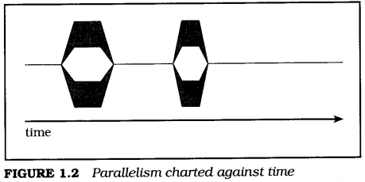

<span id="1"> </span>
# 1 Introduction
Lewis Carroll, Through the Looking-Glass:
> 'The time has come," the Walrus said,  
> "To talk of many things;  
> Of shoes-and ships-and sealing wax-  
> Of cabbages-and kings-  
> And why the sea is boiling hot-  
> And whether pigs have wings."

In a dictionary, you would probably see that one of several definitions for "thread" is along the lines of the third definition in the American Heritage paperback dictionary on my desk: "Anything suggestive of the continuousness and sequence of thread." In computer terms, a thread is the set of properties that suggest "continuousness and sequence" within the machine. A thread comprises the machine state necessary to execute a sequence of machine instructions-the location of the current instruction, the machine's address and data registers, and so forth.

A UNIX process can be thought of as a thread, plus an address space, file descriptors, and an assortment of other data. Some versions of UNIX support "lightweight" or "variable weight" processes that allow you to strip some or all of that data from some of your processes for efficiency. Now, whether you're using a "thread" or a "lightweight process," you still need the address space, file descriptors, and everything else. So, you might ask, what's the point? The point is that you can have many threads sharing an address space, doing different things. On a multiprocessor, the threads in a process can be doing different things simultaneously.

When computers lived in glass caves and were fed carefully prepared punch cards, the real world outside could be kept waiting with no consequences more severe than some grumbling programmers. But the real world doesn't do one thing at a time, and gradually computers began to model that world by adding capabilities such as multiprogramming, time sharing, multiprocessing, and, eventually, threads.

Threads can help you bring your application out of the cave, and Pthreads helps you do it in a way that will be neat, efficient, and portable. This chapter briefly introduces you to what you need to begin understanding and using threads. Don't worry-the rest of the book will follow up on the details left dangling in this chapter.

[Section 1.1](#1.1) presents the framework for a number of analogies that I will use to explain threading as we go. There is nothing all that unusual in the brief story-but hereafter you will understand when I talk about programmers and buckets, which, otherwise, might seem mildly odd.

[Section 1.2](#1.2) defines some essential concepts and terms used in this book. The most important of these concepts deserves a special introduction, which will also serve to demonstrate the convention with which various particularly important points shall be emphasized throughout this book:

> **I Asynchronous**:  
> Any two operations are "asynchronous" when they can proceed independently of each other

[Section 1.3](#1.3) describes how you already use asynchronous programming on a regular basis, both as a UNIX programmer and user, and as a human being in the real world. I wouldn't dare to claim that asynchronous programming is easy, but the basic concepts it tries to model are so easy and natural that you rarely need even to think about them until you try to apply them to software. 

Threads are, to some extent, just one more way to make applications asynchronous, but threads have some advantages over other models that have been used to build asynchronous applications. [Section 1.5](#1.5) will show you some of the advantages as we apply various programming methods in several versions of a simple alarm clock. You will get to see "threads in action" right away, with a brief description of the few Pthreads interfaces needed to build this simple application.

Armed, now, with a basic understanding of what threads are all about, you can go on to [Section 1.6](#1.6), where we will explore some of the fundamental advantages of a threaded programming model.

Although there are a lot of excellent reasons to use threads, there is a price to be paid. [Section 1.7](#1.7) provides a counterpoint to the previous section by describing some of the costs. What it boils down to, though, is simply that you need to learn how the model works, and then apply it carefully. It is not as hard as some folks would have you believe.

You have seen some of the fundamental benefits and costs. It may be obvious that you do not want to rush out and put threads into every application or library you write. [Section 1.8](#1.8) asks the question 'To thread, or not to thread?" and I will attempt to guide you toward determining the proper answer in various cases.

You will know at that point what threads are, what they do, and when to use them. Aside from brief examples, you haven't yet seen any detailed information about the particular programming interfaces (APIs) that compose Pthreads. [Section 1.9](#1.9) points out some of the basic landmarks of the Pthreads universe to get you oriented before we plunge ahead. The most important part of this section is 1.9.3, which describes the Pthreads model for reporting errors-which is somewhat different than the rest of UNIX and POSIX.

<span id="1.1"> </span>
## 1.1 The "bailing programmers"

Lewis Carroll, The Hunting of the Snark:
> This was charming, no doubt: but they shortly found out  
> That the Captain they trusted so well  
> Had only one notion for crossing the ocean,  
> And that was to tingle his bell.

Three programmers sail out to sea one fine day in a small boat, They sail quite some distance from shore, enjoying the sun and sea breeze, allowing the wind to carry them. The sky darkens, and a storm strikes. The small boat is tossed violently about, and when the storm abates the programmers are missing their boat's sail and most of the mast. The boat has sprung a small leak, and there is no land in sight.

The boat is equipped with food, water, oars, and a bailing bucket, and the programmers set to work. One programmer rows, and monitors the accumulating water in the bottom of the boat. The other programmers alternately sleep, watch the water level, or scan the horizon for sight of land or another ship.

An idle programmer may notice rising water in the boat, and begin bailing. When both idle programmers are awake, and become simultaneously concerned regarding their increasing dampness, they may both lunge for the bailing bucket-but one will inevitably reach it first, and the other will have to wait.

If the rower decides that bailing is required while both his companions sleep,a nudge is usually sufficient to awaken a programmer, allowing the other to continue sleeping. But if the rower is in a bad mood, he may resort to a loud yell, awakening both sleeping programmers. While one programmer assumes the necessary duty, the other can try to fall asleep again.

When the rower tires, he can signal one of the other programmers to take over the task, and immediately fall into a deep sleep waiting to be signaled in turn. In this way, they journey on for some time.

So, just what do the Bailing Programmers have to do with threads? I'm glad you asked! The elements of the story represent analogies that apply to the Pthreads programming model. We'll explore some additional analogies in later sections, and even expand the story a little, but for now consider a few basics:

- A **programmer** is an entity that is capable of independent activity. Our programmers represent threads. A thread is not really much like a programmer, who, as we all know, is a fascinatingly sophisticated mixture of engineer, mathematician, and artist that no computer can match. Still, as a representation of the "active element" in our programming model, it will be sufficient.
- The **bailing bucket** and the **oars** are "tokens" that can be held by only one individual at a time. They can be thought of as shared data, or as synchronization objects. The primary Pthreads synchronization object, by the way, is called a mutex.
- **Nudges** and **shouts** are communication mechanisms associated with a synchronization object, on which individuals wait for some condition. Pthreads provides condition variables, which may be signaled or broadcast to indicate changes in shared data state.


<span id="1.2"> </span>
## 1.2 Definitions and terminology

Lewis Carroll, Through the Looking-Glass:
> "When I use a word," Humpty Dumpty said, in rather a scornful tone,  
> "it means just what I choose it to mean-neither more nor less."

This book will use several critical terms that may be unfamiliar to you unless you've already had some experience with parallel or asynchronous programming. Even if you are familiar with them, some of the terms have seen assorted and even contradictory uses within research and industry, and that is clearly not going to help communication. We need to begin by coming to a mutual agreement regarding the meaning of these terms, and, since I am writing the book, we will agree to use my definitions. (Thank you.)

<span id="1.2.1"> </span>
### 1.2.1 Asynchronous

Asynchronous means that things happen independently (concurrently) unless there's some enforced dependency. Life is asynchronous. The dependencies are supplied by nature, and events that are not dependent on one another can occur simultaneously. A programmer cannot row without the oars, or bail effectively without the bucket-but a programmer with oars can row while another programmer with a bucket bails. Traditional computer programming, on the other hand, causes all events to occur in series unless the programmer takes "extraordinary measures" to allow them to happen concurrently.

The greatest complication of "asynchrony" has been that there's little advantage to being asynchronous unless you can have more than one activity going at a time. If you can start an asynchronous operation, but then you can do nothing but wait for it, you're not getting much benefit from the asynchrony.

<span id="1.2.2"> </span>
### 1.2.2 Concurrency

Concurrency, which an English dictionary will tell you refers to things happening at the same time, is used to refer to things that appear to happen at the same time, but which may occur serially. Concurrency describes the behavior of threads or processes on a uniprocessor system. The definition of concurrent execution in POSIX requires that "functions that suspend the execution of the calling thread shall not cause the execution of other threads to be indefinitely suspended."

Concurrent operations may be arbitrarily interleaved so that they make progress independently (one need not be completed before another begins), but concurrency does not imply that the operations proceed simultaneously. Nevertheless, concurrency allows applications to take advantage of asynchronous capabilities, and "do work" while independent operations are proceeding.

Most programs have asynchronous aspects that may not be immediately obvious. Users, for example, prefer asynchronous interfaces. They *expect* to be able to issue a command while they're thinking about it, even before the program has finished with the last one. And when a windowing interface provides separate windows, don't you intuitively expect those windows to act asynchronously? Nobody likes a "busy" cursor. Pthreads provides you with both concurrency and asynchrony, and the combination is exactly what you need to easily write responsive and efficient programs. Your program can "wait in parallel" for slow I/O devices, and automatically take advantage of multiprocessor systems to compute in parallel.

<span id="1.2.3"> </span>
### 1.2.3 Uniprocessor and multiprocessor

The terms *uniprocessor* and *multiprocessor* are fairly straightforward, but let's define them just to make sure there's no confusion. By *uniprocessor*, I mean a computer with a single programmer-visible execution unit (processor). A single general-purpose processor with superscalar processing, or vector processors, or other math or I/O coprocessors is still usually considered a uniprocessor.

By *multiprocessor*, I mean a computer with more than one processor sharing a common instruction set and access to the same physical memory. While the processors need not have equal access to all physical memory, it should be possible for any processor to gain access to most memory. A "massively parallel processor" (MPP) may or may not qualify as a multiprocessor for the purposes of this book. Many MPP systems do qualify, because they provide access to all physical memory from every processor, even though the access times may vary widely.

<span id="1.2.4"> </span>
### 1.2.4 Parallelism

*Parallelism* describes concurrent sequences that proceed simultaneously. In other words, software "parallelism" is the same as English "concurrency" and different from software "concurrency." Parallelism has a vaguely redeeming analogy to the English definition: It refers to things proceeding in the same direction independently (without intersection).

True parallelism can occur only on a multiprocessor system, but concurrency can occur on both uniprocessor and multiprocessor systems. Concurrency can occur on a uniprocessor because concurrency is, essentially, the illusion of parallelism. While parallelism requires that a program be able to perform two computations at once, concurrency requires only that the programmer be able to pretend that two things can happen at once.

<span id="1.2.5"> </span>
### 1.2.5 Thread safety and reentrancy

"Thread-safe" means that the code can be called from multiple threads without destructive results. It does not require that the code run *efficiently* in multiple threads, only that it can operate *safely* in multiple threads. Most existing functions can be made thread-safe using tools provided by Pthreads-mutexes, condition variables, and thread-specific data. Functions that don't require persistent context can be made thread-safe by serializing the entire function, for example, by locking a mutex on entry to the function, and unlocking the mutex before returning. Functions made thread-safe by serializing the entire function can be called in multiple threads-but only one thread can truly perform the function at a time.

More usefully, thread-safe functions can be broken down into smaller critical sections. That allows more than one thread to execute within the function, although not within the same part. Even better, the code can be redesigned to protect critical data rather than critical code, which may allow fully parallel execution of the code, when the threads don't need to use the same data at the same time.

The putchar function, for example, which writes a character into a standard I/O (stdio) buffer, might be made thread-safe by turning putchar into a critical section. That is, putchar might lock a "putchar mutex," write the character, and then unlock the putchar mutex. You could call putchar from two threads, and no data would be corrupted-it would be thread-safe. However, only one thread could write its character at a time, and the others would wait, even if they were writing to different stdio streams.

The correct solution is to associate the mutex with the stream, protecting the data rather than the code. Now your threads, as long as they are writing to different streams, can execute putchar in parallel. More importantly, all functions that access a stream can use the same mutex to safely coordinate their access to that stream.

The term "reentrant" is sometimes used to mean "efficiently thread-safe." That is, the code was made thread-safe by some more sophisticated measures than converting the function or library into a single serial region. Although existing code can usually be made thread-safe by adding mutexes and thread-specific data, it is often necessary to change the interface to make a function reentrant. Reentrant code should avoid relying on static data and, ideally, should avoid reliance on any form of synchronization between threads.

Often, a function can avoid internal synchronization by saving state in a "context structure" that is controlled by the caller. The caller is then responsible for any necessary synchronization of the data. The UNIX readdir function, for example, returns each directory entry in sequence. To make readdir thread-safe, you might add a mutex that readdir locked each time it was called, and unlocked before it returned to the caller. Another approach, as Pthreads has taken with **readdir\_r**, is to avoid any locking within the function, letting the caller allocate a structure that maintains the context of **readdir\_r** as it searches a directory.

At first glance, it may seem that we're just making the caller perform what ought to be the job of **readdir\_r**. But remember that only the caller knows how the data will be used. If only one thread uses this particular directory context, for example, then no synchronization is needed. Even when the data is shared between threads, the caller may be able to supply more efficient synchronization, for example, if the context can be protected using a mutex that the application also uses for other data.

<span id="1.2.6"> </span>
### 1.2.6 Concurrency control functions

Any "concurrent system" must provide a core set of essential functions that you need to create concurrent execution contexts, and control how they operate within your library or application. Here are three essential facilities, or aspects, of any concurrent system:

1. *Execution* context is the state of a concurrent entity. A concurrent system must provide a way to create and delete execution contexts, and maintain their state independently. It must be able to save the state of one context and dispatch to another at various times, for example, when one needs to wait for an external event. It must be able to continue a context from the point where it last executed, with the same register contents, at a later time.
2. *Scheduling* determines which context (or set of contexts) should execute at any given point in time, and switches between contexts when necessary.
3. *Synchronization* provides mechanisms for concurrent execution contexts to coordinate their use of shared resources. We use this term in a way that is nearly the opposite of the standard dictionary meaning. You'll find a definition much like "cause to occur at the same time," whereas we usually mean something that might better be expressed as "prevent from occurring at the same time." In a thesaurus, you may find that "cooperate" is a synonym for "synchronize"-and synchronization is the mechanism by which threads cooperate to accomplish a task. This book will use the term "synchronization," though, because that is what you'll see used, almost universally.

There are many ways to provide each of these facilities-but they are always present in some form. The particular choices presented in this book are dictated by the book's subject-Pthreads. Table 1.1 shows a few examples of the three facilities in various systems.


| Category              | Execution context | Scheduling               | Synchronization                 |
| --------------------- | ----------------- | ------------------------ | ------------------------------- |
| Real traffic          | automobile        | traffic lights and signs | turn signals and brake lights   |
| UNIX (before threads) | process           | priority (nice)          | wait and pipes                  |
| Pthreads              | thread            | policy, priority         | condition variables and mutexes |
<center>**TABLE 1.1** *Execution contexts, schedulers, and synchronization*</center>

A system's scheduling facility may allow each thread to run until it voluntarily yields the processor to another thread ("run until block"). It may provide timeslicing, where each thread is forced to periodically yield so that other threads may run ("round-robin"). It may provide various scheduling policies that allow the application to control how each thread is scheduled according to that thread's function. It may provide a "class scheduler" where dependencies between threads are described so that, for example, the scheduler can ensure that members of a tightly coupled parallel algorithm are scheduled at the same time.

Synchronization may be provided using a wide variety of mechanisms. Some of the most common forms are mutexes, condition variables, semaphores, and events. You may also use message passing mechanisms, such as UNIX pipes, sockets, POSIX message queues, or other protocols for communicating between asynchronous processes-on the same system or across a network. Any form of communication protocol contains some form of synchronization, because passing data around with no synchronization results in chaos, not communication.

The terms thread, mutex, and condition variable are the main topics of this book. For now, it is enough to know that a thread represents an "executable thing" on your computer. A mutex provides a mechanism to prevent threads from colliding unexpectedly, and a condition variable allows a thread, once it has avoided such a collision, to wait until it is safe to proceed. Both mutexes and condition variables are used to synchronize the operation of threads.


<span id="1.3"> </span>
## 1.3 Asynchronous programming is intuitive ...

Lewis Carroll, Through the Looking-Glass:
> "In most gardens," the Tiger-lily said,  
> "they make the beds too soft-so that the flowers are always asleep.'  
> This sounded a very good reason, and Alice was quite  
> pleased to know it.  
> "I never thought of that before!" she said.

If you haven't been involved in traditional realtime programming, asynchronous programming may seem new and different. But you've probably been using asynchronous programming techniques all along. You've probably used UNIX, for example, and, even as a user, the common UNIX shells from sh to ksh have been designed for asynchronous programming. You've also been using asynchronous "programming" techniques in real life since you were born.

Most people understand asynchronous behavior much more thoroughly than they expect, once they get past the complications of formal and restricted definitions.

<span id="1.3.1"> </span>
### 1.3.1 ... because UNIX is asynchronous

In any UNIX system, processes execute asynchronously with respect to each other, even when there is only a single processor. Yes, until recently it was difficult to write individual programs for UNIX that behaved asynchronously-but UNIX has always made it fairly easy for you to behave asynchronously. When you type a command to a shell, you are really starting an independent program-if you run the program in the background, it runs asynchronously with the shell. When you pipe the output of one command to another you are starting several independent programs, which synchronize between themselves using the pipe.

> Time is a synchronization mechanism.

In many cases you provide synchronization between a series of processes yourself, maybe without even thinking about it. For example, you run the compiler after you've finished editing the source files. It wouldn't occur to you to compile them first, or even at the same time. That's elementary reallife synchronization.

> UNIX pipes and files can be synchronization mechanisms.

In other cases you may use more complicated software synchronization mechanisms. When you type "**ls | more**" to a shell to pass the output of the **ls** command into the more command, you're describing synchronization by specifying a data dependency. The shell starts both commands right away, but the more command can't generate any output until it receives input from **ls** through the pipe. Both commands proceed concurrently (or even in parallel on a multiprocessor) with **ls** supplying data and more processing that data, independently of each other. If the pipe buffer is big enough, **ls** could complete before more ever started; but more can't ever get ahead of ls.

Some UNIX commands perform synchronization internally. For example, the command "**cc -o thread thread.c**" might involve a number of separate processes. The **cc** command might be a "front end" to the C language environment, which runs a filter to expand preprocessor commands (like **#include** and **#if**), a compiler to translate the program into an intermediate form, an optimizer to reorder the translation, an assembler to translate the intermediate form into object language, and a loader to translate that into an executable binary file. As with **ls | more**, all these programs may be running at the same time, with synchronization provided by pipes, or by access to temporary files.

UNIX processes can operate asynchronously because each process includes all the information needed to execute code. The operating system can save the state of one process and switch to another without affecting the operation of either. Any general-purpose asynchronous "entity" needs enough state to enable the operating system to switch between them arbitrarily. But a UNIX process includes additional state that is not directly related to "execution context," such as an address space and file descriptors.

A thread is the part of a process that's necessary to execute code. On most computers that means each thread has a pointer to the thread's current instruction (often called a "PC" or "program counter"), a pointer to the top of the thread's stack (SP), general registers, and floating-point or address registers if they are kept separate. A thread may have other things, such as processor status and coprocessor control registers. A thread does not include most of the rest of the state associated with a process; for example, threads do not have their own file descriptors or address space. All threads within a process share all of the files and memory, including the program text and data segments.

> Threads are "simpler" than processes.

You can think of a thread as a sort of "stripped down" process, lean and mean and ready to go. The system can switch between two threads within a process much faster than it can switch between processes. A large part of this advantage comes from the fact that threads within a process share the address space-code, data, stack, everything.

When a processor switches between two processes, all of the hardware state for that process becomes invalid. Some may need to be changed as part of the context switch procedure-data cache and virtual memory translation entries may be flushed, for example. Even when they do not need to be flushed immediately, however, the data is not useful to the new process. Each process has a separate virtual memory address space, but threads running within the same process share the virtual address space and all other process data.

Threads can make high-bandwidth communication easier between independent parts of your program. You don't have to worry about message passing mechanisms like pipes or about keeping shared memory region address references consistent between several different address spaces. Synchronization is faster, and programming is much more natural. If you create or open a file, all threads can use it. If you allocate a dynamic data structure with malloc, you can pass the address to other threads and they can reference it. Threads make it easy to take advantage of concurrency.

<span id="1.3.2"> </span>
### 1.3.2 ... because the world is asynchronous

Thinking asynchronously can seem awkward at first, but it'll become natural with a little practice. Start by getting over the unnatural expectation that everything will happen serially unless you do something "unusual." On a one-lane road cars proceed one at a time-but on a two-lane road two cars go at once. You can go out for a cup of coffee, leaving your computer compiling some code and fully expecting that it will proceed without you. Parallelism happens everywhere in the real world, and you expect it.

A row of cashiers in a store serve customers in parallel; the customers in each line generally wait their turn. You can improve throughput by opening more lines, as long as there are registers and cashiers to serve them, and enough customers to be served by them. Creating two lines for the same register may avoid confusion by keeping lines shorter-but nobody will get served faster. Opening three registers to serve two customers may look good, but it is just a waste of resources.

In an assembly line, workers perform various parts of the complete job in parallel, passing work down the line. Adding a station to the line may improve performance if it parallels or subdivides a step in the assembly that was so complicated that the operator at the next station spent a lot of time waiting for each piece. Beware of improving one step so much that it generates more work than the next step on the assembly line can handle.

In an office, each project may be assigned to a "specialist." Common specialties include marketing, management, engineering, typing pool, sales, support, and so forth. Each specialist handles her project independently on behalf of the customer or some other specialist, reporting back in some fashion when done. Assigning a second specialist to some task, or denning narrower specialties (for example, assigning an engineer or manager permanently to one product) may improve performance as long as there's enough work to keep her busy. If not, some specialists play games while others' in-baskets overflow.

Motor vehicles move in parallel on a highway. They can move at different speeds, pass each other, and enter and exit the highway independently. The drivers must agree to certain conventions in order to avoid collisions. Despite speed limits and traffic signs, compliance with the "rules of the road" is mostly voluntary. Similarly, threads must be coded to "agree" to rules that protect the program, or risk ending up undergoing emergency debugging at the thread hospital.

Software can apply parallelism in the same ways you might use it in real life, and for the same reasons. When you have more than one "thing" capable of doing work, you naturally expect them to all do work at the same time. A multiprocessor system can perform multiple computations, and any time-sharing system can perform computations while waiting for an external device to respond. Software parallelism is subject to all of the complications and problems that we have seen in real life-and the solutions may not be as easy to see or to apply. You need enough threads, but not too many; enough communication, but not too much. A key to good threaded programming is learning how to judge the proper balance for each situation.

Each thread can process similar parts of a problem, just like supermarket cashiers handling customers. Each thread can perform a specific operation on each data item in turn, just like the workers on an assembly line. Each thread can specialize in some specific operation and perform that operation repeatedly on behalf of other threads. You can combine these basic models in all sorts of ways; for example, in parallel assembly lines with some steps performed by a pool of servers.

As you read this book you'll be introduced to concepts that may seem unfamiliar: mutexes, condition variables, race conditions, deadlocks, and priority inversions. Threaded programming may feel daunting and unnatural. But I'll explain all those concepts as we move through this book, and once you've been writing multithreaded code for a while you may find yourself noticing real-world analogies to the concepts. Threads and all this other stuff are formalized and restricted representations of things you already understand.

If you find yourself thinking that someone shouldn't interrupt you because you have the conversation mutex locked, you've begun to develop an intuitive understanding of threaded programming(It may also be a good time to take a break and read some healthy escapist fiction for a while.). You can apply that understanding to help you design better threaded code with less effort. If something wouldn't make sense in real life, you probably shouldn't try it in a program either.


<span id="1.4"> </span>
## 1.4 About the examples in this book

This book contains a number of examples. All are presented as complete programs, and they have been built and tested on Digital UNIX 4.0d and Solaris 2.5.

All of these programs do something, but many do not do anything of any particular importance. The purpose of the examples is to demonstrate thread management and synchronization techniques, which are mere overhead in most real programs. They would be less effective at revealing the details if that "overhead" was buried within large programs that "did something."

Within the book, examples are presented in sections, usually one function at a time. The source code is separated from the surrounding text by a header and trailer block which include the file name and, if the example comprises more than one section, a section number and the name of the function. Each line of the source code has a line number at the left margin. Major functional blocks of each section are described in specially formatted paragraphs preceding the source code. These paragraphs are marked by line numbers outside the left margin of the paragraph, denoting the line numbers in the source listing to which the paragraph refers. Here's an example:

> **Example 1-2**  
> These lines show the header files included in most of the examples. The \<pthread.h\> header file declares constants and prototypes for the Pthreads functions, and the errors.h header file includes various other headers and some error-checking functions.

 ```c
 /* sample.c part 1 sampleinfo */
 # include <pthread.h>
 # include "errors.h"
 ```

I have written these examples to use error checking everywhere. That is, I check for errors on each function call. As long as you code carefully, this isn't necessary, and some experts recommend testing only for errors that can result from insufficient resources or other problems beyond your control. I disagree, unless of course you're the sort of programmer who never makes a mistake. Checking for errors is not that tedious, and may save you a lot of trouble during debugging.

You can build and run all of the examples for yourself-the source code is available online at [http://www.aw.com/butenhof/posixcode.html](http://www.aw.com/butenhof/posixcode.html). A Makefile is provided to build all of the examples, though it requires modifications for various platforms. On Digital UNIX, the examples were built with **CFLAGS=-pthread -stdl -wl**. On Solaris, they were built with **CFLAGS=-D\_REENTRANT -D\_POSIX\_C\_SOURCE=199506 -lpthread**. Some of the examples require interfaces that may not be in the Pthreads library on your system, for example, **clock\_gettime**, which is part of the POSIX.lb realtime standard. The additional realtime library is specified by the **RTFLAGS** variable, which is defined as **RTFLAGS=-lrt** on Digital UNIX, and as **RTFLAGS=-lposix4** on Solaris.

On Solaris 2.5 systems, several of the examples require calls to **thr\_setconcurrency** to ensure proper operation. This function causes Solaris to provide the process with additional concurrency. In a few cases, the example will not operate at all without this call, and in other cases, the example would fail to demonstrate some behavior.


<span id="1.5"> </span>
## 1.5 Asynchronous programming, by example

Lewis Carroll, The Hunting of the Snark:
> "In one moment I've seen what has hitherto been  
> Enveloped in absolute mystery,  
> And without extra charge I will give you at large  
> A Lesson in Natural History."

This section demonstrates some basic asynchronous programming, using a simple program that does something vaguely useful, by pretending to be an alarm clock with a command interface for which you would not consider paying a dime in a store. But then, this book is about threads, not user interfaces, and the code that I need to show takes up quite enough space already.

The program prompts for input lines in a loop until it receives an error or end of file on stdin. On each line, the first nonblank token is interpreted as the number of seconds to wait, and the rest of the line (up to 64 characters) is a message that will be printed when the wait completes. I will offer two additional versions-one using multiple processes, and one using multiple threads. We'll use the three examples to compare the approaches.


<span id="1.5.1"> </span>
### 1.5.1 The baseline, synchronous version

Include the header file **errors.h**, which includes standard headers like \<unistd.h\> and \<stdio.h\> and defines error reporting macros that are used throughout the examples in this book. We don't use the error reporting macros in this particular example, but consistency is nice, sometimes.

The "baseline" version, alarm.c, is a synchronous alarm program with a single routine, main. Most of main is a loop, which processes simple commands until f gets returns a NULL (error or end of file). Each line is "parsed" with sscanf to separate the number of seconds to wait (%d, the first sequence of digits) from the message string to print (%64[ A\n], the rest of the line, up to 64 characters excluding newline).

```c
/** alarm.c */

# include "errors.h"

int main (int argc, char *argv[])
{
    int seconds;
    char line[128];
    char message[64];

    while (1) {
        printf ("Alarm> ");
        if (fgets (line, sizeof (line), stdin) == NULL) exit @);
        if (strlen (line) <= 1) continue;

        /*
        * Parse input line into seconds (%d) and a message
        * (%64[^\n]), consisting of up to 64 characters
        * separated from the seconds by whitespace.
        */

        if (sscanf (line, "%d %64[^\n]",
            &seconds, message) < 2) {
            fprintf (stderr, "Bad commandXn");
        } else {
            sleep (seconds);
            printf ("(%d) %s\n", seconds, message);
        }
    }
}
```
The problem with the program alarm, c is that only one alarm request can be active at a time. If you set an alarm to remind you to do something in 10 minutes F00 seconds), you can't decide to have it remind you of something else in 5 minutes. The program is doing something synchronously that you would probably like to be asynchronous.


<span id="1.5.2"> </span>
### 1.5.2 A version using multiple processes

There are lots of ways to make this program asynchronous; for example, you could run more than one copy of the program. One way to run multiple copies is to fork a child process for each command, as shown in alarm\_fork.c. The new version is asynchronous-you can enter commands at any time, and they will be carried out independently. It isn't much more complicated than the original, which is nice.

The main difference between alarm.c and alarm\_fork.c is that instead of calling sleep directly, it uses fork to create a new child process, which then calls sleep (and, eventually, printf) asynchronously, while the parent process continues.

The primary complication in this version is the need to "reap" any child processes that have terminated. If the program fails to do this, the system will save them all until the program terminates. The normal way to reap terminated child processes is to call one of the wait functions. In this case, we call waitpid, which allows the caller to specify the wnohang flag. The function will immediately reap one child process if any have terminated, or will immediately return with a process ID (pid) of 0. The parent process continues to reap terminated child processes until there are no more to reap. When the loop terminates, main loops back to line 13 to read a new command.

```c
/** alarm_fork.c */

 # include <sys/types.h>
 # include <wait.h>
 # include "errors.h"
 
int main (int argc, char *argv[])
{
    int status;
    char line[128];
    int seconds;
    pid_t pid;
    char message[64];

    while (1) {
        printf ("Alarm> " );
        if (fgets (line, sizeof (line), stdin) == NULL) exit (0);
        if (strlen (line) <= 1) continue;

        /*
         * Parse input line into seconds (%d) and a message
         * (%64[^\n]), consisting of up to 64 characters
         * separated from the seconds by whitespace.
         */

        if (sscanf (line, "%d %64[^\n]",
            &seconds, message) < 2) {
            fprintf (stderr, "Bad command\n");
        } else {
            pid = fork ();
            if (pid == (pid_t)-1)
                errno_abort ("Fork");
            if (pid == (pid_t)0) {
                /*
                 * In the child, wait and then print a message
                 */
                sleep (seconds);
                printf ("(%d) %s\n", seconds, message);
                exit (0);
            } else {
                /*
                 * In the parent, call waitpid() to collect children
                 * that have already terminated.
                 */
                do {
                    pid = waitpid ((pid_t)-1, NULL, WNOHANG);
                    if (pid == (pid_t)-1)
                        errno_abort ("Wait for child");
                } while (pid != (pid_t)0);
            }
        }
    }
}

```

<span id="1.5.3"> </span>
### 1.5.3 A version using multiple threads

Now, let us try another alarm program, alarm\_thread.c. It is much like the fork version in alarm\_fork.c, except that it uses threads instead of child processes to create asynchronous alarms. Four Pthreads calls are used in this program:

- **pthread\_create** creates a thread running the routine specified in the third argument (alarm\_thread), returning an identifier for the new thread to the variable referenced by thread.
- **pthread\_detach** allows Pthreads to reclaim the thread's resources as soon as it terminates.
- **pthread\_exit** terminates the calling thread.
- **pthread\_self** returns the calling thread's identifier.

The **alarm\_t** structure defines the information stored for each alarm command, the number of seconds until the alarm is due, and the message string that will be printed by the thread.

```c
/** alarm_thread.c part 1 definitions */
 # include <pthread.h>
 # include "errors.h"

typedef struct alarm_tag {
    int seconds;
    char message[64];
} alarm_t;
```

The alarm\_thread function is the "alarm thread." That is, each alarm thread is created running this function, and when the function returns the thread terminates. The function's argument (void \*arg) is the fourth argument that was passed to pthread\_create, in this case, a pointer to the control packet (alarm\_t) created for the alarm request that the thread is to satisfy. The thread starts by "mapping" the void * argument as a pointer to a control packet. The thread detaches itself by calling pthread\_detach, which informs Pthreads that the application does not need to know when the thread terminates or its termination status.

The thread sleeps for the number of seconds specified in its control packet, and then prints the message string. Finally, the thread frees the control packet and returns. When a thread returns from its initial routine, as it does here, the thread terminates. Normally, Pthreads would hold the thread's resources so that another thread could later determine that it had exited and retrieve a final result. Because the thread detached itself, none of that is necessary.

```c
/** alarm_thread.c part 2 alarm_thread */
void *alarm_thread (void *arg)
{
    alarm_t *alarm = (alarm_t*)arg;
    int status;

    status = pthread_detach (pthread_self ());
    if (status != 0)
        err_abort (status, "Detach thread");
    sleep (alarm->seconds);
    printf ("(%d) %s\n", alarm->seconds, alarm->message);
    free (alarm);
    return NULL;
}
```

The main program of **alarm\_thread.c** is much the same as the other two variants. It loops, reading and interpreting command lines as long as it can read from stdin.

In this variation, main allocates heap storage (**alarm\_t**) for each alarm command. The alarm time and message are stored in this structure, so each thread can be given the appropriate information. If the sscanf call fails to "parse" a correct command, the heap storage is freed.

An alarm thread is created, running function **alarm\_thread**, with the alarm data (**alarm\_t**) as the thread's argument.

```c
/** alarm_thread.c part 3 main */
int main (int argc, char *argv[])
{
    int status;
    char line[128];
    alarm_t *alarm;
    pthread_t thread;

    while A) {
        printf ("Alarm> ");
        if (fgets (line, sizeof (line), stdin) == NULL) exit (0);
        if (strlen (line) <= 1) continue;
        alarm = (alarm_t*)malloc (sizeof (alarm_t));
        if (alarm == NULL)
            errno_abort ("Allocate alarm");

        /*
         * Parse input line into seconds (%d) and a message
         * (%64[^\n]), consisting of up to 64 characters
         * separated from the seconds by whitespace.
         */
        if (sscanf (line, "%d %64[^\n]",
            &alarm->seconds, alarm->message) < 2) {
            fprintf (stderr, "Bad command\n");
            free (alarm);
        } else {
            status = pthread_create (
                &thread, NULL, alarm_thread, alarm);
            if (status != 0)
                err_abort (status, "Create alarm thread");
        }
    }
 }

```


<span id="1.5.4"> </span>
### 1.5.4 Summary

A good way to start thinking about threads is to compare the two asynchronous versions of the alarm program. First, in the fork version, each alarm has an independent address space, copied from the main program. That means we can put the seconds and message values into local variables-once the child has been created (when fork returns), the parent can change the values without affecting the alarm. In the threaded version, on the other hand, all threads share the same address space-so we call **malloc** to create a new structure for each alarm, which is passed to the new thread. The extra bookkeeping required introduces a little complexity into the threaded version.

In the version using fork, the main program needs to tell the kernel to free resources used by each child process it creates, by calling **waitpid** or some other member of the wait "family." The **alarm\_fork.c** program, for example, calls waitpid in a loop after each command, to collect all child processes that have completed. You do not need to wait for a thread unless you need the thread's return value-in **alarm\_thread.c**, for example, each alarm thread detaches itself (at line 6, part 2) so that the resources held by the thread will be returned immediately when it terminates.

In the threaded version, the "primary activities" (sleeping and printing the message) must be coded in a separate routine. In **alarm.c** and **alarm\_fork.c**, those activities were performed without a call. In simple cases such as our alarm program, it is often easier to understand the program with all code in one place, so that might seem like an advantage for **alarm\_fork.c**. In more complicated programs, though, it is rare that a program's "primary activities" are so simple that they can be performed in a single routine without resulting in total confusion.

In a real alarm program, you wouldn't want to create a process for each alarm. You might easily have hundreds of alarms active, and the system probably wouldn't let you create that many processes. On the other hand, you probably can create hundreds of threads within a process. While there is no real need to maintain a stack and thread context for each alarm request, it is a perfectly viable design.

A more sophisticated version of **alarm\_thread.c** might use only two threads: one to read input from the user, and another to wait for expiration of the next alarm-I'll show that version later, after we've worked through some more basic concepts. You could do the same thing with two processes, of course, but it would be more cumbersome. Passing information between two threads is easy and fast-no shared memory to map, no pipes to read or write, no concerns about whether you are passing addresses that may not mean the same thing in both processes. Threads share everything in their address space-any address that's valid in one thread is valid in all threads.


<span id="1.6"> </span>
## 1.6 Benefits of threading

Lewis Carroll, Through the Looking-Glass:
> "'O Looklng-Glass creatures,'quoth Alice, 'draw near!  
> 'Tis an honour to see me, a favour to hear:  
> 'Tis a privilege high to have dinner and tea  
> Along with the Red Queen, the White Queen, and me!'"

Some advantages of the multithreaded programming model follow:

1. Exploitation of program parallelism on multiprocessor hardware. Parallelism is the only benefit that requires special hardware. The others can help most programs without special hardware.
2. More efficient exploitation of a program's natural concurrency, by allowing the program to perform computations while waiting for slow I/O operations to complete.
3. A modular programming model that clearly expresses relationships between independent "events" within the program.

These advantages are detailed in the following sections.

<span id="1.6.1"> </span>
### 1.6.1 Parallelism

On a multiprocessor system, threading allows a process to perform more than one independent computation at the same time. A computation-intensive threaded application running on two processors may achieve nearly twice the performance of a traditional single-threaded version. "Nearly twice" takes into account the fact that you'll always have some overhead due to creating the extra thread(s) and performing synchronization. This effect is often referred to as "scaling." A two-processor system may perform 1.95 times as fast as a single processor, a three-processor system 2.9 times as fast, a four-processor system 3.8 times as fast, and so forth. Scaling almost always falls off as the number of processors increases because there's more chance of lock and memory collisions, which cost time.
<div align="center">
$$
Speedup = \frac{1}{\left ( 1 - p \right ) + \frac{p}{n}}
$$
</div>
<center>**FIGURE 1.1** Amdahl's law</center>

Scaling can be predicted by "Amdahl's law," which is shown in Figure 1.1. In the equation, *p* represents the ratio of "parallelizable code" over "total execution time", and *n* represents the number of processors the code can use. The total elapsed time for a parallel job is the sum of the elapsed time for the nonparallelizable work *(1 - p)* and the elapsed time for each processor executing the parallelizable work *(p/n)*.

Amdahl's law is a simple relationship showing how parallelism is limited by the amount of serialization needed. When the program has no parallelizable code (*p* is 0), the speedup is 1. That is, it is not a parallel program. If the program requires no synchronization or other serial code (*p* is 1), then the speedup is *n* (the number of processors). As more synchronization is required, parallelism provides less benefit. To put it another way, you'll get better scaling with activities that are completely independent than with activities that are highly dependent: The independent activities need less synchronization.

The diagram in Figure 1.2 shows the effect of Amdahl's law. "Clock time" progresses from left to right across the page, and the diagram shows the number of processors working in parallel at any moment. Areas where the diagram has only a single horizontal line show that the process is serialized. Areas that have several horizontal lines in parallel show where the process benefits from multiple processors. If you can apply multiple processors for only 10% of your program's execution time, and you have four processors, then Amdahl's law predicts a speedup of **1 / (0.9+ (0.1 /4))**, or about 8%.

<div align="center">

</div>

Operations on large matrices can often be "parallelized" by splitting the matrix into pieces. For example, each thread may be able to operate on a set of rows or columns without requiring any data written by threads operating on other slices. You still generally need to synchronize threads at the beginning and end of processing the matrix, frequently using a barrier.(see below) Amdahl's law shows that you'll get better performance by giving each thread a large and relatively independent "chunk" of work, requiring infrequent synchronization, than by giving them smaller chunks.

> A barrier is a simple synchronization mechanism that blocks each thread until a certain number has reached the barrier; then all threads are unblocked. Barriers can be used, for example, to keep any thread from executing a parallel region of code until all threads are ready to execute the region. [Section 7.1.1](#7.1.1) describes barriers in more detail, and demonstrates the construction of a simple barrier package.


Amdahl's law is an excellent thought exercise to help you understand scaling. It is not, however, a practical tool, because it is nearly impossible to accurately compute p for any program. To be accurate, you need to consider not only all serialized regions within your code, but also within the operating system kernel and even in hardware. Multiprocessor hardware must have some mechanism to synchronize access to the contents of memory. When each processor has a private data cache, the contents of those caches must be kept consistent with each other and with the data in memory. All of this serialization must be included in any accurate calculation.

<span id="1.6.2"> </span>
### 1.6.2 Concurrency

The threaded programming model allows the program to make computational progress while waiting for blocking operations like I/O. This is useful for network servers and clients, and it is the main reason that client/server systems (such as OSF DCE) use threads. While one thread waits for a long network read or write operation, that thread is blocked and other threads in your application can execute independently. Some systems support asynchronous I/O operations, which can give similar advantages; but most UNIX-based systems do not have asynchronous I/O.(see below) Furthermore, asynchronous I/O is generally a lot more complicated to use than threads.

> UNIX systems support "nonblocking I/O," but this is not the same thing as asynchronous I/O. Nonblocking I/O allows the program to defer issuing an I/O operation until it can complete without blocking, but asynchronous I/O can proceed while the program does something else.

For example, you need to either handle asynchronous notification when the I/O completes, or poll for completion. If you issued an asynchronous I/O and then entered a polling loop, you would lose the advantage of asynchronous I/O-your application would just wait. If you poll elsewhere, or handle asynchronous notification, then issuing the I/O and processing the resulting data occur in different locations within your program. That makes the code more difficult to analyze and maintain. When you use synchronous I/O you just perform the I/O and then do whatever comes next. Synchronous I/O within multiple threads gives nearly all the advantages of asynchronous I/O. In most cases you will find it much easier to write complex asynchronous code using threads than using traditional asychronous programming techniques.

You could write an alarm program, like those shown in [Section 1.5](#1.5), as an asynchronous program without using processes or threads, with timer signals for the alarms and asynchronous reads for input. Using timer signals is more complicated in many ways, since you are severely limited in what you can do within a signal handler. Asynchronous I/O does not allow you to take advantage of the convenience of stdio functions. The basic program function will be scattered through a series of signal handlers and functions, and will probably be harder to understand.

Asynchronous I/O does have one advantage over threaded concurrency, though. Just as a thread is usually "cheaper" (in execution time and storage space) than a process, the context required for an asynchronous I/O operation is almost always cheaper than a thread. If you plan to have a lot of asynchronous I/O operations active at the same time, that might be important enough to justify using the more complicated programming model. But watch out-some "asynchronous I/O" packages just distribute your I/O requests across a pool of threads! Most of the time you will be better off using threads.

Another method of coding an asynchronous application is for each action to be treated as an "event." Events are queued by some "hidden" process, and dispatched serially to be handled by the application, usually through "callback" routines registered with the dispatcher. Event dispatchers have been popularized by windowing interface systems such as the Apple Macintosh toolbox, Microsoft Windows, and X Windows on UNIX (used by Motif and CDE).

The event mechanism alleviates much of the complication of using signals and asynchronous I/O, as long as the events are supported directly by the event dispatcher. All, for example, handle input from the keyboard or pointer device, and generally one can request a timer event to be inserted automatically at a desired time. Thus, the alarm program, written to an event interface, need only initialize the event dispatcher and enter a loop to process events. Input events would be dispatched to the parser, resulting in a request for a new timer event; and timer events would be dispatched to a function that would format and print the alarm message.

For very simple applications (and the alarm program here is certainly one example), an event-based implementation may be simpler than the multiprocess or multithread variations I've shown-at least when the (often substantial) overhead of initializing the event dispatcher is removed. The limitations of events become more obvious when you build larger and more sophisticated applications-the problem is that the events are sequential.

Events are not concurrent, and the program can do only one thing at a time. Your application receives an event, processes it, and then receives the next event. If processing an event takes a long time, for example, sorting a large database, the user interface may remain unresponsive for quite a while. If an event involves a long wait, for example, reading data over a slow network connection, then, again, the user must wait.

The response problems can be minimized by liberally sprinkling extended operations with calls to the event dispatcher-but getting them in the right place, without substantially impacting the performance of the operation, can be difficult. Furthermore, you may not have that option, if the database sort is taking place in a shared library you bought from somebody else.

On the other hand, one might code the application to create a new thread that runs the database sort, or reads from the slow network, leaving the "user interface" thread to immediately request another event. The application becomes responsive, while the slow operation continues to run. You can do this even if a database package, for example, cannot tolerate being run in multiple threads, by queuing a "sort" command to a server thread that runs database operations serially-while still retaining interface responsiveness.


<span id="1.6.3"> </span>
### 1.6.3 Programming model

It may be surprising that programming with threads is a good idea even if you know your code will never run on a multiprocessor. But it is true. Writing with threads forces you to think about and plan for the synchronization requirements of your program. You've always had to think about program dependencies, but threads help to move the requirements from comments into the executable structure of the program.

Assembly language programs can use all the same sequential control structures (loops, conditional code) as programs written in a high-level language. However, it can be difficult to determine whether a branch instruction represents the top or bottom of a loop, a simple conditional, a "conditional goto," or something more exotic. Switching to a higher-level language that supports these sequential controls directly in source, for example, the C language do, while, for, if, and switch statements, makes these sequential programming constructs explicit in the source language. Making control structures explicit in the program source code means that more of your program's design is explicit in the source, and that makes it easier for someone else to understand.

Similarly, a C language program (or even an assembler program) may use data encapsulation and polymorphism by adhering to programming conventions, and with luck those conventions may be carefully documented and the documentation kept updated. But if that same code is written in an object-oriented language, the encapsulation and polymorphism become explicit in the source language.

In a sequential program, synchronization requirements are implicit in the ordering of operations. The true synchronization requirements, for example, that "a file must be opened before data can be read from the file," may be documented only by source comments, if at all. When you program using threads, sequential assumptions are (or at least should be) limited to small segments of contiguous code-for example, within a single function. More global assumptions, to be at all safe, must be protected by explicit synchronization constructs.

In traditional serial programming you call function A to do one thing, then call another function B to do something else, even when those two functions don't require serialization. If a developer is trying to determine what the program is doing, perhaps to trace a bug, it often isn't obvious that there may be no need to follow both calls. Furthermore, the strictly serial model makes it easy for someone to inadvertently make function B dependent on some side effect of function A. If a later modification reverses the order of the calls, the program may break in ways that aren't obvious. Program dependencies may be documented using source code comment blocks, but comments are often ambiguous and may not be properly updated when code is changed.

The threaded programming model isolates independent or loosely coupled functional execution streams (threads) in a clear way that's made explicit in the program's source code. If activities are designed as threads, each function must include explicit synchronization to enforce its dependencies. Because synchronization is executable code, it can't be ignored when dependencies are changed. The presence of synchronization constructs allows anyone reading the code to follow temporal dependencies within the code, which can make maintenance substantially easier, especially for large programs with a lot of independent code.

An assembly language programmer can write better, more maintainable assembly code by understanding high-level language programming; a C language programmer can write better, more maintainable C code by understanding object-oriented programming. Even if you never write a threaded program, you may benefit from understanding the threaded programming model of independent functions with explicit dependencies. These are "mental models" (or that dreadfully overused word, "paradigms") that are more or less independent of the specific code sequences you write. Cleanly isolating functionally independent code may even make sequential programs easier to understand and maintain.


<span id="1.7"> </span>
## 1.7 Costs of threading
Lewis Carroll, Through the Looking-Glass:
> All this time the Guard was looking at her, first through a telescope, then  
> through a microscope, and then through an opera-glass.  
> At last he said, "You're traveling the wrong way,"  
> and shut up the window, and went away.

Of course there's always "the flip side." As I showed in the previous section, threads provide definite and powerful advantages, even on uniprocessor systems. They provide even more advantages on a multiprocessor.

So why wouldn't you want to use threads? Everything has a cost, and threaded programming is no exception. In many cases the advantage exceeds the cost; in others it doesn't. To be fair, the following subsections discuss the cost of threaded programming.

<span id="1.7.1"> </span>
### 1.7.1 Computing overhead

Overhead costs in threaded code include direct effects such as the time it takes to synchronize your threads. Many clever algorithms are available for avoiding synchronization in some cases, but none of them is portable. You'll have to use some synchronization in just about any threaded code. It is easy to lose performance by using too much synchronization; for example, by separately protecting two variables that are always used together. Protecting each variable separately means you spend a lot more time on synchronization without gaining parallelism, since any thread that needs one variable will need the other as well.

The overhead of threaded programming can also include more subtle effects. For example, threads that constantly write the same memory locations may spend a lot of time synchronizing the memory system on processors that support "read/ write ordering." Other processors may spend that time synchronizing only when you use special instructions such as a memory barrier, or a "multiprocessor atomic" operation like test-and-set. [Section 3.4](#3.4) says a lot more about these effects.

Removing a bottleneck in your code, for example, by adding threads to perform multiple concurrent I/O operations, may end up revealing another bottleneck at a lower level-in the ANSI C library, the operating system, the file system, the device driver, the memory or I/O architecture, or the device controller. These effects are often difficult to predict, or measure, and are usually not well documented.

A compute-bound thread, which rarely blocks for any external event, cannot effectively share a processor with other compute-bound threads. An I/O thread might interrupt it once in a while, but the I/O thread would block for another external event and the compute-bound thread would run again. When you create more compute-bound threads than there are available processors, you may gain better code structuring over a single-threaded implementation, but you will have worse performance. The performance suffers because the multithreaded implementation adds thread synchronization and scheduling overhead to the work you wanted to accomplish-and does it all using the same compute resources.

<span id="1.7.2"> </span>
### 1.7.2 Programming discipline

Despite the basic simplicity of the threaded programming model, writing real-world code is never trivial. Writing code that works well in multiple threads takes careful thought and planning. You have to keep track of synchronization protocols and program invariants. You have to avoid deadlocks, races, and priority inversions. I'll describe all of these things in later sections, show how to design code to avoid the problems, and how to find and repair them after the fact.

You will almost certainly use library code that you did not write. Some will be supplied with the operating system you use, and most of the more common libraries will likely be safe to use within multiple threads. POSIX guarantees that most functions specified by ANSI C and POSIX must be safe for use by multithreaded applications. However, a lot of "interesting" functions you will probably need are not included in that list. You will often need to call libraries that are not supplied with the operating system, for example, database software. Some of that code will not be thread-safe. I will discuss techniques to allow you to use most unsafe code, but they will not always work, and they can be ugly.

All threads within a process share the same address space, and there's no protection boundary between the threads. If a thread writes to memory through an uninitialized pointer, it can wipe out another thread's stack, or heap memory being used by some other thread. The eventual failure will most likely occur in the innocent victim, possibly long after the perpetrator has gone on to other things. This can be especially important if arbitrary code is run within a thread. For example, in a library that supports callbacks to functions supplied by its caller, be sure that the callback, as well as the library, is thread-safe.

The important points are that good sequential code is not necessarily good threaded code, and bad threaded code will break in ways that are more difficult to locate and repair. Thinking about real-life parallelism can help a lot, but programming requires a lot more detailed work than most things in real life.

<span id="1.7.3"> </span>
### 1.7.3 Harder to debug

You will learn more about debugging threaded code, and, more importantly, not debugging threaded code, in Chapter 8. You will see some of the tools you may encounter as well as some techniques you can use on your own. By then you will know all about mutexes and memory visibility, and you will be ready to deal with deadlocks and races. Don't worry about the details now-the point of this brief section is to demonstrate that you will have to learn about threaded debugging, and it is not as easy yet as anyone would like it to be. (So when was debugging ever easy?)

Systems that support threads generally extend traditional sequential debugging tools to provide basic debugging support. The system may provide a debugger that allows you to see the call tree for all of your program's threads, for example, and set breakpoints that activate only in particular threads. The system may provide some form of performance analyzer that lets you measure the processor time accumulated within each function for a specific thread or across all threads.

Unfortunately that's only the beginning of the problems when you're debugging asynchronous code. Debugging inevitably changes the timing of events. That doesn't matter much when you're debugging sequential code, but it is critical when you're debugging asynchronous code. If one thread runs even slightly slower than another because it had to process a debugger trap, the problem you're trying to track down may not happen. Every programmer has run into problems that won't reproduce under the debugger. You'll run into a lot more of them when you use threads.

It is difficult to track down a memory corruptor, for example, a function that writes through an uninitialized pointer, in a sequential program. It is even harder in a threaded program. Did some other thread write to memory without using a mutex? Did it use the wrong mutex? Did it count on another thread setting up a pointer without explicit synchronization? Was it just an old fashioned sequential memory corruptor?

Various additional tools are provided by some systems to help you. None of these is standard or widely available. Tools may check source code for obvious violations of locking protocol, given a definition of which variables are shared and how they should be locked. They may record thread interactions while the program runs, and allow you to analyze or even replay the interactions to determine what happened. They may record and measure synchronization contention and overhead. They may detect complicated deadlock conditions between a set of mutexes.

Your most powerful and portable thread debugging tool is your mind, applied through the old fashioned manual human-powered code review. You'll probably spend a lot of time setting up a few breakpoints and examining lots of states to try to narrow the problem down a little and then carefully reading the code to find problems. It is best if you have someone available who didn't write the code, because a lot of the worst errors are embarrassingly obvious to someone who's not burdened with detailed knowledge of what the code was supposed to do.

<span id="1.8"> </span>
## 1.8 To thread or not to thread?

Lewis Carroll, The Hunting of the Snark:
> "My poor client's fate now depends on your votes."  
> Here the speaker sat down in his place,  
> And directed the Judge to refer to his notes  
> And briefly to sum up the case.

Threads don't necessarily provide the best solution to every programming problem. They're not always easier to use, and they don't always result in better performance.

A few problems are really "inherently nonconcurrent," and adding threads will only slow the program down and complicate it. If every step in your program depends directly on the result of the previous step, then using threads probably won't help. Each thread would have to wait for another thread to complete.

The most obvious candidates for threaded coding are new applications that accomplish the following:

1. Perform extensive computation that can be parallelized (or "decomposed") into multiple threads, and which is intended to run on multiprocessor hardware, or
2. Perform substantial I/O which can be overlapped to improve throughput-many threads can wait for different I/O requests at the same time. Distributed server applications are good candidates, since they may have work to do in response to multiple clients, and they must also be prepared for unsolicited I/O over relatively slow network connections.

Most programs have some natural concurrency, even if it is only reading a command from the input device while processing the previous command. Threaded applications are often faster, and usually more responsive, than sequential programs that do the same job. They are generally much easier to develop and maintain than nonthreaded asynchronous applications that do the same job.

So should you use threads? You probably won't find them appropriate for every programming job you approach. But threaded programming is a technique that all software developers should understand.

<span id="1.9"> </span>
## 1.9 POSIX thread concepts

Lewis Carroll. Through the Looking-Glass:
> "You seem very clever at explaining words, Sir," said Alice.  
> "Would you kindly tell me the meaning of the poem  
> called 'Jabberwocky'?"  
> "Let's hear it," said Humpty Dumpty. "I can explain all  
> the poems that ever were invented-and a good many  
> that haven't been invented just yet."

First of all, this book focuses on "POSIX threads." Technically, that means the thread "application programming interfaces" (API) specified by the international formal standard POSIX 1003.1c-1995. This standard was approved by the IEEE in June 1995. A new edition of POSIX 1003.1, called ISO/IEC 9945-1:1996 (ANSI/ IEEE Std 1003.1, 1996 Edition) is available from the IEEE.(see below) This new document includes 1003.1b-1993 (realtime), 1003.1c-1995 (threads), and 1003.H-1995 (corrections to 1003.1b-1993). Unless you are writing an implementation of the standard, or are extremely curious, you probably don't want to bother buying the POSIX standard. For writing threaded code, you'll find books like this one much more useful, supplemented by the programming documentation for the operating system you're using.

> Contact the IEEE at 1-800-678-IEEE. 9945-1:1996 Information Technology-Portable Operating System Interface (POSIX)-Part 1: System Application: Program Interface (API) [C Language], ISBN 1-55937-573-6, order number SH94352.

As I explained in the preface, I will use the informal term "Pthreads" to refer to "POSIX 1003.1c-1995." I will use the slightly more formal term "POSIX. lb" to refer to "POSIX 1003.1b-1993" in the text, "POSIX. 14" to refer to the POSIX 1003.14 "Multiprocessor Profile," and similar abbreviated notation for other POSIX standards. I'll use the full names where precision is important, for example, to compare POSIX 1003.1-1990 and POSIX 1003.1-1996, and also in section titles and captions that appear in the table of contents.

<span id="1.9.1"> </span>
### 1.9.1 Architectural overview

You may remember from [Section 1.2](#1.2) that the three essential aspects of a thread system are execution context, scheduling, and synchronization. When you evaluate any thread system, or compare any two thread systems, start by categorizing the features into capabilities that support execution contexts, scheduling, and synchronization.

With Pthreads, you create an execution context (thread) by calling **pthread\_create**. Creating a thread also schedules the thread for execution, and it will begin by calling a "thread start function" that you specified. Pthreads allows you to specify scheduling parameters either at the time you create the thread, or later on while the thread is running. A thread normally terminates when it calls **pthread\_exit**, or returns from the thread start function, although we will encounter a few other possibilities later.

The primary Pthreads synchronization model uses mutexes for protection and condition variables for communication. You can also use other synchronization mechanisms such as semaphores, pipes, and message queues. A mutex allows one thread to lock shared data while using it so that other threads cannot accidentally interfere. A condition variable allows a thread to wait for shared data to reach some desired state (such as "queue not empty" or "resource available").

<span id="1.9.2"> </span>
### 1.9.2 Types and interfaces

This section briefly outlines the Pthreads data types, and some of the rules for interpreting them. For a full description of the "object" represented by each type and how to create and use those objects in a program, see the appropriate sections later in this book, as shown in Table 1.2.

| Type                  | Section | Description                              |
| --------------------- | ------- | ---------------------------------------- |
| pthread\_t            | 2       | thread identifier                        |
| pthread\_mutex\_t     | 3.2     | mutex                                    |
| pthread\_cond\_t      | 3.3     | condition variable                       |
| pthread\_key\_t       | 5.4     | "access key" for thread-specific data    |
| pthread\_attr\_t      | 5.2.3   | thread attributes object                 |
| pthread\_mutexattr\_t | 5.2.1   | mutex attributes object                  |
| pthread\_condattr\_t  | 5.2.2   | condition variable attributes object     |
| pthread\_once\_t      | 5.1     | "one time initialization" control context |
<center>**TABLE 1.2** *POSIX threads types*</center>

> All Pthreads types are "opaque," Portable code cannot make assumptions regarding the representation of these types.

All of the "pthread" types listed in Table 1.2 are considered opaque. There is no public definition of these types' representation, and programmers should never assume anything about the representation. You should use them only in the manner specifically described by the standard. A thread identifier, for example, may be an integer, or a pointer, or a structure, and any code that uses a thread identifier in a way that is not compatible with all of those definitions is incorrect.

<span id="1.9.3"> </span>
### 1.9.3 Checking for errors

> Pthreads introduces a new way to report errors, without using the errno variable.

The Pthreads amendment is the first part of POSIX to depart from the ancient UNIX and C language conventions regarding error status. Traditionally, functions that succeed returned a useful value if appropriate, or otherwise indicated success by returning the value 0. On failure, they returned the special value -1, and set the global value errno to a code specifying the type of error.

The old mechanism has a number of problems, including the fact that it is difficult to create a function that can both report an error and return a useful value of -1. There are even worse problems when you add multiple threads to a process. In traditional UNIX systems, and in the original POSIX. 1-1990 standard, errno was an extern int variable. Since such a variable can have only one value at a time, it can support only a single stream of execution within the process.

> Pthreads functions don't set errno on errors! (But most other POSIX functions do.)

New functions in the Pthreads standard reserve the return value for error status, and errno is not used. Pthreads functions return the value 0 on success, and include an extra output parameter to specify an address where "useful results" are stored. When a function cannot complete successfully, an error code from the <errno.h> header file is returned instead of 0 as the function value.

Pthreads also provides a per-thread errno, which supports other code that uses errno. This means that when one thread calls some function that reports an error using errno, the value cannot be overwritten, or read, by any other thread-you may go on using errno just as you always have. But if you're designing new interfaces you should consider following the new Pthreads convention for reporting errors. Setting or reading the per-thread errno involves more overhead than reading or writing a memory location, or returning a value from a function.

To wait for a thread, for example, and check for an error, you might use code like that shown in the following code example, **thread\_error.c**. The **pthread\_join** function, used to wait for a thread to terminate, will report an invalid thread identifier by returning the error code ESRCH. An uninitialized **pthread\_t** is likely to be an invalid thread identifier on most implementations. The result of running this program should be a message such as "error 3: no such process."

In the unlikely event that the uninitialized thread variable has a **pthread\_t** value that is not invalid, it should be the ID of the initial thread (there are no other threads in this process). In this case, **pthread\_join** should either fail with edeadlk, if your implementation of Pthreads detects self-deadlock, or the thread will hang waiting for itself to exit.

```c
/** thread error.c */
 #include <pthread.h>
 #include <stdio.h>
 #include <errno.h>

int main (int argc, char *argv[])
{
    pthread_t thread;
    int status;

    /*
     * Attempt to join with an uninitialized thread ID. On most
     * implementations, this will return an ESRCH error code. If
     * the local (and uninitialized) pthread_t happens to be a valid
     * thread ID, it is almost certainly that of the initial thread,
     * which is running main(). In that case, your Pthreads
     * implementation may either return EDEADLK (self-deadlock),
     * or it may hang. If it hangs, quit and try again.
     */
    status = pthread_join (thread, NULL);
    if (status != 0)
        fprintf (stderr, "error %d: %s\n", status, strerror (status));
    return status;
}
```

Note that there is no equivalent to the perror function to format and print an error value returned by the Pthreads interfaces. Instead, use strerror to get a string description of the error number, and print the string to the file stream stderr.

To avoid cluttering each function call in the example programs with a block of code to report each error and call abort, I have built two error macros-**err\_abort** detects a standard Pthreads error, and **errno\_abort** is used when a value of -1 means that errno contains an error code. The following header file, called errors.h, shows these macros. The errors.h header file also includes several system header files, which would otherwise be required by most of the example programs-this helps to reduce the size of the examples.

```c
/** errors.h */
 #ifndef __errors_h
 #define __errors_h

 #include <unistd.h>
 #include <errno.h>
 #include <stdio.h>
 #include <stdlib.h>
 #include <string.h>
/*
 * Define a macro that can be used for diagnostic output from
 * examples. When compiled -DDEBUG, it results in calling printf
 * with the specified argument list. When DEBUG is not defined, it
 * expands to nothing.
 */
 #ifdef DEBUG
 # define DPRINTF(arg) printf arg
 #else
 # define DPRINTF(arg)
 #endif

/*
 * NOTE: the "do {" ... "} while (0);" bracketing around the macros
 * allows the err_abort and errno_abort macros to be used as if they
 * were function calls, even in contexts where a trailing ";" would
 * generate a null statement. For example,
 *
 * if (status != 0)
 *     err_abort (status, "message");
 * else
 *     return status;
 *
 * will not compile if err_abort is a macro ending with "}", because
 * C does not expect a ";" to follow the "}". Because C does expect
 * a ";" following the ")" in the do...while construct, err_abort and
 * errno_abort can be used as if they were function calls.
 */
 #define err_abort(code,text) do { \
         fprintf (stderr, "%s at \"%s\":%d: %s\n", \
             text, __FILE__, __LINE__, strerror (code)); \
         abort (); \
     } while (0)
 #define errno_abort(text) do { \
     fprintf (stderr, "%s at \"%s\":%d: %s\n", \
         text, __FILE__, __LINE__, strerror (errno)); \
     abort (); \
 } while (0)

 #endif
```

The one exception to the Pthreads error rules is **pthread\_getspecific**, which returns the thread-specific data value of a shared "key." [Section 5.4](#5.4) describes thread-specific data in detail, but for now we're just concerned with error reporting. The capability of managing thread-specific data is critical to many applications, and the function has to be as fast as possible, so the **pthread\_getspecific** function doesn't report errors at all. If the **pthread\_key\_t** value is illegal, or if no value has been set in the thread, **pthread\_getspecific** just returns the value null.


