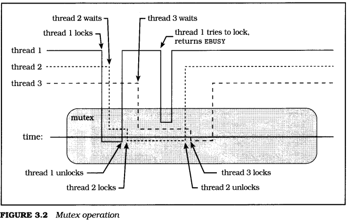
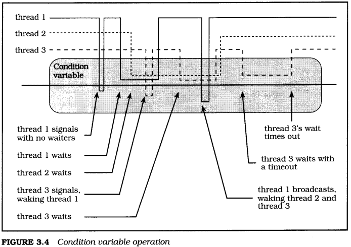
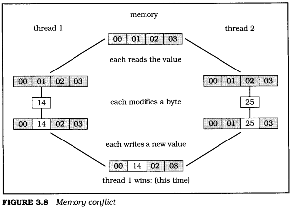
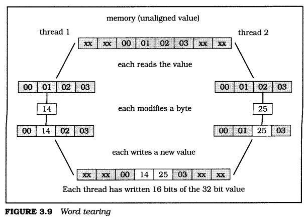

# 3 Synchronization

Lewis Carroll, Through the Looking-Glass:
> "That's right!" said the Tiger-lily. "The daisies are worst of all.  
> When one speaks, they all begin together, and it's  
> enough to make one wither to hear the way they go on!"

To write a program of any complexity using threads, you'll need to share data between threads, or cause various actions to be performed in some coherent order across multiple threads. To do this, you need to synchronize the activity of your threads.

Section 3.1 describes a few of the basic terms we'll be using to talk about thread synchronization: critical section and invariant.

Section 3.2 describes the basic Pthreads synchronization mechanism, the mutex.

Section 3.3 describes the condition variable, a mechanism that your code can use to communicate changes to the state of invariants protected by a mutex.

Section 3.4 completes this chapter on synchronization with some important information about threads and how they view the computer's memory.

## 3.1 Invariants, critical sections, and predicates

Lewis Carroll, Through the Looking-Glass:
> "/ know what you're thinking about,"  
> said Tweedledum; "but it isn't so, nohow."  
> "Contrariwise," continued Tweedledee,  
> "if it was so, it might be; and if it were so, it would be;  
> but as it isn't, it ain't. That's logic."

Invariants are assumptions made by a program, especially assumptions about the relationships between sets of variables. When you build a queue package, for example, you need certain data. Each queue has a queue header, which is a pointer to the first queued data element. Each data element includes a pointer to the next data element. But the data isn't all that's important-your queue package relies on relationships between that data. The queue header, for example, must either be null or contain a pointer to the first queued data element. Each data element must contain a pointer to the next data element, or NULL if it is the last. Those relationships are the invariants of your queue package.

It is hard to write a program that doesn't have invariants, though many of them are subtle. When a program encounters a broken invariant, for example, if it dereferences a queue header containing a pointer to something that is not a valid data element, the program will probably produce incorrect results or fail immediately.

Critical sections (also sometimes called "serial regions") are areas of code that affect a shared state. Since most programmers are trained to think about program functions instead of program data, you may well find it easier to recognize critical sections than data invariants. However, a critical section can almost always be translated into a data invariant, and vice versa. When you remove an element from a queue, for example, you can see the code performing the removal as a critical section, or you can see the state of the queue as an invariant. Which you see first may depend on how you're thinking about that aspect of your design.

Most invariants can be "broken," and are routinely broken, during isolated areas of code. The trick is to be sure that broken invariants are always repaired before "unsuspecting" code can encounter them. That is a large part of what "synchronization" is all about in an asynchronous program. Synchronization protects your program from broken invariants. If your code locks a mutex whenever it must (temporarily) break an invariant, then other threads that rely on the invariant, and which also lock the mutex, will be delayed until the mutex is unlocked- when the invariant has been restored.

Synchronization is voluntary, and the participants must cooperate for the system to work. The programmers must agree not to fight for (or against) possession of the bailing bucket. The bucket itself does not somehow magically ensure that one and only one programmer bails at any time. Rather, the bucket is a reliable shared token that, if used properly, can allow the programmers to manage their resources effectively.

"Predicates" are logical expressions that describe the state of invariants needed by your code. In English, predicates can be expressed as statements like "the queue is empty" or "the resource is available." A predicate may be a boolean variable with a true or false value, or it may be the result of testing whether a pointer is null. A predicate may also be a more complicated expression, such as determining whether a counter is greater than some threshold. A predicate may even be a value returned from some function. For example, you might call select or poll to determine whether a file is ready for input. 

## 3.2 Mutexes

Lewis Carroll, Alice's Adventures in Wonderland:
> "How are you getting on?" said the Cat,  
> as soon as there was mouth enough for it to speak with.  
> Alice waited till the eyes appeared, and then nodded.  
> "It's no use speaking to it," she thought,  
> "till its ears have come, or at least one of them."

Most threaded programs need to share some data between threads. There may be trouble if two threads try to access shared data at the same time, because one thread may be in the midst of modifying some data invariant while another acts on the data as if it were consistent. This section is all about protecting the program from that sort of trouble.

The most common and general way to synchronize between threads is to ensure that all memory accesses to the same (or related) data are "mutually exclusive." That means that only one thread is allowed to write at a time-others must wait for their turn. Pthreads provides mutual exclusion using a special form of Edsger Dijkstra's semaphore [Dijkstra, 1968a], called a mutex. The word mutex is a clever combination of "mut" from the word "mutual" and "ex" from the word "exclusion."

Experience has shown that it is easier to use mutexes correctly than it is to use other synchronization models such as a more general semaphore. It is also easy to build any synchronization models using mutexes in combination with condition variables (we'll meet them at the next corner, in Section 3.3). Mutexes are simple, flexible, and can be implemented efficiently.

The programmers' bailing bucket is something like a mutex (Figure 3.1). Both are "tokens" that can be handed around, and used to preserve the integrity of the concurrent system. The bucket can be thought of as protecting the bailing critical section-each programmer accepts the responsibility of bailing while holding the bucket, and of avoiding interference with the current bailer while not holding the bucket. Or, the bucket can be thought of as protecting the invariant that water can be removed by only one programmer at any time.

Synchronization isn't important just when you modify data. You also need synchronization when a thread needs to read data that was written by another thread, if the order in which the data was written matters. As we'll see a little later, in Section 3.4, many hardware systems don't guarantee that one processor will see shared memory accesses in the same order as another processor without a "nudge" from software.

<div align="center">

</div>

Consider, for example, a thread that writes new data to an element in an array, and then updates a **max\_index** variable to indicate that the array element is valid. Now consider another thread, running simultaneously on another processor, that steps through the array performing some computation on each valid element. If the second thread "sees" the new value of **max\_index** before it sees the new value of the array element, the computation would be incorrect. This may seem irrational, but memory systems that work this way can be substantially faster than memory systems that guarantee predictable ordering of memory accesses. A mutex is one general solution to this sort of problem. If each thread locks a mutex around the section of code that's using shared data, only one thread will be able to enter the section at a time.

Figure 3.2 shows a timing diagram of three threads sharing a mutex. Sections of the lines that are above the rounded box labeled "mutex" show where the associated thread does not own the mutex. Sections of the lines that are below the center line of the box show where the associated thread owns the mutex, and sections of the lines hovering above the center line show where the thread is waiting to own the mutex.

Initially, the mutex is unlocked. Thread 1 locks the mutex and, because there is no contention, it succeeds immediately-thread l's line moves below the center of the box. Thread 2 then attempts to lock the mutex and, because the mutex is already locked, thread 2 blocks, its line remaining above the center line. Thread 1 unlocks the mutex, unblocking thread 2, which then succeeds in locking the mutex. Slightly later, thread 3 attempts to lock the mutex, and blocks. Thread 1 calls **pthread\_mutex\_trylock** to try to lock the mutex and, because the mutex is locked, returns immediately with EBUSY status. Thread 2 unlocks the mutex, which unblocks thread 3 so that it can lock the mutex. Finally, thread 3 unlocks the mutex to complete our example.

<div align="center">

</div>

### 3.2.1 Creating and destroying a mutex

```c
pthread_mutex_t mutex = PTHREAD_MUTEX_INITIALIZER;
int pthread_mutex_init (
    pthread_mutex_t *mutex, pthread_mutexattr_t *attr);
int pthread_mutex_destroy (pthread_mutex_t *mutex);
```

A mutex is represented in your program by a variable of type **pthread\_mutex\_t**. You should never make a copy of a mutex, because the result of using a copied mutex is undefined. You can, however, freely copy a pointer to a mutex so that various functions and threads can use it for synchronization.

Most of the time you'll probably declare mutexes using extern or static storage class, at "file scope," that is, outside of any function. They should have "normal" (extern) storage class if they are used by other files, or static storage class if used only within the file that declares the variable. When you declare a static mutex that has default attributes, you should use the **pthread\_mutex\_INITIALIZER** macro, as shown in the **mutex\_static.c** program shown next. (You can build and run this program, but don't expect anything interesting to happen, since main is empty.)

```c
/** mutex_static.c */
    #include <pthread.h>
    #include "errors.h"

    /*
    * Declare a structure, with a mutex, statically initialized. This
    * is the same as using pthread_mutex_init, with the default
    * attributes.
    */
    typedef struct my_struct_tag {
        pthread_mutex_t mutex; /* Protects access to value */
        int value; /* Access protected by mutex */
    } my_struct_t;

    my_struct_t data = {PTHREAD_MUTEX_INITIALIZER, 0};

    int main (int argc, char *argv[])
    {
        return 0;
    }
```

Often you cannot initialize a mutex statically, for example, when you use malloc to create a structure that contains a mutex. Then you will need to call **pthread\_mutex\_init** to initialize the mutex dynamically, as shown in **mutex\_dynamic.c**, the next program. You can also dynamically initialize a mutex that you declare statically-but you must ensure that each mutex is initialized before it is used, and that each is initialized only once. You may initialize it before creating any threads, for example, or by calling **pthread\_once** (Section 5.1). Also, if you need to initialize a mutex with nondefault attributes, you must use dynamic initialization (see Section 5.2.1).

```c
/** mutex_dynamic.c */
    #include <pthread.h>
    #include "errors.h"

    /*
     * Define a structure, with a mutex.
     */
    typedef struct my_struct_tag {
        pthread_mutex_t mutex; /* Protects access to value */
        int value; /* Access protected by mutex */
    } my_struct_t;

    int main (int argc, char *argv[])
    {
        my_struct_t *data;
        int status;

        data = malloc (sizeof (my_struct_t));
        if (data == NULL)
            errno_abort ("Allocate structure");
        status = pthread_mutex_init (&data->mutex, NULL);
        if (status != 0)
            err_abort (status, "Init mutex");
        status = pthread_mutex_destroy (&data->mutex);
        if (status != 0)
            err_abort (status, "Destroy mutex");
        (void)free (data);
        return status;
    }
```

It is a good idea to associate a mutex clearly with the data it protects, if possible, by keeping the definition of the mutex and data together. In **mutex\_static.c** and **mutex\_dynamic.c**, for example, the mutex and the data it protects are defined in the same structure, and line comments document the association. When you no longer need a mutex that you dynamically initialized by calling **pthread\_mutex\_init**, you should destroy the mutex by calling **pthread\_mutex\_destroy**. You do not need to destroy a mutex that was statically initialized using the **PTHREAD\_MUTEX\_INITIALIZER** macro.

> You can destroy a mutex as soon as you are sure no threads are blocked on the mutex.

It is safe to destroy a mutex when you know that no threads can be blocked on the mutex, and no additional threads will try to lock the mutex. The best way to know this is usually within a thread that has just unlocked the mutex, when program logic ensures that no threads will try to lock the mutex later. When a thread locks a mutex within some heap data structure to remove the structure from a list and free the storage, for example, it is safe (and a good idea) to unlock and destroy the mutex before freeing the storage that the mutex occupies.


### 3.2.2 Locking and unlocking a mutex
```c
int pthread_mutex_lock (pthread_mutex_t *mutex);
int pthread_mutex_trylock (pthread_mutex_t *mutex);
int pthread_mutex_unlock (pthread_mutex_t *mutex);
```

In the simplest case, using a mutex is easy. You lock the mutex by calling either **pthread\_mutex\_lock** or **pthread\_mutex\_trylock**, do something with the shared data, and then unlock the mutex by calling **pthread\_mutex\_unlock**. To make sure that a thread can read consistent values for a series of variables, you need to lock your mutex around any section of code that reads or writes those variables.

You cannot lock a mutex when the calling thread already has that mutex locked. The result of attempting to do so may be an error return, or it may be a self-deadlock, with the unfortunate thread waiting forever for itself to unlock the mutex. (If you have access to a system supporting the UNIX98 thread extensions, you can create mutexes of various types, including recursive mutexes, which allow a thread to relock a mutex it already owns. The mutex type attribute is discussed in Section 10.1.2.)

The following program, **alarm\_mutex.c**, is an improved version of **alarm\_thread.c** (from Chapter 1). It lines up multiple alarm requests in a single "alarm server" thread.

The **alarm\_t** structure now contains an absolute time, as a standard UNIX **time\_t**, which is the number of seconds from the UNIX Epoch (Jan 1 1970 00:00) to the expiration time. This is necessary so that **alarm\_t** structures can be sorted by "expiration time" instead of merely by the requested number of seconds. In addition, there is a link member to connect the list of alarms.

The **alarm\_mutex** mutex coordinates access to the list head for alarm requests, called **alarm\_list**. The mutex is statically initialized using default attributes, with the **pthread\_mutex\_initializer** macro. The list head is initialized to null, or empty.

```c
/** alarm_mutex.c part 1 definitions */
#include <pthread.h>
#include <time.h>
#include "errors.h"

/*
 * The "alarm" structure now contains the time_t (time since the
 * Epoch, in seconds) for each alarm, so that they can be
 * sorted. Storing the requested number of seconds would not be
 * enough, since the "alarm thread" cannot tell how long it has
 * been on the list.
 */
typedef struct alarm_tag {
    struct alarm_tag *link;
    int seconds;
    time_t time; /* seconds from EPOCH */
    char message[64];
} alarm_t;

pthread_mutex_t alarm_mutex = PTHREAD_MUTEX_INITIALIZER;
alarm_t *alarm_list = NULL;
```

The code for the **alarm\_thread** function follows. This function is run as a thread, and processes each alarm request in order from the list **alarm\_list**. The thread never terminates-when main returns, the thread simply "evaporates." The only consequence of this is that any remaining alarms will not be delivered-the thread maintains no state that can be seen outside the process.

If you would prefer that the program process all outstanding alarm requests before exiting, you can easily modify the program to accomplish this. The main thread must notify **alarm\_thread**, by some means, that it should terminate when it finds the **alarm\_list** empty. You could, for example, have main set a new global variable **alarm\_done** and then terminate using **pthread\_exit** rather than exit. When **alarm\_thread** finds **alarm\_list** empty and **alarm\_done** set, it would immediately call **pthread\_exit** rather than waiting for a new entry.

If there are no alarms on the list, **alarm\_thread** needs to block itself, with the mutex unlocked, at least for a short time, so that main will be able to add a new alarm. It does this by setting **sleep\_time** to one second.

If an alarm is found, it is removed from the list. The current time is retrieved by calling the time function, and it is compared to the requested time for the alarm. If the alarm has already expired, then **alarm\_thread** will set **sleep\_time** to 0. If the alarm has not expired, **alarm\_thread** computes the difference between the current time and the alarm expiration time, and sets **sleep\_time** to that number of seconds.

The mutex is always unlocked before sleeping or yielding. If the mutex remained locked, then main would be unable to insert a new alarm on the list. That would make the program behave synchronously-the user would have to wait until the alarm expired before doing anything else. (The user would be able to enter a single command, but would not receive another prompt until the next alarm expired.) Calling sleep blocks **alarm\_thread** for the required period of time-it cannot run until the timer expires.

Calling **sched\_yield** instead is slightly different. We'll describe **sched\_yield** in detail later (in Section 5.5.2)-for now, just remember that calling **sched\_yield** will yield the processor to a thread that is ready to run, but will return immediately if there are no ready threads. In this case, it means that the main thread will be allowed to process a user command if there's input waiting-but if the user hasn't entered a command, sched yield will return immediately.

If the alarm pointer is not null, that is, if an alarm was processed from **alarm\_list**, the function prints a message indicating that the alarm has expired. After printing the message, it frees the alarm structure. The thread is now ready to process another alarm.

```c
/** alarm_mutex.c part 2 alarm_thread */
/*
 * The alarm thread's start routine.
 */
void *alarm_thread (void *arg)
{
    alarm_t *alarm;
    int sleep_time;
    time_t now;
    int status;

    /*
     * Loop forever, processing commands. The alarm thread will
     * be disintegrated when the process exits.
     */
    while (1) {
        status = pthread_mutex_lock (&alarm_mutex);
        if (status != 0)
            err_abort (status, "Lock mutex");
        alarm = alarm_list;

        /*
         * If the alarm list is empty, wait for one second. This
         * allows the main thread to run, and read another
         * command. If the list is not empty, remove the first
         * item. Compute the number of seconds to wait - if the
         * result is less than 0 (the time has passed), then set
         * the sleep_time to 0.
         */
        if (alarm == NULL)
            sleep_time = 1;
        else {
            alarm_list = alarm->link;
            now = time (NULL);
            if (alarm->time <= now)
                sleep_time = 0;
            else
                sleep_time = alarm->time - now;
        #ifdef DEBUG
            printf ("[waiting: %d(%d)\"%s\"]\n", alarm->time,
                sleep_time, alarm->message);
        #endif
        }

        /*
         * Unlock the mutex before waiting, so that the main
         * thread can lock it to insert a new alarm request. If
         * the sleep_time is 0, then call sched_yield, giving
         * the main thread a chance to run if it has been
         * readied by user input, without delaying the message
         * if there's no input.
         */
        status = pthread_mutex_unlock (&alarm_mutex);
        if (status != 0)
            err_abort (status, "Unlock mutex");
        if (sleep_time > 0)
            sleep (sleep_time);
        else
            sched_yield ();

        /*
         * If a timer expired, print the message and free the
         * structure.
         */
        if (alarm != NULL) {
            printf ("(%d) %s\n", alarm->seconds, alarm->message);
            free (alarm);
        }
    }
}
```
And finally, the code for the main program for **alarm\_nutex.c**. The basic structure is the same as all of the other versions of the alarm program that we've developed-a loop, reading simple commands from *stdin* and processing each in turn. This time, instead of waiting synchronously as in **alarm.c**, or creating a new asynchronous entity to process each alarm command as in **alarm\_fork.c** and **alarm\_thread.c**, each request is queued to a server thread, **alarm\_thread**. As soon as main has queued the request, it is free to read the next command.

Create the server thread that will process all alarm requests. Although we don't use it, the thread's ID is returned in local variable thread. 

Read and process a command, much as in any of the other versions of our alarm program. As in **alarm\_thread.c**, the data is stored in a heap structure allocated by ma Hoc.

The program needs to add the alarm request to **alarm\_list**, which is shared by both **alarm\_thread** and main. So we start by locking the mutex that synchronizes access to the shared data, **alarm\_mutex**.

Because **alarm\_thread** processes queued requests, serially, it has no way of knowing how much time has elapsed between reading the command and processing it. Therefore, the alarm structure includes the absolute time of the alarm expiration, which we calculate by adding the alarm interval, in seconds, to the current number of seconds since the UNIX Epoch, as returned by the time function.

The alarms are sorted in order of expiration time on the **alarm\_list** queue. The insertion code searches the queue until it finds the first entry with a time greater than or equal to the new alarm's time. The new entry is inserted preceding the located entry. Because **alarm\_list** is a simple linked list, the traversal maintains a current entry pointer (this) and a pointer to the previous entry's link member, or to the **alarm\_list** head pointer (last).

If no alarm with a time greater than or equal to the new alarm's time is found, then the new alarm is inserted at the end of the list. That is, if the alarm pointer is null on exit from the search loop (the last entry on the list always has a link pointer of null), the previous entry (or queue head) is made to point to the new entry.

```c
/** alarm\_mutex.c part 3 main */
int main (int argc, char *argv[])
{
    int status;
    char line[128];
    alarm_t *alarm, **last, *next;
    pthread_t thread;

    status = pthread_create (
        &thread, NULL, alarm_thread, NULL);
    if (status != 0)
        err_abort (status, "Create alarm thread");
    while (1) {
        printf ("alarm> ");
        if (fgets (line, sizeof (line), stdin) == NULL) exit (0);
        if (strlen (line) <= 1) continue;
        alarm = (alarm_t*)malloc (sizeof (alarm_t));
        if (alarm == NULL)
            errno_abort ("Allocate alarm");

        /*
         * Parse input line into seconds (%d) and a message
         * (%64[^\n]), consisting of up to 64 characters
         * separated from the seconds by whitespace.
         */
        if (sscanf (line, "%d %64[^\n]",
            &alarm->seconds, alarm->message) < 2) {
            fprintf (stderr, "Bad command\n");
            free (alarm);
        } else {
            status = pthread_mutex_lock (&alarm_mutex);
            if (status != 0)
                err_abort (status, "Lock mutex");
            alarm->time = time (NULL) + alarm->seconds;

            /*
             * Insert the new alarm into the list of alarms,
             * sorted by expiration time.
             */
            last = &alarm_list;
            next = *last;
            while (next != NULL) {
                if (next->time >= alarm->time) {
                    alarm->link = next;
                    *last = alarm;
                    break;
                }
                last = &next->link;
                next = next->link;
            }
            /*
             * If we reached the end of the list, insert the new
             * alarm there, ("next" is NULL, and "last" points
             * to the link field of the last item, or to the
             * list header).
             */
            if (next == NULL) {
                *last = alarm;
                alarm->link = NULL;
            }
#ifdef DEBUG
            printf ("[list: ");
            for (next = alarm_list; next != NULL; next = next->link)
                printf ("%d(%d)[\"%s\"] ", next->time,
                    next->time - time (NULL), next->message);
            printf ("]\n");
#endif
            status = pthread_mutex_unlock (&alarm_mutex);
            if (status != 0)
                err_abort (status, "Unlock mutex");
        }
    }
}
```

This simple program has a few severe failings. Although it has the advantage, compared to **alarm\_fork.c** or **alarm\_thread.c**, of using fewer resources, it is less responsive. Once **alarm\_thread** has accepted an alarm request from the queue, it sleeps until that alarm expires. When it fails to find an alarm request on the list, it sleeps for a second anyway, to allow main to accept another alarm command. During all this sleeping, it will fail to notice any alarm requests added to the head of the queue by main, until it returns from sleep.

This problem could be addressed in various ways. The simplest, of course, would be to go back to **alarm\_thread.c**, where a thread was created for each alarm request. That wasn't so bad, since threads are relatively cheap. They're still not as cheap as the **alarm\_t** data structure, however, and we'd like to make efficient programs-not just responsive programs. The best solution is to make use of condition variables for signaling changes in the state of shared data, so it shouldn't be a surprise that you'll be seeing one final version of the alarm program, **alarm\_cond.c**, in Section 3.3.4.

#### 3.2.2.1 Nonlocking mutex locks
When you lock a mutex by calling **pthread\_mutex\_lock**, the calling thread will block if the mutex is already locked. Normally, that's what you want. But occasionally you want your code to take some alternate path if the mutex is locked. Your program may be able to do useful work instead of waiting. Pthreads provides the **pthread\_mutex\_trylock** function, which will return an error status (ebusy) instead of blocking if the mutex is already locked.

When you use a nonblocking mutex lock, be careful to unlock the mutex only if **pthread\_mutex\_trylock** returned with success status. Only the thread that owns a mutex may unlock it. An erroneous call to **pthread\_mutex\_unlock** may return an error, or it may unlock the mutex while some other thread relies on having it locked-and that will probably cause your program to break in ways that may be very difficult to debug.

The following program, trylock.c, uses **pthread\_mutex\_trylock** to occasionally report the value of a counter-but only when its access does not conflict with the counting thread.

This definition controls how long **counter\_thread** holds the mutex while updating the counter. Making this number larger increases the chance that the **pthread\_mutex\_trylock** in **monitor\_thread** will occasionally return EBUSY. 

The **counter\_thread** wakes up approximately each second, locks the mutex, and spins for a while, incrementing counter. The counter is therefore increased by SPIN each second.

The **monitor\_thread** wakes up every three seconds, and tries to lock the mutex. If the attempt fails with ebusy, **monitor\_thread** counts the failure and waits another three seconds. If the **pthread\_mutex\_trylock** succeeds, then **monitor\_thread** prints the current value of counter (scaled by SPIN).

On Solaris 2.5, call **thr\_setconcurrency** to set the thread concurrency level to 2. This allows the **counter\_thread** and **monitor\_thread** to run concurrently on a uniprocessor. Otherwise, **monitor\_thread** would not run until **counter\_thread** terminated.

```c
/** trylock.c */
#include <pthread.h>
#include "errors.h"

#define SPIN 10000000

pthread_mutex_t mutex = PTHREAD_MUTEX_INITIALIZER;
long counter;
time_t end_time;

/*
 * Thread start routine that repeatedly locks a mutex and
 * increments a counter.
 */
void *counter_thread (void *arg)
{
    int status;
    int spin;

    /*
     * Until end_time, increment the counter each second. Instead of
     * just incrementing the counter, it sleeps for another second
     * with the mutex locked, to give monitor_thread a reasonable
     * chance of running.
     */
    while (time (NULL) < end_time)
    {
        status = pthread_mutex_lock (Smutex);
        if (status != 0)
            err_abort (status, "Lock mutex");
        for (spin = 0; spin < SPIN; spin++)
            counter++;
        status = pthread_mutex_unlock (Smutex);
        if (status != 0)
            err_abort (status, "Unlock mutex");
        sleep (1);
    }
    printf ("Counter is %#lx\n", counter);
    return NULL;
}

/*
 * Thread start routine to "monitor" the counter. Every 3
 * seconds, try to lock the mutex and read the counter. If the
 * trylock fails, skip this cycle.
 */
void *monitor thread (void *arg)
{
    int status;
    int misses = 0;


    /*
     * Loop until end_time, checking the counter every 3 seconds.
     */
    while (time (NULL) < end_time)
    {
        sleep (3);
        status = pthread_mutex_trylock (Smutex);
        if (status != EBUSY)
        {
            if (status != 0)
                err_abort (status, "Trylock mutex");
            printf ("Counter is %ld\n", counter/SPIN);
            status = pthread_mutex_unlock (smutex);
            if (status != 0)
                err_abort (status, "Unlock mutex");
        } else
            misses++;           /* Count "misses" on the lock */
    }
    printf ("Monitor thread missed update %d times.\n", misses);
    return NULL;
}

int main (int argc, char *argv[])
{
    int status;
    pthread_t counter_thread_id;
    pthread_t monitor_thread_id;

#ifdef sun
    /*
     * On Solaris 2.5, threads are not timesliced. To ensure
     * that our threads can run concurrently, we need to
     * increase the concurrency level to 2.
     */
    DPRINTF (("Setting concurrency level to 2\n"));
    thr_setconcurrency (2);
#endif

    end_time = time (NULL) + 60;       /* Run for 1 minute */
    status = pthread_create (
        &counter_thread_id, NULL, counter_thread, NULL);
    if (status != 0)
        err_abort (status, "Create counter thread");
    status = pthread_create (
        &monitor_thread_id, NULL, monitor_thread, NULL);
    if (status != 0)
        err_abort (status, "Create monitor thread");
    status = pthread_join (counter_thread_id, NULL);
    if (status != 0)
        err_abort (status, "Join counter thread");
    status = pthread_join (monitor_thread_id, NULL);
    if (status != 0)
        err_abort (status, "Join monitor thread");
    return 0;
}
```
### 3.2.3 Using mutexes for atomicity

Invariants, as we saw in Section 3.1, are statements about your program that must always be true. But we also saw that invariants probably aren't always true, and many can't be. To be always true, data composing an invariant must be modified atomically. Yet it is rarely possible to make multiple changes to a program state atomically. It may not even be possible to guarantee that a single change is made atomically, without substantial knowledge of the hardware and architecture and control over the executed instructions.

> "Atomic" means indivisible. But most of the time, we just mean that threads don't see things that would confuse them.

Although some hardware will allow you to set an array element and increment the array index in a single instruction that cannot be interrupted, most won't. Most compilers don't let you control the code to that level of detail even if the hardware can do it, and who wants to write in assembler unless it is really important? And, more importantly, most interesting invariants are more complicated than that.

By "atomic", we really mean only that other threads can't accidentally find invariants broken (in intermediate and inconsistent states), even when the threads are running simultaneously on separate processors. There are two basic ways to do that when the hardware doesn't support making the operation indivisible and noninterruptable. One is to detect that you're looking at a broken invariant and try again, or reconstruct the original state. That's hard to do reliably unless you know a lot about the processor architecture and are willing to design nonportable code.

When there is no way to enlist true atomicity in your cause, you need to create your own synchronization. Atomicity is nice, but synchronization will do just as well in most cases. So when you need to update an array element and the index variable atomically, just perform the operation while a mutex is locked.

Whether or not the store and increment operations are performed indivisibly and noninterruptably by the hardware, you know that no cooperating thread can peek until you're done. The transaction is, for all practical purposes, "atomic." The key, of course, is the word "cooperating." Any thread that is sensitive to the invariant must use the same mutex before modifying or examining the state of the invariant.


### 3.2.4 Sizing a mutex to fit the job

How big is a mutex? No, I don't mean the amount of memory consumed by a **pthread\_mutex\_t** structure. I'm talking about a colloquial and completely inaccurate meaning that happens to make sense to most people. This colorful usage became common during discussions about modifying existing nonthreaded code to be thread-safe. One relatively simple way to make a library thread-safe is to create a single mutex, lock it on each entry to the library, and unlock it on each exit from the library. The library becomes a single serial region, preventing any conflict between threads. The mutex protecting this big serial region came to be referred to as a "big" mutex, clearly larger in some metaphysical sense than a mutex that protects only a few lines of code.

By irrelevant but inevitable extension, a mutex that protects two variables must be "bigger" than a mutex protecting only a single variable. So we can ask, "How big should a mutex be?" And we can answer only, "As big as necessary, but no bigger."

When you need to protect two shared variables, you have two basic strategies: You can assign a small mutex to each variable, or assign a single larger mutex to both variables. Which is better will depend on a lot of factors. Furthermore, the factors will probably change during development, depending on how many threads need the data and how they use it.

These are the main design factors:

1. Mutexes aren't free. It takes time to lock them, and time to unlock them. Therefore, code that locks fewer mutexes will usually run faster than code that locks more mutexes. So use as few as practical, each protecting as much as makes sense.
2. Mutexes, by their nature, serialize execution. If a lot of threads frequently need to lock a single mutex, the threads will spend most of their time waiting. That's bad for performance. If the pieces of data (or code) protected by the mutex are unrelated, you can often improve performance by splitting the big mutex into several smaller mutexes. Fewer threads will need the smaller mutexes at any time, so they'll spend less time waiting. So use as many as makes sense, each protecting as little as is practical.
3. Items 1 and 2 conflict. But that's nothing new or unique, and you can deal with it once you understand what's going on.

In a complicated program it will usually take some experimentation to get the right balance. Your code will be simpler in most cases if you start with large mutexes and then work toward smaller mutexes as experience and performance data show where the heavy contention happens. Simple is good. Don't spend too much time optimizing until you know there's a problem.

On the other hand, in cases where you can tell from the beginning that the algorithms will make heavy contention inevitable, don't oversimplify. Your job will be a lot easier if you start with the necessary mutexes and data structure design rather than adding them later. You will get it wrong sometimes, because, especially when you are working on your first major threaded project, your intuition will not always be correct. Wisdom, as they say, comes from experience, and experience comes from lack of wisdom.

### 3.2.5 Using more than one mutex

Sometimes one mutex isn't enough. This happens when your code "crosses over" some boundary within the software architecture. For example, when multiple threads will access a queue data structure at the same time, you may need a mutex to protect the queue header and another to protect data within a queue element. When you build a tree structure for threaded programming, you may need a mutex for each node in the tree.

Complications can arise when using more than one mutex at the same time. The worst is deadlock-when each of two threads holds one mutex and needs the other to continue. More subtle problems such as priority inversion can occur when you combine mutexes with priority scheduling. For more information on deadlock, priority inversion, and other synchronization problems, refer to Section 8.1.

#### 3.2.5.1 Lock hierarchy

If you can apply two separate mutexes to completely independent data, do it. You'll almost always win in the end by reducing the time when a thread has to wait for another thread to finish with data that this thread doesn't even need. And if the data is independent you're unlikely to run into many cases where a given function will need to lock both mutexes.

The complications arise when data isn't completely independent. If you have some program invariant-even one that's rarely changed or referenced-that affects data protected by two mutexes, sooner or later you'll need to write code that must lock both mutexes at the same time to ensure the integrity of that invariant. If one thread locks **mutex\_a** and then locks **mutex\_b**, while another thread locks **mutex\_b** and then **mutex\_a**, you've coded a classic deadlock, as shown in Table 3.1.

| First thread                      | Second thread                     |
| --------------------------------- | --------------------------------- |
| pthread\_mutex\_lock (&mutex\_a); | pthread\_mutex\_lock (&mutex\_b); |
| pthread\_mutex\_lock (&mutex\_b); | pthread\_mutex\_lock (&mutex\_a); |
<center>**TABLE 3.1** *Mutex deadlock*</center>

Both of the threads shown in Table 3.1 may complete the first step about the same time. Even on a uniprocessor, a thread might complete the first step and then be timesliced (preempted by the system), allowing the second thread to complete its first step. Once this has happened, neither of them can ever complete the second step because each thread needs a mutex that is already locked by the other thread.

Consider these two common solutions to this type of deadlock:
- Fixed locking hierarchy: All code that needs both **mutex\_a** and **mutex\_b** must always lock **mutex\_a** first and then **mutex\_b**.
- Try and back off: After locking the first mutex of some set (which can be allowed to block), use **pthread\_mutex\_trylock** to lock additional mutexes in the set. If an attempt fails, release all mutexes in the set and start again.

There are any number of ways to define a fixed locking hierarchy. Sometimes there's an obvious hierarchical order to the mutexes anyway, for example, if one mutex controls a queue header and one controls an element on the queue, you'll probably have to have the queue header locked by the time you need to lock the queue element anyway.

When there's no obvious logical hierarchy, you can create an arbitrary hierarchy; for example, you could create a generic "lock a set of mutexes" function that sorts a list of mutexes in order of their identifier address and locks them in that order. Or you could assign them names and lock them in alphabetical order, or integer sequence numbers and lock them in numerical order.

To some extent, the order doesn't really matter as long as it is always the same. On the other hand, you will rarely need to lock "a set of mutexes" at one time. Function A will need to lock mutex 1, and then call function B, which needs to also lock mutex 2. If the code was designed with a functional locking hierarchy, you will usually find that mutex 1 and mutex 2 are being locked in the proper order, that is, mutex 1 is locked first and then mutex 2. If the code was designed with an arbitrary locking order, especially an order not directly controlled by the code, such as sorting pointers to mutexes initialized in heap structures, you may find that mutex 2 should have been locked before mutex 1.

If the code invariants permit you to unlock mutex 1 safely at this point, you would do better to avoid owning both mutexes at the same time. That is, unlock mutex 1, and then lock mutex 2. If there is a broken invariant that requires mutex 1 to be owned, then mutex 1 cannot be released until the invariant is restored. If this situation is possible, you should consider using a backoff (or "try and back off) algorithm.

"Backoff means that you lock the first mutex normally, but any additional mutexes in the set that are required by the thread are locked conditionally by calling **pthread\_mutex\_trylock**. If **pthread\_mutex\_trylock** returns EBUSY, indicating that the mutex is already locked, you must unlock all of the mutexes in the set and start over.

The backoff solution is less efficient than a fixed hierarchy. You may waste a lot of time trying and backing off. On the other hand, you don't need to define and follow strict locking hierarchy conventions, which makes backoff more flexible. You can use the two techniques in combination to minimize the cost of backing off. Follow some fixed hierarchy for well-defined areas of code, but apply a backoff algorithm where a function needs to be more flexible.

The program below, backoff.c, demonstrates how to avoid mutex deadlocks by applying a backoff algorithm. The program creates two threads, one running function **lock\_forward** and the other running function **lock\_backward**. The two threads loop iterations times, each iteration attempting to lock all of three mutexes in sequence. The **lock\_forward** thread locks mutex 0, then mutex 1, then mutex 2, while **lock\_backward** locks the three mutexes in the opposite order. Without special precautions, this design will always deadlock quickly (except on a uniprocessor system with a sufficiently long timeslice that either thread can complete before the other has a chance to run).

You can see the deadlock by running the program as backoff 0. The first argument is used to set the backoff variable. If backoff is 0, the two threads will use **pthread\_mutex\_lock** to lock each mutex. Because the two threads are starting from opposite ends, they will crash in the middle, and the program will hang. When backoff is nonzero (which it is unless you specify an argument), the threads use **pthread\_mutex\_trylock**, which enables the backoff algorithm. When the mutex lock fails with ebusy, the thread will release all mutexes it currently owns, and start over.

It is possible that, on some systems, you may not see any mutex collisions, because one thread is always able to lock all mutexes before the other thread has a chance to lock any. You can resolve that problem by setting the **yield\_flag** variable, which you do by running the program with a second argument, for example, backoff 1 1. When **yield\_flag** is 0, which it is unless you specify a second argument, each thread's mutex locking loop may run uninterrupted, preventing a deadlock (at least, on a uniprocessor). When **yield\_flag** has a value greater than 0, however, the threads will call **sched\_yield** after locking each mutex, ensuring that the other thread has a chance to run. And if you set **yield\_flag** to a value less than 0, the threads will sleep for one second after locking each mutex, to be really sure the other thread has a chance to run.

After locking all of the three mutexes, each thread reports success, and tells how many times it had to back off before succeeding. On a multiprocessor, or when you've set **yield\_flag** to a nonzero value, you'll usually see a lot more nonzero backoff counts. The thread unlocks all three mutexes, in the reverse order of locking, which helps to avoid unnecessary backoffs in other threads. Calling **sched\_yield** at the end of each iteration "mixes things up" a little so one thread doesn't always start each iteration first. The **sched\_yield** function is described in Section 5.5.2.

```c

/** backoff.c */
#include <pthread.h>
#include "errors.h"

#define ITERATIONS 10

/*
 * Initialize a static array of 3 mutexes.
 */
pthread_mutex_t mutex[3] = {
    PTHREAD_MUTEX_INITIALIZER,
    PTHREAD_MUTEX_INITIALIZER,
    PTHREAD_MUTEX_INITIALIZER
};

int backoff = 1;        /* Whether to backoff or deadlock */
int yield_flag =0;     /* 0: no yield, >0: yield, <0: sleep */

/*
 * This is a thread start routine that locks all mutexes in
 * order, to ensure a conflict with lock_reverse, which does the
 * opposite.
 */
void *lock_forward (void *arg)
{
    int i, iterate, backoffs;
    int status;

    for (iterate = 0; iterate < ITERATIONS; iterate++) {
        backoffs = 0;
        for (i = 0; i < 3; i++) {
            if (i == 0) {
                status = pthread_mutex_lock (Smutex[i]);
                if (status != 0)
                    err_abort (status, "First lock");
            } else {
                if (backoff)
                    status = pthread_mutex_trylock (&mutex[i]);
                else
                    status = pthread_mutex_lock (&mutex[i]);
                if (status == EBUSY) {
                    backoffs++;
                    DPRINTF ((
                        " [forward locker backing off at %d]\n",
                        i));
                    for (; i >= 0; i-) {
                        status = pthread_mutex_unlock (&mutex[i]);
                        if (status != 0)
                            err_abort (status, "Backoff");
                    }
                } else {
                    if (status != 0)
                        err_abort (status, "Lock mutex");
                    DPRINTF ((" forward locker got %d\n", i));
                }
            }
            /*
             * Yield processor, if needed to be sure locks get
             * interleaved on a uniprocessor.
             */
            if (yield_flag) {
                if (yield_flag > 0)
                    sched_yield ();
                else
                    sleep (1);
            }
        }
        /*
         * Report that we got 'em, and unlock to try again.
         */
        printf (
            "lock forward got all locks, %d backoffs\n", backoffs);
        pthread_mutex_unlock (&mutex[2]);
        pthread_mutex_unlock (&mutex[1]);
        pthread_mutex_unlock (&mutex[0]);
        sched_yield ();
    }
    return NULL;
}

/*
 * This is a thread start routine that locks all mutexes in
 * reverse order, to ensure a conflict with lock_forward, which
 * does the opposite.
 */
void *lock_backward (void *arg)
{
    int i, iterate, backoffs;
    int status;

    for (iterate = 0; iterate < ITERATIONS; iterate++) {
        backoffs = 0;
        for (i = 2; i >= 0; i--) {
            if (i == 2) {
                status = pthread_mutex_lock (&mutex[i]);
                if (status != 0)
                    err_abort (status, "First lock");
            } else {
                if (backoff)
                    status = pthread_mutex_trylock (&mutex[i]);
                else
                    status = pthread_mutex_lock (&mutex[i]);
                if (status == EBUSY) {
                    backoffs++;
                    DPRINTF ((
                        " [backward locker backing off at %d]\n",
                        i));
                    for (; i < 3; i++) {
                        status = pthread_mutex_unlock (&mutex[i]);
                        if (status != 0)
                            err_abort (status, "Backoff");
                    }
                } else {
                    if (status != 0)
                        err_abort (status, "Lock mutex");
                    DPRINTF ((" backward locker got %d\n", i));
                }
            }
            /*
             * Yield processor, if needed to be sure locks get
             * interleaved on a uniprocessor.
             */
            if (yield_flag) {
                if (yield_flag > 0)
                    sched_yield ();
                else
                    sleep (1);
            }
        }
        /*
         * Report that we got 'em, and unlock to try again.
         */
        printf (
            "lock backward got all locks, %d backoffsXn", backoffs);
        pthread_mutex_unlock (&mutex[0]);
        pthread_mutex_unlock (&mutex[1]);
        pthread_mutex_unlock (&mutex[2]);
        sched_yield ();
    }
    return NULL;
}

int main (int argc, char *argv[]) 
{
    pthread_t forward, backward;
    int status;

#ifdef sun
    /*
     * On Solaris 2.5, threads are not timesliced. To ensure
     * that our threads can run concurrently, we need to
     * increase the concurrency level.
     */
    DPRINTF (("Setting concurrency level to 2\n"));
    thr_setconcurrency (2);
#endif

    /*
     * If the first argument is absent, or nonzero, a backoff
     * algorithm will be used to avoid deadlock. If the first
     * argument is zero, the program will deadlock on a lock
     * "collision."
     */
    if (argc > 1)
        backoff = atoi (argv[1]);

    /*
     * If the second argument is absent, or zero, the two threads
     * run "at speed." On some systems, especially uniprocessors,
     * one thread may complete before the other has a chance to run,
     * and you won't see a deadlock or backoffs. In that case, try
     * running with the argument set to a positive number to cause
     * the threads to call sched_yield() at each lock; or, to make
     * it even more obvious, set to a negative number to cause the
     * threads to call sleep(1) instead.
     */
    if (argc > 2)
        yield_flag = atoi (argv[2]);
    status = pthread_create (
        &forward, NULL, lock_forward, NULL);
    if (status != 0)
        err_abort (status, "Create forward");
    status = pthread_create (
        &backward, NULL, lock_backward, NULL);
    if (status != 0)
        err_abort (status, "Create backward");
    pthread_exit (NULL);
}
```
Whatever type of hierarchy you choose, document it, carefully, completely, and often. Document it in each function that uses any of the mutexes. Document it where the mutexes are denned. Document it where they are declared in a project header file. Document it in the project design notes. Write it on your whiteboard. And then tie a string around your finger to be sure that you do not forget.

You are free to unlock the mutexes in whatever order makes the most sense. Unlocking mutexes cannot result in deadlock. In the next section, I will talk about a sort of "overlapping hierarchy" of mutexes, called a "lock chain," where the normal mode of operation is to lock one mutex, lock the next, unlock the first, and so on. If you use a "try and back off algorithm, however, you should always try to release the mutexes in reverse order. That is, if you lock mutex 1, mutex 2, and then mutex 3, you should unlock mutex 3, then mutex 2, and finally mutex 1. If you unlock mutex 1 and mutex 2 while mutex 3 is still locked, another thread may have to lock both mutex 1 and mutex 2 before finding it cannot lock the entire hierarchy, at which point it will have to unlock mutex 2 and mutex 1, and then retry. Unlocking in reverse order reduces the chance that another thread will need to back off.

#### 3.2.5.2 Lock chaining

"Chaining" is a special case of locking hierarchy, where the scope of two locks overlap. With one mutex locked, the code enters a region where another mutex is required. After successfully locking that second mutex, the first is no longer needed, and can be released. This technique can be very valuable in traversing data structures such as trees or linked lists. Instead of locking the entire data structure with a single mutex, and thereby preventing any parallel access, each node or link has a unique mutex. The traversal code would first lock the queue head, or tree root, find the desired node, lock it, and then release the root or queue head mutex.

Because chaining is a special form of hierarchy, the two techniques are compatible, if you apply them carefully. You might use hierarchical locking when balancing or pruning a tree, for example, and chaining when searching for a specific node.

Apply lock chaining with caution, however. It is exceptionally easy to write code that spends most of its time locking and unlocking mutexes that never exhibit any contention, and that is wasted processor time. Use lock chaining only when multiple threads will almost always be active within different parts of the hierarchy.

## 3.3 Condition variables

Lewis Carroll, Alice's Adventures In Wonderland:
> "There's no sort of use in knocking," said the Footman, "and that for two
> reasons. First, because I'm on the same side of the door as you are:
> secondly, because they're making such a noise inside, no one could
> possibly hear you."

<div align="center">

</div>

A condition variable is used for communicating information about the state of shared data. You would use a condition variable to signal that a queue was no longer empty, or that it had become empty, or that anything else needs to be done or can be done within the shared data manipulated by threads in your program.

Our seafaring programmers use a mechanism much like condition variables to communicate (Figure 3.3). When the rower nudges a sleeping programmer to signal that the sleeping programmer should wake up and start rowing, the original rower "signals a condition." When the exhausted ex-rower sinks into a deep slumber, secure that another programmer will wake him at the appropriate time, he is "waiting on a condition." When the horrified bailer discovers that water is seeping into the boat faster than he can remove it, and he yells for help, he is "broadcasting a condition."

When a thread has mutually exclusive access to some shared state, it may find that there is no more it can do until some other thread changes the state. The state may be correct, and consistent-that is, no invariants are broken-but the current state just doesn't happen to be of interest to the thread. If a thread servicing a queue finds the queue empty, for example, the thread must wait until an entry is added to the queue.

The shared data, for example, the queue, is protected by a mutex. A thread must lock the mutex to determine the current state of the queue, for example, to determine that it is empty. The thread must unlock the mutex before waiting (or no other thread would be able to insert an entry onto the queue), and then it must wait for the state to change. The thread might, for example, by some means block itself so that a thread inserting a new queue entry can find its identifier and awaken it. There is a problem here, though-the thread is running between unlocking and blocking.

If the thread is still running while another thread locks the mutex and inserts an entry onto the queue, that other thread cannot determine that a thread is waiting for the new entry. The waiting thread has already looked at the queue and found it empty, and has unlocked the mutex, so it will now block itself without knowing that the queue is no longer empty. Worse, it may not yet have recorded the fact that it intends to wait, so it may wait forever because the other thread cannot find its identifier. The unlock and wait operations must be atomic, so that no other thread can lock the mutex before the waiter has become blocked, and is in a state where another thread can awaken it.

> A condition variable wait always returns with the mutex locked.

That's why condition variables exist. A condition variable is a "signaling mechanism" associated with a mutex and by extension is also associated with the shared data protected by the mutex. Waiting on a condition variable atomically releases the associated mutex and waits until another thread signals (to wake one waiter) or broadcasts (to wake all waiters) the condition variable. The mutex must always be locked when you wait on a condition variable and, when a thread wakes up from a condition variable wait, it always resumes with the mutex locked.

The shared data associated with a condition variable, for example, the queue "full" and "empty" conditions, are the predicates we talked about in Section 3.1. A condition variable is the mechanism your program uses to wait for a predicate to become true, and to communicate to other threads that it might be true. In other words, a condition variable allows threads using the queue to exchange information about the changes to the queue state.

> Condition variables are for signaling, not for mutual exclusion.

Condition variables do not provide mutual exclusion. You need a mutex to synchronize access to the shared data, including the predicate for which you wait. That is why you must specify a mutex when you wait on a condition variable. By making the unlock atomic with the wait, the Pthreads system ensures that no thread can change the predicate after you have unlocked the mutex but before your thread is waiting on the condition variable.

Why isn't the mutex created as part of the condition variable? First, mutexes are used separately from any condition variable as often as they're used with condition variables. Second, it is common for one mutex to have more than one associated condition variable. For example, a queue may be "full" or "empty." Although you may have two condition variables to allow threads to wait for either condition, you must have one and only one mutex to synchronize all access to the queue header.

A condition variable should be associated with a single predicate. If you try to share one condition variable between several predicates, or use several condition variables for a single predicate, you're risking deadlock or race problems. There's nothing wrong with doing either, as long as you're careful-but it is easy to confuse your program (computers aren't very smart) and it is usually not worth the risk. I will expound on the details later, but the rules are as follows: First, when you share a condition variable between multiple predicates, you must always broadcast, never signal; and second, signal is more efficient than *broadcast*.

Both the condition variable and the predicate are shared data in your program; they are used by multiple threads, possibly at the same time. Because you're thinking of the condition variable and predicate as being locked together, it is easy to remember that they're always controlled using the same mutex. It is possible (and legal, and often even reasonable) to signal or broadcast a condition variable without having the mutex locked, but it is safer to have it locked.

Figure 3.4 is a timing diagram showing how three threads, thread 1, thread 2, and thread 3, interact with a condition variable. The rounded box represents the condition variable, and the three lines represent the actions of the three threads.

<div align="center">

</div>

When a line goes within the box, it is "doing something" with the condition variable. When a thread's line stops before reaching below the middle line through the box, it is waiting on the condition variable; and when a thread's line reaches below the middle line, it is signaling or broadcasting to awaken waiters.

Thread 1 signals the condition variable, which has no effect since there are no waiters. Thread 1 then waits on the condition variable. Thread 2 also blocks on the condition variable and, shortly thereafter, thread 3 signals the condition variable. Thread 3's signal unblocks thread 1. Thread 3 then waits on the condition variable. Thread 1 broadcasts the condition variable, unblocking both thread 2 and thread 3. Thread 3 waits on the condition variable shortly thereafter, with a timed wait. Some time later, thread 3's wait times out, and the thread awakens.

### 3.3.1 Creating and destroying a condition variable
```c
pthread_cond_t cond = PTHREAD_COND_INITIALIZER;
int pthread_cond_init (pthread_cond_t *cond,
    pthread_condattr_t *condattr);
int pthread_cond_destroy (pthread_cond_t *cond);
```

A condition variable is represented in your program by a variable of type **pthread\_cond\_t**. You should never make a copy of a condition variable, because the result of using a copied condition variable is undefined. It would be like telephoning a disconnected number and expecting an answer. One thread could, for example, wait on one copy of the condition variable, while another thread signaled or broadcast the other copy of the condition variable-the waiting thread would not be awakened. You can, however, freely pass pointers to a condition variable so that various functions and threads can use it for synchronization.

Most of the time you'll probably declare condition variables using the extern or static storage class at file scope, that is, outside of any function. They should have normal (extern) storage class if they are used by other files, or static storage class if used only within the file that declares the variable. When you declare a static condition variable that has default attributes, you should use the **pthread\_cond\_initializer** initialization macro, as shown in the following example, **cond\_static.c**.

```c
/** cond_static.c */
#include <pthread.h>
#include "errors.h"

/*
 * Declare a structure, with a mutex and condition variable,
 * statically initialized. This is the same as using
 * pthread_mutex_init and pthread_cond_init, with the default
 * attributes.
 */
typedef struct my_struct_tag {
    pthread_mutex_t     mutex;        /* Protects access to value */
    pthread_cond_t      cond;         /* Signals change to value */
    int                 value;        /* Access protected by mutex */
} my_struct_t;

my_struct_t data = {
    PTHREAD_MUTEX_INITIALIZER, PTHREAD_COND_INITIALIZER, 0};

int main (int argc, char *argv[])
{
    return 0;
}
```

> Condition variables and their predicates are "linked"-for best results, treat them that way!

When you declare a condition variable, remember that a condition variable and the associated predicate are "locked together." You may save yourself (or your successor) some confusion by always declaring the condition variable and predicate together, if possible. I recommend that you try to encapsulate a set of invariants and predicates with its mutex and one or more condition variables as members in a structure, and carefully document the association.

Sometimes you cannot initialize a condition variable statically; for example, when you use malloc to create a structure that contains a condition variable. Then you will need to call **pthread\_cond\_init** to initialize the condition variable dynamically, as shown in the following example, **cond\_dynamic.c**. You can also dynamically initialize condition variables that you declare statically-but you must ensure that each condition variable is initialized before it is used, and that each is initialized only once. You may initialize it before creating any threads, for example, or by using **pthread\_once** (Section 5.1). If you need to initialize a condition variable with nondefault attributes, you must use dynamic initialization (see Section 5.2.2).

```c
/** cond_dynamic.c */
#include <pthread.h>
#include "errors.h"

/*
 * Define a structure, with a mutex and condition variable.
 */
typedef struct my_struct_tag {
    pthread_mutex_t     mutex;  /* Protects access to value */
    pthread_cond_t      cond;   /* Signals change to value */
    int                 value;  /* Access protected by mutex */
} my_struct_t;

int main (int argc, char *argv[])
{
    my_struct_t *data;
    int status;

    data = malloc (sizeof (my_struct_t));
    if (data == NULL)
        errno_abort ("Allocate structure");
    status = pthread_mutex_init (&data->mutex, NULL);
    if (status != 0)
        err_abort (status, "Init mutex");
    status = pthread_cond_init (&data->cond, NULL);
    if (status != 0)
        err_abort (status, "Init condition");
    status = pthread_cond_destroy (&data->cond);
    if (status != 0)
        err_abort (status, "Destroy condition");
    status = pthread_mutex_destroy (&data->mutex);
    if (status != 0)
        err_abort (status, "Destroy mutex");
    (void)free (data);
    return status;
}
```

When you dynamically initialize a condition variable, you should destroy the condition variable when you no longer need it, by calling **pthread\_cond\_destroy**. You do not need to destroy a condition variable that was statically initialized using the **pthread\_cond\_initializer** macro.

It is safe to destroy a condition variable when you know that no threads can be blocked on the condition variable, and no additional threads will try to wait on, signal, or broadcast the condition variable. The best way to determine this is usually within a thread that has just successfully broadcast to unblock all waiters, when program logic ensures that no threads will try to use the condition variable later.

When a thread removes a structure containing a condition variable from a list, for example, and then broadcasts to awaken any waiters, it is safe (and also a very good idea) to destroy the condition variable before freeing the storage that the condition variable occupies. The awakened threads should check their wait predicate when they resume, so you must make sure that you don't free resources required for the predicate before they've done so-this may require additional synchronization.


### 3.3.2 Waiting on a condition variable
```c
int pthread_cond_wait (pthread_cond_t *cond,
    pthread_mutex_t *mutex);
int pthread_cond_timedwait (pthread_cond_t *cond,
    pthread_mutex_t *mutex,
    struct timespec *expiration);
```
Each condition variable must be associated with a specific mutex, and with a predicate condition. When a thread waits on a condition variable it must always have the associated mutex locked. Remember that the condition variable wait operation will unlock the mutex for you before blocking the thread, and it will relock the mutex before returning to your code.

All threads that wait on any one condition variable concurrently (at the same time) must specify the same associated mutex. Pthreads does not allow thread 1, for example, to wait on condition variable A specifying mutex A while thread 2 waits on condition variable A specifying mutex B. It is, however, perfectly reasonable for thread 1 to wait on condition variable A specifying mutex A while thread 2 waits on condition variable B specifying mutex A. That is, each condition variable must be associated, at any given time, with only one mutex-but a mutex may have any number of condition variables associated with it.

It is important that you test the predicate after locking the appropriate mutex and before waiting on the condition variable. If a thread signals or broadcasts a condition variable while no threads are waiting, nothing happens. If some other thread calls **pthread\_cond\_wait** right after that, it will keep waiting regardless of the fact that the condition variable was just signaled, which means that if a thread waits when it doesn't have to, it may never wake up. Because the mutex remains locked until the thread is blocked on the condition variable, the predicate cannot become set between the predicate test and the wait-the mutex is locked and no other thread can change the shared data, including the predicate.

> Always test your predicate; and then test it again!

It is equally important that you test the predicate again when the thread wakes up. You should always wait for a condition variable in a loop, to protect against program errors, multiprocessor races, and spurious wakeups. The following short program, cond.c, shows how to wait on a condition variable. Proper predicate loops are also shown in all of the examples in this book that use condition variables, for example, **alarm\_cond.c** in Section 3.3.4.

The **wait\_thread** sleeps for a short time to allow the main thread to reach its condition wait before waking it, sets the shared predicate (data, value), and then signals the condition variable. The amount of time for which **wait\_thread** will sleep is controlled by the hibernation variable, which defaults to one second.

If the program was run with an argument, interpret the argument as an integer value, which is stored in hibernation. This controls the amount of time for which wait-thread will sleep before signaling the condition variable.

The main thread calls **pthread\_cond\_timedwait** to wait for up to two seconds (from the current time). If hibernation has been set to a value of greater than two seconds, the condition wait will time out, returning ETIMEDOUT. If hibernation has been set to two, the main thread and **wait\_thread** race, and, in principle, the result could differ each time you run the program. If hibernation is set to a value less than two, the condition wait should not time out.

```c
/** cond.c */
#include <pthread.h>
#include <time.h>
#include "errors.h"

typedef struct my_struct_tag {
    pthread_mutex_init      mutex;  /* Protects access to value */
    pthread_cond_t          cond;   /* Signals change to value */
    int                     value;  /* Access protected by mutex */
} my_struct_t;

my_struct_t data = {
    PTHREAD_MUTEX_INITIALIZER, PTHREAD_COND_INITIALIZER, 0};

int hibernation = 1;                /* Default to 1 second */

/*
 * Thread start routine. It will set the main thread's predicate
 * and signal the condition variable.
 */
void *
wait_thread (void *arg)
{
    int status;

    sleep (hibernation);
    status = pthread_mutex_lock (&data.mutex);
    if (status != 0)
        err_abort (status, "Lock mutex");
    data.value = 1;                 /* Set predicate */
    status = pthread_cond_signal (&data.cond);
    if (status != 0)
        err_abort (status, "Signal condition");
    status = pthread_mutex_unlock (&data.mutex);
    if (status != 0)
        err_abort (status, "Unlock mutex");
    return NULL;
}

int main (int argc, char *argv[])
{
    int status;
    pthread_t wait_thread_id;
    struct timespec timeout;

    /*
     * If an argument is specified, interpret it as the number
     * of seconds for wait_thread to sleep before signaling the
     * condition variable. You can play with this to see the
     * condition wait below time out or wake normally.
     */
    if (argc > 1)
        hibernation = atoi (argv[1]);

    /*
     * Create wait_thread.
     */
    status = pthread_create (
        &wait_thread_id, NULL, wait_thread, NULL);
    if (status != 0)
        err_abort (status, "Create wait thread");

    /*
     * Wait on the condition variable for 2 seconds, or until
     * signaled by the wait_thread. Normally, wait_thread
     * should signal. If you raise "hibernation" above 2
     * seconds, it will time out.
     */
    timeout.tv_sec = time (NULL) + 2;
    timeout.tv_nsec = 0;
    status = pthread_mutex_lock (&data.mutex);
    if (status != 0)
        err_abort (status, "Lock mutex");

    while (data, value == 0) {
        status = pthread_cond_timedwait (
            &data.cond, &data.mutex, &timeout);
        if (status == ETIMEDOUT) {
            printf ("Condition wait timed out.\n");
            break;
        }
        else if (status != 0)
            err_abort (status, "Wait on condition");
    }

    if (data.value != 0)
        printf ("Condition was signaled.\n");
    status = pthread_mutex_unlock (&data.mutex);
    if (status != 0)
        err_abort (status, "Unlock mutex");
    return 0;
}
```
There are a lot of reasons why it is a good idea to write code that does not assume the predicate is always true on wakeup, but here are a few of the main reasons:
- **Intercepted wakeups:** Remember that threads are asynchronous. Waking up from a condition variable wait involves locking the associated mutex. But what if some other thread acquires the mutex first? It may, for example, be checking the predicate before waiting itself. It doesn't have to wait, since the predicate is now true. If the predicate is "work available," it will accept the work. When it unlocks the mutex there may be no more work. It would be expensive, and usually counterproductive, to ensure that the latest awakened thread got the work.
- **Loose predicates:** For a lot of reasons it is often easy and convenient to use approximations of actual state. For example, "there may be work" instead of "there is work." It is often much easier to signal or broadcast based on "loose predicates" than on the real "tight predicates." If you always test the tight predicates before and after waiting on a condition variable, you're free to signal based on the loose approximations when that makes sense. And your code will be much more robust when a condition variable is signaled or broadcast accidentally. Use of loose predicates or accidental wakeups may turn out to be a performance issue; but in many cases it won't make a difference.
- **Spurious wakeups:** This means that when you wait on a condition variable, the wait may (occasionally) return when no thread specifically broadcast or signaled that condition variable. Spurious wakeups may sound strange, but on some multiprocessor systems, making condition wakeup completely predictable might substantially slow all condition variable operations. The race conditions that cause spurious wakeups should be considered rare.

It usually takes only a few instructions to retest your predicate, and it is a good programming discipline. Continuing without retesting the predicate could lead to serious application errors that might be difficult to track down later. So don't make assumptions: Always wait for a condition variable in a while loop testing the predicate.

You can also use the **pthread\_cond\_timedwait** function, which causes the wait to end with an etimedout status after a certain time is reached. The time is an absolute clock time, using the POSIX. lb struct timespec format. The timeout is absolute rather than an interval (or "delta time") so that once you've computed the timeout it remains valid regardless of spurious or intercepted wakeups. Although it might seem easier to use an interval time, you'd have to recompute it every time the thread wakes up, before waiting again-which would require determining how long it had already waited.

When a timed condition wait returns with the etimedout error, you should test your predicate before treating the return as an error. If the condition for which you were waiting is true, the fact that it may have taken too long usually isn't important. Remember that a thread always relocks the mutex before returning from a condition wait, even when the wait times out. Waiting for a locked mutex after timeout can cause the timed wait to appear to have taken a lot longer than the time you requested.

### 3.3.3 Waking condition variable waiters
```c
int pthread_cond_signal (pthread_cond_t *cond);
int pthread_cond_broadcast (pthread_cond_t *cond);
```
Once you've got a thread waiting on a condition variable for some predicate, you'll probably want to wake it up. Pthreads provides two ways to wake a condition variable waiter. One is called "signal" and the other is called "broadcast." A signal operation wakes up a single thread waiting on the condition variable, while broadcast wakes up all threads waiting on the condition variable.

The term "signal" is easily confused with the "POSIX signal" mechanisms that allow you to define "signal actions," manipulate "signal masks," and so forth. However, the term "signal," as we use it here, had independently become well established in threading literature, and even in commercial implementations, and the Pthreads working group decided not to change the term. Luckily, there are few situations where we might be tempted to use both terms together-it is a very good idea to avoid using signals in threaded programs when at all possible. If we are careful to say "signal a condition variable" or "POSIX signal" (or "UNIX signal") where there is any ambiguity, we are unlikely to cause anyone severe discomfort.

It is easy to think of "broadcast" as a generalization of "signal," but it is more accurate to think of signal as an optimization of broadcast. Remember that it is never wrong to use broadcast instead of signal since waiters have to account for intercepted and spurious wakes. The only difference, in fact, is efficiency: A broadcast will wake additional threads that will have to test their predicate and resume waiting. But, in general, you can't replace a broadcast with a signal. "When in doubt, broadcast."

Use signal when only one thread needs to wake up to process the changed state, and when any waiting thread can do so. If you use one condition variable for several program predicate conditions, you can't use the signal operation; you couldn't tell whether it would awaken a thread waiting for that predicate, or for another predicate. Don't try to get around that by resignaling the condition variable when you find the predicate isn't true. That might not pass on the signal as you expect; a spurious or intercepted wakeup could result in a series of pointless resignals.

If you add a single item to a queue, and only threads waiting for an item to appear are blocked on the condition variable, then you should probably use a signal. That'll wake up a single thread to check the queue and let the others sleep undisturbed, avoiding unnecessary context switches. On the other hand, if you add more than one item to the queue, you will probably need to broadcast. For examples of both broadcast and signal operations on condition variables, check out the "read/write lock" package in Section 7.1.2.

Although you must have the associated mutex locked to wait on a condition variable, you can signal (or broadcast) a condition variable with the associated mutex unlocked if that is more convenient. The advantage of doing so is that, on many systems, this may be more efficient. When a waiting thread awakens, it must first lock the mutex. If the thread awakens while the signaling thread holds the mutex, then the awakened thread must immediately block on the mutex-you've gone through two context switches to get back where you started.

> **Hint:**
> There is an optimization, which I've called "wait morphing," that moves a thread directly from the condition variable wait queue to the mutex wait queue in this case, without a context switch, when the mutex is locked. This optimization can produce a substantial performance benefit for many applications.

Weighing on the other side is the fact that, if the mutex is not locked, any thread (not only the one being awakened) can lock the mutex prior to the thread being awakened. This race is one source of intercepted wakeups. A lower-priority thread, for example, might lock the mutex while another thread was about to awaken a very high-priority thread, delaying scheduling of the high-priority thread. If the mutex remains locked while signaling, this cannot happen-the high-priority waiter will be placed before the lower-priority waiter on the mutex, and will be scheduled first.

### 3.3.4 One final alarm program

It is time for one final version of our simple alarm program. In **alarm\_mutex.c**, we reduced resource utilization by eliminating the use of a separate execution context (thread or process) for each alarm. Instead of separate execution contexts, we used a single thread that processed a list of alarms. There was one problem, however, with that approach-it was not responsive to new alarm commands. It had to finish waiting for one alarm before it could detect that another had been entered onto the list with an earlier expiration time, for example, if one entered the commands "10 message 1" followed by "5 message 2."

Now that we have added condition variables to our arsenal of threaded programming tools, we will solve that problem. The new version, creatively named **alarm\_cond.c**, uses a timed condition wait rather than sleep to wait for an alarm expiration time. When main inserts a new entry at the head of the list, it signals the condition variable to awaken **alarm\_thread** immediately. The **alarm\_thread** then requeues the alarm on which it was waiting, to sort it properly with respect to the new entry, and tries again.

Part 1 shows the declarations for **alarm\_cond.c**. There are two additions to this section, compared to **alarm\_mutex.c**: a condition variable called **alarm\_cond** and the **current\_alarm** variable, which allows main to determine the expiration time of the alarm on which **alarm\_thread** is currently waiting. The **current\_alarm** variable is an optimization-main does not need to awaken **alarm\_thread** unless it is either idle, or waiting for an alarm later than the one main has just inserted.

```c
/** alarm_cond.c part 1 declarations */
#include <pthread.h>
#include <time.h>
#include "errors.h"

/*
 * The "alarm" structure now contains the time_t (time since the
 * Epoch, in seconds) for each alarm, so that they can be
 * sorted. Storing the requested number of seconds would not be
 * enough, since the "alarm thread" cannot tell how long it has
 * been on the list.
 */
typedef struct alarm_tag {
    struct alarm_tag *link;
    int seconds;
    time_t time;            /* seconds from EPOCH */
    char message[64];
} alarm_t;

pthread_mutex_t alarmjnutex = PTHREAD_MUTEX_INITIALIZER;
pthread_cond_t alarm_cond = PTHREAD_COND_INITIALIZER;
alarm_t *alarm_list = NULL;
time_t current_alarm = 0;
```

Part 2 shows the new function **alarm\_insert**. This function is nearly the same as the list insertion code from **alarm\_mutex.c**, except that it signals the condition variable **alarm\_cond** when necessary. I made **alarm\_insert** a separate function because now it needs to be called from two places-once by main to insert a new alarm, and now also by **alarm\_thread** to reinsert an alarm that has been "preempted" by a new earlier alarm.

I have recommended that mutex locking protocols be documented, and here is an example: The **alarm\_insert** function points out explicitly that it must be called with the **alarm\_mutex** locked.

If **current\_alarm** (the time of the next alarm expiration) is 0, then the **alarm\_thread** is not aware of any outstanding alarm requests, and is waiting for new work. If **current\_alarm** has a time greater than the expiration time of the new alarm, then **alarm\_thread** is not planning to look for new work soon enough to handle the new alarm. In either case, signal the **alarm\_cond** condition variable so that **alarm\_thread** will wake up and process the new alarm.

```c
/** alarm_cond.c part 2 alarm_insert */
/*
 * Insert alarm entry on list, in order.
 */
void alarm_insert (alarm_t *alarm)
{
    int status;
    alarm t **last, *next;
    /*
     * LOCKING PROTOCOL:
     *
     * This routine requires that the caller have locked the
     * alarm_mutex!
     */
    last = &alarm_list;
    next = *last;
    while (next != NULL) {
        if (next->time >= alarm->time) {
            alarm->link = next;
            *last = alarm;
            break;
        }
        last = &next->link;
        next = next->link;
        /*
         * If we reached the end of the list, insert the new alarm
         * there. ("next" is NULL, and "last" points to the link
         * field of the last item, or to the list header.)
         */
        if (next == NULL) {
            *last = alarm;
            alarm->link = NULL;
        }
#ifdef DEBUG
        printf ("[list: ");
        for (next = alarm_list; next != NULL; next = next->link)
            printf ("%d(%d)[\"%s\"] ", next->time,
                next->time - time (NULL), next->message);
        printf ("]\n");
#endif
        /*
         * Wake the alarm thread if it is not busy (that is, if
         * current_alarm is 0, signifying that it's waiting for
         * work), or if the new alarm comes before the one on
         * which the alarm thread is waiting.
         */
        if (current_alarm == 0 || alarm->time < current_alarm) {
            current_alarm = alarm->time;
            status = pthread_cond_signal (&alarm_cond);
            if (status != 0)
                err_abort (status, "Signal cond");
        }
    }
```
Part 3 shows the **alarm\_thread** function, the start function for the "alarm server" thread. The general structure of **alarm\_thread** is very much like the **alarm\_thread** in **alarm_mutex.c**. The differences are due to the addition of the condition variable.

If the **alarm\_list** is empty, **alarm\_mutex.c** could do nothing but sleep anyway, so that main would be able to process a new command. The result was that it could not see a new alarm request for at least a full second. Now, **alarm\_thread** instead waits on the **alarm\_cond** condition variable, with no timeout. It will "sleep" until you enter a new alarm command, and then main will be able to awaken it immediately. Setting **current\_alarm** to 0 tells main that **alarm\_thread** is idle. Remember that **pthread\_cond\_wait** unlocks the mutex before waiting, and relocks the mutex before returning to the caller.

The new variable expired is initialized to 0; it will be set to 1 later if the timed condition wait expires. This makes it a little easier to decide whether to print the current alarm's message at the bottom of the loop.

If the alarm we've just removed from the list hasn't already expired, then we need to wait for it. Because we're using a timed condition wait, which requires a POSIX. lb struct timespec, rather than the simple integer time required by sleep, we convert the expiration time. This is easy, because a struct timespec has two members-**tv\_sec** is the number of seconds since the Epoch, which is exactly what we already have from the time function, and **tv\_nsec** is an additional count of nanoseconds. We will just set **tv\_nsec** to 0, since we have no need of the greater resolution.

Record the expiration time in the **current\_alarm** variable so that main can determine whether to signal **alarm\_cond** when a new alarm is added.

Wait until either the current alarm has expired, or main requests that **alarm\_thread** look for a new, earlier alarm. Notice that the predicate test is split here, for convenience. The expression in the while statement is only half the predicate, detecting that main has changed **current\_alarm** by inserting an earlier timer. When the timed wait returns etimedout, indicating that the current alarm has expired, we exit the while loop with a break statement at line 49.

If the while loop exited when the current alarm had not expired, main must have asked **alarm\_thread** to process an earlier alarm. Make sure the current alarm isn't lost by reinserting it onto the list.

If we remove from **alarm\_list** an alarm that has already expired, just set the expired variable to 1 to ensure that the message is printed.

```c
/** alarm_cond.c part 3 alarm_routine */

/*
 * The alarm thread's start routine.
 */
void *alarm_thread (void *arg)
{
    alarm_t *alarm;
    struct timespec cond_time;
    time_t now;
    int status, expired;

    /*
     * Loop forever, processing commands. The alarm thread will
     * be disintegrated when the process exits. Lock the mutex
     * at the start -- it will be unlocked during condition
     * waits, so the main thread can insert alarms.
     */
    status = pthread_mutex_lock (&alarm_mutex);
    if (status != 0)
        err_abort (status, "Lock mutex");
    while (1) {
        /*
         * If the alarm list is empty, wait until an alarm is
         * added. Setting current_alarm to 0 informs the insert
         * routine that the thread is not busy.
         */
        current_alarm = 0;
        while (alarm_list == NULL) {
            status = pthread_cond_wait (&alarm_cond, &alarm_mutex);
            if (status != 0)
                err_abort (status, "Wait on cond");
        }
        alarm = alarm_list;
        alarm_list = alarm->link;
        now = time (NULL);
        expired = 0;
        if (alarm->time > now) {
#ifdef DEBUG
            printf ("[waiting: %d(%d)\"%s\"]\n", alarm->time,
                    alarm->time - time (NULL), alarm->message);
#endif
            cond_time.tv_sec = alarm->time;
            cond_time.tv_nsec = 0;
            current_alarm = alarm->time;
            while (current_alarm == alarm->time) {
                status = pthread_cond_timedwait (
                        &alarm_cond, &alarm_mutex, &cond_time);
                if (status == ETIMEDOUT) {
                    expired = 1;
                    break;
                }
                if (status != 0)
                    err_abort (status, "Cond timedwait");
            }
            if (!expired)
                alarm_insert (alarm);
        } else
            expired = 1;
        if (expired) {
            printf ("(%d) %s\n", alarm->seconds, alarm->message);
            free (alarm);
        }
    }
}

```
Part 4 shows the final section of **alarm\_cond.c**, the main program. It is nearly identical to the main function from **alarm\_mutex.c**.

Because the condition variable signal operation is built into the new **alarm\_insert** function, we call **alarm\_insert** rather than inserting a new alarm directly.

```c
/** alarm cond.c part 4 main */

int main (int argc, char *argv[])
{
    int status;
    char line[128];
    alarm_t *alarm;
    pthread_t thread;
    status = pthread_create (
            &thread, NULL, alarm_thread, NULL);
    if (status != 0)
        err_abort (status, "Create alarm thread");
    while (1) {
        printf ("Alarm> ");
        if (fgets (line, sizeof (line), stdin) == NULL) exit (0);
        if (strlen (line) <= 1) continue;
        alarm = (alarm_t*)malloc (sizeof (alarm_t));
        if (alarm == NULL)
            errno_abort ("Allocate alarm");

        /*
         * Parse input line into seconds (%d) and a message
         * (%64[^\n]), consisting of up to 64 characters
         * separated from the seconds by whitespace.
         */
        if (sscanf (line, "%d %64[^\n]",
            &alarm->seconds, alarm->message) < 2) {
            fprintf (stderr, "Bad commandSn");
            free (alarm);
        } else {
            status = pthread_mutex_lock (&alarm_mutex);
            if (status != 0)
                err_abort (status, "Lock mutex");
            alarm->time = time (NULL) + alarm->seconds;
            /*
             * Insert the new alarm into the list of alarms,
             * sorted by expiration time.
             */
            alarm_insert (alarm);
            status = pthread_mutex_unlock (&alarm_mutex);
            if (status != 0)
                err_abort (status, "Unlock mutex");
        }
    }
}
```
## 3.4 Memory visibility between threads
Lewis Carroll, Alice's Adventures in Wonderland:
> The moment Alice appeared, she was appealed to by all three to settle the
> question, and they repeated their arguments to her, though, as they all
> spoke at once, she found it very hard to make out exactly what they
> said.

In this chapter we have seen how you should use mutexes and condition variables to synchronize (or "coordinate") thread activities. Now we'll journey off on a tangent, for just a few pages, and see what is really meant by "synchronization" in the world of threads. It is more than making sure two threads don't write to the same location at the same time, although that's part of it. As the title of this section implies, it is about how threads see the computer's memory.

Pthreads provides a few basic rules about memory visibility. You can count on all implementations of the standard to follow these rules:
1. Whatever memory values a thread can see when it calls **pthread\_create** can also be seen by the new thread when it starts. Any data written to memory after the call to **pthread\_create** may not necessarily be seen by the new thread, even if the write occurs before the thread starts.
2. Whatever memory values a thread can see when it unlocks a mutex, either directly or by waiting on a condition variable, can also be seen by any thread that later locks the same mutex. Again, data written after the mutex is unlocked may not necessarily be seen by the thread that locks the mutex, even if the write occurs before the lock.
3. Whatever memory values a thread can see when it terminates, either by cancellation, returning from its start function, or by calling **pthread\_exit**, can also be seen by the thread that joins with the terminated thread by calling pthread**\_join**. And, of course, data written after the thread terminates may not necessarily be seen by the thread that joins, even if the write occurs before the join.
4. Whatever memory values a thread can see when it signals or broadcasts a condition variable can also be seen by any thread that is awakened by that signal or broadcast. And, one more time, data written after the signal or broadcast may not necessarily be seen by the thread that wakes up, even if the write occurs before it awakens.

Figures 3.5 and 3.6 demonstrate some of the consequences. So what should you, as a programmer, do?

First, where possible make sure that only one thread will ever access a piece of data. A thread's registers can't be modified by another thread. A thread's stack and heap memory a thread allocates is private unless the thread communicates pointers to that memory to other threads. Any data you put in register or auto variables can therefore be read at a later time with no more complication than in a completely synchronous program. Each thread is synchronous with itself. The less data you share between threads, the less work you have to do.

Second, any time two threads need to access the same data, you have to apply one of the Pthreads memory visibility rules, which, in most cases, means using a mutex. This is not only to protect against multiple writes-even when a thread only reads data it must use a mutex to ensure that it sees the most recent value of the data written while the mutex was locked.

This example does everything correctly. The left-hand code (running in thread A) sets the value of several variables while it has a mutex locked. The right-hand code (running in thread B) reads those values, also while holding the mutex.

| Thread A                          | Thread B                          |
| --------------------------------- | --------------------------------- |
| pthread\_mutex\_lock (&mutex1);   |                                   |
| variableA = 1;                    | pthread\_mutex\_lock (&mutex1);   |
| variableB = 2;                    |                                   |
| pthread\_mutex\_unlock (&mutex1); |                                   |
|                                   | localA = variableA;               |
|                                   | localB = variableB;               |
|                                   | pthread\_mutex\_unlock (&mutex1); |
<center>**FIGURE 3.5** *Correct memory visibility*</center>

**Rule 2:** visibility from **pthread\_mutex\_unlock** to **pthread\_mutex\_lock**. When thread B returns from **pthread\_mutex\_lock**, it will see the same values for variableA and variableB that thread A had seen at the time it called **pthread\_mutex\_unlock**. That is, 1 and 2, respectively.

This example shows an error. The left-hand code (running in thread A) sets the value of variables after unlocking the mutex. The right-hand code (running in thread B) reads those values while holding the mutex.

| Thread A                          | Thread B                          |
| --------------------------------- | --------------------------------- |
| pthread\_mutex\_lock (&mutex1);   |                                   |
| variableA = 1;                    | pthread\_mutex\_lock (&mutex1);   |
| pthread\_mutex\_unlock (&mutex1); |                                   |
| variableB = 2;                    |                                   |
|                                   | localA = variableA;               |
|                                   | localB = variableB;               |
|                                   | pthread\_mutex\_unlock (&mutex1); |
<center>**FIGURE 3.6** *Incorrect memory visibility*</center>

**Rule 2:** visibility from **pthread\_mutex\_unlock** to **pthread\_mutex\_lock**. When thread B returns from **pthread\_mutex\_lock**, it will see the same values for variableA and variableB that thread A had seen at the time it called **pthread\_mutex\_unlock**. That is, it will see the value 1 for variableA, but may not see the value 2 for variableB since that was written after the mutex was unlocked.


As the rules state, there are specific cases where you do not need to use a mutex to ensure visibility. If one thread sets a global variable, and then creates a new thread that reads the same variable, you know that the new thread will not see an old value. But if you create a thread and then set some variable that the new thread reads, the thread may not see the new value, even if the creating thread succeeds in writing the new value before the new thread reads it.

> Warning! We are now descending below the Pthreads API into details of hardware memory architecture that you may prefer not to know. You may want to skip this explanation for now and come back later.

If you are willing to just trust me on all that (or if you've had enough for now), you may now skip past the end of this section. This book is not about multiprocessor memory architecture, so I will just skim the surface-but even so, the details are a little deep, and if you don't care right now, you do not need to worry about them yet. You will probably want to come back later and read the rest, though, when you have some time.

In a single-threaded, fully synchronous program, it is "safe" to read or write any memory at any time. That is, if the program writes a value to some memory address, and later reads from that memory address, it will always receive the last value that it wrote to that address.

When you add asynchronous behavior (which includes multiprocessors) to the program, the assumptions about memory visibility become more complicated. For example, an asynchronous signal could occur at any point in the program's execution. If the program writes a value to memory, a signal handler runs and writes a different value to the same memory address, when the main program resumes and reads the value, it may not receive the value it wrote.

That's not usually a major problem, because you go to a lot of trouble to declare and use signal handlers. They run "specialized" code in a distinctly different environment from the main program. Experienced programmers know that they should write global data only with extreme care, and it is possible to keep track of what they do. If that becomes awkward, you block the signal around areas of code that use the global data.

When you add multiple threads to the program the asynchronous code is no longer special. Each thread runs normal program code, and all in the same unrestricted environment. You can hardly ever be sure you always know what each thread may be doing. It is likely that they will all read and write some of the same data. Your threads may run at unpredictable times or even simultaneously on different processors. And that's when things get interesting.

By the way, although we are talking about programming with multiple threads, none of the problems outlined in this section is specific to threads. Rather, they are artifacts of memory architecture design, and they apply to any situation where two "things" independently access the same memory. The two things may be threads running on separate processors, but they could instead be processes running on separate processors and using shared memory. Or one "thing" might be code running on a uniprocessor, while an independent I/O controller reads or writes the same memory.

> A memory address can hold only one value at a time; don't let threads "race" to get there first.

When two threads write different values to the same memory address, one after the other, the final state of memory is the same as if a single thread had written those two values in the same sequence. Either way only one value remains in memory. The problem is that it becomes difficult to know which write occurred last. Measuring some absolute external time base, it may be obvious that "processor B" wrote the value "2" several microseconds after "processor A" wrote the value "1." That doesn't mean the final state of memory will have a "2."

Why? Because we haven't said anything about how the machine's cache and memory bus work. The processors probably have cache memory, which is just fast, local memory used to keep quickly accessible copies of data that were recently read from main memory. In a write-back cache system, data is initially written only to cache, and copied ("flushed") to main memory at some later time. In a machine that doesn't guarantee read/write ordering, each cache block may be written whenever the processor finds it convenient. If two processors write different values to the same memory address, each processor's value will go into its own cache. Eventually both values will be written to main memory, but at essentially random times, not directly related to the order in which the values were written to the respective processor caches.

Even two writes from within a single thread (processor) need not appear in memory in the same order. The memory controller may find it faster, or just more convenient, to write the values in "reverse" order, as shown in Figure 3.7. They may have been cached in different cache blocks, for example, or interleaved to different memory banks. In general, there's no way to make a program aware of these effects. If there was, a program that relied on them might not run correctly on a different model of the same processor family, much less on a different type of computer.

The problems aren't restricted to two threads writing memory. Imagine that one thread writes a value to a memory address on one processor, and then another thread reads from that memory address on another processor. It may seem obvious that the thread will see the last value written to that address, and on some hardware that will be true. This is sometimes called "memory coherence" or "read/write ordering." But it is complicated to ensure that sort of synchronization between processors. It slows the memory system and the overhead provides no benefit to most code. Many modern computers (usually among the fastest) don't guarantee any ordering of memory accesses between different processors, unless the program uses special instructions commonly known as memory *barriers*.

| Time | Thread 1                       | Thread 2                |
| ---- | ------------------------------ | ----------------------- |
| t    | write "1" to address 1(cache)  |                         |
| t+1  | write "2" to address 2(cache)  | read "0" from address 1 |
| t+2  | cache system flushes address 2 |                         |
| t+3  |                                | read "2" from address 2 |
| t+4  | cache system flushes address 1 |                         |
<center>**FIGURE 3.7** *Memory ordering without synchronization*</center>

Memory accesses in these computers are, at least in principle, queued to the memory controller, and may be processed in whatever order becomes most efficient. A read from an address that is not in the processor's cache may be held waiting for the cache fill, while later reads complete. A write to a "dirty" cache line, which requires that old data be flushed, may be held while later writes complete. A memory barrier ensures that all memory accesses that were initiated by the processor prior to the memory barrier have completed before any memory accesses initiated after the memory barrier can complete.

>A "memory barrier" is a moving wall, not a "cache flush" command.

A common misconception about memory barriers is that they "flush" values to main memory, thus ensuring that the values are visible to other processors. That is not the case, however. What memory barriers do is ensure an order between sets of operations. If each memory access is an item in a queue, you can think of a memory barrier as a special queue token. Unlike other memory accesses, however, the memory controller cannot remove the barrier, or look past it, until it has completed all previous accesses.

A mutex lock, for example, begins by locking the mutex, and completes by issuing a memory barrier. The result is that any memory accesses issued while the mutex is locked cannot complete before other threads can see that the mutex was locked. Similarly, a mutex unlock begins by issuing a memory barrier and completes by unlocking the mutex, ensuring that memory accesses issued while the mutex is locked cannot complete after other threads can see that the mutex is unlocked.

This memory barrier model is the logic behind my description of the Pthreads memory rules. For each of the rules, we have a "source" event, such as a thread calling **pthread\_mutex\_unlock**, and a "destination" event, such as another thread returning from **pthread\_mutex\_lock**. The passage of "memory view" from the first to the second occurs because of the memory barriers carefully placed in each.

Even without read/write ordering and memory barriers, it may seem that writes to a single memory address must be atomic, meaning that another thread will always see either the intact original value or the intact new value. But that's not always true, either. Most computers have a natural memory granularity, which depends on the organization of memory and the bus architecture. Even if the processor naturally reads and writes 8-bit units, memory transfers may occur in 32- or 64-bit "memory units."

That may mean that 8-bit writes aren't atomic with respect to other memory operations that overlap the same 32- or 64-bit unit. Most computers write the full memory unit (say, 32 bits) that contains the data you're modifying. If two threads write different 8-bit values within the same 32-bit memory unit, the result may be that the last thread to write the memory unit specifies the value of both bytes, overwriting the value supplied by the first writer. Figure 3.8 shows this effect.

<div align="center">

</div>

If a variable crosses the boundary between memory units, which can happen if the machine supports unaligned memory access, the computer may have to send the data in two bus transactions. An unaligned 32-bit value, for example, may be sent by writing the two adjacent 32-bit memory units. If either memory unit involved in the transaction is simultaneously written from another processor, half of the value may be lost. This is called "word tearing," and is shown in Figure 3.9.

We have finally returned to the advice at the beginning of this section: If you want to write portable Pthreads code, you will always guarantee correct memory visibility by using the Pthreads memory visibility rules instead of relying on any assumptions regarding the hardware or compiler behavior. But now, at the bottom of the section, you have some understanding of why this is true. For a substantially more in-depth treatment of multiprocessor memory architecture, refer to UNIX Systems for Modern Architectures [Schimmel, 1994].

Figure 3.10 shows the same sequence as Figure 3.7, but it uses a mutex to ensure the desired read/write ordering. Figure 3.10 does not show the cache flush steps that are shown in Figure 3.7, because those steps are no longer relevant. Memory visibility is guaranteed by passing mutex ownership in steps t+3 and t+4, through the associated memory barriers. That is, when thread 2 has successfully locked the mutex previously unlocked by thread 1, thread 2 is guaranteed to see memory values "at least as recent" as the values visible to thread 1 at the time it unlocked the mutex.

<div align="center">

</div>

| Time | Thread 1                       | Thread 2                      |
| ---- | ------------------------------ | ----------------------------- |
| t    | lock mutex (memory barrier)    |                               |
| t+1  | write "1" to address 1 (cache) |                               |
| t+2  | write "2" to address 2 (cache) |                               |
| t+3  | (memory barrier) unlock mutex  |                               |
| t+4  |                                | lock mutex (memory barrier)   |
| t+5  |                                | read "1" from address 1       |
| t+6  |                                | read "2" from address 2       |
| t+7  |                                | (memory barrier) unlock mutex |
<center>**FIGURE 3.10** *Memory ordering with synchronization*</center>


