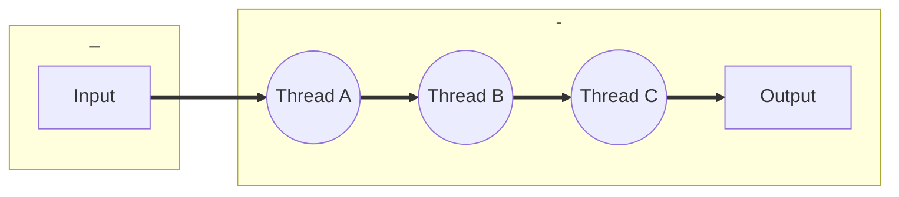
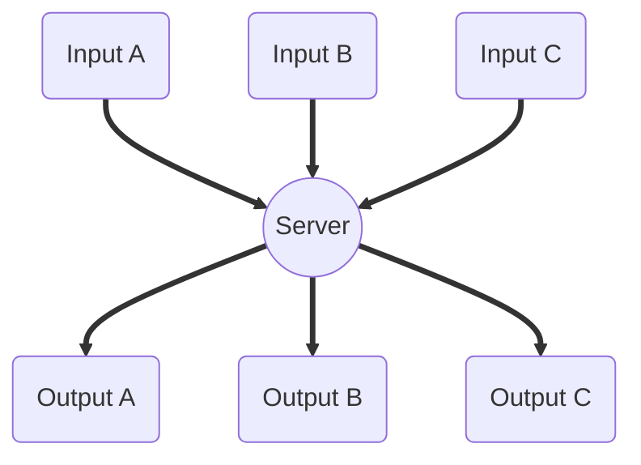

# 4 A few ways to use threads
Lewis Carroll, Alice's Adventures in Wonderland;
> "They were obliged to have him with them," the Mock Turtle said.  
> "No wise fish would go anywhere without a porpoise."  
> "Wouldn't it, really?" said Alice, in a tone of great surprise.  
> "Of course not," said the Mock Turtle. "Why, if a fish came to me,  
> and told me he was going on a journey, I should say 'With what porpoise?'"  

During the introduction to this book, I mentioned some of the ways you can structure a threaded solution to a problem. There are infinite variations, but the primary models of threaded programming are shown in Table 4.1.

|               |                                          |
| ------------- | ---------------------------------------- |
| Pipeline      | Each thread repeatedly performs the same operation on a sequence of data sets, passing each result to another thread for the next step. This is also known as an "assembly line." |
| Work crew     | Each thread performs an operation on its own data. Threads in a work crew may all perform the same operation, or each a separate operation, but they always proceed independently. |
| Client/server | A client "contracts" with an independent server for each job. Often the "contract" is anonymous-a request is made through some interface that queues the work item. |
|               |                                          |

<center>**TABLE 4.1** *Thread programming models*</center>

All of these models can be combined in arbitrary ways and modified beyond all recognition to fit individual situations. A step in a pipeline could involve requesting a service from a server thread, and the server might use a work crew, and one or more workers in the crew might use a pipeline. Or a parallel search "engine" might initiate several threads, each trying a different search algorithm.


## 4.1 Pipeline
Lewis Carroll, Alice's Adventures in Wonderland;
> "/ want a clean cup," interrupted the Hatter: "let's all move one place on."
> He moved on as he spoke, and the Dormouse followed him: the March Hare
> moved into the Dormouse's place, and Alice rather unwillingly took the
> place of the March Hare. The Hatter was the only one who got any
> advantage from the change; and Alice was a good deal worse off than
> before, as the March Hare had just upset the milk-jug into his plate.

In pipelining, a stream of "data items" is processed serially by an ordered set of threads (Figure 4.1). Each thread performs a specific operation on each item in sequence, passing the data on to the next thread in the pipeline.

For example, the data might be a scanned image, and thread A might process an image array, thread B might search the processed data for a specific set of features, and thread C might collect the serial stream of search results from thread B into a report. Or each thread might perform a single step in some sequence of modifications on the data.

The following program, called `pipe.c`, shows the pieces of a simple pipeline program. Each thread in the pipeline increments its input value by 1 and passes it to the next thread. The main program reads a series of "command lines" from `stdin`. A command line is either a number, which is fed into the beginning of the pipeline, or the character "=," which causes the program to read the next result from the end of the pipeline and print it to `stdout`.



<center>**FIGURE 4.1** *Pipelining*</center>


[10-18] Each stage of a pipeline is represented by a variable of type `stage_t`. `stage_t` contains a `mutex` to synchronize access to the stage. The `avail` condition variable is used to signal a stage that data is `ready` for it to process, and each stage signals its own ready condition variable when it is ready for new data. The `data` member is the data passed from the previous stage, `thread` is the thread operating this stage, and `next` is a pointer to the following stage.

[24-30] The `pipe_t` structure describes a pipeline. It provides pointers to the first and last stage of a pipeline. The first stage, `head`, represents the first thread in the pipeline. The last stage, `tail`, is a special `stage_t` that has no thread-it is a place to store the final result of the pipeline.

```c
/** pipe.c part 1 definitions */
#include <pthread.h>
#include "errors.h"

/*
 * Internal structure describing a "stage" in the
 * pipeline. One for each thread, plus a "result
 * stage" where the final thread can stash the value.
 */
typedef struct stage_tag {
    pthread_mutex_t     mutex;          /* Protect data */
    pthread_cond_t      avail;          /* Data available */
    pthread_cond_t      ready;          /* Ready for data */
    int                 data_ready;     /* Data present */
    long                data;           /* Data to process */
    pthread_t           thread;         /* Thread for stage */
    struct stage_tag    *next;          /* Next stage */
} stage_t;

/*
 * External structure representing the entire
 * pipeline.
 */
typedef struct pipe_tag {
    pthread_mutex_t     mutex;          /* Mutex to protect pipe */
    stage_t             *head;          /* First stage */
    stage_t             *tail;          /* Final stage */
    int                 stages;         /* Number of stages */
    int                 active;         /* Active data elements */
} pipe_t;
```
Part 2 shows `pipe_send`, a utility function used to start data along a pipeline, and also called by each stage to pass data to the next stage.

[18-24] It begins by waiting on the specified pipeline stage's `ready` condition variable until it can accept new data.

[29-31] Store the new data value, and then tell the stage that data is available.

```c
/** pipe.c part 2 pipe_send */
/*
 * Internal function to send a "message" to the
 * specified pipe stage. Threads use this to pass
 * along the modified data item.
 */
int pipe_send (stage_t *stage, long data)
{
    int status;

    status = pthread_mutex_lock (&stage->mutex);
    if (status != 0)
        return status;
    /*
     * If there's data in the pipe stage, wait for it
     * to be consumed.
     */
    while (stage->data_ready) {
        status = pthread_cond_wait (&stage->ready, &stage->mutex);
        if (status != 0) {
            pthread_mutex_unlock (&stage->mutex);
            return status;
        }
    }

    /*
     * Send the new data
     */
    stage->data = data;
    stage->data_ready = 1;
    status = pthread_cond_signal (&stage->avail);
    if (status != 0) {
        pthread_mutex_unlock (&stage->mutex);
        return status;
    }
    status = pthread_mutex_unlock (&stage->mutex);
    return status;
}
```
Part 3 shows `pipe_stage`, the start function for each thread in the pipeline. The thread's argument is a pointer to its `stage_t` structure.

[17-28] The thread loops forever, processing data. Because the mutex is locked outside the loop, the thread appears to have the pipeline stage's `mutex` locked all the time. However, it spends most of its time waiting for new data, on the `avail` condition variable. Remember that a thread automatically unlocks the mutex associated with a condition variable, while waiting on that condition variable. In reality, therefore, the thread spends most of its time with `mutex` unlocked.

[23-27] When given data, the thread increases its own data value by one, and passes the result to the next stage. The thread then records that the stage no longer has data by clearing the `data_ready` flag, and signals the `ready` condition variable to wake any thread that might be waiting for this pipeline stage.

```c
/** pipe.c part 3 pipe_stage */
/*
 * The thread start routine for pipe stage threads.
 * Each will wait for a data item passed from the
 * caller or the previous stage, modify the data
 * and pass it along to the next (or final) stage.
 */
void *pipe_stage (void *arg)
{
    stage_t *stage = (stage_t*)arg;
    stage_t *next_stage = stage->next;
    int status;

    status = pthread_mutex_lock (&stage->mutex);
    if (status != 0)
        err_abort (status, "Lock pipe stage");
    while (1) {
        while (stage->data_ready != 1) {
            status = pthread_cond_wait (&stage->avail, &stage->mutex);
            if (status != 0)
                err_abort (status, "Wait for previous stage");
        }
        pipe_send (next_stage, stage->data + 1);
        stage->data_ready = 0;
        status = pthread_cond_signal (&stage->ready);
        if (status != 0)
            err_abort (status, "Wake next stage");
    }
    /*
     * Notice that the routine never unlocks the stage->mutex.
     * The call to pthread_cond_wait implicitly unlocks the
     * mutex while the thread is waiting, allowing other threads
     * to make progress. Because the loop never terminates, this
     * function has no need to unlock the mutex explicitly.
     */
}
```
Part 4 shows `pipe_create`, the function that creates a pipeline. It can create a pipeline of any number of stages, linking them together in a list.

[19-35] For each stage, it allocates a new `stage_t` structure and initializes the members. Notice that one additional "stage" is allocated and initialized to hold the final result of the pipeline.

[37-38] The `link` member of the final stage is set to `NULL` to terminate the list, and the pipeline's `tail` is set to point at the final stage. The `tail` pointer allows `pipe_result` to easily find the final product of the pipeline, which is stored into the final stage.

[53-60] After all the stage data is initialized, `pipe_create` creates a thread for each stage. The extra "final stage" does not get a thread-the termination condition of the for loop is that the current stage's `next` link is not `NULL`, which means that it will not process the final stage.

```c
/* pipe.c part 4 pipe_create */
/*
 * External interface to create a pipeline. All the
 * data is initialized and the threads created. They'll
 * wait for data.
 */
int pipe_create (pipe_t *pipe, int stages)
{
    int pipe_index;
    stage_t **link = &pipe->head, *new_stage, *stage;
    int status;

    status = pthread_mutex_init (&pipe->mutex, NULL);
    if (status != 0)
        err_abort (status, "Init pipe mutex");
    pipe->stages = stages;
    pipe->active = 0;

    for (pipe_index = 0; pipe_index <= stages; pipe_index++) {
        new_stage = (stage_t*)malloc (sizeof (stage_t));
        if (new_stage == NULL)
            errno_abort ("Allocate stage");
        status = pthread_mutex_init (&new_stage->mutex, NULL);
        if (status != 0)
            err_abort (status, "Init stage mutex");
        status = pthread_cond_init (&new_stage->avail, NULL);
        if (status != 0)
            err_abort (status, "Init avail condition");
        status = pthread_cond_init (&new_stage->ready, NULL);
        if (status != 0)
            err_abort (status, "Init ready condition");
        new_stage->data_ready = 0;
        *link = new_stage;
        link = &new_stage->next;
    }

    *link = (stage_t*)NULL;     /* Terminate list */
    pipe->tail = new_stage;     /* Record the tail */

    /*
     * Create the threads for the pipe stages only after all
     * the data is initialized (including all links). Note
     * that the last stage doesn't get a thread, it's just
     * a receptacle for the final pipeline value.
     *
     * At this point, proper cleanup on an error would take up
     * more space than worthwhile in a "simple example", so
     * instead of cancelling and detaching all the threads
     * already created, plus the synchronization object and
     * memory cleanup done for earlier errors, it will simply
     * abort.
     */
    for (   stage = pipe->head;
            stage->next != NULL;
            stage = stage->next) {
        status = pthread_create (
            &stage->thread, NULL, pipe_stage, (void*)stage);
        if (status != 0)
            err_abort (status, "Create pipe stage");
    }
    return 0;
}
```
Part 5 shows `pipe_start` and `pipe_result`. The `pipe_start` function pushes an item of data into the beginning of the pipeline and then returns immediately without waiting for a result. The `pipe_result` function allows the caller to wait for the final result, whenever the result might be needed.

[10-23] The `pipe_start` function sends data to the first stage of the pipeline. The function increments a count of "active" items in the pipeline, which allows `pipe_result` to detect that there are no more active items to collect, and to return immediately instead of blocking. You would not always want a pipeline to behave this way-it makes sense for this example because a single thread alternately "feeds" and "reads" the pipeline, and the application would hang forever if the user inadvertently reads one more item than had been fed.

[29-48] The `pipe_result` function first checks whether there is an active item in the pipeline. If not, it returns with a status of 0, after unlocking the pipeline mutex.

[50-56] If there is another item in the pipeline, `pipe_result` locks the `tail` (final) stage, and waits for it to receive data. It copies the data and then resets the stage so it can receive the next item of data. Remember that the final stage does not have a thread, and cannot reset itself.

```c
/* pipe.c part 5 pipe_start,pipe_result */
/*
 * External interface to start a pipeline by passing
 * data to the first stage. The routine returns while
 * the pipeline processes in parallel. Call the
 * pipe_result return to collect the final stage values
 * (note that the pipe will stall when each stage fills,
 * until the result is collected).
 */
int pipe_start (pipe_t *pipe, long value)
{
    int status;

    status = pthread_mutex_lock (&pipe->mutex);
    if (status != 0)
        err_abort (status, "Lock pipe mutex");
    pipe->active++;
    status = pthread_mutex_unlock (&pipe->mutex);
    if (status != 0)
        err_abort (status, "Unlock pipe mutex");
    pipe_send (pipe->head, value);
    return 0;
}

/*
 * Collect the result of the pipeline. Wait for a
 * result if the pipeline hasn't produced one.
 */
int pipe_result (pipe_t *pipe, long *result)
{
    stage_t *tail = pipe->tail;
    long value;
    int empty = 0;
    int status;

    status = pthread_mutex_lock (&pipe->mutex);
    if (status != 0)
        err_abort (status, "Lock pipe mutex");
    if (pipe->active <= 0)
        empty = 1;
    else
        pipe->active--;

    status = pthread_mutex_unlock (&pipe->mutex);
    if (status != 0)
        err_abort (status, "Unlock pipe mutex");
    if (empty)
        return 0;

    pthread_mutex_lock (&tail->mutex);
    while (!tail->data_ready)
        pthread_cond_wait (&tail->avail, &tail->mutex);
    *result = tail->data;
    tail->data_ready = 0;
    pthread_cond_signal (&tail->ready);
    pthread_mutex_unlock (&tail->mutex);    
    return 1;
}
```
Part 6 shows the main program that drives the pipeline. It creates a pipeline, and then loops reading lines from stdin. If the line is a single "=" character, it pulls a result from the pipeline and prints it. Otherwise, it converts the line to an integer value, which it feeds into the pipeline.

```c
/*  pipe.c part 6 main  */
/*
 * The main program to "drive" the pipeline...
 */
int main (int argc, char *argv[])
{
    pipe_t my_pipe;
    long value, result;
    int status;
    char line[128];

    pipe_create (&my_pipe, 10);
    printf ("Enter integer values, or \"=\" for next result\n");

    while (1) {
        printf ("Data> ");
        if (fgets (line, sizeof (line), stdin) == NULL) exit (0);
        if (strlen (line) <= 1) continue;
        if (strlen (line) <= 2 && line[0] == '=') {
            if (pipe_result (&my_pipe, &result))
                printf ("Result is %ld\n", result);
            else
                printf ("Pipe is empty\n");
        } else {
            if (sscanf (line, "%ld", &value) < 1)
                fprintf (stderr, "Enter an integer value\n");
            else
                pipe_start (&my_pipe, value);
        }
    }
}
```

## 4.2 Work crew

Lewis Carroll, Alice's Adventures in Wonderland:
> The twelve jurors were all writing very busily on slates.
> "What are they doing?" Alice whispered to the Gryphon.
> "They ca'n't have anything to put down yet, before the trial's begun."
> "They're putting down their names," the Gryphon whispered in reply,
> "for fear they should forget them before the end of the trial."

In a work crew, data is processed independently by a set of threads {Figure 4.2). A "parallel decomposition" of a loop generally falls into this category. A set of threads may be created, for example, each directed to process some set of rows or columns of an array. A single set of data is split between the threads, and the result is a single (filtered) set of data. Because all the threads in the work crew, in this model, are performing the same operation on different data, it is often known as SIMD parallel processing, for "single instruction, multiple data." The original use of SIMD was in an entirely different form of parallelism, and doesn't literally apply to threads-but the concept is similar.


```mermaid
graph TB;
    I(Input)==>A((Thread A))
    I==>B((Thread B))
    I==>C((Thread C))
    A==>O(Output)
    B==>O
    C==>O
end
```

<center>**FIGURE 4.2** *Work crew*</center>

The threads in a work crew don't have to use a SIMD model, though. They may perform entirely different operations on different data. The members of our work crew, for example, each remove work requests from a shared queue, and do whatever is required by that request. Each queued request packet could describe a variety of operations-but the common queue and "mission statement" (to process that queue) make them a "crew" rather than independent worker threads. This model can be compared to the original definition of MIMD parallel processing, "multiple instruction, multiple data."

Section 7.2, by the way, shows the development of a more robust and general (and more complicated) "work queue manager" package. A "work crew" and a "work queue" are related in much the same way as "invariants" and "critical sections"-it depends on how you look at what's happening. A work crew is the set of threads that independently processes data, whereas a work queue is a mechanism by which your code may request that data be processed by anonymous and independent "agents." So in this section, we develop a "work crew," whereas in Section 7.2 we develop a more sophisticated "work queue." The focus differs, but the principle is the same.

The following program, called `crew.c`, shows a simple work crew. Run the program with two arguments, a string, and a file path. The program will queue the file path to the work crew. A crew member will determine whether the file path is a file or a directory-if a file, it will search the file for the string; if a directory, it will use `readdir_r` to find all directories and regular files within the directory, and queue each entry as new work. Each file containing the search string will be reported on `stdout`.

Part 1 shows the header files and definitions used by the program.

The symbol `CREW_SIZE` determines how many threads are created for each work crew.

Each item of work is described by a `work_t` structure. This structure has a pointer to the next work item (set to null to indicate the end of the list), a pointer to the file path described by the work item, and a pointer to the string for which the program is searching. As currently constructed, all work items point to the same search string.

Each member of a work crew has a `worker_t` structure. This structure contains the index of the crew member in the crew vector, the thread identifier of the crew member (thread), and a pointer to the `crew_t` structure (crew).

The `crew_t` structure describes the work crew state. It records the number of members in the work crew (`crew_size`) and an array of `worker_t` structures (crew). It also has a counter of how many work items remain to be processed (`work_count`) and a list of outstanding work items (first points to the earliest item, and last to the latest). Finally, it contains the various Pthreads synchronization objects: a mutex to control access, a condition variable (done) to wait for the work crew to finish a task, and a condition variable on which crew members wait to receive new work (go).

The allowed size of a file name and path name may vary depending on the file system to which the path leads. When a crew is started, the program calculates the allowable file name and path length for the specified file path by calling pathconf, and stores the values in `path_max` and `name_max`, respectively, for later use.

```c
/* crew.c */
#include <sys/types.h>
#include <pthread.h>
#include <sys/stat.h>
#include <dirent.h>
#include "errors.h"

#define CREW_SIZE       4

/*
 * Queued items of work for the crew. One is queued by
 * crew_start, and each worker may queue additional items.
 */
typedef struct work_tag {
    struct work_tag     *next;          /* Next work item */
    char                *path; /* Directory or file */
    char                *string;        /* Search string */
} work_t, *work_p;

/*
 * One of these is initialized for each worker thread in the
 * crew. It contains the "identity" of each worker.
 */
typedef struct worker_tag {
    int                 index;          /* Thread's index */
    pthread_t           thread;         /* Thread for stage */
    struct crew_tag     *crew;          /* Pointer to crew */
} worker_t, *worker_p;

/*
 * The external "handle" for a work crew. Contains the
 * crew synchronization state and staging area.
 */
typedef struct crew_tag {
    int                 crew_size;      /* Size of array */
    worker_t            crew[CREW_SIZE];/* Crew members */
    long                work_count;     /* Count of work items */
    work_t              *first, *last;  /* First & last work item */
    pthread_mutex_t     mutex;          /* Mutex for crew data */
    pthread_cond_t      done;           /* Wait for crew done */
    pthread_cond_t      go;             /* Wait for work */
} crew_t, *crew_p;

size_t  path_max;                       /* Filepath length */
size_t  name_max;                       /* Name length */
```
Part 2 shows `worker_routine`, the start function for crew threads. The outer loop repeats processing until the thread is told to terminate.

POSIX is a little ambiguous about the actual size of the struct dirent type. The actual requirement for `readdir_r` is that you pass the address of a buffer large enough to contain a struct dirent with a name member of at least `NAME_MAX` bytes. To ensure that we have enough space, allocate a buffer the size of the system's struct dirent plus the maximum size necessary for a file name on the file system we're using. This may be bigger than necessary, but it surely won't be too small.

This condition variable loop blocks each new crew member until work is made available.

This wait is a little different. While the work list is empty, wait for more work. The crew members never terminate-once they're all done with the current assignment, they're ready for a new assignment. (This example doesn't take advantage of that capability-the process will terminate once the single search command has completed.)

Remove the first work item from the queue. If the queue becomes empty, also clear the pointer to the last entry, `crew-\>last`.

Unlock the work crew mutex, so that the bulk of the crew's work can proceed concurrently.

Determine what sort of file we've got in the work item's path string. We use lstat, which will return information for a symbolic link, rather than stat, which would return information for the file to which the link pointed. By not following symbolic links, we reduce the amount of work in this example, and, especially, avoid following links into other file systems where our namejmax and `path_max` sizes may not be sufficient.

If the file is a link, report the name, but do nothing else with it. Note that each message includes the thread's work crew index (`mine-\>index`), so that you can easily see "concurrency at work" within the example.

If the file is a directory, open it with `opendir`. Find all entries in the directory by repeatedly calling `readdir_r`. Each directory entry is entered as a new work item.

If the file is a regular file, open it and read all text, looking for the search string. If we find it, write a message and exit the search loop.

If the file is of any other type, write a message attempting to identify the type.

Relock the work crew mutex, and report that another work item is done. If the count reaches 0, then the crew has completed the assignment, and we broadcast to awaken any threads waiting to issue a new assignment. Note that the work count is decreased only after the work item is fully processed-the count will never reach 0 if any crew member is still busy (and might queue additional directory entries).

```c
/* crew.c part 2 worker_routine */
/*
 * The thread start routine for crew threads. Waits until "go"
 * command, processes work items until requested to shut down.
 */
void *worker_routine (void *arg)
{
    worker_p mine = (worker_t*)arg;
    crew_p crew = mine->crew;
    work_p work, new_work;
    struct stat filestat;
    struct dirent *entry;
    int status;

    /*
     * "struct dirent" is funny, because POSIX doesn't require
     * the definition to be more than a header for a variable
     * buffer. Thus, allocate a "big chunk" of memory, and use
     * it as a buffer.
     */
    entry = (struct dirent*)malloc (
        sizeof (struct dirent) + name_max);
    if (entry == NULL)
        errno_abort ("Allocating dirent");
    
    status = pthread_mutex_lock (&crew->mutex);
    if (status != 0)
        err_abort (status, "Lock crew mutex");

    /*
     * There won't be any work when the crew is created, so wait
     * until something's put on the queue.
     */
    while (crew->work_count == 0) {
        status = pthread_cond_wait (&crew->go, &crew->mutex);
        if (status != 0)
            err_abort (status, "Wait for go");
    }

    status = pthread_mutex_unlock (&crew->mutex);
    if (status != 0)
        err_abort (status, "Unlock mutex");

    DPRINTF (("Crew %d starting\n", mine->index));

    /*
     * Now, as long as there's work, keep doing it.
     */
    while (1) {
        /*
         * Wait while there is nothing to do, and
         * the hope of something coming along later. If
         * crew->first is NULL, there's no work. But if
         * crew->work_count goes to zero, we're done.
         */
        status = pthread_mutex_lock (&crew->mutex);
        if (status != 0)
            err_abort (status, "Lock crew mutex");

        DPRINTF (("Crew %d top: first is %#lx, count is %d\n",
                  mine->index, crew->first, crew->work_count));
        while (crew->first == NULL) {
            status = pthread_cond_wait (&crew->go, &crew->mutex);
            if (status != 0)
                err_abort (status, "Wait for work");
        }

        DPRINTF (("Crew %d woke: %#lx, %d\n",
                  mine->index, crew->first, crew->work_count));

        /*
         * Remove and process a work item
         */
        work = crew->first;
        crew->first = work->next;
        if (crew->first == NULL)
            crew->last = NULL;

        DPRINTF (("Crew %d took %#lx, leaves first %#lx, last %#lx\n",
                  mine->index, work, crew->first, crew->last));

        status = pthread_mutex_unlock (&crew->mutex);
        if (status != 0)
            err_abort (status, "Unlock mutex");

        /*
         * We have a work item. Process it, which may involve
         * queuing new work items.
         */
        status = lstat (work->path, &filestat);

        if (S_ISLNK (filestat.st_mode))
            printf (
                "Thread %d: %s is a link, skipping.\n",
                mine->index,
                work->path);
        else if (S_ISDIR (filestat.st_mode)) {
            DIR *directory;
            struct dirent *result;

            /*
             * If the file is a directory, search it and place
             * all files onto the queue as new work items.
             */
            directory = opendir (work->path);
            if (directory == NULL) {
                fprintf (
                    stderr, "Unable to open directory %s: %d (%s)\n",
                    work->path,
                    errno, strerror (errno));
                continue;
            }
            
            while (1) {
                status = readdir_r (directory, entry, &result);
                if (status != 0) {
                    fprintf (
                        stderr,
                        "Unable to read directory %s: %d (%s)\n",
                        work->path,
                        status, strerror (status));
                    break;
                }
                if (result == NULL)
                    break;              /* End of directory */
                
                /*
                 * Ignore "." and ".." entries.
                 */
                if (strcmp (entry->d_name, ".") == 0)
                    continue;
                if (strcmp (entry->d_name, "..") == 0)
                    continue;
                new_work = (work_p)malloc (sizeof (work_t));
                if (new_work == NULL)
                    errno_abort ("Unable to allocate space");
                new_work->path = (char*)malloc (path_max);
                if (new_work->path == NULL)
                    errno_abort ("Unable to allocate path");
                strcpy (new_work->path, work->path);
                strcat (new_work->path, "/");
                strcat (new_work->path, entry->d_name);
                new_work->string = work->string;
                new_work->next = NULL;
                status = pthread_mutex_lock (&crew->mutex);
                if (status != 0)
                    err_abort (status, "Lock mutex");
                if (crew->first == NULL) {
                    crew->first = new_work;
                    crew->last = new_work;
                } else {
                    crew->last->next = new_work;
                    crew->last = new_work;
                }
                crew->work_count++;
                DPRINTF ((
                    "Crew %d: add work %#lx, first %#lx, last %#lx, %d\n",
                    mine->index, new_work, crew->first,
                    crew->last, crew->work_count));
                status = pthread_cond_signal (&crew->go);
                status = pthread_mutex_unlock (&crew->mutex);
                if (status != 0)
                    err_abort (status, "Unlock mutex");
            }
            
            closedir (directory);
        } else if (S_ISREG (filestat.st_mode)) {
            FILE *search;
            char buffer[256], *bufptr, *search_ptr;

            /*
             * If this is a file, not a directory, then search
             * it for the string.
             */
            search = fopen (work->path, "r");
            if (search == NULL)
                fprintf (
                    stderr, "Unable to open %s: %d (%s)\n",
                    work->path,
                    errno, strerror (errno));
            else {

                while (1) {
                    bufptr = fgets (
                        buffer, sizeof (buffer), search);
                    if (bufptr == NULL) {
                        if (feof (search))
                            break;
                        if (ferror (search)) {
                            fprintf (
                                stderr,
                                "Unable to read %s: %d (%s)\n",
                                work->path,
                                errno, strerror (errno));
                            break;
                        }
                    }
                    search_ptr = strstr (buffer, work->string);
                    if (search_ptr != NULL) {
                        flockfile (stdout);
                        printf (
                            "Thread %d found \"%s\" in %s\n",
                            mine->index, work->string, work->path);
#if 0
                        printf ("%s\n", buffer);
#endif
                        funlockfile (stdout);
                        break;
                    }
                }
                fclose (search);
            }
        } else
            fprintf (
                stderr,
                "Thread %d: %s is type %o (%s))\n",
                mine->index,
                work->path,
                filestat.st_mode & S_IFMT,
                (S_ISFIFO (filestat.st_mode) ? "FIFO"
                 : (S_ISCHR (filestat.st_mode) ? "CHR"
                    : (S_ISBLK (filestat.st_mode) ? "BLK"
                       : (S_ISSOCK (filestat.st_mode) ? "SOCK"
                          : "unknown")))));

        free (work->path);              /* Free path buffer */
        free (work);                    /* We're done with this */

        /*
         * Decrement count of outstanding work items, and wake
         * waiters (trying to collect results or start a new
         * calculation) if the crew is now idle.
         *
         * It's important that the count be decremented AFTER
         * processing the current work item. That ensures the
         * count won't go to 0 until we're really done.
         */
        status = pthread_mutex_lock (&crew->mutex);
        if (status != 0)
            err_abort (status, "Lock crew mutex");

        crew->work_count--;
        DPRINTF (("Crew %d decremented work to %d\n", mine->index,
                  crew->work_count));
        if (crew->work_count <= 0) {
            DPRINTF (("Crew thread %d done\n", mine->index));
            status = pthread_cond_broadcast (&crew->done);
            if (status != 0)
                err_abort (status, "Wake waiters");
            status = pthread_mutex_unlock (&crew->mutex);
            if (status != 0)
                err_abort (status, "Unlock mutex");
            break;
        }

        status = pthread_mutex_unlock (&crew->mutex);
        if (status != 0)
            err_abort (status, "Unlock mutex");

    }

    free (entry);
    return NULL;
}
```
Part 3 shows `crew_create`, the function used to create a new work crew. This simple example does not provide a way to destroy a work crew, because that is not necessary-the work crew would be destroyed only when the main program was prepared to exit, and process exit will destroy all threads and process data.

The `crew_create` function begins by checking the `crew_size` argument. The size of the crew is not allowed to exceed the size of the crew array in crewt. If the requested size is acceptable, copy it into the structure.

Start with no work and an empty work queue. Initialize the crew's synchronization objects.

Then, for each crew member, initialize the member's `worker_t` data. The index of the member within the crew array is recorded, and a pointer back to the `crew_t`. Then the crew member thread is created, with a pointer to the member's workert as its argument.

```c
/* crew.c part 3 crew_create */
/*
 * Create a work crew.
 */
int crew_create (crew_t *crew, int crew_size)
{
    int crew_index;
    int status;

    /*
     * We won't create more than CREW_SIZE members
     */
    if (crew_size > CREW_SIZE)
        return EINVAL;

    crew->crew_size = crew_size;
    crew->work_count = 0;
    crew->first = NULL;
    crew->last = NULL;

    /*
     * Initialize synchronization objects
     */
    status = pthread_mutex_init (&crew->mutex, NULL);
    if (status != 0)
        return status;
    status = pthread_cond_init (&crew->done, NULL);
    if (status != 0)
        return status;
    status = pthread_cond_init (&crew->go, NULL);
    if (status != 0)
        return status;

    /*
     * Create the worker threads.
     */
    for (crew_index = 0; crew_index < CREW_SIZE; crew_index++) {
        crew->crew[crew_index].index = crew_index;
        crew->crew[crew_index].crew = crew;
        status = pthread_create (&crew->crew[crew_index].thread,
            NULL, worker_routine, (void*)&crew->crew[crew_index]);
        if (status != 0)
            err_abort (status, "Create worker");
    }
    return 0;
}
```
Part 4 shows the `crew_start` function, which is called to assign a new path name and search string to the work crew. The function is synchronous-that is, after assigning the task it waits for the crew members to complete the task before returning to the caller. The `crew_start` function assumes that the `crew_t` structure has been previously created by calling `crew_create`, shown in part 3, but does not attempt to validate the structure.

Wait for the crew members to finish any previously assigned work. Although `crew_start` is synchronous, the crew may be processing a task assigned by another thread. On creation, the crew's `work_count` is set to 0, so the first call to crew start will not need to wait.

Get the proper values of `path_max` and `name_max` for the file system specified by the file path we'll be reading. The pathconf function may return a value of-1 without setting errno, if the requested value for the file system is "unlimited." To detect this, we need to clear errno before making the call. If pathconf returns -1 without setting errno, assume reasonable values.

The values returned by pathconf don't include the terminating null character of a string-so add one character to both.

Allocate a work queue entry (`work_t`) and fill it in. Add it to the end of the request queue.

We've queued a single work request, so awaken one of the waiting work crew members by signaling the condition variable. If the attempt fails, free the work request, clear the work queue, and return with the error.

Wait for the crew to complete the task. The crew members handle all output, so when they're done we simply return to the caller.

```c
/*crew.c part 4 crew_start*/
/*
 * Pass a file path to a work crew previously created
 * using crew_create
 */
int crew_start (
    crew_p crew,
    char *filepath,
    char *search)
{
    work_p request;
    int status;

    status = pthread_mutex_lock (&crew->mutex);
    if (status != 0)
        return status;

    /*
     * If the crew is busy, wait for them to finish.
     */
    while (crew->work_count > 0) {
        status = pthread_cond_wait (&crew->done, &crew->mutex);
        if (status != 0) {
            pthread_mutex_unlock (&crew->mutex);
            return status;
        }
    }

    errno = 0;
    path_max = pathconf (filepath, _PC_PATH_MAX);
    if (path_max == -1) {
        if (errno == 0)
            path_max = 1024;             /* "No limit" */
        else
            errno_abort ("Unable to get PATH_MAX");
    }
    errno = 0;
    name_max = pathconf (filepath, _PC_NAME_MAX);
    if (name_max == -1) {
        if (errno == 0)
            name_max = 256;             /* "No limit" */
        else
            errno_abort ("Unable to get NAME_MAX");
    }
    DPRINTF ((
        "PATH_MAX for %s is %ld, NAME_MAX is %ld\n",
        filepath, path_max, name_max));
    path_max++;                         /* Add null byte */
    name_max++;                         /* Add null byte */
    request = (work_p)malloc (sizeof (work_t));
    if (request == NULL)
        errno_abort ("Unable to allocate request");
    DPRINTF (("Requesting %s\n", filepath));
    request->path = (char*)malloc (path_max);
    if (request->path == NULL)
        errno_abort ("Unable to allocate path");
    strcpy (request->path, filepath);
    request->string = search;
    request->next = NULL;
    if (crew->first == NULL) {
        crew->first = request;
        crew->last = request;
    } else {
        crew->last->next = request;
        crew->last = request;
    }

    crew->work_count++;
    status = pthread_cond_signal (&crew->go);
    if (status != 0) {
        free (crew->first);
        crew->first = NULL;
        crew->work_count = 0;
        pthread_mutex_unlock (&crew->mutex);
        return status;
    }
    while (crew->work_count > 0) {
        status = pthread_cond_wait (&crew->done, &crew->mutex);
        if (status != 0)
            err_abort (status, "waiting for crew to finish");
    }
    status = pthread_mutex_unlock (&crew->mutex);
    if (status != 0)
        err_abort (status, "Unlock crew mutex");
    return 0;
}
```
Part 5 shows the initial thread (`main`) for the little work crew sample.

The program requires three arguments-the program name, a string for which to search, and a path name. For example, "crew butenhof ~"

On a Solaris system, call `thr_setconcurrency` to ensure that at least one LWP (kernel execution context) is created for each crew member. The program will work without this call, but, on a uniprocessor, you would not see any concurrency. See Section 5.6.3 for more information on "many to few" scheduling models, and Section 10.1.3 for information on "set concurrency" functions.

Create a work crew, and assign to it the concurrent file search.

```c
/* crew.c part 5 main */
/*
 * The main program to "drive" the crew...
 */
int main (int argc, char *argv[])
{
    crew_t my_crew;
    char line[128], *next;
    int status;

    if (argc < 3) {
        fprintf (stderr, "Usage: %s string path\n", argv[0]);
        return -1;
    }

#ifdef sun
    /*
     * On Solaris 2.5, threads are not timesliced. To ensure
     * that our threads can run concurrently, we need to
     * increase the concurrency level to CREW_SIZE.
     */
    DPRINTF (("Setting concurrency level to %d\n", CREW_SIZE));
    thr_setconcurrency (CREW_SIZE);
#endif
    status = crew_create (&my_crew, CREW_SIZE);
    if (status != 0)
        err_abort (status, "Create crew");

    status = crew_start (&my_crew, argv[2], argv[1]);
    if (status != 0)
        err_abort (status, "Start crew");

    return 0;
}
```

## 4.3 Client/Server

Lewis Carroll, The Hunting of the Snark:
> But the Judge said he never had summed up before;
> So the Snark undertook it instead,
> And summed it so well that it came to far more
> Than the Witnesses ever had said!

In a client/server system, a "client" requests that a "server" perform some operation on a set of data (Figure 4.3). The server performs the operation independently-the client can either wait for the server or proceed in parallel and look for the result at a later time when the result is required. Although it is simplest to have the client wait for the server, that's rarely very useful-it certainly doesn't provide a speed advantage to the client. On the other hand, it can be an easy way to manage synchronization for some common resource.


<center>**FIGURE 4.3** *Client/Server*</center>

If a set of threads all need to read input from stdin, it might be confusing for them to each issue independent prompt-and-read operations. Imagine that two threads each writes its prompt using printf, and then each reads the response using gets-you would have no way of knowing to which thread you were responding. If one thread asks "OK to send mail?" and the other asks "OK to delete root directory?" you'd probably like to know which thread will receive your response. Of course there are ways to keep the prompt and response "connected" without introducing a server thread; for example, by using the flockfile and funlockfile functions to lock both stdin and stdout around the prompt-and-read sequences, but a server thread is more interesting-and certainly more relevant to this section.

In the following program, server, c, each of four threads will repeatedly read, and then echo, input lines. When the program is run you should see the threads prompt in varying orders, and another thread may prompt before the echo. But you'll never see a prompt or an echo between the prompt and read performed by the "prompt server."

These symbols define the commands that can be sent to the "prompt server." It can be asked to read input, write output, or quit.

The `request_t` structure defines each request to the server. The outstanding requests are linked in a list using the next member. The operation member contains one of the request codes (read, write, or quit). The synchronous member is nonzero if the client wishes to wait for the operation to be completed (synchronous), or 0 if it does not wish to wait (asynchronous).

The `tty_server_t` structure provides the context for the server thread. It has the synchronization objects (mutex and request), a flag denoting whether the server is running, and a list of requests that have been made and not yet processed (first and last).

This program has a single server, and the control structure (`tty_server`) is statically allocated and initialized here. The list of requests is empty, and the server is not running. The mutex and condition variable are statically initialized.

The main program; and client threads coordinate their shutdown using these synchronization objects (`client_mutex` and `clients_done`) rather than using pthread join.

```c
/* server.c part 1 definitions */
#include <pthread.h>
#include <math.h>
#include "errors.h"

#define CLIENT_THREADS  4               /* Number of clients */

#define REQ_READ        1               /* Read with prompt */
#define REQ_WRITE       2               /* Write */
#define REQ_QUIT        3               /* Quit server */

/*
 * Internal to server "package" -- one for each request.
 */
typedef struct request_tag {
    struct request_tag  *next;          /* Link to next */
    int                 operation;      /* Function code */
    int                 synchronous;    /* Non-zero if synchronous */
    int                 done_flag;      /* Predicate for wait */
    pthread_cond_t      done;           /* Wait for completion */
    char                prompt[32];     /* Prompt string for reads */
    char                text[128];      /* Read/write text */
} request_t;

/*
 * Static context for the server
 */
typedef struct tty_server_tag {
    request_t           *first;
    request_t           *last;
    int                 running;
    pthread_mutex_t     mutex;
    pthread_cond_t      request;
} tty_server_t;

tty_server_t tty_server = {
    NULL, NULL, 0,
    PTHREAD_MUTEX_INITIALIZER, PTHREAD_COND_INITIALIZER};

/*
 * Main program data
 */

int client_threads;
pthread_mutex_t client_mutex = PTHREAD_MUTEX_INITIALIZER;
pthread_cond_t clients_done = PTHREAD_COND_INITIALIZER;
```
Part 2 shows the server thread function, `tty_server_routine`. It loops, processing requests continuously until asked to quit.

The server waits for a request to appear using the request condition variable.

Remove the first request from the queue-if the queue is now empty, also clear the pointer to the last entry (`tty_server. last`).

The switch statement performs the requested work, depending on the operation given in the request packet, reqquit tells the server to shut down. `REQ_READ` tells the server to read, with an optional prompt string. `REQ_WRITE` tells the server to write a string.

If a request is marked "synchronous" (synchronous flag is nonzero), the server sets `done_flag` and signals the done condition variable. When the request is synchronous, the client is responsible for freeing the request packet. If the request was asynchronous, the server frees request on completion.

If the request was `REQ_QUIT`, terminate the server thread by breaking out of the while loop, to the return statement.

```c
/* server.c part 2 tty_server_routine */
/*
 * The server start routine. It waits for a request to appear
 * in tty_server.requests using the request condition variable.
 * It processes requests in FIFO order. If a request is marked
 * "synchronous" (synchronous != 0), the server will set done_flag
 * and signal the request's condition variable. The client is
 * responsible for freeing the request. If the request was not
 * synchronous, the server will free the request on completion.
 */
void *tty_server_routine (void *arg)
{
    static pthread_mutex_t prompt_mutex = PTHREAD_MUTEX_INITIALIZER;
    request_t *request;
    int operation, len;
    int status;

    while (1) {
        status = pthread_mutex_lock (&tty_server.mutex);
        if (status != 0)
            err_abort (status, "Lock server mutex");

        /*
         * Wait for data
         */
        while (tty_server.first == NULL) {
            status = pthread_cond_wait (
                &tty_server.request, &tty_server.mutex);
            if (status != 0)
                err_abort (status, "Wait for request");
        }
        request = tty_server.first;
        tty_server.first = request->next;
        if (tty_server.first == NULL)
            tty_server.last = NULL;
        status = pthread_mutex_unlock (&tty_server.mutex);
        if (status != 0)
            err_abort (status, "Unlock server mutex");

        /*
         * Process the data
         */
        operation = request->operation;
        switch (operation) {
            case REQ_QUIT:
                break;
            case REQ_READ:
                if (strlen (request->prompt) > 0)
                    printf (request->prompt);
                if (fgets (request->text, 128, stdin) == NULL)
                    request->text[0] = '\0';
                /*
                 * Because fgets returns the newline, and we don't want it,
                 * we look for it, and turn it into a null (truncating the
                 * input) if found. It should be the last character, if it is
                 * there.
                 */
                len = strlen (request->text);
                if (len > 0 && request->text[len-1] == '\n')
                    request->text[len-1] = '\0';
                break;
            case REQ_WRITE:
                puts (request->text);
                break;
            default:
                break;
        }
        if (request->synchronous) {
            status = pthread_mutex_lock (&tty_server.mutex);
            if (status != 0)
                err_abort (status, "Lock server mutex");
            request->done_flag = 1;
            status = pthread_cond_signal (&request->done);
            if (status != 0)
                err_abort (status, "Signal server condition");
            status = pthread_mutex_unlock (&tty_server.mutex);
            if (status != 0)
                err_abort (status, "Unlock server mutex");
        } else
            free (request);
        if (operation == REQ_QUIT)
            break;
    }
    return NULL;
}
```
Part 3 shows the function that is called to initiate a request to the tty server thread. The caller specifies the desired operation (`REQ_QUIT`, `REQ_READ`, or `REQ_WRITE`), whether the operation is synchronous or not (`sync`), an optional prompt string (`prompt`) for `REQ_READ` operations, and the pointer to a string (input for `REQ_WRITE`, or a buffer to return the result of an `REQ_READ` operation).

If a tty server thread is not already running, start one. A temporary thread attributes object (`detached_attr`) is created, and the *detachstate* attribute is set to `pthread_create_detached`. Thread attributes will be explained later in Section 5.2.3. In this case, we are just saying that we will not need to use the thread identifier after creation.

Allocate and initialize a server request (`reguest_t`) packet. If the request is synchronous, initialize the condition variable (done) in the request packet-otherwise the condition variable isn't used. The new request is linked onto the request queue.

Wake the server thread to handle the queued request.

If the request is synchronous, wait for the server to set `done_flag` and signal the done condition variable. If the operation is `REQ_READ`, copy the result string into the output buffer. Finally, destroy the condition variable, and free the request packet.

```c
/*server.c part 3 tty_server_request*/
/*
 * Request an operation
 */
void tty_server_request (
    int         operation,
    int         sync,
    const char  *prompt,
    char        *string)
{
    request_t *request;
    int status;

    status = pthread_mutex_lock (&tty_server.mutex);
    if (status != 0)
        err_abort (status, "Lock server mutex");
    if (!tty_server.running) {
        pthread_t thread;
        pthread_attr_t detached_attr;

        status = pthread_attr_init (&detached_attr);
        if (status != 0)
            err_abort (status, "Init attributes object");
        status = pthread_attr_setdetachstate (
            &detached_attr, PTHREAD_CREATE_DETACHED);
        if (status != 0)
            err_abort (status, "Set detach state");
        tty_server.running = 1;
        status = pthread_create (&thread, &detached_attr,
            tty_server_routine, NULL);
        if (status != 0)
            err_abort (status, "Create server");

        /*
         * Ignore an error in destroying the attributes object.
         * It's unlikely to fail, there's nothing useful we can
         * do about it, and it's not worth aborting the program
         * over it.
         */
        pthread_attr_destroy (&detached_attr);
    }

    /*
     * Create and initialize a request structure.
     */
    request = (request_t*)malloc (sizeof (request_t));
    if (request == NULL)
        errno_abort ("Allocate request");
    request->next = NULL;
    request->operation = operation;
    request->synchronous = sync;
    if (sync) {
        request->done_flag = 0;
        status = pthread_cond_init (&request->done, NULL);
        if (status != 0)
            err_abort (status, "Init request condition");
    }
    if (prompt != NULL)
        strncpy (request->prompt, prompt, 32);
    else
        request->prompt[0] = '\0';
    if (operation == REQ_WRITE && string != NULL)
        strncpy (request->text, string, 128);
    else
        request->text[0] = '\0';

    /*
     * Add the request to the queue, maintaining the first and
     * last pointers.
     */
    if (tty_server.first == NULL) {
        tty_server.first = request;
        tty_server.last = request;
    } else {
        (tty_server.last)->next = request;
        tty_server.last = request;
    }

    /*
     * Tell the server that a request is available.
     */
    status = pthread_cond_signal (&tty_server.request);
    if (status != 0)
        err_abort (status, "Wake server");

    /*
     * If the request was "synchronous", then wait for a reply.
     */
    if (sync) {
        while (!request->done_flag) {
            status = pthread_cond_wait (
                &request->done, &tty_server.mutex);
            if (status != 0)
                err_abort (status, "Wait for sync request");
        }
        if (operation == REQ_READ) {
            if (strlen (request->text) > 0)
                strcpy (string, request->text);
            else
                string[0] = '\0';
        }
        status = pthread_cond_destroy (&request->done);
        if (status != 0)
            err_abort (status, "Destroy request condition");
        free (request);
    }
    status = pthread_mutex_unlock (&tty_server.mutex);
    if (status != 0)
        err_abort (status, "Unlock mutex");
}
```
Part 4 shows the thread start function for the client threads, which repeatedly queue tty operation requests to the server.

Read a line through the tty server. If the resulting string is empty, break out of the loop and terminate. Otherwise, loop four times printing the result string, at one-second intervals. Why four? It just "mixes things up" a little.

Decrease the count of client threads, and wake the main thread if this is the last client thread to terminate.

```c
/*server.c part 4 client_routine*/
/*
 * Client routine -- multiple copies will request server.
 */
void *client_routine (void *arg)
{
    int my_number = (int)arg, loops;
    char prompt[32];
    char string[128], formatted[128];
    int status;

    sprintf (prompt, "Client %d> ", my_number);
    while (1) {
        tty_server_request (REQ_READ, 1, prompt, string);
        if (strlen (string) == 0)
            break;
        for (loops = 0; loops < 4; loops++) {
            sprintf (
                formatted, "(%d#%d) %s", my_number, loops, string);
            tty_server_request (REQ_WRITE, 0, NULL, formatted);
            sleep (1);
        }
    }
    status = pthread_mutex_lock (&client_mutex);
    if (status != 0)
        err_abort (status, "Lock client mutex");
    client_threads--;
    if (client_threads <= 0) {
        status = pthread_cond_signal (&clients_done);
        if (status != 0)
            err_abort (status, "Signal clients done");
    }
    status = pthread_mutex_unlock (&client_mutex);
    if (status != 0)
        err_abort (status, "Unlock client mutex");
    return NULL;
}
```
Part 5 shows the main program for `server.c`. It creates a set of client threads to utilize the tty server, and waits for them.

On a Solaris system, set the concurrency level to the number of client threads by calling `thr_setconcurrency`. Because all the client threads will spend some of their time blocked on condition variables, we don't really need to increase the concurrency level for this program-however, it will provide less predictable execution behavior.

Create the client threads.

This construct is much like `pthread_join`, except that it completes only when all of the client threads have terminated. As I have said elsewhere, `pthread_join` is nothing magical, and there is no reason to use it to detect thread termination unless it does exactly what you want. Joining multiple threads in a loop with `pthread_join` is rarely exactly what you want, and a "multiple join" like that shown here is easy to construct.

```c
/* server.c part 5 main */
int main (int argc, char *argv[])
{
    pthread_t thread;
    int count;
    int status;

#ifdef sun
    /*
     * On Solaris 2.5, threads are not timesliced. To ensure
     * that our threads can run concurrently, we need to
     * increase the concurrency level to CLIENT_THREADS.
     */
    DPRINTF (("Setting concurrency level to %d\n", CLIENT_THREADS));
    thr_setconcurrency (CLIENT_THREADS);
#endif

    /*
     * Create CLIENT_THREADS clients.
     */
    client_threads = CLIENT_THREADS;
    for (count = 0; count < CLIENT_THREADS; count++) {
        status = pthread_create (&thread, NULL,
            client_routine, (void*)count);
        if (status != 0)
            err_abort (status, "Create client thread");
    }
    status = pthread_mutex_lock (&client_mutex);
    if (status != 0)
        err_abort (status, "Lock client mutex");
    while (client_threads > 0) {
        status = pthread_cond_wait (&clients_done, &client_mutex);
        if (status != 0)
            err_abort (status, "Wait for clients to finish");
    }
    status = pthread_mutex_unlock (&client_mutex);
    if (status != 0)
        err_abort (status, "Unlock client mutex");
    printf ("All clients done\n");
    tty_server_request (REQ_QUIT, 1, NULL, NULL);
    return 0;
}
```


