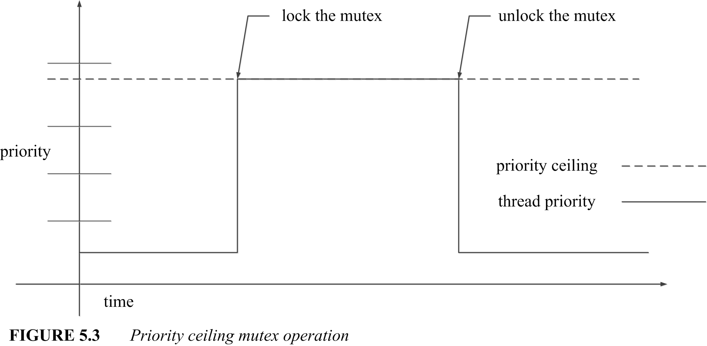

# 5 Advanced threaded programming
Lewis Carroll, Alice's Adventures in Wonderland:
> "Take some more tea," the March Hare said to Alice, very earnestly.  
> "I've had nothing yet," Alice replied in an offended tone:  
> "so I ca'n't take more."  
> "You mean you ca'n't take less,"said the Hatter:  
> "it's very easy to take more than nothing."  

The Pthreads standard provides many capabilities that aren't needed by many programs. To keep the sections dealing with synchronization and threads relatively simple, the more advanced capabilities are collected into this additional section.

Section 5.1 describes a facility to manage initialization of data, particularly within a library, in a multithreaded environment.

Section 5.2 describes "attributes objects," a way to control various characteristics of your threads, mutexes, and condition variables when you create them.

Section 5.3 describes cancellation, a way to ask your threads to "go away" when you don't need them to continue.

Section 5.4 describes thread-specific data, a sort of database mechanism that allows a library to associate data with individual threads that it encounters and to retrieve that data later.

Section 5.5 describes the Pthreads facilities for realtime scheduling, to help your program interact with the cold, cruel world in a predictable way.

## 5.1 One-time initialization
Lewis Carroll, The Hunting of the Snark:
> '"Tis the voice of the Jubjub!" he suddenly cried.  
> (This man, that they used to call "Dunce.")  
> "As the Bellman would tell you," he added with pride,  
> "I have uttered that sentiment once."  

```c
pthread_once_t once_control = PTHREAD_ONCE_INIT;
int pthread_once (pthread_once_t *once_control,
    void (*init_routine) (void));
```

Some things need to be done once and only once, no matter what. When you are Initializing an application, it is often easiest to do all that from main, before calling anything else that might depend on the initialization-and, in particular, before creating any threads that might depend on having initialized mutexes, created thread-specific data keys, and so forth.

If you are writing a library, you usually don't have that luxury. But you must still be sure that the necessary initialization has been completed before you can use anything that needs to be initialized. Statically initialized mutexes can help a lot, but sometimes you may find this "one-time initialization" feature more convenient.

In traditional sequential programming, one-time initialization is often managed by a boolean variable. A control variable is statically initialized to 0, and any code that depends on the initialization can test the variable. If the value is still 0 it can perform the initialization and then set the variable to 1. Later checks will skip the initialization.

When you are using multiple threads, it is not that easy. If more than one thread executes the initialization sequence concurrently, two threads may both find `initializer` to be 0, and both perform the initialization, which, presumably, should have been performed only once. The state of initialization is a shared invariant that must be protected by a mutex.

You can code your own one-time initialization using a boolean variable and a statically initialized mutex. In many cases this will be more convenient than `pthread_once`, and it will always be more efficient. The main reason for `pthread_once` is that you were not originally allowed to statically initialize a mutex. Thus, to use a mutex, you had to first call `pthread_mutex_init`. You must initialize a mutex only once, so the initialization call must be made in one-time initialization code. The `pthread_once` function solved this recursive problem. When static initialization of mutexes was added to the standard, `pthread_once` was retained as a convenience function. If it's convenient, use it, but remember that you don't have to use it.

First, you declare a control variable of type `pthread_once_t`. The control variable must be statically initialized using the `PTHREAD_ONCE_INIT` macro, as shown in the following program, called `once.c`. You must also create a function containing the code to perform all initialization that is to be associated with the control variable. Now, at any time, a thread may call `pthread_once`, specifying a pointer to the control variable and a pointer to the associated initialization function.

The `pthread_once` function first checks the control variable to determine whether the initialization has already completed. If so, `pthread_once` simply returns. If initialization has not yet been started, `pthread_once` calls the initialization function (with no arguments), and then records that initialization has been completed. If a thread calls `pthread_once` while initialization is in progress in another thread, the calling thread will wait until that other thread completes initialization, and then return. In other words, when any call to `pthread_once` returns successfully, the caller can be certain that all states initialized by the associated initialization function are ready to go.

[14-20] The function `once_init_routine` initializes the `mutex` when called-the use of `pthread_once` ensures that it will be called exactly one time.

[30] The thread function `thread_routine` calls `pthread_once` before using `mutex`, to ensure that it exists even if it had not already been created by `main`.

[52] The main program also calls `pthread_once` before using `mutex`, so that the program will execute correctly regardless of when `thread_routine` runs. Notice that, while I normally stress that all shared data must be initialized before creating any thread that uses it, in this case, the only critical shared data is really the `once_block`-it is irrelevant that the `mutex` is not initialized, because the use of `pthread_once` ensures proper synchronization.

```c
/*  once.c  */
#include <pthread.h>
#include "errors.h"

pthread_once_t once_block = PTHREAD_ONCE_INIT;
pthread_mutex_t mutex;

/*
 * This is the one-time initialization routine. It will be
 * called exactly once, no matter how many calls to pthread_once
 * with the same control structure are made during the course of
 * the program.
 */
void once_init_routine (void)
{
    int status;

    status = pthread_mutex_init (&mutex, NULL);
    if (status != 0)
        err_abort (status, "Init Mutex");
}

/*
 * Thread start routine that calls pthread_once.
 */
void *thread_routine (void *arg)
{
    int status;

    status = pthread_once (&once_block, once_init_routine);
    if (status != 0)
        err_abort (status, "Once init");
    status = pthread_mutex_lock (&mutex);
    if (status != 0)
        err_abort (status, "Lock mutex");
    printf ("thread_routine has locked the mutex.\n");
    status = pthread_mutex_unlock (&mutex);
    if (status != 0)
        err_abort (status, "Unlock mutex");
    return NULL;
}

int main (int argc, char *argv[])
{
    pthread_t thread_id;
    char *input, buffer[64];
    int status;

    status = pthread_create (&thread_id, NULL, thread_routine, NULL);
    if (status != 0)
        err_abort (status, "Create thread");
    status = pthread_once (&once_block, once_init_routine);
    if (status != 0)
        err_abort (status, "Once init");
    status = pthread_mutex_lock (&mutex);
    if (status != 0)
        err_abort (status, "Lock mutex");
    printf ("Main has locked the mutex.\n");
    status = pthread_mutex_unlock (&mutex);
    if (status != 0)
        err_abort (status, "Unlock mutex");
    status = pthread_join (thread_id, NULL);
    if (status != 0)
        err_abort (status, "Join thread");
    return 0;
}
```
## 5.2 Attributes objects
Lewis Carroll, The Hunting of the Snark:
> The fifth is ambition. It next will be right  
> To describe each particular batch:  
> Distinguishing those that have feathers, and bite,  
> From those that have whiskers, and scratch.  

So far, when we created threads, or dynamically initialized mutexes and condition variables, we have usually used the pointer value `NULL` as the second argument. That argument is actually a pointer to an attributes object. The value `NULL` indicates that Pthreads should assume the default value for all attributes-just as it does when statically initializing a mutex or condition variable.

An attributes object is an extended argument list provided when you initialize an object. It allows the main interfaces (for example, `pthread_create`) to be relatively simple, while allowing "expert" capability when you need it. Later POSIX standards will be able to add options without requiring source changes to existing code. In addition to standard attributes provided by Pthreads, an implementation can provide specialized options without creating nonstandard parameters.

You can think of an attributes object as a private structure. You read or write the "members" of the structure by calling special functions, rather than by accessing public member names. For example, you read the *stacksize* attribute from a thread attributes object by calling `pthread_attr_getstacksize`, or write it by calling `pthread_attr_setstacksize`.

In a simple implementation of Pthreads the type `pthread_attr_t` might be a `typedef struct` and the get and set functions might be macros to read or write members of the variable. Another implementation might allocate memory when you initialize an attributes object, and it may implement the get and set operations as real functions that perform validity checking.

Threads, mutexes, and condition variables each have their own special attributes object type. Respectively, the types are `pthread_attr_t`, `pthread_mutexattr_t`, and `pthread_condattr_t`.

### 5.2.1 Mutex attributes
```c
pthread_mutexattr_t attr;
int pthread_mutexattr_init (pthread_mutexattr_t *attr);
int pthread_mutexattr_destroy (
    pthread_mutexattr_t *attr);
#ifdef _POSIX_THREAD_PROCESS_SHARED
int pthread_mutexattr_getpshared (
    pthread_mutexattr_t *attr, int *pshared);
int pthread_mutexattr_setpshared (
    pthread_mutexattr_t *attr, int pshared);
#endif
```

Pthreads defines the following attributes for mutex creation: *pshared*, *protocol*, and *prioceiling*. No system is required to implement any of these attributes, however, so check the system documentation before using them.

You initialize a mutex attributes object by calling `pthread_mutexattr_init`, specifying a pointer to a variable of type `pthread_mutexattr_t`, as in `mutex_attr.c`, shown next. You use that attributes object by passing its address to `pthread_mutex_init` instead of the `NULL` value we've been using so far.

If your system provides the `_POSIX_THREAD_PROCESS_SHARED` option, then it supports the *pshared* attribute, which you can set by calling the function `pthread_mutexattr_setpshared`. If you set the *pshared* attribute to the value `PTHREAD_PROCESS_SHARED`, you can use the mutex to synchronize threads within separate processes that have access to the memory where the mutex (`pthread_mutex_t`) is initialized. The default value for this attribute is `PTHREAD_PROCESS_PRIVATE`.

The `mutex_attr.c` program shows how to set a mutex attributes object to create a mutex using the pshared attribute. This example uses the default value. `PTHREAD_PROCESS_PRIVATE`, to avoid the additional complexity of creating shared memory and forking a process. The other mutex attributes, *protocol* and *prioceiling*, will be discussed later in Section 5.5.5.

```c
/*  mutex_attr.c  */
#include <pthread.h>
#include "errors.h"

pthread_mutex_t mutex;

int main (int argc, char *argv[])
{
    pthread_mutexattr_t mutex_attr;
    int status;

    status = pthread_mutexattr_init (&mutex_attr);
    if (status != 0)
        err_abort (status, "Create attr");
#ifdef _POSIX_THREAD_PROCESS_SHARED
    status = pthread_mutexattr_setpshared (
        &mutex_attr, PTHREAD_PROCESS_PRIVATE);
    if (status != 0)
        err_abort (status, "Set pshared");
#endif
    status = pthread_mutex_init (&mutex, &mutex_attr);
    if (status != 0)
        err_abort (status, "Init mutex");
    return 0;
}
```
### 5.2.2 Condition variable attributes
```c
pthread_condattr_t attr;
int pthread_condattr_init (pthread_condattr_t *attr);
int pthread_condattr_destroy (
    pthread_condattr_t *attr);
#ifdef _POSIX_THREAD_PROCESS_SHARED
int pthread_condattr_getpshared (
    pthread_condattr_t *attr, int *pshared);
int pthread_condattr_setpshared (
    pthread_condattr_t *attr, int pshared);
#endif
```

Pthreads defines only one attribute for condition variable creation, `pshared`. No system is required to implement this attribute, so check the system documentation before using it. You initialize a condition variable attributes object using `pthread_condattr_init`, specifying a pointer to a variable of type `pthread_condattr_t`, as in `cond_attr.c`, shown next. You use that attributes object by passing its address to `pthread_cond_init` instead of the `NULL` value we've been using so far.

If your system defines `_POSIX_THREAD_PROCESS_SHARED` then it supports the *pshared* attribute. You set the *pshared* attribute by calling the function `pthread_condattr_setpshared`. If you set the *pshared* attribute to the value `PTHREAD_PROCESS_SHARED`, the condition variable can be used by threads in separate processes that have access to the memory where the condition variable (`pthread_cond_t`) is initialized. The default value for this attribute is `PTHREAD_PROCESS_PRIVATE`.

The `cond_attr.c` program shows how to set a condition variable attributes object to create a condition variable using the *pshared* attribute. This example uses the default value, `PTHREAD_PROCESS_PRIVATE`, to avoid the additional complexity of creating shared memory and forking a process.

```c
/*  cond_attr.c  */
#include <pthread.h>
#include "errors.h"

pthread_cond_t cond;

int main (int argc, char *argv[])
{
    pthread_condattr_t cond_attr;
    int status;

    status = pthread_condattr_init (&cond_attr);
    if (status != 0)
        err_abort (status, "Create attr");
#ifdef _POSIX_THREAD_PROCESS_SHARED
    status = pthread_condattr_setpshared (
        &cond_attr, PTHREAD_PROCESS_PRIVATE);
    if (status != 0)
        err_abort (status, "Set pshared");
#endif
    status = pthread_cond_init (&cond, &cond_attr);
    if (status != 0)
        err_abort (status, "Init cond");
    return 0;
}
```
To make use of a `PTHREAD_PROCESS_SHARED` condition variable, you must also use a `PTHREAD_PROCESS_SHARED` mutex. That's because two threads that synchronize using a condition variable must also use the same mutex. Waiting for a condition variable automatically unlocks, and then locks, the associated mutex. So if the mutex isn't also created with `PTHREAD_PROCESS_SHARED`, the synchronization won't work.

### 5.2.3 Thread attributes
```c
pthread_attr_t attr;
int pthread_attr_init (pthread_attr_t *attr);
int pthread_attr_destroy (pthread_attr_t *attr);
int pthread_attr_getdetachstate (
    pthread_attr_t *attr, int *detachstate);
int pthread_attr_setdetachstate (
    pthread_attr_t *attr, int detachstate);
#ifdef _POSIX_THREAD_ATTR_STACKSIZE
int pthread_attr_getstacksize (
    pthread_attr_t *attr, size_t *stacksize);
int pthread_attr_setstacksize (
    pthread_attr_t *attr, size_t stacksize);
#endif
#ifdef _POSIX_THREAD_ATTR_STACKADDR
int pthread_attr_getstackaddr (
    pthread_attr_t *attr, void *stackaddr);
int pthread_attr_setstackaddr (
    pthread_attr_t *attr, void **stackaddr);
#endif
```

POSIX defines the following attributes for thread creation: *detachstate*, *stacksize*, *stackaddr*, *scope*, *inheritsched*, *schedpolicy*, and *schedparam*. Some systems won't support all of these attributes, so you need to check the system documentation before using them. You initialize a thread attributes object using `pthread_attr_init`, specifying a pointer to a variable of type `pthread_attr_t`, as in the program `thread_attr.c`, shown later. You use the attributes object you've created by passing its address as the second argument to `pthread_create` instead of the `NULL` value we've been using so far.

All Pthreads systems support the *detachstate* attribute. The value of this attribute can be either `PTHREAD_CREATE_JOINABLE` or `PTHREAD_CREATE_DETACHED`. By default, threads are created *joinable*, which means that the thread identification created by `pthread_create` can be used to join with the thread and retrieve its return value, or to cancel it. If you set the *detachstate* attribute to `PTHREAD_CREATE_DETACHED`, the identification of threads created using that attributes object can't be used. It also means that when the thread terminates, any resources it used can immediately be reclaimed by the system.

When you create threads that you know you won't need to cancel, or join with, you should create them detached. Remember that, in many cases, even if you want to know when a thread terminates, or receive some return value from it, you may not need to use `pthread_join`. If you provide your own notification mechanism, for example, using a condition variable, you can still create your threads detached.

> Setting the size of a stack is not very portable.

If your system defines the symbol `_POSIX_THREAD_ATTR_STACKSIZE`, then you can set the *stacksize* attribute to specify the minimum size for the stack of a thread created using the attributes object. Most systems will support this option, but you should use it with caution because stack size isn't portable. The amount of stack space you'll need depends on the calling standards and data formats used by each system.

Pthreads defines the symbol `PTHREAD_STACK_MIN` as the minimum stack size required for a thread: If you really need to specify a stack size, you might be best off calculating your requirements in terms of the minimum required by the implementation. Or, you could base your requirements on the default *stacksize* attribute selected by the implementation-for example, twice the default, or half the default. The program `thread_attr.c` shows how to read the default *stacksize* attribute value of an initialized attribute by calling `pthread_attr_getstacksize`.

> Setting the address of a stack is less portable!

If your system defines the symbol `_POSIX_THREAD_ATTR_STACKADDR`, then you can set the *stackaddr* attribute to specify a region of memory to be used as a stack by any thread created using this attributes object. The stack must be at least as large as `PTHREAD_STACK_MIN`. You may need to specify an area of memory with an address that's aligned to some required granularity. On a machine where the stack grows downward from higher addresses to lower addresses, the address you specify should be the highest address in the stack, not the lowest. If the stack grows up, you need to specify the lowest address.

You also need to be aware of whether the machine increments (or decrements) the stack before or after writing a new value-this determines whether the address you specify should be "inside" or "outside" the stack you've allocated. The system can't tell whether you allocated enough space, or specified the right address, so it has to trust you. If you get it wrong, undesirable things will occur.

Use the *stackaddr* attribute only with great caution, and beware that it may well be the least portable aspect of Pthreads. While a reasonable value for the *stacksize* attribute will probably work on a wide range of machines, it is little more than a wild coincidence if any particular value of the *stackaddr* attribute works on any two machines. Also, you must remember that you can create only one thread with any value of the *stackaddr* attribute. If you create two concurrent threads with the same *stackaddr* attribute value, the threads will run on the same stack. (That would be bad.)

The `thread_attr.c` program that follows shows some of these attributes in action, with proper conditionalization to avoid using the *stacksize* attribute if it is not supported by your system. If *stacksize* is supported (and it will be on most UNIX systems), the program will print the default and minimum stack size, and set *stacksize* to a value twice the minimum. The code also creates the thread detached, which means no thread can join with it to determine when it completes. Instead, main exits by calling `pthread_exit`, which means that the process will terminate when the last thread exits.

This example does not include the priority scheduling attributes, which are discussed (and demonstrated) in Section 5.5.2. It also does not demonstrate use of the *stackaddr* attribute-as I said, there is no way to use *stackaddr* in any remotely portable way and, although I have mentioned it for completeness, I strongly discourage use of *stackaddr* in any program.

```c
/*  thread_attr.c  */
#include <limits.h>
#include <pthread.h>
#include "errors.h"

/*
 * Thread start routine that reports it ran, and then exits.
 */
void *thread_routine (void *arg)
{
    printf ("The thread is here\n");
    return NULL;
}

int main (int argc, char *argv[])
{
    pthread_t thread_id;
    pthread_attr_t thread_attr;
    size_t stack_size;
    int status;

    status = pthread_attr_init (&thread_attr);
    if (status != 0)
        err_abort (status, "Create attr");

    /*
     * Create a detached thread.
     */
    status = pthread_attr_setdetachstate (
        &thread_attr, PTHREAD_CREATE_DETACHED);
    if (status != 0)
        err_abort (status, "Set detach");
#ifdef _POSIX_THREAD_ATTR_STACKSIZE
    /*
     * If supported, determine the default stack size and report
     * it, and then select a stack size for the new thread.
     *
     * Note that the standard does not specify the default stack
     * size, and the default value in an attributes object need
     * not be the size that will actually be used.  Solaris 2.5
     * uses a value of 0 to indicate the default.
     */
    status = pthread_attr_getstacksize (&thread_attr, &stack_size);
    if (status != 0)
        err_abort (status, "Get stack size");
    printf ("Default stack size is %u; minimum is %u\n",
        stack_size, PTHREAD_STACK_MIN);
    status = pthread_attr_setstacksize (
        &thread_attr, PTHREAD_STACK_MIN*2);
    if (status != 0)
        err_abort (status, "Set stack size");
#endif
    status = pthread_create (
        &thread_id, &thread_attr, thread_routine, NULL);
    if (status != 0)
        err_abort (status, "Create thread");
    printf ("Main exiting\n");
    pthread_exit (NULL);
    return 0;
}
```

## 5.3 Cancellation
Lewis Carroll, Alice's Adventures in Wonderland:
> "Now, I give you fair warning,"  
> shouted fhe Queen, stamping on the ground as she spoke;  
> "either you or your head must be off,  
> and that in about half no time! Take your choice!"  
> The Duchess took her choice, and was gone in a moment.  

```c
int pthread_cancel (pthread_t thread);
int pthread_setcancelstate (int state, int *oldstate);
int pthread_setcanceltype (int type, int *oldtype);
void pthread_testcancel (void);
void pthread_cleanup_push (
    void (*routine)(void *), void *arg);
void pthread_cleanup_pop (int execute);
```

Most of the time each thread runs independently, finishes a specific job, and exits on its own. But sometimes a thread is created to do something that doesn't necessarily need to be finished. The user might press a CANCEL button to stop a long search operation. Or the thread might be part of a redundant algorithm and is no longer useful because some other thread succeeded. What do you do when you just want a thread to go away? That's what the Pthreads cancellation interfaces are for.

Cancelling a thread is a lot like telling a human to stop something they're doing. Say that one of the bailing programmers has become maniacally obsessed with reaching land, and refuses to stop rowing until reaching safety (Figure 5.1). When the boat finally runs up onto the beach, he's become so fixated that he fails to realize he's done. The other programmers must roughly shake him, and forcibly remove the oars from his blistered hands to stop him-but clearly he must be stopped. That's cancellation. Sort of. I can think of other analogies for cancellation within the bailing programmer story, but I choose to ignore them. Perhaps you can, too.

Cancellation allows you to tell a thread to shut itself down. You don't need it often, but it can sometimes be extremely useful. Cancellation isn't an arbitrary external termination. It is more like a polite (though not necessarily "friendly") request. You're most likely to want to cancel a thread when you've found that something you set it off to accomplish is no longer necessary. You should never use cancellation unless you really want the target thread to go away. It is a termination mechanism, not a communication channel. So, why would you want to do that to a thread that you presumably created for some reason?

<center></center>

An application might use threads to perform long-running operations, perhaps in the background, while the user continues working. Such operations might include saving a large document, preparing to print a document, or sorting a large list. Most such interfaces probably will need to have some way for the user to cancel an operation, whether it is pressing the ESC key or Ctrl-C, or clicking a stop sign icon on the screen. The thread receiving the user interface cancel request would then determine that one or more background operations were in progress, and use `pthread_cancel` to cancel the appropriate threads.

Often, threads are deployed to "explore" a data set in parallel for some heuristic solution. For example, solving an equation for a local minimum or maximum. Once you've gotten one answer that's good enough, the remaining threads may no longer be needed. If so, you can cancel them to avoid wasting processor time and get on to other work.

Pthreads allows each thread to control its own termination. It can restore program invariants and unlock mutexes. It can even defer cancellation while it completes some important operation. For example, when two write operations must both complete if either completes, a cancellation between the two is not acceptable.

Mode | State | Type | Meaning
--- | --- | --- | ---
Off | disabled | may be either | Cancellation remains pending until enabled.
Deferred | enabled | deferred | Cancellation occurs at next cancellation point.
Asynchronous | enabled | asynchronous | Cancellation may be processed at any time.

<center>**TABLE 5.1** *Cancellation states*</center>

Pthreads supports three cancellation modes, described in Table 5.1, which are encoded as two binary values called "cancellation state" and "cancellation type." Each essentially can be on or off. (While that technically gives four modes, one of them is redundant.) As shown in the table, cancellation state is said to be *enabled* or *disabled*, and cancellation type is said to be *deferred* or *asynchronous*.

By default, cancellation is *deferred*, and can occur only at specific points in the program that check whether the thread has been requested to terminate, called *cancellation points*. Most functions that can wait for an unbounded time should be deferred cancellation points. Deferred cancellation points include waiting on a condition variable, reading or writing a file, and other functions where the thread may be blocked for a substantial period of time. There is also a special function called `pthread_testcancel` that is nothing but a deferred cancellation point. It will return immediately if the thread hasn't been asked to terminate, which allows you to turn any of your functions into cancellation points.

Some systems provide a function to *terminate* a thread immediately. Although that sounds useful, it is difficult to use such a function safely. In fact, it is nearly impossible in a normal modular programming environment. If a thread is terminated with a mutex locked, for example, the next thread trying to lock that mutex will be stuck waiting forever.

It might seem that the thread system could automatically release the mutex; but most of the time that's no help. Threads lock mutexes because they're modifying shared data. No other thread can know what data has been modified or what the thread was trying to change, which makes it difficult to fix the data. Now the program is broken. When the mutex is left locked, you can usually tell that something's broken because one or more threads will hang waiting for the mutex.

The only way to recover from terminating a thread with a locked mutex is for the application to be able to analyze all shared data and repair it to achieve a consistent and correct state. That is not impossible, and it is worth substantial effort when an application must be fail-safe. However, it is generally not practical for anything but an embedded system where the application designers control every bit of shared state in the process. You would have to rebuild not only your own program or library state, but also the state affected by any library functions that might be called by the thread (for example, the ANSI C library).

To cancel a thread, you need the thread's identifier, the `pthread_t` value returned to the creator by `pthread_create` or returned to the thread itself by `pthread_self`. Cancelling a thread is asynchronous-that is, when the call to `pthread_cancel` returns, the thread has not necessarily been canceled, it may have only been notified that a cancel request is *pending* against it. If you need to know when the thread has actually terminated, you must *join* with it by calling `pthread_join` after cancelling it.

If the thread had asynchronous cancelability type set, or when the thread next reaches a deferred cancellation point, the cancel request will be *delivered* by the system. When that happens, the system will set the thread's cancelability type to `PTHREAD_CANCEL_DEFERRED` and the cancelability state to `PTHREAD_CANCEL_DISABLE`. That is, the thread can clean up and terminate without having to worry about being canceled again.

When a function that is a cancellation point detects a pending cancel request, the function does not return to the caller. The active cleanup handlers will be called, if there are any, and the thread will terminate. There is no way to "handle" cancellation and continue execution-the thread must either defer cancellation entirely or terminate. This is analogous to C++ object destructors, rather than C++ exceptions-the object is allowed to clean up after itself, but it is not allowed to avoid destruction.

The following program, called `cancel.c`, shows how to write a thread that responds "reasonably quickly" to deferred cancellation, by calling `pthread_testcancel` within a loop.

[12-20] The thread function `thread_routine` loops indefinitely, until canceled, testing periodically for a pending cancellation request. It minimizes the overhead of calling `pthread_testcancel` by doing so only every 1000 iterations (line 18).

[28-36] On a Solaris system, set the thread concurrency level to 2, by calling `thr_setconcurrency`. Without the call to `thr_setconcurrency`, this program will hang on Solaris because `thread_routine` is "compute bound" and will not block. The main program would never have another chance to run once `thread_routine` started, and could not call `pthread_cancel`.

[37-55] The main program creates a thread running `thread_routine`, sleeps for two seconds, and then cancels the thread. It joins with the thread, and checks the return value, which should be `PTHREAD_CANCELED` to indicate that it was canceled, rather than terminated normally.

```c
/*  cancel.c  */
#include <pthread.h>
#include "errors.h"

static int counter;

/*
 * Loop until cancelled. The thread can be cancelled only
 * when it calls pthread_testcancel, which it does each 1000
 * iterations.
 */
void *thread_routine (void *arg)
{
    DPRINTF (("thread_routine starting\n"));
    for (counter = 0; ; counter++)
        if ((counter % 1000) == 0) {
            DPRINTF (("calling testcancel\n"));
            pthread_testcancel ();
        }
}

int main (int argc, char *argv[])
{
    pthread_t thread_id;
    void *result;
    int status;

#ifdef sun
    /*
     * On Solaris 2.5, threads are not timesliced. To ensure
     * that our two threads can run concurrently, we need to
     * increase the concurrency level to 2.
     */
    DPRINTF (("Setting concurrency level to 2\n"));
    thr_setconcurrency (2);
#endif
    status = pthread_create (
        &thread_id, NULL, thread_routine, NULL);
    if (status != 0)
        err_abort (status, "Create thread");
    sleep (2);

    DPRINTF (("calling cancel\n"));
    status = pthread_cancel (thread_id);
    if (status != 0)
        err_abort (status, "Cancel thread");

    DPRINTF (("calling join\n"));
    status = pthread_join (thread_id, &result);
    if (status != 0)
        err_abort (status, "Join thread");
    if (result == PTHREAD_CANCELED)
        printf ("Thread cancelled at iteration %d\n", counter);
    else
        printf ("Thread was not cancelled\n");
    return 0;
}
```
A thread can disable cancellation around sections of code that need to complete without interruption, by calling `pthread_setcancelstate`. For example, if a database update operation takes two separate `write` calls, you wouldn't want to complete the first and have the second canceled. If you request that a thread be canceled while cancellation is disabled, the thread remembers that it was canceled but won't do anything about it until after cancellation is enabled again. Because enabling cancellation isn't a *cancellation point*, you also need to test for a pending cancel request if you want a cancel processed immediately.

When a thread may be canceled while it holds private resources, such as a locked mutex or heap storage that won't ever be freed by any other thread, those resources need to be released when the thread is canceled. If the thread has a mutex locked, it may also need to "repair" shared data to restore program invariants. *Cleanup handlers* provide the mechanism to accomplish the cleanup, somewhat like process `atexit` handlers. After acquiring a resource, and before any cancellation points, declare a cleanup handler by calling `pthread_cleanup_push`. Before releasing the resource, but after any cancellation points, remove the cleanup handler by calling `pthread_cleanup_pop`.

If you don't have a thread's identifier, you can't cancel the thread. That means that, at least using portable POSIX functions, you can't write an "idle thread killer" that will arbitrarily terminate threads in the process. You can only cancel threads that you created, or threads for which the creator (or the thread itself) gave you an identifier. That generally means that cancellation is restricted to operating within a subsystem.

### 5.3.1 Deferred cancelability
"Deferred cancelability" means that the thread's cancelability type has been set to `PTHREAD_CANCEL_DEFERRED` and the thread's cancelability enable has been set to `PTHREAD_CANCEL_ENABLE`. The thread will only respond to cancellation requests when it reaches one of a set of "cancellation points."

The following functions are always cancellation points on any Pthreads system:

|                          |              |                |
| ----                     | ----         | ----           |
| `pthread_cond_wait`      | `fsync`      | `sigwaitinfo`  |
| `pthread_cond_timedwait` | `mq_receive` | `sigsuspend`   |
| `pthread_join`           | `mq_send`    | `sigtimedwait` |
| `pthread_testcancel`     | `msync`      | `sleep`        |
| `sigwait`                | `nanosleep`  | `system`       |
| `aio_suspend`            | `open`       | `tcdrain`      |
| `close`                  | `pause`      | `wait`         |
| `creat`                  | `read`       | `waitpid`      |
| `fcntl (F_SETLCKW)`      | `sem_wait`   | `write`        |
|                          |              |                |

The following list of functions may be cancellation points. You should write your code so that it will function correctly if any of these are cancellation points and also so that it will not break if any of them are not. If you depend upon any particular behavior, you may limit the portability of your code. You'll have to look at the conformance documentation to find out which, if any, are cancellation points for the system you are using:

|                            |                    |                    |
| --                         | --                 | --                 |
| `closedir`                 | `getc_unlocked`    | `printf`           |
| `ctermid`                  | `getchar`          | `putc`             |
| `fclose`                   | `getchar_unlocked` | `putc_unlocked`    |
| `fcntl (except F_SETLCKW)` | `getcwd`           | `putchar`          |
| `fflush`                   | `getgrgid`         | `putchar_unlocked` |
| `fgetc`                    | `getgrgid_r`       | `puts`             |
| `fgets`                    | `getrtnam`         | `readdir`          |
| `fopen`                    | `getgrnam_r`       | `remove`           |
| `fprintf`                  | `getlogin`         | `rename`           |
| `fputc`                    | `getlogin_r`       | `rewind`           |
| `fputs`                    | `getpwnam`         | `rewinddir`        |
| `fread`                    | `getpwnam r`       | `scanf`            |
| `freopen`                  | `getpwuid`         | `tmpfile`          |
| `fscanf`                   | `getpwuid_r`       | `tmpname`          |
| `fseek`                    | `gets`             | `ttyname`          |
| `ftell`                    | `lseek`            | `ttyname_r`        |
| `fwrite`                   | `opendir`          | `ungetc`           |
| `getc`                     | `perror`           |                    |
|                            |                    |                    |

Pthreads specifies that any ANSI C or POSIX function not specified in one of the two lists cannot be a cancellation point. However, your system probably has many additional cancellation points. That's because few UNIX systems are "POSIX." That is, they support other programming interfaces as well-such as BSD 4.3, System V Release 4, UNIX95, and so forth. POSIX doesn't recognize the existence of functions such as `select` or `poll`, and therefore it can't say whether or not they are cancellation points. Yet clearly both are functions that may block for an arbitrary period of time, and programmers using them with cancellation would reasonably expect them to behave as cancellation points. X/Open is currently addressing this problem for UNIX98 (*X/Open System Interfaces, Issue 5*). by extending the Pthreads list of cancellation points.

Most cancellation points involve I/O operations that may block the thread for an "unbounded" time. They're cancelable so that the waits can be interrupted. When a thread reaches a cancellation point the system determines whether a cancel is pending for the current ("target") thread. A cancel will be pending if another thread has called `pthread_cancel` for the target thread since the last time the target thread returned from a cancellation point. If a cancel is pending, the system will immediately begin calling cleanup functions, and then the thread will terminate.

If no cancel is currently pending, the function will proceed. If another thread requests that the thread be canceled while the thread is waiting for something (such as I/O) then the wait will be interrupted and the thread will begin its cancellation cleanup.

If you need to ensure that cancellation can't occur at a particular cancellation point, or during some sequence of cancellation points, you can temporarily disable cancellation in that region of code. The following program, called `cancel_disable.c`, is a variant of `cancel.c`. The "target" thread periodically calls `sleep`, and does not want the call to be cancelable.

[24-33] After each cycle of 755 iterations, `thread_routine` will call `sleep` to wait a second. (The value 755 is just an arbitrary number that popped into my head. Do arbitrary numbers ever pop into your head?) Prior to sleeping, `thread_routine` disables cancellation by setting the cancelability state to `PTHREAD_CANCEL_DISABLE`. After `sleep` returns, it restores the saved cancelability state by calling `pthread_setcancelstate` again.

[34-36] Just as in `cancel.c`, test for a pending cancel every 1000 iterations.

```c
/*  cancel_disable.c  */
#include <pthread.h>
#include "errors.h"

static int counter;

/*
 * Thread start routine.
 */
void *thread_routine (void *arg)
{
    int state;
    int status;

    for (counter = 0; ; counter++) {

        /*
         * Each 755 iterations, disable cancellation and sleep
         * for one second.
         *
         * Each 1000 iterations, test for a pending cancel by
         * calling pthread_testcancel().
         */
        if ((counter % 755) == 0) {
            status = pthread_setcancelstate (
                PTHREAD_CANCEL_DISABLE, &state);
            if (status != 0)
                err_abort (status, "Disable cancel");
            sleep (1);
            status = pthread_setcancelstate (
                state, &state);
            if (status != 0)
                err_abort (status, "Restore cancel");
        } else
            if ((counter % 1000) == 0)
                pthread_testcancel ();
    }
}

int main (int argc, char *argv[])
{
    pthread_t thread_id;
    void *result;
    int status;

    status = pthread_create (
        &thread_id, NULL, thread_routine, NULL);
    if (status != 0)
        err_abort (status, "Create thread");
    sleep (2);
    status = pthread_cancel (thread_id);
    if (status != 0)
        err_abort (status, "Cancel thread");

    status = pthread_join (thread_id, &result);
    if (status != 0)
        err_abort (status, "Join thread");
    if (result == PTHREAD_CANCELED)
        printf ("Thread cancelled at iteration %d\n", counter);
    else
        printf ("Thread was not cancelled\n");
    return 0;
}
```

### 5.3.2 Asynchronous cancelability

Asynchronous cancellation is useful because the "target thread" doesn't need to poll for cancellation requests by using cancellation points. That can be valuable for a thread that runs a tight compute-bound loop (for example, searching for a prime number factor) where the overhead of calling `pthread_testcancel` might be severe.

> Avoid asynchronous cancellation!  
> It is difficult to use correctly and is rarely useful.  

The problem is that you're limited in what you can do with asynchronous cancellation enabled. You can't acquire any resources, for example, including locking a mutex. That's because the cleanup code would have no way to determine whether the mutex had been locked. Asynchronous cancellation can occur at any hardware instruction. On some computers it may even be possible to interrupt some instructions in the middle. That makes it really difficult to determine what the canceled thread was doing.

For example, when you call `malloc` the system allocates some heap memory for you, stores a pointer to that memory somewhere (possibly in a hardware register), and then returns to your code, which probably moves the return value into some local storage for later use. There are lots of places that `malloc` might be interrupted by an asynchronous cancel, with varying effects. It might be interrupted before the memory was allocated. Or it might be interrupted after allocating storage but before it stored the address for return. Or it might even return to your code, but get interrupted before the return value could be copied to a local variable. In any of those cases the variable where your code expects to find a pointer to the allocated memory will be uninitialized. You can't tell whether the memory really was allocated yet. You can't free the memory, so that memory (if it was allocated to you) will remain allocated for the life of the program. That's a memory leak, which is not a desirable feature.

Or when you call `pthread_mutex_lock`, the system might be interrupted within a function call either before or after locking the mutex. Again, there's no way for your program to find out, because the interrupt may have occurred between any two instructions, even within the `pthread_mutex_lock` function, which might leave the mutex unusable. If the mutex is locked, the application will likely end up hanging because it will never be unlocked.

> Call no code with asynchronous cancellation enabled unless you wrote it to be async-cancel safe-and even then,think twice!

You are not allowed to call any function that acquires resources while asynchronous cancellation is enabled. In fact, you should never call any function while asynchronous cancellation is enabled unless the function is documented as "async-cancel safe." The only functions required to be async safe by Pthreads are `pthread_cancel`, `pthread_setcancelstate`, and `pthread_setcanceltype`. (And there is no reason to call `pthread_cancel` with asynchronous cancelability enabled.) No other POSIX or ANSI C functions need be async-cancel safe, and you should never call them with asynchronous cancelability enabled.

Pthreads suggests that all library functions should document whether or not they are async-cancel safe. However if the description of a function does not specifically say it is async-cancel safe you should always assume that it is not. The consequences of asynchronous cancellation in a function that is not async-cancel safe can be severe. And worse, the effects are sensitive to timing-so a function that appears to be async-cancel safe during experimentation may in fact cause all sorts of problems later when it ends up being canceled in a slightly different place.

The following program. `cancel_async.c`, shows the use of asynchronous cancellation in a compute-bound loop. Use of asynchronous cancellation makes this loop "more responsive" than the deferred cancellation loop in `cancel.c`. However, the program would become unreliable if any function calls were made within the loop, whereas the deferred cancellation version would continue to function correctly. In most cases, synchronous cancellation is preferable.

[25-29] To keep the thread running awhile with something more interesting than an empty loop, `cancel_async.c` uses a simple matrix multiply nested loop. The `matrixa` and `matrixb` arrays are initialized with, respectively, their major or minor array index.

[35-37] The cancellation type is changed to `PTHREAD_CANCEL_ASYNCHRONOUS`, allowing asynchronous cancellation within the matrix multiply loops.

[40-45] The thread repeats the matrix multiply until canceled, on each iteration replacing the first source array (`matrixa`) with the result of the previous multiplication (`matrixc`).

[67-75] Once again, on a Solaris system, set the thread concurrency level to 2, allowing the main thread and `thread_routine` to run concurrently on a uniprocessor. The program will hang without this step, since user mode threads are not timesliced on Solaris.

```c
/*  cancel_async.c  */
#include <pthread.h>
#include "errors.h"

#define SIZE    10      /* array size */

static int matrixa[SIZE][SIZE];
static int matrixb[SIZE][SIZE];
static int matrixc[SIZE][SIZE];

/*
 * Loop until cancelled. The thread can be cancelled at any
 * point within the inner loop, where asynchronous cancellation
 * is enabled. The loop multiplies the two matrices matrixa
 * and matrixb.
 */
void *thread_routine (void *arg)
{
    int cancel_type, status;
    int i, j, k, value = 1;
    
    /*
     * Initialize the matrices to something arbitrary.
     */
    for (i = 0; i < SIZE; i++)
        for (j = 0; j < SIZE; j++) {
            matrixa[i][j] = i;
            matrixb[i][j] = j;
        }

    while (1) {
        /*
         * Compute the matrix product of matrixa and matrixb.
         */
        status = pthread_setcanceltype (
                PTHREAD_CANCEL_ASYNCHRONOUS,
                &cancel_type);
        if (status != 0)
            err_abort (status, "Set cancel type");
        for (i = 0; i < SIZE; i++)
            for (j = 0; j < SIZE; j++) {
                matrixc[i][j] = 0;
                for (k = 0; k < SIZE; k++)
                    matrixc[i][j] += matrixa[i][k] * matrixb[k][j];
            }
        status = pthread_setcanceltype (
                cancel_type,
                &cancel_type);
        if (status != 0)
            err_abort (status, "Set cancel type");

        /*
         * Copy the result (matrixc) into matrixa to start again
         */
        for (i = 0; i < SIZE; i++)
            for (j = 0; j < SIZE; j++)
                matrixa[i][j] = matrixc[i][j];
    }
}

int main (int argc, char *argv[])
{
    pthread_t thread_id;
    void *result;
    int status;

#ifdef sun
    /*
     * On Solaris 2.5, threads are not timesliced. To ensure
     * that our two threads can run concurrently, we need to
     * increase the concurrency level to 2.
     */
    DPRINTF (("Setting concurrency level to 2\n"));
    thr_setconcurrency (2);
#endif
    status = pthread_create (
        &thread_id, NULL, thread_routine, NULL);
    if (status != 0)
        err_abort (status, "Create thread");
    sleep (1);
    status = pthread_cancel (thread_id);
    if (status != 0)
        err_abort (status, "Cancel thread");
    status = pthread_join (thread_id, &result);
    if (status != 0)
        err_abort (status, "Join thread");
    if (result == PTHREAD_CANCELED)
        printf ("Thread cancelled\n");
    else
        printf ("Thread was not cancelled\n");
    return 0;
}
```

> Warning: do not let "DCE threads'" habits carry over to Pthreads!

I'll end this section with a warning. DCE threads, a critical component of the Open Software Foundation's Distributed Computing Environment, was designed to be independent of the underlying UNIX kernel. Systems with no thread support at all often emulated "thread synchronous" I/O in user mode, using nonblocking I/O mode, so that a thread attempting I/O on a busy file was blocked on a condition variable until a later `select` or `poll` showed that the I/O could complete. DCE listener threads might block indefinitely on a socket read, and it was important to be able to cancel that read.

When DCE was ported to newer kernels that had thread support, but not Pthreads support, the user mode I/O wrappers were usually omitted, resulting in a thread blocked within a kernel that did not support deferred cancellation. Users discovered that, in many cases, these systems implemented asynchronous cancellation in such a way that, quite by coincidence, a kernel wait might be canceled "safely" if the thread switched to asynchronous cancellation immediately before the kernel call, and switched back to deferred cancellation immediately after. This observation was publicized in DCE documentation, but it is a very dangerous hack, even on systems where it seems to work. You should never try this on any Pthreads system! If your system conforms to POSIX 1003.1c-1995 (or POSIX 1003.1, 1996 edition, or later), it supports deferred cancellation of, at minimum, kernel functions such as read and write. You do not need asynchronous cancellation, and using it can be extremely dangerous.

### 5.3.3 Cleaning up

> When you write any library code, design it to handle deferred cancellation gracefully. Disable cancellation where it is not appropriate, and always use cleanup handlers at cancellation points.

If a section of code needs to restore some state when it is canceled, it must use cleanup handlers. When a thread is canceled while waiting for a condition variable, it will wake up with the mutex locked. Before the thread terminates it usually needs to restore invariants, and it always needs to release the mutex.

Each thread may be considered to have a stack of active cleanup handlers. Cleanup handlers are added to the stack by calling `pthread_cleanup_push`, and the most recently added cleanup handler is removed by calling `pthread_cleanup_pop`. When the thread is canceled or when it exits by calling `pthread_exit`, Pthreads calls each active cleanup handler in turn, beginning with the most recently added cleanup handler. When all active cleanup handlers have returned, the thread is terminated.

Pthreads cleanup handlers are designed so that you can often use the cleanup handler even when the thread wasn't canceled. It is often useful to run the same cleanup function regardless of whether your code is canceled or completes normally. When `pthread_cleanup_pop` is called with a nonzero value, the cleanup handler is executed even if the thread was not canceled.

You cannot push a cleanup handler in one function and pop it in another function. The `pthread_cleanup_push` and `pthread_cleanup_pop` operations may be defined as macros, such that `pthread_cleanup_push` contains the opening brace "{" of a block, while `pthread_cleanup_pop` contains the matching closing brace "}" of the block. You must always keep this restriction in mind while using cleanup handlers, if you wish your code to be portable.

The following program, `cancel_cleanup.c`, shows the use of a cleanup handler to release a mutex when a condition variable wait is canceled.

[11-18] The control structure (`control`) is used by all threads to maintain shared synchronization objects and invariants. Each thread increases the member `counter` by one when it starts, and decreases it at termination. The member `busy` is used as a dummy condition wait predicate-it is initialized to 1, and never cleared, which means that the condition wait loops will never terminate (in this example) until the threads are canceled.

[25-35] The function `cleanup_handler` is installed as the cancellation cleanup handler for each thread. It is called on normal termination as well as through cancellation, to decrease the count of active threads and unlock the mutex.

[48] The function `thread_routine` establishes `cleanup_handler` as the active cancellation cleanup handler.

[55-59] Wait until the control structure's `busy` member is set to 0, which, in this example, will never occur. The condition wait loop will exit only when the wait is canceled.

[61] Although the condition wait loop in this example will not exit, the function cleans up by removing the active cleanup handler. The nonzero argument to `pthread_cleanup_pop`, remember, means that the cleanup handler will be called even though cancellation did not occur.

In some cases, you may omit "unreachable statements" like this `pthread_cleanup_pop` call. However, in this case, your code might not compile without it. The `pthread_cleanup_push` and `pthread_cleanup_pop` macros are special, and may expand to form, respectively, the beginning and ending of a block. Digital UNIX does this, for example, to implement cancellation on top of the common structured exception handling provided by the operating system.

```c
/*  cancel_cleanup.c  */
#include <pthread.h>
#include "errors.h"

#define THREADS 5

/*
 * Control structure shared by the test threads, containing
 * the synchronization and invariant data.
 */
typedef struct control_tag {
    int                 counter, busy;
    pthread_mutex_t     mutex;
    pthread_cond_t      cv;
} control_t;

control_t control =
    {0, 1, PTHREAD_MUTEX_INITIALIZER, PTHREAD_COND_INITIALIZER};

/*
 * This routine is installed as the cancellation cleanup
 * handler around the cancellable condition wait. It will
 * be called by the system when the thread is cancelled.
 */
void cleanup_handler (void *arg)
{
    control_t *st = (control_t *)arg;
    int status;

    st->counter--;
    printf ("cleanup_handler: counter == %d\n", st->counter);
    status = pthread_mutex_unlock (&st->mutex);
    if (status != 0)
        err_abort (status, "Unlock in cleanup handler");
}

/*
 * Multiple threads are created running this routine (controlled
 * by the THREADS macro). They maintain a "counter" invariant,
 * which expresses the number of running threads. They specify a
 * nonzero value to pthread_cleanup_pop to run the same
 * "finalization" action when cancellation does not occur.
 */
void *thread_routine (void *arg)
{
    int status;

    pthread_cleanup_push (cleanup_handler, (void*)&control);

    status = pthread_mutex_lock (&control.mutex);
    if (status != 0)
        err_abort (status, "Mutex lock");
    control.counter++;

    while (control.busy) {
        status = pthread_cond_wait (&control.cv, &control.mutex);
        if (status != 0)
            err_abort (status, "Wait on condition");
    }

    pthread_cleanup_pop (1);
    return NULL;
}

int main (int argc, char *argv[])
{
    pthread_t thread_id[THREADS];
    int count;
    void *result;
    int status;

    for (count = 0; count < THREADS; count++) {
        status = pthread_create (
            &thread_id[count], NULL, thread_routine, NULL);
        if (status != 0)
            err_abort (status, "Create thread");
    }

    sleep (2);

    for (count = 0; count < THREADS; count++) {
        status = pthread_cancel (thread_id[count]);
        if (status != 0)
            err_abort (status, "Cancel thread");

        status = pthread_join (thread_id[count], &result);
        if (status != 0)
            err_abort (status, "Join thread");
        if (result == PTHREAD_CANCELED)
            printf ("thread %d cancelled\n", count);
        else
            printf ("thread %d was not cancelled\n", count);
    }
    return 0;    
}
```

If one of your threads creates a set of threads to "subcontract" some function, say, a parallel arithmetic operation, and the "contractor" is canceled while the function is in progress, you probably won't want to leave the subcontractor threads running. Instead, you could "pass on" the cancellation to each subcontrator thread, letting them handle their own termination independently.

If you had originally intended to join with the subcontractors, remember that they will continue to consume some resources until they have been joined or detached. When the contractor thread cancels them, you should not delay cancellation by joining with the subcontractors. Instead, you can cancel each thread and immediately detach it using `pthread_detach`. The subcontractor resources can then be recycled immediately as they finish, while the contractor can wrap things up independently.

The following program, `cancel_subcontract.c`, shows one way to propagate cancellation to subcontractors.

[10-13] The `team_t` structure defines the state of the team of subcontractor threads. The `join_i` member records the index of the last subcontractor with which the contractor had joined, so on cancellation from within `pthread_join`, it can cancel the threads it had not yet joined. The `workers` member is an array recording the thread identifiers of the subcontractor threads.

[19-26] The subcontractor threads are started running the `worker_routine` function. This function loops until canceled, calling `pthread_testcancel` every 1000 iterations.

[32-47] The cleanup function is established as the active cleanup handler within the contractor thread. When the contractor is canceled, cleanup iterates through the remaining (unjoined) subcontractors, cancelling and detaching each. Note that it does not join the subcontractors-in general, it is not a good idea to wait in a cleanup handler. The thread, after all, is expected to clean up and terminate, not to wait around for something to happen. But if your cleanup handler really needs to wait for something, don't be afraid, it will work just fine.

[54-77] The contractor thread is started running `thread_routine`. This function creates a set of subcontractors, then joins with each subcontractor. As it joins each thread, it records the current index within the `workers` array in the `team_t` member `join_i`. The cleanup handler is established with a pointer to the team structure so that it can determine the last offset and begin cancelling the remaining subcontractors.

[79-105] The main program creates the contractor thread, running `thread_routine`, and then sleeps for five seconds. When it wakes up, it cancels the contractor thread, and waits for it to terminate.

```c
/*  cancel_subcontract.c  */
#include <pthread.h>
#include "errors.h"

#define THREADS 5

/*
 * Structure that defines the threads in a "team".
 */
typedef struct team_tag {
   int          join_i;                 /* join index */
   pthread_t    workers[THREADS];       /* thread identifiers */
} team_t;

/*
 * Start routine for worker threads. They loop waiting for a
 * cancellation request.
 */
void *worker_routine (void *arg)
{
    int counter;

    for (counter = 0; ; counter++)
        if ((counter % 1000) == 0)
            pthread_testcancel ();
}

/*
 * Cancellation cleanup handler for the contractor thread. It
 * will cancel and detach each worker in the team.
 */
void cleanup (void *arg)
{
    team_t *team = (team_t *)arg;
    int count, status;

    for (count = team->join_i; count < THREADS; count++) {
        status = pthread_cancel (team->workers[count]);
        if (status != 0)
            err_abort (status, "Cancel worker");

        status = pthread_detach (team->workers[count]);
        if (status != 0)
            err_abort (status, "Detach worker");
        printf ("Cleanup: cancelled %d\n", count);
    }
}

/*
 * Thread start routine for the contractor. It creates a team of
 * worker threads, and then joins with them. When cancelled, the
 * cleanup handler will cancel and detach the remaining threads.
 */
void *thread_routine (void *arg)
{
    team_t team;                        /* team info */
    int count;
    void *result;                       /* Return status */
    int status;

    for (count = 0; count < THREADS; count++) {
        status = pthread_create (
            &team.workers[count], NULL, worker_routine, NULL);
        if (status != 0)
            err_abort (status, "Create worker");
    }
    pthread_cleanup_push (cleanup, (void*)&team);

    for (team.join_i = 0; team.join_i < THREADS; team.join_i++) {
        status = pthread_join (team.workers[team.join_i], &result);
        if (status != 0)
            err_abort (status, "Join worker");
    }

    pthread_cleanup_pop (0);
    return NULL;
}

int main (int argc, char *argv[])
{
    pthread_t thread_id;
    int status;

#ifdef sun
    /*
     * On Solaris 2.5, threads are not timesliced. To ensure
     * that our threads can run concurrently, we need to
     * increase the concurrency level to at least 2 plus THREADS
     * (the number of workers).
     */
    DPRINTF (("Setting concurrency level to %d\n", THREADS+2));
    thr_setconcurrency (THREADS+2);
#endif
    status = pthread_create (&thread_id, NULL, thread_routine, NULL);
    if (status != 0)
        err_abort (status, "Create team");
    sleep (5);
    printf ("Cancelling...\n");
    status = pthread_cancel (thread_id);
    if (status != 0)
        err_abort (status, "Cancel team");
    status = pthread_join (thread_id, NULL);
    if (status != 0)
        err_abort (status, "Join team");
    return 0;
}
```
## 5.4 Thread-specific data

Lewis Carroll, Alice's Adventures in Wonderland:
> No, I've made up my mind about it: if I'm Mabel, I'll stay down here. It'll be  
> no use their putting their heads down and saying "Come up again,  
> dear!" I shall only look up and say "Who am I, then? Tell me that first, and  
> then, if I like being that person, I'll come up: if not, I'll stay down here till  
> I'm somebody else."  

When a function in a single threaded program needs to create private data that persists across calls to that function, the data can be allocated statically in memory. The name's scope can be limited to the function or file that uses it (`static`) or it can be made global (`extern`).

It is not quite that simple when you use threads. All threads within a process share the same address space, which means that any variable declared as `static` or `extern`, or in the process heap, may be read and written by all threads within the process. That has several important implications for code that wants to store "persistent" data between a series of function calls within a thread:

- The value in a `static` or `extern` variable, or in the heap, will be the value last written by any thread. In some cases this may be what you want, for example, to maintain the seed of a pseudorandom number sequence. In other cases, it may not be what you want.

- The only storage a thread has that's truly "private" are processor registers. Even stack addresses can be shared, although only if the "owner" deliberately exposes an address to another thread. In any event, neither registers nor "private" stack can replace uses of persistent static storage in non-threaded code.

So when you need a private variable, you must first decide whether all threads share the same value, or whether each thread should have its own value. If they share, then you can use `static` or `extern` data, just as you could in a single threaded program; however, you must synchronize access to the shared data across multiple threads, usually by adding one or more mutexes.

If each thread needs its own value for a private variable, then you must store all the values somewhere, and each thread must be able to locate the proper value. In some cases you might be able to use static data, for example, a table where you can search for a value unique to each thread, such as the thread's `pthread_t`. In many interesting cases you cannot predict how many threads might call the function-imagine you were implementing a thread-safe library that could be called by arbitrary code, in any number of threads.

The most general solution is to `malloc` some heap in each thread and store the values there, but your code will need to be able to find the proper private data in any thread. You could create a linked list of all the private values, storing the creating thread's identifier (`pthread_t`) so it could be found again, but that will be slow if there are many threads. You need to search the list to find the proper value, and it would be difficult to recover the storage that was allocated by terminated threads-your function cannot know when a thread terminates.

> New interfaces should not rely on implicit persistent storage!

When you are designing new interfaces, there's a better solution. You should require the caller to allocate the necessary persistent state, and tell you where it is. There are many advantages to this model, including, most importantly:

- In many cases, you can avoid internal synchronization using this model, and, in rare cases where the caller wishes to share the persistent state between threads, the caller can supply the needed synchronization.

- The caller can instead choose to allocate more than one state buffer for use within a single thread. The result is several independent sequences of calls to your function within the same thread, with no conflict.

The problem is that you often need to support implicit persistent states. You may be making an existing interface thread-safe, and cannot add an argument to the functions, or require that the caller maintain a new data structure for your benefit. That's where thread-specific data comes in.

Thread-specific data allows each thread to have a separate copy of a variable, as if each thread has an array of thread-specific data values, which is indexed by a common "key" value. Imagine that the bailing programmers are wearing their corporate ID badges, clipped to their shirt pockets (Figure 5.2). While the information is different for each programmer, you can find the information easily without already knowing which programmer you're examining.

The program creates a key (sort of like posting a corporate regulation that employee identification badges always be displayed clipped to the left breast pocket of the employee's shirt or jacket) and each thread can then independently set or get its own value for that key (although the badge is always on the left pocket, each employee has a unique badge number, and, in most cases, a unique name). The key is the same for all threads, but each thread can associate its own independent value with that shared key. Each thread can change its private value for a key at any time, without affecting the key or any value other threads may have for the key.

<center></center>

### 5.4.1 Creating thread-specific data
```c
pthread_key_t key;
int pthread_key_create (
    pthread_key_t *key, void (*destructor)(void *));
int pthread_key_delete (pthread_key_t key);
```

A thread-specific data key is represented in your program by a variable of type `pthread_key_t`. Like most Pthreads types, `pthread_key_t` is opaque and you should never make any assumptions about the structure or content. The easiest way to create a thread-specific data key is to call `pthread_key_create` before any threads try to use the key, for example early in the program's `main` function.

If you need to create a thread-specific data key later, you have to ensure that `pthread_key_create` is called only once for each `pthread_key_t` variable. That's because if you create a key twice, you are really creating two different keys. The second key will overwrite the first, which will be lost forever along with the values any threads might have set for the first key.

When you can't add code to `main`, the easiest way to ensure that a thread-specific data key is created only once is to use `pthread_once`, the one-time initialization function, as shown in the following program, `tsd_once.c`.

[8-11] The `tsd_t` structure is used to contain per-thread data. Each thread allocates a private `tsd_t` structure, and stores a pointer to that structure as its value for the thread-specific data key `tsd_key`. The `thread_id` member holds the thread's identifier (`pthread_t`), and the string member holds the pointer to a "name" string for the thread. The variable `tsd_key` holds the thread-specific data key used to access the `tsd_t` structures.

[20-28] One-time initialization (`pthread_once`) is used to ensure that the key `tsd_key` is created before the first access.

[34-57] The threads begin in the thread start function `thread_routine`. The argument (`arg`) is a pointer to a character string naming the thread. Each thread calls `pthread_once` to ensure that the thread-specific data key has been created. The thread then allocates a `tsd_t` structure, initializes the `thread_id` member with the thread's identifier, and copies its argument to the `string` member.

The thread gets the current thread-specific data value by calling `pthread_getspecific`, and prints a message using the thread's name. It then sleeps for a few seconds and prints another message to demonstrate that the thread-specific data value remains the same, even though another thread has assigned a different `tsd_t` structure address to the same thread-specific data key.

```c
/*  tsd_once.c  */
#include <pthread.h>
#include "errors.h"

/*
 * Structure used as the value for thread-specific data key.
 */
typedef struct tsd_tag {
    pthread_t   thread_id;
    char        *string;
} tsd_t;

pthread_key_t tsd_key;           /* Thread-specific data key */
pthread_once_t key_once = PTHREAD_ONCE_INIT;

/*
 * One-time initialization routine used with the pthread_once
 * control block.
 */
void once_routine (void)
{
    int status;

    printf ("initializing key\n");
    status = pthread_key_create (&tsd_key, NULL);
    if (status != 0)
        err_abort (status, "Create key");
}

/*
 * Thread start routine that uses pthread_once to dynamically
 * create a thread-specific data key.
 */
void *thread_routine (void *arg)
{
    tsd_t *value;
    int status;

    status = pthread_once (&key_once, once_routine);
    if (status != 0)
        err_abort (status, "Once init");
    value = (tsd_t*)malloc (sizeof (tsd_t));
    if (value == NULL)
        errno_abort ("Allocate key value");
    status = pthread_setspecific (tsd_key, value);
    if (status != 0)
        err_abort (status, "Set tsd");
    printf ("%s set tsd value %p\n", arg, value);
    value->thread_id = pthread_self ();
    value->string = (char*)arg;
    value = (tsd_t*)pthread_getspecific (tsd_key);
    printf ("%s starting...\n", value->string);
    sleep (2);
    value = (tsd_t*)pthread_getspecific (tsd_key);
    printf ("%s done...\n", value->string);
    return NULL;
}

int main (int argc, char *argv[])
{
    pthread_t thread1, thread2;
    int status;

    status = pthread_create (
        &thread1, NULL, thread_routine, "thread 1");
    if (status != 0)
        err_abort (status, "Create thread 1");
    status = pthread_create (
        &thread2, NULL, thread_routine, "thread 2");
    if (status != 0)
        err_abort (status, "Create thread 2");
    pthread_exit (NULL);
}
```

Pthreads allows you to *destroy* a thread-specific data key when your program no longer needs it, by calling `pthread_key_delete`. The Pthreads standard guarantees only 128 thread-specific data keys at any one time, so it may be useful to destroy a key that you know you aren't using and won't need again. The actual number of keys supported by your Pthreads system is specified by the value of the symbol `PTHREAD_KEYS_MAX` defined in `<limits.h>`.

When you destroy a thread-specific data key, it does not affect the current value of that key in any thread, not even in the calling thread. That means your code is completely responsible for freeing any memory that you have associated with the thread-specific data key, in all threads. Of course, any use of the deleted thread-specific data key (`pthread_key_t`) results in undefined behavior.

> Delete thread-specific data keys only when you are sure no thread has a value for that key!  
>  
> Or... don't destroy them at all.

You should never destroy a key while some thread still has a value for that key. Some later call to `pthread_key_create`, for example, might reuse the `pthread_key_t` identifier that had been assigned to a deleted key. When an existing thread that had set a value for the old key requests the value of the new key, it will receive the old value. The program will likely react badly to receiving this incorrect data, so you should never delete a thread-specific data key until you are sure that no existing threads have a value for that key, for example, by maintaining a "reference count" for the key, as shown in the program `tsd_destructor.c`. in Section 5.4.3.

Even better, don't destroy thread-specific data keys. There's rarely any need to do so, and if you try you will almost certainly run into difficulties. Few programs will require even the minimum Pthreads limit of 128 thread-specific data keys. Rarely will you use more than a few. In general, each component that uses thread-specific data will have a small number of keys each maintaining pointers to data structures that contain related data. It would take a lot of components to exhaust the available keys!

### 5.4.2 Using thread-specific data
```c
int pthread_setspecific (
    pthread_key_t key, const void *value);
void *pthread_getspecific (pthread_key_t key);
```
You can use the `pthread_getspecific` function to determine the thread's current value for a key, or `pthread_setspecific` to change the current value. Take a look at Section 7.3.1 for ideas on using thread-specific data to adapt old libraries that rely on static data to be thread-safe.

> A thread-specific data value of `NULL` means something special to Pthreads-do not set a thread-specific data value of `NULL` unless you really mean it.

The initial value for any new key (in all threads) is `NULL`. Also, Pthreads sets the thread-specific data value for a key to `NULL` before calling that key's destructor (passing the previous value of the key) when a thread terminates.(see **Hint** below) If your thread-specific data value is the address of heap storage, for example, and you want to free that storage in your destructor, you must use the argument passed to the destructor rather than calling `pthread_getspecific`.

> **Hint**:  
> "That is, unfortunately, not what the standard says. This is one of the problems with formal standards-they say what they say, not what they were intended to say. Somehow, an error crept in, and the sentence specifying that "the implementation clears the thread-specific data value before calling the destructor" was deleted. Nobody noticed, and the standard was approved with the error. So the standard says (by omission) that if you want to write a portable application using thread-specific data, that will not hang on thread termination, you must call `pthread_setspecific` within your destructor function to change the value to `NULL`. This would be silly, and any serious implementation of Pthreads will violate the standard in this respect. Of course, the standard will be fixed, probably by the 1003. In amendment (assorted corrections to 1003.1c-1995), but that will take a while.

Pthreads will not call the destructor for a thread-specific data key if the terminating thread has a value of `NULL` for that key. `NULL` is special, meaning "this key has no value." If you ever use `pthread_setspecific` to set the value of a thread-specific data key to `NULL`, you need to remember that you are not setting the value `NULL`, but rather stating that the key no longer has a value in the current thread.

> Destructor functions are called only when the thread terminates, not when the value of a thread-specific data key is changed.

Another important thing to remember is that thread-specific data key destructor functions are not called when you replace an existing value for that key. That is, if you allocate a structure in heap and assign a pointer to that structure as the value of a thread-specific data key, and then later allocate a new structure and assign a pointer to that new structure to the same thread-specific data key, in the same thread, you are responsible for freeing the old structure. Pthreads will not free the old structure, nor will it call your destructor function with a pointer to the old structure.

### 5.4.3 Using destructor functions

When a thread exits while it has a value defined for some thread-specific data key, you usually need to do something about it. If your key's value is a pointer to heap memory, you will need to free the memory to avoid a memory leak each time a thread terminates. Pthreads allows you to define a destructor function when you create a thread-specific data key. When a thread terminates with a non-`NULL` value for a thread-specific data key, the key's destructor (if any) is called with the current value of the key.

> Thread-specific data destructors are called in "unspecified order."

Pthreads checks all thread-specific data keys in the process when a thread exits, and for each thread-specific data key with a value that's not `NULL`, it sets the value to `NULL` and then calls the key's destructor function. Going back to our analogy, someone might collect the identity badges of all programmers by removing whatever is hanging from each programmer's left shirt pocket, safe in the knowledge that it will always be the programmer's badge. Be careful, because the order in which destructors are called is undefined. Try to make each destructor as independent as possible.

Thread-specific data destructors can set a new value for the key for which a value is being destroyed or for any other key. You should never do this directly, but it can easily happen indirectly if you call other functions from your destructor. For example, the ANSI C library's destructors might be called before yours-and calling an ANSI C function, for example, using `fprintf` to write a log message to a file, could cause a new value to be assigned to a thread-specific data key. The system must recheck the list of thread-specific data values for you after all destructors have been called.

> If your thread-specific data destructor creates a new thread-specific data value,you will get another chance. Maybe too many chances.

The standard requires that a Pthreads implementation may recheck the list some fixed number of times and then give up. When it gives up, the final thread-specific data value is not destroyed. If the value is a pointer to heap memory, the result may be a memory leak, so be careful. The `<limits.h>` header defines `_PTHREAD_DESTRUCTOR_ITERATIONS` to the number of times the system will check, and the value must be at least 4. Alternately, the system is allowed to keep checking forever, so a destructor function that always sets thread-specific data values may cause an infinite loop.

Usually, new thread-specific data values are set within a destructor only when subsystem 1 uses thread-specific data that depends on another independent subsystem 2 that also uses thread-specific data. Because the order in which destructor functions run is unspecified, the two may be called in the wrong order. If the subsystem 1 destructor needs to call into subsystem 2, it may inadvertently result in allocating new thread-specific data for subsystem 2. Although the subsystem 2 destructor will need to be called again to free the new data, the subsystem 1 thread-specific data remains `NULL`, so the loop will terminate.

The following program, `tsd_destructor.c`, demonstrates using thread-specific data destructors to release memory when a thread terminates. It also keeps track of how many threads are using the thread-specific data, and deletes the thread-specific data key when the destructor is run for the final thread. This program is similar in structure to `tsd_once.c`, from Section 5.3, so only the relevant differences will be annotated here.

[13-15] In addition to the key value (`identity_key`), the program maintains a count of threads that are using the key (`identity_key_counter`), which is protected by a mutex (`identity_key_mutex`).

[23-43] The function `identity_key_destructor` is the thread-specific data key's destructor function. It begins by printing a message so we can observe when it runs in each thread. It frees the storage used to maintain thread-specific data, the `private_t` structure. Then it locks the mutex associated with the thread-specific data key (`identity_key_mutex`) and decreases the count of threads using the key. If the count reaches 0, it deletes the key and prints a message.

[49-64] The function `identity_key_get` can be used anywhere (in this example, it is used only once per thread) to get the value of `identity_key` for the calling thread. If there is no current value (the value is `NULL`), then it allocates a new `private_t` structure and assigns it to the key for future reference.

[69-79] The function `thread_routine` is the thread start function used by the example. It acquires a value for the key by calling `identity_key_get`, and sets the members of the structure. The `string` member is set to the thread's argument, creating a global "name" for the thread, which can be used for printing messages.

[81-115] The main program creates the thread-specific data key `tsd_key`. Notice that, unlike `tsd_once.c`, this program does not bother to use `pthread_once`. As I mentioned in the annotation for that example, in a main program it is perfectly safe, and more efficient, to create the key inside `main`, before creating any threads.

[102] The main program initializes the reference counter (`identity_key_counter`) to 3. It is critical that you define in advance how many threads will reference a key that will be deleted based on a reference count, as we intend to do. The counter must be set before any thread using the key can possibly terminate.

You cannot, for example, code `identity_key_get` so that it dynamically increases the counter when it first assigns a thread-specific value for `identity_key`. That is because one thread might assign a thread-specific value for `identity_key` and then terminate before another thread using the key had a chance to start. If that happened, the first thread's destructor would find no remaining references to the key, and it would delete the key. Later threads would then fail when trying to set thread-specific data values.

```c
/*  tsd_destructor.c  */
#include <pthread.h>
#include "errors.h"

/*
 * Structure used as value of thread-specific data key.
 */
typedef struct private_tag {
    pthread_t   thread_id;
    char        *string;
} private_t;

pthread_key_t identity_key;         /* Thread-specific data key */
pthread_mutex_t identity_key_mutex = PTHREAD_MUTEX_INITIALIZER;
long identity_key_counter = 0;

/*
 * This routine is called as each thread terminates with a value
 * for the thread-specific data key. It keeps track of how many
 * threads still have values, and deletes the key when there are
 * no more references.
 */
void identity_key_destructor (void *value)
{
    private_t *private = (private_t*)value;
    int status;

    printf ("thread \"%s\" exiting...\n", private->string);
    free (value);
    status = pthread_mutex_lock (&identity_key_mutex);
    if (status != 0)
        err_abort (status, "Lock key mutex");
    identity_key_counter--;
    if (identity_key_counter <= 0) {
        status = pthread_key_delete (identity_key);
        if (status != 0)
            err_abort (status, "Delete key");
        printf ("key deleted...\n");
    }
    status = pthread_mutex_unlock (&identity_key_mutex);
    if (status != 0)
        err_abort (status, "Unlock key mutex");
}

/*
 * Helper routine to allocate a new value for thread-specific
 * data key if the thread doesn't already have one.
 */
void *identity_key_get (void)
{
    void *value;
    int status;

    value = pthread_getspecific (identity_key);
    if (value == NULL) {
        value = malloc (sizeof (private_t));
        if (value == NULL)
            errno_abort ("Allocate key value");
        status = pthread_setspecific (identity_key, (void*)value);
        if (status != 0)
            err_abort (status, "Set TSD");
    }
    return value;
}

/*
 * Thread start routine to use thread-specific data.
 */
void *thread_routine (void *arg)
{
    private_t *value;

    value = (private_t*)identity_key_get ();
    value->thread_id = pthread_self ();
    value->string = (char*)arg;
    printf ("thread \"%s\" starting...\n", value->string);
    sleep (2);
    return NULL;
}

int main (int argc, char *argv[])
{
    pthread_t thread_1, thread_2;
    private_t *value;
    int status;

    /*
     * Create the TSD key, and set the reference counter to
     * the number of threads that will use it (two thread_routine
     * threads plus main). This must be done before creating
     * the threads! Otherwise, if one thread runs the key's
     * destructor before any other thread uses the key, it will
     * be deleted.
     *
     * Note that there's rarely any good reason to delete a
     * thread-specific data key.
     */
    status = pthread_key_create (&identity_key, identity_key_destructor);
    if (status != 0)
        err_abort (status, "Create key");
    identity_key_counter = 3;
    value = (private_t*)identity_key_get ();
    value->thread_id = pthread_self ();
    value->string = "Main thread";
    status = pthread_create (&thread_1, NULL,
        thread_routine, "Thread 1");
    if (status != 0)
        err_abort (status, "Create thread 1");
    status = pthread_create (&thread_2, NULL,
        thread_routine, "Thread 2");
    if (status != 0)
        err_abort (status, "Create thread 2");
    pthread_exit (NULL);
}
```
## 5.5 Realtime scheduling
Lewis Carroll, Through the Looking-Glass:
> "Well, it's no use your talking about waking him," said Tweedledum,  
> "when you're only one of the things in his dream. You know  
> very well you're not real."  
> "I am real!" said Alice, and began to cry.  
> "You wo'n't make yourself a bit realler by crying," Tweedledee remarked:  
> "there's nothing to cry about."  

Once upon a time, realtime programming was considered an arcane and rare art. Realtime programmers were doing unusual things, outside of the programming mainstream, like controlling nuclear reactors or airplane navigational systems. But the POSIX.1b realtime extension defines realtime as "the ability of the operating system to provide a required level of service in a bounded response time."

What applies to the operating system also applies to your application or library. "Bounded" response time does not necessarily mean "fast" response, but it does mean "predictable" response. There must be some way to define a span of time during which a sequence of operations is guaranteed to complete. A system controlling a nuclear reactor has more strict response requirements than most programs you will write, and certainly the consequences of failing to meet the reactor's response requirements are more severe. But a lot of code you write will need to provide some "required level of service" within some "bounded response time." Realtime programming just means that the software lives in the real world.

Realtime programming covers such a vast area that it is common to divide it into two separate categories. "Hard realtime" is the traditional sort most people think of. When your nuclear reactor will go critical if a fuel rod adjustment is delayed by a microsecond or your airplane will crash if the navigation system takes a half second to respond to a wind sheer, that's hard realtime. Hard realtime is unforgiving, because the required level of service and bounded response time are defined by physics or something equally unyielding. "Soft realtime" means that you need to meet your schedule most of the time, but the consequences of failing to meet the schedule are not severe.

Many systems that interact with humans should be designed according to soft realtime principles. Although humans react slowly, in computer terms, they're sensitive to response time. Make your users wait too often while the screen redraws before accepting the next mouse click, and they'll be annoyed. Nobody likes a "busy cursor"-most people expect response to be at least predictable, even when it cannot be fast.

Threads are useful for all types of realtime programming, because coding for predictable response is far easier when you can keep the operations separate. Your "user input function" doesn't have to wait for your sort operation or for your screen update operation because it executes independently.

Achieving predictability requires a lot more than just separating operations into different threads, however. For one thing, you need to make sure that the thread you need to run "soon" won't be left sitting on a run queue somewhere while another thread uses the processor. Most systems, by default, will try to distribute resources more or less fairly between threads. That's nice for a lot of things-but realtime isn't fair. Realtime means carefully giving precedence to the parts of the program that limit external response time.

### 5.5.1 POSIX realtime options

The POSIX standards are flexible, because they're designed to be useful in a wide range of environments. In particular, since traditional UNIX systems don't support any form of realtime scheduling control, all of the tools for controlling realtime response are optional. The fact that a given implementation of UNIX "conforms to 1003.1c-1995" does not mean you can write predictable realtime programs.

If the system defines `_POSIX_THREAD_PRIORITY_SCHEDULING`, it provides support for assigning realtime scheduling priorities to threads. The POSIX priority scheduling model is a little more complicated than the traditional UNIX priority model, but the principle is similar. Priority scheduling allows the programmer to give the system an idea of how important any two threads are, relative to each other. Whenever more than one thread is ready to execute, the system will choose the thread with the highest priority.

### 5.5.2 Scheduling policies and priorities

```c
int sched_get_priority_max (int policy);
int sched_get_priority_min (int policy);

int pthread_attr_getinheritsched (
    const pthread_attr_t *attr, int *inheritsched);
int pthread_attr_setinheritsched (
    pthread_attr_t *attr, int inheritsched);

int pthread_attr_getschedparam (
    const pthread_attr_t *attr,
    struct sched_param *param);
int pthread_attr_setschedparam (
    pthread_attr_t *attr,
    const struct sched_param *param);

int pthread_attr_getschedpolicy (
    const pthread_attr_t *attr, int *policy);
int pthread_attr_setschedpolicy (
    pthread_attr_t *attr, int policy);

int pthread_getschedparam (pthread_t thread,
    int *policy, struct sched_param *param);
int pthread_setschedparam (
    pthread_t thread, int>policy,
    const struct sched_param *param);
```
A Pthreads system that supports `_POSIX_THREAD_PRIORITY_SCHEDULING` must provide a definition of the struct `sched_param` structure that includes at least the member `sched_priority`. The `sched_priority` member is the only scheduling parameter used by the standard Pthreads scheduling policies, `SCHED_FIFO` and `SCHED_RR`. The minimum and maximum priority values (`sched_priority` member) that are allowed for each scheduling policy can be determined by calling `sched_get_priority_min` or `sched_get_priority_max`, respectively, for the scheduling policy. Pthreads systems that support additional, nonstandard scheduling policies may include additional members.

The `SCHED_FIFO` (*first in, first out*) policy allows a thread to run until another thread with a higher priority becomes ready, or until it blocks voluntarily. When a thread with `SCHED_FIFO` scheduling policy becomes ready, it begins executing immediately unless a thread with equal or higher priority is already executing.

The `SCHED_RR` (*round-robin*) policy is much the same, except that if a thread with `SCHED_RR` policy executes for more than a fixed period of time (the timeslice interval) without blocking, and another thread with `SCHED_RR` or `SCHED_FIFO` policy and the same priority is ready, the running thread will be preempted so the ready thread can be executed.

When threads with `SCHED_FIFO` or `SCHED_RR` policy wait on a condition variable or wait to lock a mutex, they will be awakened in priority order. That is, if a low-priority `SCHED_FIFO` thread and a high-priority `SCHED_FIFO` thread are both waiting to lock the same mutex, the high-priority thread will always be unblocked first when the mutex is unlocked.

Pthreads defines the name of an additional scheduling policy, called `SCHED_OTHER`. Pthreads, however, says nothing at all regarding what this scheduling policy does. This is an illustration of an unofficial POSIX philosophy that has been termed "a standard way to be nonstandard" (or, alternately, "a portable way to be nonportable"). That is, when you use any implementation of Pthreads that supports the priority scheduling option, you can write a portable program that creates threads running in `SCHED_OTHER` policy, but the behavior of that program is nonportable. (The official explanation of `SCHED_OTHER` is that it provides a portable way for a program to declare that it does not need a realtime scheduling policy.)

The `SCHED_OTHER` policy may be an alias for `SCHED_FIFO`, or it may be `SCHED_RR`, or it may be something entirely different. The real problem with this ambiguity is not that you don't know what `SCHED_OTHER` does, but that you have no way of knowing what scheduling parameters it might require. Because the meaning of `SCHED_OTHER` is undefined, it does not necessarily use the `sched_priority` member of the struct `sched_param` structure, and it may require additional, nonstandard members that an implementation may add to the structure. If there's any point to this, it is simply that `SCHED_OTHER` is not portable. If you write any code that uses `SCHED_OTHER` you should be aware that the code is not portable-you are, by definition, depending on the `SCHED_OTHER` of the particular Pthreads implementation for which you wrote the code.

The *schedpolicy* and *schedparam* attributes, set respectively by `pthread_attr_setschedpolicy` and `pthread_attr_setschedparam`, specify the explicit scheduling policy and parameters for the attributes object. Pthreads does not specify a default value for either of these attributes, which means that each implementation may choose some "appropriate" value. A realtime operating system intended for embedded controller applications, for example, might choose to create threads by default with `SCHED_FIFO` policy, and, perhaps, some medium-range priority.

Most multiuser operating systems are more likely to use a nonstandard "time-share" scheduling policy by default, causing threads to be scheduled more or less as processes have always been scheduled. The system may, for example, temporarily reduce the priority of "CPU hogs" so that they cannot prevent other threads from making progress.

One example of a multiuser operating system is Digital UNIX, which supports two nonstandard timeshare scheduling policies. The *foreground* policy (`SCHED_FG_NP`), which is the default, is used for normal interactive activity, and corresponds to the way nonthreaded processes are scheduled. The *background* policy (`SCHED_BG_NP`) can be used for less important support activities.

> When you set the scheduling policy or priority attributes in an attributes object,you must also set the inheritsched attribute!

The *inheritsched* attribute, which you can set by calling `pthread_attr_setinheritsched`, controls whether a thread you create inherits scheduling information from the creating thread, or uses the explicit scheduling information in the *schedpolicy* and *schedparam* attributes. Pthreads does not specify a default value for *inheritsched*, either, so if you care about the policy and scheduling parameters of your thread, you must always set this attribute.

Set the `inheritsched` attribute to `PTHREAD_INHERIT_SCHED` to cause a new thread to inherit the scheduling policy and parameters of the creating thread. Scheduling inheritance is useful when you're creating "helper" threads that are working on behalf of the creator-it generally makes sense for them to run at the same policy and priority. Whenever you need to control the scheduling policy or parameters of a thread you create, you must set the *inheritsched* attribute to `PTHREAD_EXPLICIT_SCHED`.

[59-119] The following program, `sched_attr.c`, shows how to use an attributes object to create a thread with an explicit scheduling policy and priority. Notice that it uses conditional code to determine whether the priority scheduling feature of Pthreads is supported at compilation time. It will print a message if the option is not supported and continue, although the program in that case will not do much. (It creates a thread with default scheduling behavior, which can only say that it ran.)

Although Solaris 2.5 defines `_POSIX_THREAD_PRIORITY_SCHEDULING`, it does not support the POSIX realtime scheduling policies, and attempting to set the policy attribute to `SCHED_RR` would fail. This program treats Solaris as if it did not define the `_POSIX_THREAD_PRIORITY_SCHEDULLNG` option.

```c
/*  sched_attr.c  */
#include <unistd.h>
#include <pthread.h>
#include <sched.h>
#include "errors.h"

/*
 * Thread start routine. If priority scheduling is supported,
 * report the thread's scheduling attributes.
 */
void *thread_routine (void *arg)
{
    int my_policy;
    struct sched_param my_param;
    int status;

    /*
     * If the priority scheduling option is not defined, then we
     * can do nothing with the output of pthread_getschedparam,
     * so just report that the thread ran, and exit.
     */
#if defined (_POSIX_THREAD_PRIORITY_SCHEDULING) && !defined (sun)
    status = pthread_getschedparam (
        pthread_self (), &my_policy, &my_param);
    if (status != 0)
        err_abort (status, "Get sched");
    printf ("thread_routine running at %s/%d\n",
        (my_policy == SCHED_FIFO ? "FIFO"
            : (my_policy == SCHED_RR ? "RR"
            : (my_policy == SCHED_OTHER ? "OTHER"
            : "unknown"))),
        my_param.sched_priority);
#else
    printf ("thread_routine running\n");
#endif
    return NULL;
}

int main (int argc, char *argv[])
{
    pthread_t thread_id;
    pthread_attr_t thread_attr;
    int thread_policy;
    struct sched_param thread_param;
    int status, rr_min_priority, rr_max_priority;

    status = pthread_attr_init (&thread_attr);
    if (status != 0)
        err_abort (status, "Init attr");

    /*
     * If the priority scheduling option is defined, set various scheduling
     * parameters. Note that it is particularly important that you remember
     * to set the inheritsched attribute to PTHREAD_EXPLICIT_SCHED, or the
     * policy and priority that you've set will be ignored! The default
     * behavior is to inherit scheduling information from the creating
     * thread.
     */
#if defined (_POSIX_THREAD_PRIORITY_SCHEDULING) && !defined (sun)
    status = pthread_attr_getschedpolicy (
        &thread_attr, &thread_policy);
    if (status != 0)
        err_abort (status, "Get policy");
    status = pthread_attr_getschedparam (
        &thread_attr, &thread_param);
    if (status != 0)
        err_abort (status, "Get sched param");
    printf (
        "Default policy is %s, priority is %d\n",
        (thread_policy == SCHED_FIFO ? "FIFO"
         : (thread_policy == SCHED_RR ? "RR"
            : (thread_policy == SCHED_OTHER ? "OTHER"
               : "unknown"))),
        thread_param.sched_priority);

    status = pthread_attr_setschedpolicy (
        &thread_attr, SCHED_RR);
    if (status != 0)
        printf ("Unable to set SCHED_RR policy.\n");
    else {
        /*
         * Just for the sake of the exercise, we'll use the
         * middle of the priority range allowed for
         * SCHED_RR. This should ensure that the thread will be
         * run, without blocking everything else. Because any
         * assumptions about how a thread's priority interacts
         * with other threads (even in other processes) are
         * nonportable, especially on an implementation that
         * defaults to System contention scope, you may have to
         * adjust this code before it will work on some systems.
         */
        rr_min_priority = sched_get_priority_min (SCHED_RR);
        if (rr_min_priority == -1)
            errno_abort ("Get SCHED_RR min priority");
        rr_max_priority = sched_get_priority_max (SCHED_RR);
        if (rr_max_priority == -1)
            errno_abort ("Get SCHED_RR max priority");
        thread_param.sched_priority =
            (rr_min_priority + rr_max_priority)/2;
        printf (
            "SCHED_RR priority range is %d to %d: using %d\n",
            rr_min_priority,
            rr_max_priority,
            thread_param.sched_priority);
        status = pthread_attr_setschedparam (
            &thread_attr, &thread_param);
        if (status != 0)
            err_abort (status, "Set params");
        printf (
            "Creating thread at RR/%d\n",
            thread_param.sched_priority);
        status = pthread_attr_setinheritsched (
            &thread_attr, PTHREAD_EXPLICIT_SCHED);
        if (status != 0)
            err_abort (status, "Set inherit");
    }
#else
    printf ("Priority scheduling not supported\n");
#endif
    status = pthread_create (
        &thread_id, &thread_attr, thread_routine, NULL);
    if (status != 0)
        err_abort (status, "Create thread");
    status = pthread_join (thread_id, NULL);
    if (status != 0)
        err_abort (status, "Join thread");
    printf ("Main exiting\n");
    return 0;
}
```
The next program, `sched_thread.c`, shows how to modify the realtime scheduling policy and parameters for a running thread. When changing the scheduling policy and parameters in a thread attributes object, remember, you use two separate operations: one to modify the scheduling policy and the other to modify the scheduling parameters.

You cannot modify the scheduling policy of a running thread separately from the thread's parameters, because the policy and parameters must always be consistent for scheduling to operate correctly. Each scheduling policy may have a unique range of valid scheduling priorities, and a thread cannot operate at a priority that isn't valid for its current policy. To ensure consistency of the policy and parameters, they are set with a single call.

[56] Unlike `sched_attr.c`, `sched_thread.c` does not check the compile-time feature macro `_POSIX_THREAD_PRIORITY_SCHEDULING`. That means it will probably not compile, and almost certainly won't run correctly, on a system that does not support the option. There's nothing wrong with writing a program that way-in fact, that's what you are likely to do most of the time. If you need priority scheduling, you would document that your application requires the `_POSIX_THREAD_PRIORITY_SCHEDULING` option, and use it.

[58-63] Solaris 2.5, despite denning `_POSIX_THREAD_PRIORITY_SCHEDULING`, does not support realtime scheduling policies. For this reason, the `ENOSYS` from `sched_get_priority_min` is handled as a special case.

```c
/*  sched_thread.c  */
#include <unistd.h>
#include <pthread.h>
#include <sched.h>
#include "errors.h"

#define THREADS 5

/*
 * Structure describing each thread.
 */
typedef struct thread_tag {
    int         index;
    pthread_t   id;
} thread_t;

thread_t        threads[THREADS];
int             rr_min_priority;

/*
 * Thread start routine that will set its own priority
 */
void *thread_routine (void *arg)
{
    thread_t *self = (thread_t*)arg;
    int my_policy;
    struct sched_param my_param;
    int status;

    my_param.sched_priority = rr_min_priority + self->index;
    DPRINTF ((
        "Thread %d will set SCHED_FIFO, priority %d\n",
        self->index, my_param.sched_priority));
    status = pthread_setschedparam (
        self->id, SCHED_RR, &my_param);
    if (status != 0)
        err_abort (status, "Set sched");
    status = pthread_getschedparam (
        self->id, &my_policy, &my_param);
    if (status != 0)
        err_abort (status, "Get sched");
    printf ("thread_routine %d running at %s/%d\n",
        self->index,
        (my_policy == SCHED_FIFO ? "FIFO"
            : (my_policy == SCHED_RR ? "RR"
            : (my_policy == SCHED_OTHER ? "OTHER"
            : "unknown"))),
        my_param.sched_priority);
    return NULL;
}

int main (int argc, char *argv[])
{
    int count, status;

    rr_min_priority = sched_get_priority_min (SCHED_RR);
    if (rr_min_priority == -1) {
#ifdef sun
        if (errno == ENOSYS) {
            fprintf (stderr, "SCHED_RR is not supported.\n");
            exit (0);
        }
#endif
        errno_abort ("Get SCHED_RR min priority");
    }
    for (count = 0; count < THREADS; count++) {
        threads[count].index = count;
        status = pthread_create (
            &threads[count].id, NULL,
            thread_routine, (void*)&threads[count]);
        if (status != 0)
            err_abort (status, "Create thread");
    }
    for (count = 0; count < THREADS; count++) {
        status = pthread_join (threads[count].id, NULL);
        if (status != 0)
            err_abort (status, "Join thread");
    }
    printf ("Main exiting\n");
    return 0;
}
```
### 5.5.3 Contention scope and allocation domain
```c
int pthread_attr_getscope (
    const pthread_attr_t *attr, int *contentionscope);
int pthread_attr_setscope (
    pthread attr t *attr, int contentionscope);
```

Besides scheduling policy and parameters, two other controls are important in realtime scheduling. Unless you are writing a realtime application, they probably don't matter. If you are writing a realtime application, you will need to find out which settings of these controls are supported by a system.

The first control is called *contention scope*. It is a description of how your threads compete for processor resources. *System contention scope* means that your thread competes for processor resources against threads outside your process. A high-priority system contention scope thread in your process can keep system contention scope threads in other processes from running (or vice versa). *Process contention scope* means that your threads compete only among themselves. Usually, process contention scope means that the operating system chooses a process to execute, possibly using only the traditional UNIX priority, and some additional scheduler within the process applies the POSIX scheduling rules to determine which thread to execute.

Pthreads provides the thread scope attribute so that you can specify whether each thread you create should have process or system contention scope. A Pthreads system may choose to support `PTHREAD_SCOPE_PROCESS`, `PTHREAD_SCOPE_SYSTEM`, or both. If you try to create a thread with a scope that is not supported by the system, `pthread_attr_setscope` will return `ENOTSUP`.

The second control is *allocation domain*. An allocation domain is the set of processors within the system for which threads may compete. A system may have one or more allocation domains, each containing one or more processors. In a uniprocessor system, an allocation domain will contain only one processor, but you may still have more than one allocation domain. On a multiprocessor, each allocation domain may contain from one processor to the number of processors in the system.

There is no Pthreads interface to set a thread's allocation domain. The POSIX.14 (Multiprocessor Profile) working group considered proposing standard interfaces, but the effort was halted by the prospect of dealing with the wide range of hardware architectures and existing software interfaces. Despite the lack of a standard, any system supporting multiprocessors will have interfaces to affect the allocation domain of a thread.

Because there is no standard interface to control allocation domain, there is no way to describe precisely all the effects of any particular hypothetical situation. Still, you may need to be concerned about these things if you use a system that supports multiprocessors. A few things to think about:

1. How do system contention scope threads and process contention scope threads, within the same allocation domain, interact with each other? They are competing for resources in some manner, but the behavior is not defined by the standard.

2. If the system supports "overlapping" allocation domains, in other words, if a processor can appear in more than one allocation domain within the system, and you have one system contention scope thread in each of two overlapping allocation domains, what happens?

> System contention scope is predictable.  
>  
> Process contention scope is cheap.  

On most systems, you will get better performance, and lower cost, by using only process contention scope. Context switches between system contention scope threads usually require at least one call into the kernel, and those calls are relatively expensive compared to the cost of saving and restoring thread state in user mode. Each system contention scope thread will be permanently associated with one "kernel entity," and the number of kernel entities is usually more limited than the number of Pthreads threads. Process contention scope threads may share one kernel entity, or some small number of kernel entities. On a given system configuration, for example, you may be able to create thousands of process contention scope threads, but only hundreds of system contention scope threads.

On the other hand, process contention scope gives you no real control over the scheduling priority of your thread-while a high priority may give it precedence over other threads in the process, it has no advantage over threads in other processes with lower priority. System contention scope gives you better predictability by allowing control, often to the extent of being able to make your thread "more important" than threads running within the operating system kernel. 

> System contention scope is less predictable with an allocation domain greater than one.

When a thread is assigned to an allocation domain with more than a single processor, the application can no longer rely on completely predictable scheduling behavior. Both high- and low-priority threads may run at the same time, for example, because the scheduler will not allow processors to be idle just because a high-priority thread is running. The uniprocessor behavior would make little sense on a multiprocessor.

When thread 1 awakens thread 2 by unlocking a mutex, and thread 2 has a higher priority than thread 1, thread 2 will preempt thread 1 and begin running immediately. However, if thread 1 and thread 2 are running simultaneously in an allocation domain greater than one, and thread 1 awakens thread 3, which has lower priority than thread 1 but higher priority than thread 2, thread 3 may not immediately preempt thread 2. Thread 3 may remain ready until thread 2 blocks.

For some applications, the predictability afforded by guaranteed preemption in the case outlined in the previous paragraph may be important. In most cases, it is not that important as long as thread 3 will eventually run. Although POSIX does not require any Pthreads system to implement this type of "cross processor preemption," you are more likely to find it when you use system contention scope threads. If predictability is critical, of course, you should be using system contention scope anyway.

### 5.5.4 Problems with realtime scheduling

One of the problems of relying on realtime scheduling is that it is not modular. In real applications you will generally be working with libraries from a variety of sources, and those libraries may rely on threads for important functions like network communication and resource management. Now, it may seem reasonable to make "the most important thread" in your library run with `SCHED_FIFO` policy and maximum priority. The resulting thread, however, isn't just the most important thread for your library-it is (or, at least, behaves as) the most important thread in the entire process, including the main program and any other libraries. Your high-priority thread may prevent all other libraries, and in some cases even the operating system, from performing work on which the application relies.

Another problem, which really isn't a problem with priority scheduling, but with the way many people think about priority scheduling, is that it doesn't do what many people expect. Many people think that "realtime priority" threads somehow "go faster" than other threads, and that's not true. Realtime priority threads may actually go slower, because there is more overhead involved in making all of the required preemption checks at all the right times-especially on a multiprocessor.

A more severe problem with fixed priority scheduling is called priority inversion. Priority inversion is when a low-priority thread can prevent a high-priority thread from running-a nasty interaction between scheduling and synchronization. Scheduling rules state that one thread should run, but synchronization requires that another thread run, so that the priorities of the two threads appear to be reversed.

Priority inversion occurs when low-priority thread acquires a shared resource (such as a mutex), and is preempted by a high-priority thread that then blocks on that same resource. With only two threads, the low-priority thread would then be allowed to run, eventually (we assume) releasing the mutex. However, if a third thread with a priority between those two is ready to run, it can prevent the low-priority thread from running. Because the low-priority thread holds the mutex that the high-priority thread needs, the middle-priority thread is also keeping the higher-priority thread from running.

There are a number of ways to prevent priority inversion. The simplest is to avoid using realtime scheduling, but that's not always practical. Pthreads provides several mutex locking protocols that help avoid priority inversion, *priority ceiling* and *priority inheritance*. These are discussed in Section 5.5.5.

> Most threaded programs do not need realtime scheduling.

A final problem is that priority scheduling isn't completely portable. Pthreads defines the priority scheduling features under an option, and many implementations that are not primarily intended for realtime programming may choose not to support the option. Even if the option is supported, there are many important aspects of priority scheduling that are not covered by the standard. When you use system contention scope, for example, where your threads may compete directly against threads within the operating system, setting a high priority on your threads might prevent kernel I/O drivers from functioning on some systems.

Pthreads does not specify a thread's default scheduling policy or priority, or how the standard scheduling policies interact with nonstandard policies. So when you set the scheduling policy and priority of your thread, using "portable" interfaces, the standard provides no way to predict how that setting will affect any other threads in the process or the system itself.

If you really need priority scheduling, then use it-and be aware that it has special requirements beyond simply Pthreads. If you need priority scheduling, keep the following in mind:

1. Process contention scope is "nicer" than system contention scope, because you will not prevent a thread in another process, or in the kernel, from running.

2. `SCHED_RR` is "nicer" than `SCHED_FIFO`, and slightly more portable, because `SCHED_RR` threads will be preempted at intervals to share the available processor time with other threads at the same priority.

3. Lower priorities for `SCHED_FIFO` and `SCHED_RR` policies are nicer than higher priorities, because you are less likely to interfere with something else that's important.

Unless your code really needs priority scheduling, avoid it. In most cases, introducing priority scheduling will cause more problems than it will solve.

### 5.5.5 Priority-aware mutexes
```c
#if defined (_POSIX_THREAD_PRIO_PROTECT) \
    || defined (_POSIX_THREAD_PRIO_INHERIT)
    int pthread_mutexattr_getprotocol (
        const pthread_mutexattr_t *attr, int *protocol);
    int pthread_mutexattr_setprotocol (
        pthread_mutexattr_t *attr, int protocol);
#endif

#ifdef _POSIX_THREAD_PRIO_PROTECT
    int pthread_mutexattr_getprioceiling (
        const pthread_attr_t *attr, int *prioceiling);
    int pthread_rautexattr_setprioceiling (
        pthread_mutexattr_t *attr, int prioceiling);

    int pthread_mutex_getprioceiling (
        const pthread_mutex_t *mutex, int *prioceiling);
    int pthread_mutex_setprioceiling (
        pthread_mutex_t *mutex,
        int prioceiling, int *old_ceiling);
#endif
```

Pthreads provides several special mutex attributes that can help to avoid priority inversion deadlocks. Locking, or waiting for, a mutex with one of these attributes may change the priority of the thread-or the priority of other threads- to ensure that the thread that owns the mutex cannot be preempted by another thread that needs to lock the same mutex.

These mutex attributes may not be supported by your implementation of Pthreads, because they are optional features. If your code needs to function with or without these options, you can conditionally compile references based on the feature test macros `_POSIX_THREAD_PRIO_PROTECT` or `_POSIX_THREAD_PRIO_INHERIT`, defined in `<unistd.h>`, or you can call `sysconf` during program execution to check for `_SC_THREAD_PRIO_PROTECT` or `_SC_THREAD_PRIO_INHERIT`.

Once you've created a mutex using one of these attributes, you can lock and unlock the mutex exactly like any other mutex. As a consequence, you can easily convert any mutex you create by changing the code that initializes the mutex. (You must call `pthread_mutex_init`, however, because you cannot statically initialize a mutex with nondefault attributes.)

> "Priority ceiling" protocol means that while a thread owns the mutex, it runs at the specified priority.

If your system defines `_POSIX_THREAD_PRIO_PROTECT` then it supports the protocol and prioceiling attributes. You set the protocol attribute by calling `pthread_mutexattr_setprotocol`. If you set the protocol attribute to the value `PTHREAD_PRIO_PROTECT`, then you can also specify the priority ceiling for mutexes created using the attributes object by setting the *prioceiling* attribute.

You set the *prioceiling* attribute by calling the function `pthread_mutexattr_setprioceiling`. When any thread locks a mutex defined with such an attributes object, the thread's priority will be set to the priority ceiling of the mutex, unless the thread's priority is already the same or higher. Note that locking the mutex in a thread running at a priority above the priority ceiling of the mutex breaks the protocol, removing the protection against priority inversion.

> "Priority inheritance" means that when a thread waits on a mutex owned by a lower-priority thread, the priority of the owner is increased to that of the waiter.

If your system defines `_POSIX_THREAD_PRIO_INHERIT` then it supports the protocol attribute. If you set the protocol attribute to the value `PTHREAD_PRIO_INHERIT`, then no thread holding the mutex can be preempted by another thread with a priority lower than that of any thread waiting for the mutex. When any thread attempts to lock the mutex while a lower-priority thread holds the mutex, the priority of the thread currently holding the mutex will be raised to the priority of the waiter as long as it owns the mutex.

If your system does not define either `_POSIX_THREAD_PRIO_PROTECT` or `_POSIX_THREAD_PRIO_INHERIT` then the protocol attribute may not be defined. The default value of the protocol attribute (or the effective value if the attribute isn't defined) is `POSIX_PRIO_NONE`, which means that thread priorities are not modified by the act of locking (or waiting for) a mutex.

#### 5.5.5.1 Priority ceiling mutexes

The simplest of the two types of "priority aware" mutexes is the *priority ceiling* (or "priority protection") protocol (Figure 5.3). When you create a mutex using a priority ceiling, you specify the highest priority at which a thread will ever be running when it locks the mutex. Any thread locking that mutex will have its priority automatically raised to that value, which will allow it to finish with the mutex before it can be preempted by any other thread that might try to lock the mutex. You can also examine or modify the priority ceiling of a mutex that was created with the priority ceiling (*protect*) protocol.

<center></center>

A priority ceiling mutex is not useful within a library that can be called by threads you don't control. If any thread that is running at a priority above the ceiling locks the priority ceiling mutex, the protocol is broken. This doesn't necessarily guarantee a priority inversion, but it removes all protection against priority inversion. Since the priority ceiling protocol adds overhead to each mutex operation compared to a normal "unprotected" mutex, you may have wasted processor time accomplishing nothing.

Priority ceiling is perfect for an embedded realtime application where the developers control all synchronization within the system. The priority ceiling can be safely determined when the code is designed, and you can avoid priority inversion with a relatively small cost in performance compared to more general solutions. Of course it is always most efficient to avoid priority inversion, either by avoiding priority scheduling or by using any given mutex only within threads of equal priority. Equally, of course, these alternatives rarely prove practical when you need them most.

You can use priority ceiling within almost any main program, even when you don't control the code in libraries you use. That's because while it is common for threads that call into library functions to lock library mutexes, it is not common for threads created by a library to call into application code and lock application mutexes. If you use a library that has "callbacks" into your code, you must either ensure that those callbacks (and any functions they call) don't use the priority ceiling mutexes or that no thread in which the callback might be invoked will run at a priority above the ceiling priority of the mutex.

#### 5.5.5.2 Priority inheritance mutexes

The other Pthreads mutex protocol is *priority inheritance*. In the priority inheritance protocol, when a thread locks a mutex the thread's priority is controlled through the mutex (Figure 5.4). When another thread needs to block on that mutex, it looks at the priority of the thread that owns the mutex. If the thread that owns the mutex has a lower priority than the thread attempting to block on the mutex, the priority of the owner is raised to the priority of the blocking thread.

The priority increase ensures that the thread that has the mutex locked cannot be preempted unless the waiting thread would also have been preempted-in a sense, the thread owning the mutex is working on behalf of the higher-priority thread. When the thread unlocks the mutex, the thread's priority is automatically lowered to its normal priority and the highest-priority waiter is awakened. If a second thread of even higher priority blocks on the mutex, the thread that has the mutex blocked will again have its priority increased. The thread will still be returned to its original priority when the mutex is unlocked.

The priority inheritance protocol is more general and powerful than priority ceiling, but also more complicated and expensive. If a library package must make use of priority scheduling, and cannot avoid use of a mutex from threads of different priority, then priority inheritance is the only currently available solution. If you are writing a main program, and know that none of your mutexes can be locked by threads created within a library, then priority ceiling will accomplish the same result as priority inheritance, and with less overhead.

<center></center>

## 5.6 Threads and kernel entities

Lewis Carroll, Alice's Adventures in Wonderland:
> "Two lines!" cried the Mock Turtle. "Seals, turtles, salmon, and so on:  
> then, when you've cleared all the jelly-fish out of the way-"  
> 'That generally takes some time," interrupted the Gryphon.  
> "-you advance twice-"  
> "Each with a lobster as a partner!" cried the Gryphon.  


Pthreads deliberately says very little about implementation details. This leaves each vendor free to make decisions based on the needs of their users and to allow the state of the art to advance by permitting innovation. The standard places a few essential requirements on the implementation-enough that you can write strictly conforming POSIX applications(see **Hint** below) that do useful work with threads and will be able to run correctly on all conforming implementations of the standard.

> **Hint:**  
> Strictly conforming is used by POSIX to mean something quite specific: a strictly conforming application is one that does not rely on any options or extensions to the standard and requires only the specified minimum value for all implementation limits (but will work correctly with any allowed value).

Any Pthreads implementation must ensure that "system services invoked by one thread do not suspend other threads" so that you do not need to worry that calling `read` might block all threads in the process on some systems. On the other hand, this does not mean that your process will always have the maximum possible level of concurrency.

Nevertheless, when using a system it is often useful to understand the ways in which the system may be implemented. When writing ANSI C expressions, for example, it is often helpful to understand what the code generator, and even the hardware, will do with those expressions. With that in mind, the following sections describe, briefly, a few of the main variations you're likely to encounter.

The important terms used in these sections are "Pthreads thread," "kernel entity," and "processor." "Pthreads thread" means a thread that you created by calling `pthread_create`, represented by an identifier of type `pthread_t`. These are the threads that you control using Pthreads interfaces. By "processor," I refer to the physical hardware, the particular thing of which a "multiprocessor" has more than one.

Most operating systems have at least one additional level of abstraction between "Pthreads thread" and "processor" and I refer to that as a "kernel entity," because that is the term used by Pthreads. In some systems, "kernel entity" may be a traditional UNIX process. It may be a Digital UNIX Mach thread, or a Solaris 2.x LWP, or an IRIX sproc process. The exact meaning of "kernel entity," and how it interacts with the Pthreads thread, is the crucial difference between the three models described in the following sections.

### 5.6.1 Many-to-one (user level)

The many-to-one method is also sometimes called a "library implementation." In general, "many-to-one" implementations are designed for operating systems with no support for threads. Pthreads implementations that run on generic UNIX kernels usually fall into this category-for example, the classic DCE threads reference implementation, or the SunOS 4.x LWP package (no relation to the Solaris 2.x LWP, which is a kernel entity).

Many-to-one implementations cannot take advantage of parallelism on a multiprocessor, and any blocking system service, for example, a call to `read`, will block all threads in the process. Some implementations may help you avoid this problem by using features such as UNIX nonblocking I/O, or POSIX.1b asynchronous I/O, where available. However, these features have limitations; for example, not all device drivers support nonblocking I/O, and traditional UNIX disk file system response is usually considered "instantaneous" and will ignore the nonblocking I/O mode.

Some many-to-one implementations may not be tightly integrated with the ANSI C library's support functions, and that can cause serious trouble. The `stdio` functions, for example, might block the entire process (and all threads) while one thread waits for you to enter a command. Any many-to-one implementation that conforms to the Pthreads standard, however, has gotten around these problems, perhaps by including a special version of `stdio` and other functions.

When you require concurrency but do not need parallelism, a many-to-one implementation may provide the best thread creation performance, as well as the best context switch performance for voluntary blocking using mutexes and condition variables. It is fast because the Pthreads library saves and restores thread context entirely in user mode. You can, for example, create a lot of threads and block most of them on condition variables (waiting for some external event) very quickly, without involving the kernel at all.

<!--```mermaid-->
<!--graph LR;-->
<!--    subgraph Thread-->
<!--    T1[Pthread 1]-->
<!--    T2[Pthread 2]-->
<!--    T3[Pthread 3]-->
<!--    T4[Pthread 4]-->
<!--    end-->
<!--    -->
<!--    subgraph Kernel-->
<!--    T3==>K1[kernel entity 1]-->
<!--    end-->
<!--    -->
<!--    subgraph Processor-->
<!--    K1==>P1[Processor 1]-->
<!--    P2[Processor 2]-->
<!--    end-->
<!--```-->
<!--<center>**FIGURE 5.5** *Many-to-one thread mapping*</center>-->

<center></center>


Figure 5.5 shows the mapping of Pthreads threads (left column) to the kernel entity (middle column), which is a process, to physical processors (right column). In this case, the process has four Pthreads threads, labeled "Pthread 1" through "Pthread 4." The Pthreads library schedules the four threads onto the single process in user mode by swapping register state (SP, general registers, and so forth). The library may use a timer to preempt a Pthreads thread that runs too long. The kernel schedules the process onto one of the two physical processors, labeled "processor 1" and "processor 2." The important characteristics of this model are shown in Table 5.2.

Advantages | Disadvantages
 --- | ---
Fastest context switch time. | Potentially long latency during system service blocking.
Simple; the implementation may even be (mostly) portable.(see **Hint** below) | Single-process applications cannot take advantage of multiprocessor hardware.

<center>**TABLE 5.2** *Many-to-one thread scheduling*</center>

> **Hint:**  
> The DCE threads user-mode scheduler can usually be ported to new operating systems in a few days, involving primarily new assembly language for the register context switching routines. We use the motto "Some Assembly Required."  

### 5.6.2 One-to-one (kernel level)

One-to-one thread mapping is also sometimes called a "kernel thread" implementation. The Pthreads library assigns each thread to a kernel entity. It generally must use blocking kernel functions to wait on mutexes and condition variables. While synchronization may occur either within the kernel or in user mode, thread scheduling occurs within the kernel.

Pthreads threads can take full advantage of multiprocessor hardware in a one-to-one implementation without any extra effort on your part, for example, separating your code into multiple processes. When a thread blocks in the kernel, it does not affect other threads any more than the blocking of a normal UNIX process affects other processes. One thread can even process a page fault without affecting other threads.

One-to-one implemenations suffer from two main problems. The first is that they do not scale well. That is, each thread in your application is a kernel entity. Because kernel memory is precious, kernel objects such as processes and threads are often limited by preallocated arrays, and most implementations will limit the number of threads you can create. It will also limit the number of threads that can be created on the entire system-so depending on what other processes are doing, your process may not be able to reach its own limit.

The second problem is that blocking on a mutex and waiting on a condition variable, which happen frequently in many applications, are substantially more expensive on most one-to-one implementations, because they require entering the machine's protected kernel mode. Note that locking a mutex, when it was not already locked, or unlocking a mutex, when there are no waiting threads, may be no more expensive than on a many-to-one implementation, because on most systems those functions can be completed in user mode.

A one-to-one implementation can be a good choice for CPU-bound applications, which don't block very often. Many high-performance parallel applications begin by creating a worker thread for each physical processor in the system, and, once started, the threads run independently for a substantial time period. Such applications will work well because they do not strain the kernel by creating a lot of threads, and they don't require a lot of calls into the kernel to block and unblock their threads.

<!--```mermaid-->
<!--graph LR;-->
<!--    subgraph Thread-->
<!--    T1[Pthread 1]-->
<!--    T2[Pthread 2]-->
<!--    T3[Pthread 3]-->
<!--    T4[Pthread 4]-->
<!--    end-->
<!--    -->
<!--    subgraph Kernel-->
<!--    T1==>K1[kernel entity 1]-->
<!--    T2==>K2[kernel entity 2]-->
<!--    T3==>K3[kernel entity 3]-->
<!--    T4==>K4[kernel entity 4]-->
<!--    end-->
<!--    -->
<!--    subgraph Processor-->
<!--    K1==>P1[Processor 1]-->
<!--    K3==>P2[Processor 2]-->
<!--    end-->
<!--```-->
<!--<center>**FIGURE 5.6** *One-to-one thread mapping*</center>-->

<center></center>

Figure 5.6 shows the mapping of Pthreads threads (left column) to kernel entities (middle column) to physical processors (right column). In this case, the process has four Pthreads threads, labeled "Pthread 1" through "Pthread 4." Each Pthreads thread is permanently bound to the corresponding kernel entity. The kernel schedules the four kernel entities (along with those from other processes) onto the two physical processors, labeled "processor 1" and "processor 2." The important characteristics of this model are shown in Table 5.3.

Advantages | Disadvantages
--- | ---
Can take advantage of multiprocessor hardware within a single process. | Relatively slow thread context switch (calls into kernel).
No latency during system service blocking. | Poor scaling when many threads are used, because each Pthreads thread takes kernel resources from the system.

<center>**TABLE 5.3** *One-to-one thread scheduling*</center>

### 5.6.3 Many-to-few (two level)

The many-to-few model tries to merge the advantages of both the many-to- one and one-to-one models, while avoiding their disadvantages. This model requires cooperation between the user-level Pthreads library and the kernel. They share scheduling responsibilities and may communicate information about the threads between each other.

When the Pthreads library needs to switch between two threads, it can do so directly, in user mode. The new Pthreads thread runs on the same kernel entity without intervention from the kernel. This gains the performance benefit of many-to-one implementations for the most common cases, when a thread blocks on a mutex or condition variable, and when a thread terminates.

When the kernel needs to block a thread, to wait for an I/O or other resource, it does so. The kernel may inform the Pthreads library, as in Digital UNIX 4.0, so that the library can preserve process concurrency by immediately scheduling a new Pthreads thread, somewhat like the original "scheduler activations" model proposed by the famous University of Washington research [Anderson, 1991]. Or. the kernel may simply block the kernel entity, in which case it may allow programmers to increase the number of kernel entities that are allocated to the process, as in Solaris 2.5-otherwise the process could be stalled when all kernel entities have blocked, even though other user threads are ready to run.

Many-to-few implementations excel in most real-world applications, because in most applications, threads perform a mixture of CPU-bound and I/O-bound operations, and block both in I/O and in Pthreads synchronization. Most applications also create more threads than there are physical processors, either directly or because an application that creates a few threads also uses a parallel library that creates a few threads, and so forth.

<!--```mermaid-->
<!--graph LR;-->
<!--    subgraph Thread-->
<!--    T1[Pthread 1]-->
<!--    T2[Pthread 2]-->
<!--    T3[Pthread 3]-->
<!--    T4[Pthread 4]-->
<!--    end-->
<!--    -->
<!--    subgraph Kernel-->
<!--    T1==>K1[kernel entity 1]-->
<!--    T4==>K2[kernel entity 2]-->
<!--    end-->
<!--    -->
<!--    subgraph Processor-->
<!--    K1==>P1[Processor 1]-->
<!--    K2==>P2[Processor 2]-->
<!--    end-->
<!--```-->
<!---->
<!--<center>**FIGURE 5.7** *Many-to-few thread mapping*</center>-->

<center></center>

Figure 5.7 shows the mapping of Pthreads threads (left column) to kernel entities (middle column) to physical processors (right column). In this case, the process has four Pthreads threads, labeled "Pthread 1" through "Pthread 4." The Pthreads library creates some number of kernel entities at initialization (and may create more later). Typically, the library will start with one kernel entity (labeled "kernel entity 1" and "kernel entity 2") for each physical processor. The kernel schedules these kernel entities (along with those from other processes) onto the two physical processors, labeled "processor 1" and "processor 2." The important characteristics of this model are shown in Table 5.4.

Advantages | Disadvantages
 ---- | ----
Can take advantage of multiprocessor hardware within a process. | More complicated than other models.
Most context switches are in user mode (fast). | Programmers lose direct control over kernel entities, since the thread's priority may be meaningful only in user mode.
Scales well; a process may use one kernel entity per physical processor, or "a few" more. | 
Little latency during system service blocking. | 

<center>**TABLE 5.4** *Many-to-few thread scheduling*</center>
