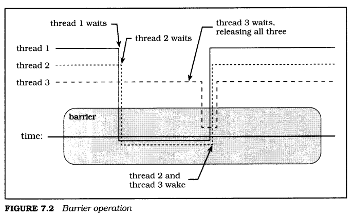
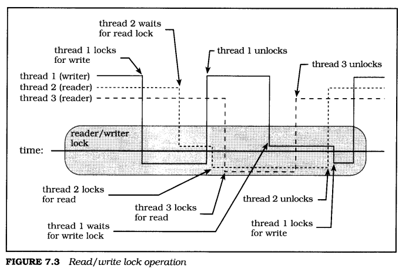

# 7 "Real code"
Lewis Carroll, Through the Looking-Glass:
> "When we were still little," the Mock Turtle went on at last, more calmly,  
> though still sobbing a little now and then, "we went to school in the sea.  
> The master was an old Turtle-we used to call him Tortoise-"  
> "Why did you call him Tortoise, if he wasn't one?" Alice asked.  
> "We called him Tortoise because he taught us," said the  
> Mock Turtle angrily.  

This section builds on most of the earlier sections of the book, but principally on the mutex and condition variable sections. You should already understand how to create both types of synchronization objects and how they work. I will demonstrate the design and construction of barrier and read/ write lock synchronization mechanisms that are built from mutexes, condition variables, and a dash of data. Both barriers and read/write locks are in common use. and have been proposed for standardization in the near future. I will follow up with a work queue server that lets you parcel out tasks to a pool of threads.

The purpose of all this is to teach you more about the subtleties of using these new threaded programming tools (that is, mutexes, condition variables and threads). The library packages may be useful to you as is or as templates. Primarily, though, they are here to give me something to talk about in this section, and have omitted some complication that may be valuable in real code. The error detection and recovery code, for example, is fairly primitive.

## 7.1 Extended synchronization
Mutexes and condition variables are flexible and efficient synchronization tools. You can build just about any form of synchronization you need using those two things. But you shouldn't build them from scratch every time you need them. It is nice to start with a general, modular implementation that doesn't need to be debugged every time. This section shows some common and useful tools that you won't have to redesign every time you write an application that needs them.

First we'll build a barrier. The function of a barrier is about what you might guess-it stops threads. A barrier is initialized to stop a certain number of threads-when the required number of threads have reached the barrier, all are allowed to continue.

Then we'll build something called a read/write lock. A read/write lock allows multiple threads to read data simultaneously, but prevents any thread from modifying data that is being read or modified by another thread.

### 7.1.1 Barriers
A barrier is a way to keep the members of a group together. If our intrepid "bailing programmers" washed up on a deserted island, for example, and they ventured into the jungle to explore, they would want to remain together, for the illusion of safety in numbers, if for no other reason (Figure 7.1). Any exploring programmer finding himself very far in front of the others would therefore wait for them before continuing.

A barrier is usually employed to ensure that all threads cooperating in some parallel algorithm reach a specific point in that algorithm before any can pass. This is especially common in code that has been decomposed automatically by creating fine-grained parallelism within compiled source code. All threads may execute the same code, with threads processing separate portions of a shared data set (such as an array) in some areas and processing private data in parallel in other areas. Still other areas must be executed by only one thread, such as setup or cleanup for the parallel regions. The boundaries between these areas are often implemented using barriers. Thus, threads completing a matrix computation may wait at a barrier until all have finished. One may then perform setup for the next parallel segment while the others skip ahead to another barrier. When the setup thread reaches that barrier, all threads begin the next parallel region.

<center></center>

Figure 7.2 shows the operation of a barrier being used to synchronize three threads, called thread 1, thread 2, and thread 3. The figure is a sort of timing diagram, with time increasing from left to right. Each of the lines beginning at the labels in the upper left designates the behavior of a specific thread-solid for thread 1, dotted for thread 2, and dashed for thread 3. When the lines drop within the rounded rectangle, they are interacting with the barrier. If the line drops below the center line, it shows that the thread is blocked waiting for other threads to reach the barrier. The line that stops above the center line represents the final thread to reach the barrier, awakening all waiters.

In this example, thread 1 and then thread 2 wait on the barrier. At a later time, thread 3 waits on the barrier, finds that the barrier is now full, and awakens all the waiters. All three threads then return from the barrier wait.

The core of a barrier is a counter. The counter is initialized to the number of threads in the "tour group," the number of threads that must wait on a barrier before all the waiters return. I'll call that the "threshold," to give it a simple one-word name. When each thread reaches the barrier, it decreases the counter. If the value hasn't reached 0, it waits. If the value has reached 0, it wakes up the waiting threads.

<center></center>

Because the counter will be modified by multiple threads, it has to be protected by a mutex. Because threads will be waiting for some event (a counter value of 0), the barrier needs to have a condition variable and a predicate expression. When the counter reaches 0 and the barrier drops open, we need to reset the counter, which means the barrier must store the original threshold.

The obvious predicate is to simply wait for the counter to reach 0, but that complicates the process of resetting the barrier. When can we reset the count to the original value? We can't reset it when the counter reaches 0, because at that point most of the threads are waiting on the condition variable. The counter must be 0 when they wake up, or they'll continue waiting. Remember that condition variable waits occur in loops that retest the predicate.

The best solution is to add a separate variable for the predicate. We will use a "cycle" variable that is logically inverted each time some thread determines that one cycle of the barrier is complete. That is, whenever the counter value is reset, before broadcasting the condition variable, the thread inverts the cycle flag. Threads wait in a loop as long as the cycle flag remains the same as the value seen on entry, which means that each thread must save the initial value.

The header file barrier.h and the C source file barrier.c demonstrate an implementation of barriers using standard Pthreads mutexes and condition variables. This is a portable implementation that is relatively easy to understand. One could, of course, create a much more efficient implementation for any specific system based on knowledge of nonportable hardware and operating system characteristics.

Part 1 shows the structure of a barrier, represented by the type **barrier\_t**. You can see the mutex (mutex) and the condition variable (cv). The threshhold member is the number of threads in the group, whereas counter is the number of threads that have yet to join the group at the barrier. And cycle is the flag discussed in the previous paragraph. It is used to ensure that a thread awakened from a barrier wait will immediately return to the caller, but will block in the barrier if it calls the wait operation again before all threads have resumed execution.

```c
/* barrier.h part 1 barrier_t */
#include <pthread.h>
/*
* Structure describing a barrier.
*/
typedef struct barrier tag {
    pthread_mutex_t     mutex;         /* Control access to barrier */
    pthread_cond_t      cv;            /* wait for barrier */
    int                 valid;         /* set when valid */
    int                 threshold;     /* number of threads required */
    int                 counter;       /* current number of threads */
    int                 cycle;         /* alternate cycles (0 or 1) */
} barrier_t;

#define BARRIER_VALID Oxdbcafe
```

The **barrier\_valid** macro defines a "magic number," which we store into the valid member and then check to determine whether an address passed to other barrier interfaces is "reasonably likely to be" a barrier. This is an easy, quick check that will catch the most common errors(see **Hint** below).

> **Hint:**  
> I always like to define magic numbers using hexadecimal constants that can be pronounced as English words. For barriers, I invented my own restaurant called the "DB cafe," or, in C syntax, Oxdbcaf e. Many interesting (or at least mildly amusing) English words can be spelled using only the letters a through/ There are even more possibilities if you allow the digit 1 to stand in for the letter 1. and the digit 0 to stand in for the letter o. (Whether you like the results will depend a lot on the typeface in which you commonly read your code.)

Part 2 shows definitions and prototypes that allow you to do something with the **barrier\_t** structure. First, you will want to initialize a new barrier.

You can initialize a static barrier at compile time by using the macro **BARRIER\_INITIALIZER**. You can instead dynamically initialize a barrier by calling the function **barrier\_init**.

Once you have initialized a barrier, you will want to be able to use it. and the main thing to be done with a barrier is to wait on it. When we're done with a barrier, it would be nice to be able to destroy the barrier and reclaim the resources it used. We'll call these operations **barrier\_init**, **barrier\_wait**, and **barrier\_destroy**. All the operations need to specify upon which barrier they will operate. Because barriers are synchronization objects, and contain both a mutex and a condition variable (neither of which can be copied), we always pass a pointer to a barrier. Only the initialization operation requires a second parameter, the number of waiters required before the barrier opens.

To be consistent with Pthreads conventions, the functions all return an integer value, representing an error number defined in \<errno.h\>. The value 0 represents success.

```c
/*  barrier.h part 2 interfaces  */
/*
 * Support static initialization of barriers.
 */
#define BARRIER_INITIALIZER(cnt) \
    {PTHREAD_MUTEX_INITIALIZER, PTHREAD_COND_INITIALIZER, \
    BARRIER_VALID, cnt, cnt, 0}
/*
 * Define barrier functions
 */
extern int barrier_init (barrier_t *barrier, int count);
extern int barrier_destroy (barrier_t *barrier);
extern int barrier_wait (barrier_t *barrier);
```

Now that you know the interface definition, you could write a program using barriers. But then, the point of this section is not to tell you how to use barriers, but to help improve your understanding of threaded programming by showing how to build a barrier. The following examples show the functions provided by barrier. c, to implement the interfaces we've just seen in barrier. h.

Part 1 shows **barrier\_init**, which you would call to dynamically initialize a barrier, for example, if you allocate a barrier with malloc.

Both the counter and threshold are set to the same value. The counter is the "working counter" and will be reset to threshold for each barrier cycle.

If mutex initialization fails, **barrier\_init** returns the failing status to the caller.

If condition variable (cv) initialization fails, **barrier\_init** destroys the mutex it had already created and returns the failure status-the status of **pthread\_mutex\_destroy** is ignored because the failure to create the condition variable is more important than the failure to destroy the mutex.

The barrier is marked valid only after all initialization is complete. This does not completely guarantee that another thread erroneously trying to wait on that barrier will detect the invalid barrier rather than failing in some less easily diagnosable manner, but at least it is a token attempt.

```c
/*  barrier.c part 1 barrier_init  */
#include <pthread.h>
#include "errors.h"
#include "barrier.h"

/*
 * Initialize a barrier for use.
 */
int barrier_init (barrier_t *barrier, int count)
{
    int status;

    barrier->threshold = barrier->counter = count;
    barrier->cycle = 0;
    status = pthread_mutex_init (&barrier->mutex, NULL);
    if (status != 0)
        return status;
    status = pthread cond init (&barrier->cv, NULL);
    if (status != 0) {
        pthread_mutex_destroy (&barrier->mutex);
        return status;
    }
    barrier->valid = BARRIER_VALID;
    return 0 ;
}
```

Part 2 shows the **barrier\_destroy** function, which destroys the mutex and condition variable (cv) in the **barrier\_t** structure. If we had allocated any additional resources for the barrier, we would need to release those resources also.

First check that the barrier appears to be valid, and initialized, by looking at the valid member. We don't lock the mutex first, because that will fail, possibly with something nasty like a segmentation fault, if the mutex has been destroyed or hasn't been initialized. Because we do not lock the mutex first, the validation check is not entirely reliable, but it is better than nothing, and will only fail to detect some race conditions where one thread attempts to destroy a barrier while another is initializing it, or where two threads attempt to destroy a barrier at nearly the same time.

If any thread is currently waiting on the barrier, return ebusy.

At this point, the barrier is "destroyed"-all that's left is cleanup. To minimize the chances of confusing errors should another thread try to wait on the barrier before we're done, mark the barrier "not valid" by clearing valid, before changing any other state. Then, unlock the mutex, since we cannot destroy it while it is locked.

Destroy the mutex and condition variable. If the mutex destruction fads return the status; otherwise, return the status of the condition variable destruction. Or, to put it another way, return an error status if either destruction failed otherwise, return success.

```c
/*  barrier.c part 2 barrier_destrcy  */
/*
 * Destroy a barrier when done using it.
 */
int barrier_destroy (barrier_t *barrier)
{
    int status, status2;

    if (barrier->valid != BARRIER_VALID)
        return EINVAL;

    status = pthread_mutex_lock (&barrier->mutex);
    if (status != 0)
        return status;

    /*
     * Check whether any threads are known to be waiting; report
     * "BUSY" if so.
     */
    if (barrier->counter != barrier->threshold) {
        pthread_mutex_unlock (&barrier->mutex);
        return EBUSY;
    }

    barrier->valid = 0;
    status = pthread_mutex_unlock (&barrier->mutex);
    if (status != 0)
        return status;

    /*
     * If unable to destroy either 1003.1c synchronization
     * object, return the error status.
     */
    status = pthread_mutex_destroy (&barrier->mutex);
    status2 = pthread_cond_destroy (&barrier->cv);
    return (status == 0 ? status : status2);
}
```

Finally, part 3 shows the implementation of **barrier\_wait**.

First we verify that the argument barrier appears to be a valid **barrier\_t**. We perform this check before locking the mutex, so that **barrier\_destroy** can safely destroy the mutex once it has cleared the valid member. This is a simple attempt to minimize the damage if one thread attempts to wait on a barrier while another thread is simultaneously either initializing or destroying that barrier.

We cannot entirely avoid problems, since without the mutex, **barrier\_wait** has no guarantee that it will see the correct (up-to-date) value of valid. The valid check may succeed when the barrier is being made invalid, or fail when the barrier is being made valid. Locking the mutex first would do no good, because the mutex may not exist if the barrier is not fully initialized, or if it is being destroyed. This isn't a problem as long as you use the barrier correctly-that is, you initialize the barrier before any thread can possibly try to use it, and do not destroy the barrier until you are sure no thread will try to use it again.

Copy the current value of the barrier's cycle into a local variable. The comparison of our local cycle against the **barrier\_t** structure's cycle member becomes our condition wait predicate. The predicate ensures that all currently waiting threads will return from **barrier\_wait** when the last waiter broadcasts the condition variable, but that any thread that calls **barrier\_wait** again will wait for the next broadcast. (This is the "tricky part" of correctly implementing a barrier.)

Now we decrease counter, which is the number of threads that are required but haven't yet waited on the barrier. When counter reaches 0, no more threads are needed-they're all here and waiting anxiously to continue to the next attraction. Now all we need to do is tell them to wake up. We advance to the next cycle, reset the counter, and broadcast the barrier's condition variable.

Earlier, I mentioned that a program often needs one thread to perform some cleanup or setup between parallel regions. Each thread could lock a mutex and check a flag so that only one thread would perform the setup. However, the setup may not need additional synchronization, for example, because the other threads will wait at a barrier for the next parallel region, and, in that case, it would be nice to avoid locking an extra mutex.

The **barrier\_wait** function has this capability built into it. One and only one thread will return with the special value of -1 while the others return 0. In this particular implementation, the one that waits last and wakes the others will take the honor, but in principle it is "unspecified" which thread returns -1. The thread that receives -1 can perform the setup, while others race ahead. If you do not need the special return status, treat -1 as another form of success. The proposed POSIX. lj standard has a similar capability-one (unspecified) thread completing a barrier will return the status **barrier\_serial\_thread**.

Any threaded code that uses condition variables should always either support deferred cancellation or disable cancellation. Remember that there are two distinct types of cancellation: deferred and asynchronous. Code that deals with asynchronous cancellation is rare. In general it is difficult or impossible to support asynchronous cancellation in any code that acquires resources (including locking a mutex). Programmers can't assume any function supports asynchronous cancellation unless its documentation specifically says so. Therefore we do not need to worry about asynchronous cancellation.

We could code **barrier\_wait** to deal with deferred cancellation, but that raises difficult questions. How, for example, will the barrier wait ever be satisfied if one of the threads has been canceled? And if it won't be satisfied, what happens to all the other threads that have already waited (or are about to wait) on that barrier? There are various ways to answer these questions. One would be for **barrier\_wait** to record the thread identifiers of all threads waiting on the barrier, and for any thread that's canceled within the wait to cancel all other waiters.

Or we might handle cancellation by setting some special error flag and broadcasting the condition variable, and modifying **barrier\_wait** to return a special error when awakened in that way. However, it makes little sense to cancel one thread that's using a barrier. We're going to disallow it, by disabling cancellation prior to the wait, and restoring the previous state of cancellation afterward. This is the same approach taken by the proposed POSIX. lj standard, by the way-barrier waits are not cancellation points.

If there are more threads that haven't reached the barrier, we need to wait for them. We do that by waiting on the condition variable until the barrier has advanced to the next cycle-that is, the barrier's cycle no longer matches the local copy.

```c
/*  barrier.c part 3 barrier_wait  */
/*
 * Wait for all members of a barrier to reach the barrier. When
 * the count (of remaining members) reaches 0, broadcast to wake
 * all threads waiting.
 */
int barrier_wait (barrier_t *barrier)
{
    int status, cancel, tmp, cycle;

    if (barrier->valid != BARRIER_VALID)
        return EINVAL;

    status = pthread_mutex_lock (&barrier->mutex);
    if (status != 0)
        return status;

    cycle = barrier->cycle; /* Remember which cycle we're on */

    if (--barrier->counter == 0) {
        barrier->cycle = !barrier->cycle;
        barrier->counter = barrier->threshold;
        status = pthread_cond_broadcast (&barrier->cv);
        /*
         * The last thread into the barrier will return status
         * -1 rather than 0, so that it can be used to perform
         * some special serial code following the barrier.
         */
        if (status == 0)
            status = -1;
    } else {
        /*
         * Wait with cancellation disabled, because barrier_wait
         * should not be a cancellation point.
         */
        pthread_setcancelstate (PTHREAD_CANCEL_DISABLE, &cancel);

        /*
         * Wait until the barrier's cycle changes, which means
         * that it has been broadcast, and we don't want to wait
         * anymore.
         */
        while (cycle == barrier->cycle) {
            status = pthread_cond_wait (
                &barrier->cv, &barrier->mutex);
            if (status != 0) break;
        }

        pthread_setcancelstate (cancel, &tmp);
    }
    /*
     * Ignore an error in unlocking. It shouldn't happen, and
     * reporting it here would be misleading - the barrier wait
     * completed, after all, whereas returning, for example,
     * EINVAL would imply the wait had failed. The next attempt
     * to use the barrier *will* return an error, or hang, due
     * to whatever happened to the mutex.
     */
    pthread_mutex_unlock (&barrier->mutex);
    return status; /* error, -1 for waker, or 0 */
}
```

Finally, **barrier\_main.c** is a simple program that uses barriers. Each thread loops on calculations within a private array.

At the beginning and end of each iteration, the threads, running function **thread\_routine**, all wait on a barrier to synchronize the operation.

At the end of each iteration, the "lead thread" (the one receiving a -1 result from **barrier\_wait**) will modify the data of all threads, preparing them for the next iteration. The others go directly to the top of the loop and wait on the barrier at line 35.

```c
/*  barrier_main.c  */
#include <pthread.h>
#include "barrier.h"
#include "errors.h"

#define THREADS     5
#define ARRAY       6
#define INLOOPS     1000
#define OUTLOOPS    10

/*
 * Keep track of each thread.
 */
typedef struct thread_tag {
    pthread_t thread_id;
    int number;
    int increment;
    int array[ARRAY];
} thread_t;

barrier_t barrier;
thread_t thread[THREADS];

/*
 * Start routine for threads.
 */
void *thread_routine (void *arg)
{
    thread_t *self = (thread_t*)arg; /* Thread's thread_t */
    int in_loop, out_loop, count, status;

    /*
     * Loop through OUTLOOPS barrier cycles.
     */
    for (out_loop = 0; out_loop < OUTLOOPS; out_loop++) {
        status = barrier_wait (&barrier);
        if (status > 0)
            err_abort (status, "Wait on barrier");

        /*
         * This inner loop just adds a value to each element in
         * the working array.
         */
        for (in_loop = 0; in_loop < INLOOPS; in_loop++)
            for (count = 0; count < ARRAY; count++)
                self->array[count] += self->increment;

        status = barrier_wait (&barrier);
        if (status > 0)
            err_abort (status, "Wait on barrier");

        /*
         * The barrier causes one thread to return with the
         * special return status -1. The thread receiving this
         * value increments each element in the shared array.
         */
        if (status == -1) {
            int thread_num;

            for (thread_num = 0; thread_num < THREADS; thread_num++)
                thread[thread_num].increment += 1;
        }
    }
    return NULL;
}

int main (int arg, char *argv[])
{
    int thread_count, array_count;
    int status;

    barrier_init (&barrier, THREADS);

    /*
     * Create a set of threads that will use the barrier.
     */
    for (thread_count = 0; thread_count < THREADS; thread_count++) {
        thread[thread_count].increment = thread_count;
        thread[thread_count].number = thread_count;

        for (array_count = 0; array_count < ARRAY; array_count++)
            thread[thread_count].array[array_count] = array_count + 1;

        status = pthread_create (&thread[thread_count].thread_id,
                NULL, thread_routine, (void*)&thread[thread_count]);
        if (status != 0)
            err_abort (status, "Create thread");
    }

    /*
     * Now join with each of the threads.
     */
    for (thread_count = 0; thread_count < THREADS; thread_count++) {
        status = pthread_join (thread[thread_count].thread_id, NULL);
        if (status != 0)
            err_abort (status, "Join thread");

        printf ("%02d: (%d) ",
            thread_count, thread[thread_count].increment);

        for (array_count = 0; array_count < ARRAY; array_count++)
            printf ("%010u ",
                thread[thread_count].array[array_count]);
        printf ("\n");
    }

    /*
     * To be thorough, destroy the barrier.
     */
    barrier_destroy (&barrier);
    return 0;
}
```
### 7.1.2 Read/write locks
A read/write lock is a lot like a mutex. It is another way to prevent more than one thread from modifying shared data at the same time. But unlike a mutex it distinguishes between reading data and writing data. A mutex excludes all other threads, while a read/write lock allows more than one thread to read the data, as long as none of them needs to change it.

Read/write locks are used to protect information that you need to read frequently but usually don't need to modify. For example, when you build a cache of recently accessed information, many threads may simultaneously examine the cache without conflict. When a thread needs to update the cache, it must have exclusive access.

When a thread locks a read/write lock, it chooses shared read access or exclusive write access. A thread that wants read access can't continue while any thread currently has write access. A thread trying to gain write access can't continue when another thread currently has either write access or read access.

When both readers and writers are waiting for access at the same time, the readers are given precedence when the write lock is released. Read precedence favors concurrency because it potentially allows many threads to accomplish work simultaneously. Write precedence on the other hand would ensure that pending modifications to the shared data are completed before the data is used. There's no absolute right or wrong policy, and if you don't find the implementation here appropriate for you, it is easy to change.

<center></center>

Figure 7.3 shows the operation of a read/write lock being used to synchronize three threads, called thread 1, thread 2, and thread 3. The figure is a sort of timing diagram, with time increasing from left to right. Each of the lines beginning at the labels in the upper left designates the behavior of a specific thread-solid for thread 1, dotted for thread 2, and dashed for thread 3. When the lines drop within the rounded rectangle, they are interacting with the read/write lock. If the line drops below the center line, it shows that the thread has the read/write lock locked, either for exclusive write or for shared read. Lines that hover above the center line represent threads waiting for the lock.

In this example, thread 1 locks the read/write lock for exclusive write. Thread 2 tries to lock the read/write lock for shared read and, finding it already locked for exclusive write, blocks. When thread 1 releases the lock, it awakens thread 2, which then succeeds in locking the read/write lock for shared read. Thread 3 then tries to lock the read/write lock for shared read and, because the read/write lock is already locked for shared read, it succeeds immediately. Thread 1 then tries to lock the read/write lock again for exclusive write access, and blocks because the read/write lock is already locked for read access. When thread 3 unlocks the read/write lock, it cannot awaken thread 1, because there is another reader. Only when thread 2 also unlocks the read/write lock, and the lock becomes unlocked, can thread 1 be awakened to lock the read/write lock for exclusive write access.

The header file rwlock. h and the C source file rwlock. c demonstrate an implementation of read/write locks using standard Pthreads mutexes and condition variables. This is a portable implementation that is relatively easy to understand. One could, of course, create a much more efficient implementation for any specific system based on knowledge of nonportable hardware and operating system characteristics.

The rest of this section shows the details of a read/write lock package. First, rwlock. h describes the interfaces, and then rwlock. c provides the implementation. Part 1 shows the structure of a read/write lock, represented by the type **rwlock\_t**.

Of course, there's a mutex to serialize access to the structure. We'll use two separate condition variables, one to wait for read access (called read) and one to wait for write access (called, surprisingly, write).

The **rwlock\_t** structure has a valid member to easily detect common usage errors, such as trying to lock a read/write lock that hasn't been initialized. The member is set to a magic number when the read/write lock is initialized, just as in **barrier\_init**.

To enable us to determine whether either condition variable has waiters, we'll keep a count of active readers (**r\_active**) and a flag to indicate an active writer (**w\_active**).

We also keep a count of the number of threads waiting for read access (**r\_wait**) and for write access (wwait).

Finally, we need a "magic number" for our valid member. (See the footnote in Section 7.1.1 if you missed this part of the barrier example.)

```c
/*  rwlock.h part 1 rwlock_t  */
#include <pthread.h>

/*
 * Structure describing a read/write lock.
 */
typedef struct rwlock_tag {
    pthread_mutex_t    mutex;
    pthread_cond_t     read;         /* wait for read */
    pthread_cond_t     write;        /* wait for write */
    int                valid;        /* set when valid */
    int                r_active;     /* readers active */
    int                w_active;     /* writer active */
    int                r_wait;       /* readers waiting */
    int                w_wait;       /* writers waiting */
} rwlock_t;

#define RWLOCK_VALID    0xfacade
```

We could have saved some space and simplified the code by using a single condition variable, with readers and writers waiting using separate predicate expressions. We will use one condition variable for each predicate, because it is more efficient. This is a common trade-off. The main consideration is that when two predicates share a condition variable, you must always wake them using **pthread\_cond\_broadcast**, which would mean waking all waiters each time the read/write lock is unlocked.

We keep track of a boolean variable for "writer active," since there can only be one. There are also counters for "readers active," "readers waiting," and "writers waiting." We could get by without counters for readers and writers waiting. All readers are awakened simultaneously using a broadcast, so it doesn't matter how many there are. Writers are awakened only if there are no readers, so we could dispense with keeping track of whether there are any threads waiting to write (at the cost of an occasional wasted condition variable signal when there are no waiters).

We count the number of threads waiting for read access because the condition variable waits might be canceled. Without cancellation, we could use a simple flag-"threads are waiting for read" or "no threads are waiting for read." Each thread could set it before waiting, and we could clear it before broadcasting to wake all waiting readers. However, because we can't count the threads waiting on a condition variable, we wouldn't know whether to clear that flag when a waiting reader was canceled. This information is critical, because if there are no readers waiting when the read/write lock is unlocked, we must wake a writer-but we cannot wake a writer if there are waiting readers. A count of waiting readers,

which we can decrease when a waiter is canceled, solves the problem. The consequences of "getting it wrong" are less important for writers than for readers. Because we check for readers first, we don't really need to know whether there are writers. We could signal a "potential writer" anytime the read/write lock was released with no waiting readers. But counting waiting writers allows us to avoid a condition variable signal when no threads are waiting.

Part 2 shows the rest of the definitions and the function prototypes.

The **RWLOCK\_INITIALIZER** macro allows you to statically initialize a read/write lock.

Of course, you must also be able to initialize a read/write lock that you cannot allocate statically, so we provide **rwl\_init** to initialize dynamically, and **rwl\_destroy** to destroy a read/write lock once you're done with it. In addition, there are functions to lock and unlock the read/write lock for either read or write access. You can "try to lock" a read/write lock, either for read or write access, by calling **rwl\_readtrylock** or **rwl\_writetrylock**., just as you can try to lock a mutex by calling **pthread\_mutex\_trylock**.

```c
/*  rwlock.h part 2 interfaces  */
/*
 * Support static initialization of barriers.
 */
#define RWL_INITIALIZER \
    {PTHREAD_MUTEX_INITIALIZER, PTHREAD_COND_INITIALIZER, \
    PTHREAD_COND_INITIALIZER, RWLOCK_VALID, 0, 0, 0, 0}

/*
 * Define read/write lock functions.
 */
extern int rwl_init (rwlock_t *rwlock);
extern int rwl_destroy (rwlock_t *rwlock);
extern int rwl_readlock (rwlock_t *rwlock);
extern int rwl_readtrylock (rwlock_t *rwlock);
extern int rwl_readunlock (rwlock_t Twlock);
extern int rwl_writelock (rwlock_t *rwlock);
extern int rwl_writetrylock (rwlock_t *rwlock);
extern int rwl_writeunlock (rwlock_t *rwlock);
```
The file rwlock. c contains the implementation of read/write locks. The following examples break down each of the functions used to implement the rwlock.h interfaces.

Part 1 shows **rwl\_init**, which initializes a read/write lock. It initializes the Pthreads synchronization objects, initializes the counters and flags, and finally sets the valid sentinel to make the read/write lock recognizable to the other interfaces. If we are unable to initialize the read condition variable, we destroy the mutex that we'd already created. Similarly, if we are unable to initialize the write condition variable, we destroy both the mutex and the read condition variable.

```c
/*  rwlock.c part 1 rwl_init  */
#include <pthread.h>
#include "errors.h"
#include "rwlock.h"

/*
 * Initialize a read/write lock.
 */
int rwl_init (rwlock_t *rwl)
{
    int status;

    rwl->r_active = 0;
    rwl->r_wait = rwl->w_wait = 0;
    rwl->w_active = 0;
    status = pthread_mutex_init (&rwl->mutex, NULL);
    if (status != 0)
        return status;
    status = pthread_cond_init (&rwl->read, NULL);
    if (status != 0) {
        /* if unable to create read CV, destroy mutex */
        pthread_mutex_destroy (&rwl->mutex);
        return status;
    }
    status = pthread_cond_init (&rwl->write, NULL);
    if (status != 0) {
        /* if unable to create write CV, destroy read CV and mutex */
        pthread_cond_destroy (&rwl->read);
        pthread_mutex_destroy (&rwl->mutex);
        return status;
    }
    rwl->valid = RWLOCK_VALID;
    return 0;
}
```

Part 2 shows the **rwl\_destroy** function, which destroys a read/write lock.

We first try to verify that the read/write lock was properly initialized by checking the valid member. This is not a complete protection against incorrect usage, but it is cheap, and it will catch some of the most common errors. See the annotation for barrier.c, part 2, for more about how the valid member is used.

Check whether the read/write lock is in use. We look for threads that are using or waiting for either read or write access. Using two separate if statements makes the test slightly more readable, though there's no other benefit.

As in **barrier\_destroy**, we destroy all Pthreads synchronization objects, and store each status return. If any of the destruction calls fails, returning a nonzero value, **rwl\_destroy** will return that status, and if they all succeed it will return 0 for success.

```c
/*  rwlock.c part 2 rwl_destroy  */
/*
 * Destroy a read/write lock.
 */
int rwl_destroy (rwlock_t *rwl)
{
    int status, status1, status2;

    if (rwl->valid != RWLOCK_VALID)
        return EINVAL;
    status = pthread_mutex_lock (&rwl->mutex);
    if (status != 0)
        return status;

    /*
     * Check whether any threads own the lock; report "BUSY" if
     * so.
     */
    if (rwl->r_active > 0 || rwl->w_active) {
        pthread_mutex_unlock (&rwl->mutex);
        return EBUSY;
    }

    /*
     * Check whether any threads are known to be waiting; report
     * EBUSY if so.
     */
    if (rwl->r_wait != 0 || rwl->w_wait != 0) {
        pthread_mutex_unlock (&rwl->mutex);
        return EBUSY;
    }

    rwl->valid = 0;
    status = pthread_mutex_unlock (&rwl->mutex);
    if (status != 0)
        return status;
    status = pthread_mutex_destroy (&rwl->mutex);
    status1 = pthread_cond_destroy (&rwl->read);
    status2 = pthread_cond_destroy (&rwl->write);
    return (status == 0 ? status
        : (status1 == 0 ? status1 : status2));
}
```

Part 3 shows the code for **rwl\_readcleanup** and **rwl\_writecleanup**, two cancellation cleanup handlers used in locking the read/write lock for read and write access, respectively. As you may infer from this, read/write locks, unlike barriers, are cancellation points. When a wait is canceled, the waiter needs to decrease the count of threads waiting for either a read or write lock, as appropriate, and unlock the mutex.

```c
/*  rwlock.c part 3 cleanuphandlers  */
/*
 * Handle cleanup when the read lock condition variable
 * wait is canceled.
 *
 * Simply record that the thread is no longer waiting,
 * and unlock the mutex.
 */
static void rwl_readcleanup (void *arg)
{
    rwlock_t *rwl = (rwlock_t *)arg;

    rwl->r_wait--;
    pthread_mutex_unlock (&rwl->mutex);
}

/*
 * Handle cleanup when the write lock condition variable
 * wait is canceled.
 *
 * Simply record that the thread is no longer waiting,
 * and unlock the mutex.
 */
static void rwl_writecleanup (void *arg)
{
    rwlock_t *rwl = (rwlock_t *)arg;

    rwl->w_wait--;
    pthread_mutex_unlock (&rwl->mutex);
}
```

Part 4 shows **rwl\_readlock**, which locks a read/write lock for read access. If a writer is currently active (**w\_active** is nonzero), we wait for it to broadcast the read condition variable. The **r\_wait** member counts the number of threads waiting to read. This could be a simple boolean variable, except for one problem-when a waiter is canceled, we need to know whether there are any remaining waiters. Maintaining a count makes this easy, since the cleanup handler only needs to decrease the count.

This is one of the places where the code must be changed to convert our read/ write lock from "reader preference" to "writer preference," should you choose to do that. To implement writer preference, a reader must block while there are waiting writers (**w\_wait** \> 0), not merely while there are active writers, as we do here.

Notice the use of the cleanup handler around the condition wait. Also, notice that we pass the argument 0 to **pthread\_cleanup\_pop** so that the cleanup code is called only if the wait is canceled. We need to perform slightly different actions when the wait is not canceled. If the wait is not canceled, we need to increase the count of active readers before unlocking the mutex.

```c
/*  rwlock.c part 4 rwl_readlock  */
/*
 * Lock a read/write lock for read access.
 */
int rwl_readlock (rwlock_t *rwl)
{
    int status;

    if (rwl->valid != RWLOCK_VALID)
        return EINVAL;
    status = pthread_mutex_lock (&rwl->mutex);
    if (status != 0)
        return status;
    if (rwl->w_active) {
        rwl->r_wait++;
        pthread_cleanup_push (rwl_readcleanup, (void*)rwl);
        while (rwl->w_active) {
            status = pthread_cond_wait (&rwl->read, &rwl->mutex);
            if (status != 0)
                break;
        }
        pthread_cleanup_pop (0);
        rwl->r_wait--;
    }
    if (status == 0)
        rwl->r_active++;
    pthread_mutex_unlock (&rwl->mutex);
    return status;
}
```

Part 5 shows **rwl\_readtrylock**. This function is nearly identical to **rwl\_readlock**, except that, instead of waiting for access if a writer is active, it returns ebusy. It doesn't need a cleanup handler, and has no need to increase the count of waiting readers.

This function must also be modified to implement "writer preference" read/ write locks, by returning EBUSY when a writer is waiting, not just when a writer is active.

```c
/*  rwlock.c part 5 rwl_readtrylock  */
/*
 * Attempt to lock a read/write lock for read access (don't
 * block if unavailable).
 */
int rwl_readtrylock (rwlock_t *rwl)
{
    int status, status2;

    if (rwl->valid != RWLOCK_VALID)
        return EINVAL;
    status = pthread_mutex_lock (&rwl->mutex);
    if (status != 0)
        return status;
    if (rwl->w_active)
        status = EBUSY;
    else
        rwl->r_active++;
    status2 = pthread_mutex_unlock (&rwl->mutex);
    return (status2 != 0 ? status2 : status);
}
```
Part 6 shows rwlreadunlock. This function essentially reverses the effect of **rwl\_readlock** or **rwl\_tryreadlock**, by decreasing the count of active readers (**r\_active**).

If there are no more active readers, and at least one thread is waiting for write access, signal the write condition variable to unblock one. Note that there is a race here, and whether you should be concerned about it depends on your notion of what should happen. If another thread that is interested in read access calls **rwl\_readlock** or **rwl\_tryreadlock** before the awakened writer can run, the reader may "win," despite the fact that we just selected a writer.

Because our version of read/write locks has "reader preference," this is what we usually want to happen-the writer will determine that it has failed and will resume waiting. (It received a spurious wakeup.) If the implementation changes to prefer writers, the spurious wakeup will not occur, because the potential reader would have to block. The waiter we just unblocked cannot decrease **w\_wait** until it actually claims the lock.

```c
/*  rwlock.c part 6 rwl_readunlock  */
/*
 * Unlock a read/write lock from read access.
 */
int rwl_readunlock (rwlock_t *rwl)
{
    int status, status2;
    if (rwl->valid != RWLOCK_VALID)
        return EINVAL;
    status = pthread_mutex_lock (&rwl->mutex);
    if (status != 0)
        return status;
    rwl->r_active--;
    if (rwl->r_active == 0 && rwl->w_wait > 0)
        status = pthread_cond_signal (&rwl->write);
    status2 = pthread_mutex_unlock (&rwl->mutex);
    return (status2 == 0 ? status : status2);
}
```

Part 7 shows **rwl\_writelock**. This function is much like **rwl\_readlock**, except for the predicate condition on the condition variable wait. In part 1, I explained that, to convert from "preferred read" to "preferred write," a potential reader would have to wait until there were no active or waiting writers, whereas currently it waits only for active writers. The predicate in rwlwritelock is the converse of that condition. Because we support "preferred read," in theory, we must wait here if there are any active or waiting readers. In fact, it is a bit simpler, because if there are any active readers, there cannot be any waiting readers-the whole point of a read/write lock is that multiple threads can have read access at the same time. On the other hand, we do have to wait if there are any active writers, because we allow only one writer at a time.

Unlike ractive, which is a counter, wactive is treated as a boolean. Or is it a counter? There's really no semantic difference, since the value of 1 can be considered a boolean true or a count of 1-there can be only one active writer at any time.

```c
/*  rwlock.c part 7 rwl_writelock  */
/*
 * Lock a read/write lock for write access.
 */
int rwl_writelock (rwlock_t *rwl)
{
    int status;

    if (rwl->valid != RWLOCK_VALID)
        return EINVAL;
    status = pthread_mutex_lock (&rwl->mutex);
    if (status != 0)
        return status;
    if (rwl->w_active || rwl->r_active > 0) {
        rwl->w_wait++;
        pthread_cleanup_push (rwl_writecleanup, (void*)rwl);
        while (rwl->w_active || rwl->r_active > 0) {
            status = pthread_cond_wait (&rwl->write, &rwl->mutex);
            if (status != 0)
                break;
        }
        pthread_cleanup_pop (0);
        rwl->w_wait-;
    }
    if (status == 0)
        rwl->w_active = 1;
    pthread_mutex_unlock (&rwl->mutex);
    return status;
}
```

Part 8 shows **rwl\_writetrylock**. This function is much like **rwl\_writelock**, except that it returns ebusy if the read/write lock is currently in use (either by a reader or by a writer) rather than waiting for it to become free.

```c
/*  rwlock.c part 8 rwl_writetrylock  */
/*
 * Attempt to lock a read/write lock for write access. Don't
 * block if unavailable.
 */
int rwl_writetrylock (rwlock_t *rwl)
{
    int status, status2;

    if (rwl->valid != RWLOCK_VALID)
        return EINVAL;
    status = pthread_mutex_lock (&rwl->mutex);
    if (status != 0)
        return status;
    if (rwl->w_active || rwl->r_active > 0)
        status = EBUSY;
    else
        rwl->w_active = 1;
    status2 = pthread_mutex_unlock (&rwl->mutex);
    return (status != 0 ? status : status2);
}
```

Finally, part 9 shows **rwl\_writeunlock**. This function is called by a thread with a write lock, to release the lock.

When a writer releases the read/write lock, it is always free; if there are any threads waiting for access, we must wake one. Because we implement "preferred read" access, we first look for threads that are waiting for read access. If there are any, we broadcast the read condition variable to wake them all.

If there were no waiting readers, but there are one or more waiting writers, wake one of them by signaling the write condition variable. To implement a "preferred write" lock, you would reverse the two tests, waking a waiting writer, if any, before looking for waiting readers.

```c
/*  rwlock.c part 9 rwl_writeunlock  */
/*
 * Unlock a read/write lock from write access.
 */
int rwl_writeunlock (rwlock_t *rwl)
{
    int status;

    if (rwl->valid != RWLOCK_VALID)
        return EINVAL;
    status = pthread_mutex_lock (&rwl->mutex);
    if (status != 0)
        return status;
    rwl->w_active = 0;
    if (rwl->r_wait > 0) {
        status = pthread_cond_broadcast (&rwl->read);
        if (status != 0) {
            pthread_mutex_unlock (&rwl->mutex);
            return status;
        }
    } else if (rwl->w_wait > 0) {
        status = pthread_cond_signal (&rwl->write);
        if (status != 0) {
            pthread_mutex_unlock (&rwl->mutex);
            return status;
        }
    }
    status = pthread_mutex_unlock (&rwl->mutex);
    return status;
}
```

Now that we have all the pieces, **rwlock\_main.c** shows a program that uses read/write locks.

Each thread is described by a structure of type **thread\_t**. The **thread\_num** member is the thread's index within the array of **thread\_t** structures. The **thread\_id** member is the **pthread\_t** (thread identifier) returned by **pthread\_create** when the thread was created. The updates and reads members are counts of the number of read lock and write lock operations performed by the thread. The interval member is generated randomly as each thread is created, to determine how many iterations the thread will read before it performs a write.

The threads cycle through an array of **data\_t** elements. Each element has a read/write lock, a data element, and a count of how many times some thread has updated the element.

The program creates a set of threads running the **thread\_routine** function. Each thread loops iterations times, practicing use of the read/write lock. It cycles through the array of data elements in sequence, resetting the index (element) to 0 when it reaches the end. At intervals specified by each thread's interval member, the thread will modify the current data element instead of reading it. The thread locks the read/write lock for write access, stores its **thread\_num** as the new data value, and increases the updates counter.

On all other iterations, **thread\_routine** reads the current data element, locking the read/write lock for read access. It compares the data value against its **thread\_num** to determine whether it was the most recent thread to update that data element, and, if so, it increments a counter.

On Solaris systems, increase the thread concurrency level to generate more interesting activity. Without timesllcing of user threads, each thread would tend to execute sequentially otherwise.

```c
/*  rwlock_main.c  */
#include "rwlock.h"
#include "errors.h"

#define THREADS         5
#define DATASIZE        15
#define ITERATIONS      10000

/*
 * Keep statistics for each thread.
 */
typedef struct thread_tag {
    int thread num;
    pthread_t thread_id;
    int updates;
    int reads;
    int interval;
} thread_t;

/*
 * Read/write lock and shared data.
 */
typedef struct data_tag {
    rwlock_t lock;
    int data;
    int updates;
} data_t;

thread_t threads[THREADS];
data_t data[DATASIZE];

/*
 * Thread start routine that uses read/write locks.
 */
void *thread_routine (void *arg)
{
    thread_t *self = (thread_t*)arg;
    int repeats = 0;
    int iteration;
    int element =0;
    int status;

    for (iteration = 0; iteration < ITERATIONS; iteration++) {
        /*
         * Each "self->interval" iterations, perform an
         * update operation (write lock instead of read
         * lock).
         */
        if ((iteration % self->interval) == 0) {
            status = rwl_writelock (&data[element].lock);
            if (status != 0)
                err_abort (status, "Write lock");
            data[element].data = self->thread_num;
            data[element].updates++;
            self->updates++;
            status = rwl_writeunlock (&data[element].lock);
            if (status != 0)
                err_abort (status, "Write unlock");
        } else {
            /*
             * Look at the current data element to see whether
             * the current thread last updated it. Count the
             * times, to report later.
             */
            status = rwl_readlock (&data[element].lock);
            if (status != 0)
                err_abort (status, "Read lock");
            self->reads++;
            if (data[element].data == self->thread_num)
                repeats++;
            status = rwl_readunlock (&data[element].lock);
            if (status != 0)
                err_abort (status, "Read unlock");
        }
        element++;
        if (element >= DATASIZE)
            element = 0;
    }

    if (repeats > 0)
        printf (
            "Thread %d found unchanged elements %d times\n",
            self->thread_num, repeats);
    return NULL;
}

int main (int argc, char *argv[])
{
    int count;
    int data_count;
    int status;
    unsigned int seed = 1;
    int thread_updates = 0;
    int data_updates =0;

#ifdef sun
    /*
     * On Solaris 2.5, threads are not timesliced. To ensure
     * that our threads can run concurrently, we need to
     * increase the concurrency level to THREADS.
     */
    DPRINTF (("Setting concurrency level to %d\n", THREADS));
    thr_setconcurrency (THREADS);
#endif

    /*
     * Initialize the shared data.
     */
    for (data_count = 0; data_count < DATASIZE; data_count++) {
        data[data_count].data = 0;
        data[data_count].updates = 0;
        status = rwl_init (&data[data_count].lock);
        if (status != 0)
            err_abort (status, "Init rw lock");
    }

    /*
     * Create THREADS threads to access shared data.
     */
    for (count = 0; count < THREADS; count++) {
        threads[count].thread_num = count;
        threads[count].updates = 0;
        threads[count].reads = 0;
        threads[count].interval = rand_r (&seed) % 71;
        status = pthread_create (&threads[count].thread_id,
            NULL, thread_routine, (void*)&threads[count]);
        if (status != 0)
            err_abort (status, "Create thread");
    }

    /*
     * Wait for all threads to complete, and collect
     * statistics.
     */
    for (count = 0; count < THREADS; count++) {
        status = pthread_join (threads[count].thread_id, NULL);
        if (status != 0)
            err_abort (status, "Join thread");
        thread_updates += threads[count].updates;
        printf ("%02d: interval %d, updates %d, reads %d\n",
            count, threads[count].interval,
            threads[count].updates, threads[count].reads);
    }

    /*
     * Collect statistics for the data.
     */
    for (data_count = 0; data_count < DATASIZE; data_count++) {
        data_updates += data[data_count].updates;
        printf ("data %02d: value %d, %d updates\n",
            data_count, data[data_count].data,
            data[data_count].updates);
        rwl_destroy (&data[data_count].lock);
    }

    printf ("%d thread updates, %d data updates\n",
            thread_updates, data_updates);
    return 0;
}
```

## 7.2 Work queue manager
I've already briefly outlined the various models of thread cooperation. These include pipelines, work crews, client/servers, and so forth. In this section, I present the development of a "work queue," a set of threads that accepts work requests from a common queue, processing them (potentially) in parallel.

The work queue manager could also be considered a work crew manager, depending on your reference point. If you think of it as a way to feed work to a set of threads, then "work crew" might be more appropriate. I prefer to think of it as a queue that magically does work for you in the background, since the presence of the work crew is almost completely invisible to the caller.

When you create the work queue, you can specify the maximum level of parallelism that you need. The work queue manager interprets that as the maximum number of "engine" threads that it may create to process your requests. Threads will be started and stopped as required by the amount of work. A thread that finds nothing to do will wait a short time and then terminate. The optimal "short time" depends on how expensive it is to create a new thread on your system, the cost in system resources to keep a thread going that's not doing anything, and how likely it is that you'll need the thread again soon. I've chosen two seconds, which is probably much too long.

The header file workq. h and the C source file workq. c demonstrate an implementation of a work queue manager. Part 1 shows the two structure types used by the work queue package. The **workq\_t** type is the external representation of a work queue, and the workqelet is an internal representation of work items that have been queued.

The **workq\_ele\_t** structure is used to maintain a linked list of work items. It has a link element (called next) and a data value, which is stored when the work item is queued and passed to the caller's "engine function" with no interpretation.

Of course, there's a mutex to serialize access to the workqt, and a condition variable (cv) on which the engine threads wait for work to be queued.

The attr member is a thread attributes object, used when creating new engine threads. The attributes object could instead have been a static variable within workq.c, but I chose to add a little memory overhead to each work queue, rather than add the minor complexity of one-time initialization of a static data item.

The first member points to the first item on the work queue. As an optimization to make it easier to queue new items at the end of the queue, the last member points to the last item on the queue.

These members record assorted information about the work queue. The valid member is a magic number that's set when the work queue is initialized, as we've seen before in barriers and read/write locks. (In this case, the magic number is the month and year of my daughter's birthday.) The quit member is a flag that allows the "work queue manager" to tell engine threads to terminate as soon as the queue is empty. The parallelism member records how many threads the creator chose to allow the work queue to utilize, counter records the number of threads created, and idle records the current number of threads that are waiting for work. The engine member is the user's "engine function," supplied when the work queue was created. As you can see, the engine function takes an "untyped" (void *) argument, and has no return value.

```c

/* workq.h part 1 workq_t */
#include <pthread.h>
/*
 * Structure to keep track of work queue requests.
 */
typedef struct workq_ele_tag {
    struct workq_ele_tag    *next;
    void                    *data;
} workq_ele_t;
/*
 * Structure describing a work queue.
 */
typedef struct workq_tag {
    pthread_mutex_t   mutex;          /* control access to queue */
    pthread_cond_t    cv;             /* wait for work */
    pthread_attr_t    attr;           /* create detached threads */
    workq_ele_t       *first, *last;  /* work queue */
    int               valid;          /* valid */
    int               quit;           /* workq should quit */
    int               parallelism;    /* maximum threads */
    int               counter;        /* current threads */
    int               idle;           /* number of idle threads */
    void              (*engine)(void *arg); /* user engine */
} workq_t;

#define WORKQ_VALID 0xdec1992
```

Part 2 shows the interfaces we'll create for our work queue. We need to create and destroy work queue managers, so we'll define **workq\_init** and **workq\_destroy**. Both take a pointer to a **workq\_t** structure. In addition, the initializer needs the maximum number of threads the manager is allowed to create to service the queue, and the engine function. Finally, the program needs to be able to queue work items for processing-we'll call the interface for this workqadd. It takes a pointer to the **workq\_t** and the argument that should be passed to the engine function.

```c
/*  workq.h part 2 interfaces  */
/*
 * Define work queue functions.
 */
extern int workq_init (
    workq_t *wq,
    int threads,                        /* maximum threads */
    void (*engine)(void *));            /* engine routine */
extern int workq_destroy (workq t *wq);
extern int workq_add (workq_t *wq, void *data);
```

The file workq.c contains the implementation of our work queue. The following examples break down each of the functions used to implement the workq. h interfaces.

Part 1 shows the **workq\_init** function, which initializes a work queue. We create the Pthreads synchronization objects that we need, and fill in the remaining members.

Initialize the thread attributes object attr so that the engine threads we create will run detached. That means we do not need to keep track of their thread identifier values, or worry about joining with them.

We're not ready to quit yet (we've hardly started!), so clear the quit flag. The parallelism member records the maximum number of threads we are allowed to create, which is the **workq\_init** parameter threads. The counter member will record the current number of active engine threads, initially 0, and idle will record the number of active threads waiting for more work. And of course, finally, we set the valid member.

```c
/*  workq.c part 1 workq_init  */
#include <pthread.h>
#include <stdlib.h>
#include <time.h>
#include "errors.h"
#include "workq.h"

/*
 * Initialize a work queue.
 */
int workq_init (workq_t *wq, int threads, void (*engine)(void *arg))
{
    int status;

    status = pthread_attr_init (&wq->attr);
    if (status != 0)
        return status;
    status = pthread attr setdetachstate (
        &wq->attr, PTHREAD_CREATE_DETACHED);
    if (status != 0) {
        pthread_attr_destroy (&wq->attr);
        return status;
    }
    status = pthread_mutex_init (&wq->mutex, NULL);
    if (status != 0) {
        pthread_attr_destroy (&wq->attr);
        return status;
    }
    status = pthread_cond_init (&wq->cv, NULL);
    if (status != 0) {
        pthread_mutex_destroy (&wq->mutex);
        pthread_attr_destroy (&wq->attr);
        return status;
    }
    wq->quit =0;                    /* not time to quit */
    wq->first = wq->last = NULL;    /* no queue entries */
    wq->parallelism = threads;      /* max servers */
    wq->counter =0;                 /* no server threads yet */
    wq->idle = 0;                   /* no idle servers */
    wq->engine = engine;
    wq->valid = WORKQ_VALID;
    return 0;
}
```

Part 2 shows the **workq\_destroy** function. The procedure for shutting down a work queue is a little different than the others we've seen. Remember that the Pthreads mutex and condition variable destroy function fail, returning ebusy, when you try to destroy an object that is in use. We used the same model for barriers and read/write locks. But we cannot do the same for work queues-the calling program cannot know whether the work queue is in use, because the caller only queues requests that are processed asynchronously.

The work queue manager will accept a request to shut down at any time, but it will wait for all existing engine threads to complete their work and terminate. Only when the last work queue element has been processed and the last engine thread has exited will **workq\_destroy** return successfully.

If the work queue has no threads, either it was never used or all threads have timed out and shut down since it was last used. That makes things easy, and we can skip all the shutdown complication.

If there are engine threads, they are asked to shut down by setting the quit flag in the **workq\_t** structure and broadcasting the condition variable to awaken any waiting (idle) engine threads. Each engine thread will eventually run and see this flag. When they see it and find no more work, they'll shut themselves down.

The last thread to shut down will wake up the thread that's waiting in **workq\_destroy**, and the shutdown will complete. Instead of creating a condition variable that's used only to wake up **workq\_destroy**, the last thread will signal the same condition variable used to inform idle engine threads of new work. At this point, all waiters have already been awakened by a broadcast, and they won't wait again because the quit flag is set. Shutdown occurs only once during the life of the work queue manager, so there's little point to creating a separate condition variable for this purpose.

```c
/*  workq.c part 2 workq_destroy  */
/*
 * Destroy a work queue.
 */
int workq_destroy (workq_t *wq)
{
    int status, status1, status2;

    if (wq->valid != WORKQ_VALID)
        return EINVAL;
    status = pthread_mutex_lock (&wq->mutex);
    if (status != 0)
        return status;
    wq->valid =0;           /* prevent any other operations */

    /*
     * Check whether any threads are active, and run them down:
     *
     * 1. set the quit flag
     * 2. broadcast to wake any servers that may be asleep
     * 4. wait for all threads to quit (counter goes to 0)
     * Because we don't use join, we don't need to worry
     * about tracking thread IDs.
     */
    if (wq->counter > 0) {
        wq->quit = 1;
        /* if any threads are idling, wake them. */
        if (wq->idle > 0) {
            status = pthread_cond_broadcast (&wq->cv);
            if (status != 0) {
                pthread_mutex_unlock (&wq->mutex);
                return status;
            }
        }

        /*
         * Just to prove that every rule has an exception, I'm
         * using the "cv" condition for two separate predicates
         * here. That's OK, since the case used here applies
         * only once during the life of a work queue - during
         * rundown. The overhead is minimal and it's not worth
         * creating a separate condition variable that would
         Work queue manager 275
         * wait and be signaled exactly once!
         */
        while (wq->counter > 0) {
            status = pthread_cond_wait (&wq->cv, &wq->mutex);
            if (status != 0) {
                pthread_mutex_unlock (&wq->mutex);
                return status;
            }
        }
    }
    status = pthread_mutex_unlock (&wq->mutex);
    if (status != 0)
        return status;
    status = pthread_mutex_destroy (&wq->mutex);
    status1 = pthread_cond_destroy (&wq->cv);
    status2 = pthread_attr_destroy (&wq->attr);
    return (status ? status : (status1 ? status1 : status2));
}
```

Part 3 shows **workq\_add**, which accepts work for the queue manager system.

It allocates a new work queue element and initializes It from the parameters. It queues the element, updating the first and last pointers as necessary.

If there are idle engine threads, which were created but ran out of work, signal the condition variable to wake one.

If there are no idle engine threads, and the value of parallelism allows for more, create a new engine thread. If there are no idle threads and it can't create a new engine thread, **workq\_add** returns, leaving the new element for the next thread that finishes its current assignment.

```c
/*  workq.c part 3 workq_add  */
/*
 * Add an item to a work queue.
 */
int workq_add (workq_t *wq, void *element)
{
    workq_ele_t *item;
    pthread_t id;
    int status;

    if (wq->valid != WORKQ_VALID)
        return EINVAL;

    /*
     * Create and initialize a request structure.
     */
    item = (workq_ele_t *)malloc (sizeof (workq_ele_t));
    if (item == NULL)
        return ENOMEM;
    item->data = element;
    item->next = NULL;
    status = pthread_mutex_lock (&wq->mutex);
    if (status != 0) {
        free (item);
        return status;
    }

    /*
     * Add the request to the end of the queue, updating the
     * first and last pointers.
     */
    if (wq->first == NULL)
        wq->first = item;
    else
        wq->last->next = item;
    wq->last = item;

    /*
     * if any threads are idling, wake one.
     */
    if (wq->idle > 0) {
        status = pthread_cond_signal (&wq->cv);
        if (status != 0) {
            pthread_mutex_unlock (&wq->mutex);
            return status;
        }
    } else if (wq->counter < wq->parallelism) {
        /*
         * If there were no idling threads, and we're allowed to
         * create a new thread, do so.
         */
        DPRINTF (("Creating new worker\n"));
        status = pthread_create (
            &id, &wq->attr, workq_server, (void*)wq);
        if (status != 0) {
            pthread_mutex_unlock (&wq->mutex);
            return status;
        }
        wq->counter++;
    }
    pthread_mutex_unlock (&wq->mutex);
    return 0;
}
```

That takes care of all the external interfaces, but we will need one more function, the start function for the engine threads. The function, shown in part 4, is called **workq\_server**. Although we could start a thread running the caller's engine with the appropriate argument for each request, this is more efficient. The **workq\_server** function will dequeue the next request and pass it to the engine function, then look for new work. It will wait if necessary and shut down only when a certain period of time passes without any new work appearing, or when told to shut down by **workq\_destroy**.

Notice that the server begins by locking the work queue mutex, and the "matching" unlock does not occur until the engine thread is ready to terminate. Despite this, the thread spends most of its life with the mutex unlocked, either waiting for work in the condition variable wait or within the caller's engine function.

When a thread completes the condition wait loop, either there is work to be done or the work queue is shutting down (**wq-\>quit** is nonzero).

First, we check for work and process the work queue element if there is one. There could still be work queued when **workq\_destroy** is called, and it must all be processed before any engine thread terminates.

The user's engine function is called with the mutex unlocked, so that the user's engine can run a long time, or block, without affecting the execution of other engine threads. That does not necessarily mean that engine functions can run in parallel-the caller-supplied engine function is responsible for ensuring whatever synchronization is needed to allow the desired level of concurrency or parallelism. Ideal engine functions would require little or no synchronization and would run in parallel.

When there is no more work and the queue is being shut down, the thread terminates, awakening **workq\_destroy** if this was the last engine thread to shut down.

Finally we check whether the engine thread timed out looking for work, which would mean the engine has waited long enough. If there's still no work to be found, the engine thread exits.

```c
/*  workq.c part 4 workq_server  */
/*
 * Thread start routine to serve the work queue.
 */
static void *workq_server (void *arg)
{
    struct timespec timeout;
    workq_t *wq = (workq_t *)arg;
    workq_ele_t *we;
    int status, timedout;

    /*
     * We don't need to validate the workq_t here... we don't
     * create server threads until requests are queued (the
     * queue has been initialized by then!) and we wait for all
     * server threads to terminate before destroying a work
     * queue.
     */
    DPRINTF (("A worker is starting\n"));
    status = pthread_mutex_lock (&wq->mutex);
    if (status != 0)
        return NULL;

    while (1) {
        timedout = 0;
        DPRINTF (("Worker waiting for work\n"));
        clock_gettime (CLOCK_REALTIME, Stimeout);
        timeout.tv_sec += 2;

        while (wq->first == NULL && !wq->quit) {
            /*
             * Server threads time out after spending 2 seconds
             * waiting for new work, and exit.
             */
            status = pthread_cond_timedwait (
                &wq->cv, &wq->mutex, Stimeout);
            if (status == ETIMEDOUT) {
                DPRINTF (("Worker wait timed out\n"));
                timedout = 1;
                break;
            } else if (status != 0) {
                /*
                 * This shouldn't happen, so the work queue
                 * package should fail. Because the work queue
                 * API is asynchronous, that would add
                 * complication. Because the chances of failure
                 * are slim, I choose to avoid that
                 * complication. The server thread will return,
                 * and allow another server thread to pick up
                 * the work later. Note that if this were the
                 * only server thread, the queue wouldn't be
                 * serviced until a new work item is
                 * queued. That could be fixed by creating a new
                 * server here.
                 */
                DPRINTF ((
                    "Worker wait failed, %d (%s)\n",
                    status, strerror (status)));
                wq->counter--;
                pthread_mutex_unlock (&wq->mutex);
                return NULL;
            }
        }
        DPRINTF (("Work queue: %#lx, quit: %d\n",
                    wq->first, wq->quit));
        we = wq->first;

        if (we != NULL) {
            wq->first = we->next;
            if (wq->last == we)
                wq->last = NULL;
            status = pthread_mutex_unlock (&wq->mutex);
            if (status != 0)
                return NULL;
            DPRINTF (("Worker calling engine\n"));
            wq->engine (we->data);
            free (we);
            status = pthread_mutex_lock (&wq->mutex);
            if (status != 0)
                return NULL;
        }

        /*
         * If there are no more work requests, and the servers
         * have been asked to quit, then shut down.
         */
        if (wq->first == NULL && wq->quit) {
            DPRINTF (("Worker shutting down\n"));
            wq->counter--;

            /*
             * NOTE: Just to prove that every rule has an
             * exception, I'm using the "cv" condition for two
             * separate predicates here. That's OK, since the
             * case used here applies only once during the life
             * of a work queue -- during rundown. The overhead
             * is minimal and it's not worth creating a separate
             * condition variable that would wait and be
             * signaled exactly once!
             */
            if (wq->counter == 0)
                pthread_cond_broadcast (&wq->cv);
            pthread_mutex_unlock (&wq->mutex);
            return NULL;
        }

        /*
         * If there's no more work, and we wait for as long as
         * we're allowed, then terminate this server thread.
         */
        if (wq->first == NULL && timedout) {
            DPRINTF (("engine terminating due to timeout.\n"));
            wq->counter-;
            break;
        }
    }
    pthread_mutex_unlock (&wq->inutex);
    DPRINTF (("Worker exiting\n"));
    return NULL;
}
```

Finally, **workq\_main.c** is a sample program that uses our work queue manager. Two threads queue work elements to the work queue in parallel. The engine function is designed to gather some statistics about engine usage. To accomplish this, it uses thread-specific data. When the sample run completes, main collects all of the thread-specific data and reports some statistics.

Each engine thread has an **engine\_t** structure associated with the thread-specific data key **engine\_key**. The engine function gets the calling thread's value of this key, and if the current value is NULL, creates a new **engine\_t** structure and assigns it to the key. The calls member of **engine\_t** structure records the number of calls to the engine function within each thread.

The thread-specific data key's destructor function, destructor, adds the terminating thread's **engine\_t** to a list (**engine\_list\_head**), where main can find it later to generate the final report.

The engine function's work is relatively boring. The argument is a pointer to a **power\_t** structure, containing the members value and power. It uses a trivial loop to multiply value by itself power times. The result is discarded in this example, and the **power\_t** structure is freed.

A thread is started, by main, running the **thread\_routine** function. In addition, main calls **thread\_routine**. The **thread\_routine** function loops for some number of iterations, determined by the macro iterations, creating and queuing work queue elements. The value and power members of the **power\_t** structure are determined semirandomly using **rand\_r**. The function sleeps for a random period of time, from zero to four seconds, to occasionally allow engine threads to time out and terminate. Typically when you run this program you would expect to see summary messages reporting some small number of engine threads, each of which processed some number of calls-which total 50 calls B5 each from the two threads).

```c
/*  workq_main.c  */
#include <pthread.h>
#include <stdlib.h>
#include <stdio.h>
#include <time.h>
#include "workq.h"
#include "errors.h"

#define ITERATIONS      25

typedef struct power_tag {
    int         value;
    int         power;
} power_t;

typedef struct engine_tag {
    struct engine_tag   *link;
    pthread_t           thread_id;
    int                 calls;
} engine_t;

pthread_key_t engine_key;       /* Keep track of active engines */
pthread_mutex_t engine_list_mutex = PTHREAD_MUTEX_INITIALIZER;
engine_t *engine_list_head = NULL;
workq_t workg;

/*
 * Thread-specific data destructor routine for engine_key.
 */
void destructor (void *value_ptr)
{
    engine_t *engine = (engine_t*)value_ptr;

    pthread_mutex_lock (&engine_list_mutex);
    engine->link = engine_list_head;
    engine_list_head = engine;
    pthread_rautex_unlock (&engine_list_mutex);
}

/*
 * This is the routine called by the work queue servers to
 * perform operations in parallel.
 */
void engine_routine (void *arg)
{
    engine_t *engine;
    power_t *power = (power_t*)arg;
    int result, count;
    int status;

    engine = pthread_getspecific (engine_key);
    if (engine == NULL) {
        engine = (engine_t*)malloc (sizeof (engine_t));
        status = pthread_setspecific (
            engine key, (void*)engine);
        if (status != 0)
            err_abort (status, "Set tsd");
        engine->thread_id = pthread_self ();
        engine->calls = 1;
    } else
        engine->calls++;
    result = 1;
    printf (
        "Engine: computing %d'%d\n",
        power->value, power->power);
    for (count = 1; count <= power->power; count++)
        result *= power->value;
    free (arg);
}

/*
 * Thread start routine that issues work queue requests.
 */
void *thread_routine (void *arg)
{
    power_t *element;
    int count;
    unsigned int seed = (unsigned int)time (NULL);
    int status;

    /*
     * Loop, making requests.
     */
    for (count = 0; count < ITERATIONS; count++) {
        element = (power_t*)malloc (sizeof (power_t));
        if (element == NULL)
            errno_abort ("Allocate element");
        element->value = rand_r (&seed) % 20;
        element->power = rand_r (&seed) % 7;
        DPRINTF ((
            "Request: %d~%d\n",
            element->value, element->power));
        status = workq_add (&workq, (void*)element);
        if (status != 0)
            err_abort (status, "Add to work queue");
        sleep (rand_r (&seed) % 5);
    }
    return NULL;
}

int main (int argc, char *argv[])
{
    pthread_t thread_id;
    engine_t *engine;
    int count = 0, calls = 0;
    int status;

    status = pthread_key_create (&engine_key, destructor);
    if (status != 0)
        err_abort (status, "Create key");
    status = workq_init (&workq, 4, engine_routine);
    if (status != 0)
        err_abort (status, "Init work queue");
    status = pthread_create (&thread_id, NULL, thread_routine, NULL);
    if (status != 0)
        err_abort (status, "Create thread");
    (void)thread_routine (NULL);
    status = pthread_join (thread_id, NULL);
    if (status != 0)
        err_abort (status, "Join thread");
    status = workq_destroy (&workq);
    if (status != 0)
        err_abort (status, "Destroy work queue");

    /*
     * By now, all of the engine_t structures have been placed
     * on the list (by the engine thread destructors), so we
     * can count and summarize them.
     */
    engine = engine_list_head;
    while (engine != NULL) {
        count++;
        calls += engine->calls;
        printf ("engine %d: %d calls\n", count, engine->calls);
        engine = engine->link;
    }
    printf ("%d engine threads processed %d calls\n",
        count, calls);
    return 0;
}
```
## 7.3 But what about existing libraries?

Lewis Carroll, Through the Looking-Glass:
> "The great art of riding, as I was saying is-  
> to keep your balance properly. Like this, you know-"  
> He let go the bridle, and stretched out both his arms to  
> show Alice what he meant, and this time he fell flat on  
> his back, right under the horse's feet.  

When you create a new library, all it takes is careful design to ensure that the library will be thread-safe. As you decide what state is needed for the function, you can determine which state needs to be shared between threads, which state should be managed by the caller through external context handles, which state can be kept in local variables within a function, and so forth. You can define the interfaces to the functions to support that state in the most efficient manner. But when you're modifying an existing library to work with threads, you usually don't have that luxury. And when you are using someone else's library, you may need simply to "make do."

### 7.3.1 Modifying libraries to be thread-safe
Many functions rely on static storage across a sequence of calls, for example, strtok or getpwd. Others depend on returning a pointer to static storage, for example, asctime. This section points out some techniques that can help when you need to make "legacy" libraries thread-safe, using some well-known examples in the ANSI C run-time library.

The simplest technique is to assign a mutex to each subsystem. At any call into the subsystem you lock the mutex; at any exit from the subsystem you unlock the mutex. Because this single mutex covers the entire subsystem, we often refer to such a mechanism as a "big mutex" (see Section 3.2.4). The mutex prevents more than one thread from executing within the subsystem at a time. Note that this fixes only synchronization races, not sequence races (Section 8.1.2 describes the distinction between the two). The best candidates for this approach are functions that do little except maintain some internal database. That includes functions such as malloc and free that manage an internal resource pool but grant limited (or no) external visibility into that pool.

One problem with using the "big mutex" approach is that you have to be careful about your definition of "subsystem." You need to include all functions that share data or that call each other. If malloc and free have one mutex while realloc uses another, then you've got a race as soon as one thread calls realloc while another thread is in malloc or free.

And what if realloc is implemented to call malloc, copy data, and then call free on the old pointer? The realloc function would lock the heap mutex and call malloc. The malloc function would immediately try to lock the heap mutex itself, resulting in a deadlock. There are several ways to solve this. One is to carefully separate each of the external interfaces into an internal "engine" function that does the actual work and an external entry point that locks the subsystem mutex and calls the engine. Other entry points within the subsystem that need the same engine function would call it directly rather than using the normal entry point. That's often the most efficient solution, but it is also harder to do. Another possibility is to construct a "recursive" mutex that allows the subsystem to relock its own mutex without deadlock.(see **Hint** below) Now malloc and free are allowed to relock the mutex held by realloc, but another thread trying to call any of them will be blocked until realloc completely unlocks the recursive mutex.

> **Hint:**  
> It is easy to construct a "recursive" mutex using a mutex, a condition variable, the **pthread\_t** value of the current owner (if any), and a count of the owner's "recursion depth." The depth is 0 when the recursive mutex is not locked, and greater than 0 when it is locked. The mutex protects access to the depth and owner members, and the condition variable is used to wait for the depth to become 0, should a thread wish to lock the recursive mutex while another thread has it locked.  

Most functions with persistent state require more substantial changes than just a "big mutex," especially to avoid altering the interface. The asctime function, for example, returns a pointer to the character string representation of a binary time. Traditionally, the string is formatted into a static buffer declared within the asctime function, and the function returns a pointer to that buffer.

Locking a mutex within asctime isn't enough to protect the data. In fact, it is not even particularly useful. After asctime returns, the mutex has been unlocked. The caller needs to read the buffer, and there is nothing to prevent another thread from calling asctime (and "corrupting" the first thread's result) before the first thread has finished reading or copying it. To solve this problem using a mutex, the caller would need to lock a mutex before calling asctime, and then unlock it only after it had finished with the data or copied the returned buffer somewhere "safe."

The problem can instead be fixed by recoding asctime to allocate a heap buffer using malloc, formatting the time string into that buffer, and returning its address. The function can use a thread-specific data key to keep track of the heap address so that it can be reused on the next call within that thread. When the thread terminates, a destructor function can free the storage.

It would be more efficient to avoid using malloc and thread-specific data, but that requires changing the interface to asctime. Pthreads adds a new thread-safe alternative to asctime, called **asctime\_r**, which requires the caller to pass the address and length of a buffer. The **asctime\_r** function formats the time string into the caller's buffer. This allows the caller to manage the buffer in any way that's convenient. It can be on the thread's stack, in heap, or can even be shared between threads. Although in a way this is "giving up" on the existing function and defining a new function, it is often the best way (and sometimes the only practical way) to make a function thread-safe.

### 7.3.2 Living with legacy libraries
Sometimes you have to work with code you didn't write, and can't change. A lot of code is now being made thread-safe, and most operating systems that support threads can be expected to supply thread-safe implementations of the common bundled library packages. The "inner circle" of thread-safe libraries will gradually increase to become the rule rather than the exception as more application and library developers demand thread-safety.

But inevitably you'll find that a library you need hasn't been made thread-safe, for example, an older version of the X Windows windowing system, or a database engine, or a simulation package. And you won't have source code. Of course you'll immediately complain to the supplier of the library and convince them to make the next version fully thread-safe. But what can you do until the new version arrives?

If you really need the library, the answer is "use it anyway." There are a number of techniques you can use, from simple to complex. The appropriate level of complexity required depends entirely on the library's interface and how (as well as how much) you use the library in your code.

> Make the unsafe library into a server thread.

In some cases, you may find it convenient to restrict use of the library to one thread, making that thread a "server" for the capabilities provided by the unsafe library. This technique is commonly applied, for example, when using versions of the X11 protocol client library that are not thread-safe. The main thread or some other thread created for the purpose processes queued X11 requests on behalf of other threads. Only the server thread makes calls into the X11 library, so it does not matter whether X11 is thread-safe.

> Write your own "big mutex" wrappers around the interfaces.

If the function you need has a "thread-safe interface" but not a "thread-safe implementation," then you may be able to encapsulate each call inside a wrapper function (or a macro) that locks a mutex, calls the function, and then unlocks the mutex. This is just an external version of the "big mutex" approach. By "thread-safe interface" I mean that the function relies on the static state, but that any data returned to the caller isn't subject to alteration by later calls. For example, malloc fits that category. The allocation of memory involves static data that needs to be protected, but once a block has been allocated and returned to a caller, that address (and the memory to which it points) will not be affected by later calls to malloc. The external "big mutex" is not a good solution for libraries that may block for substantial periods of time-like X11 or any other network protocol. While the result may be safe, it will be very inefficient unless you rarely use the library, because other threads may be locked out for long periods of time while remote operations are taking place.

> Extend the implementation with external state.

A big mutex won't fix a function like asctime that writes data into a static buffer and returns the address: The returned data must be protected until the caller is finished using it, and the data is used outside the wrapper. For a function like strtok the data is in use until the entire sequence of tokens has been parsed. In general, functions that have persistent static data are more difficult to encapsulate.

A function like asctime can be encapsulated by creating a wrapper function that locks a mutex, calls the function, copies the return value into a thread-safe buffer, unlocks the mutex, and then returns. The thread-safe buffer can be dynamically allocated by the wrapper function using malloc, for instance. You can require the caller to free the buffer when done, which changes the interface, or you can make the wrapper keep track of a per-thread buffer using thread-specific data.

Alternatively, you could invent a new interface that requires the caller to supply a buffer. The caller can use a stack buffer, or a buffer in heap, or, if properly synchronized (by the caller), it can share the buffer between threads. Remember that if the wrapper uses thread-specific data to keep track of a per-thread heap buffer, the wrapper can be made compatible with the original interface. The other variants require interface changes: The caller must supply different inputs or it must be aware of the need to free the returned buffer.

A function that keeps persistent state across a sequence of calls is more difficult to encapsulate neatly. The static data must be protected throughout. The easiest way to do this is simply to change the caller to lock a mutex before the first call and keep it locked until after the final call of a sequence. But remember that no other thread can use the function until the mutex is unlocked. If the caller does a substantial amount of processing between calls, a major processing bottleneck can occur. Of course, this may also be difficult or impossible to integrate into a simple wrapper-the wrapper would have to be able to recognize the first and last of any series of calls.

A better, but harder, way is to find some way to encapsulate the function (or a set of related functions) into a new thread-safe interface. There is no general model for this transformation, and in many cases it may be impossible. But often you just need to be creative, and possibly apply some constraints. While the library function may not be easy to encapsulate, you may be able to encapsulate "special cases" that you use. While strtok, for example, allows you to alter the token delimiters at each call, most code does not take advantage of this flexibility. Without the complication of varying delimiters, you could define a new token parsing model on top of strtok where all tokens in a string are found by a thread-safe setup function and stored where they can be retrieved one by one without calling strtok again. Thus, while the setup function would lock a common mutex and serialize access across all threads, the information retrieval function could run without any serialization.

